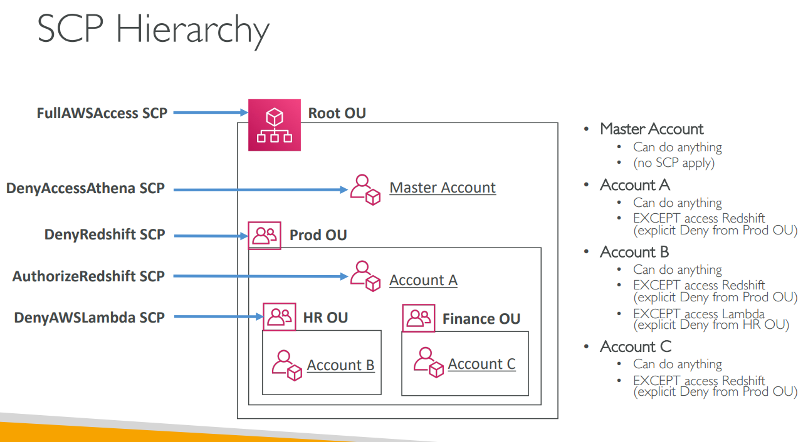
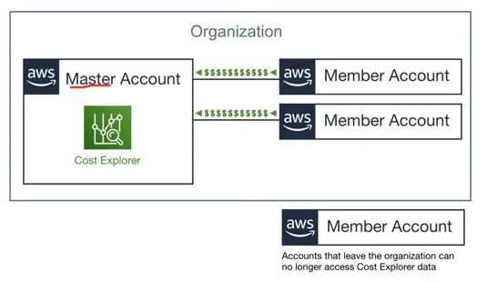

# AWS - Multi-Account Management

[Back](../index.md)

- [AWS - Multi-Account Management](#aws---multi-account-management)
  - [`AWS Organizations`](#aws-organizations)
    - [Multi Account Strategies](#multi-account-strategies)
    - [Service Control Policies (SCP) - OU/Account level, centrally manage](#service-control-policies-scp---ouaccount-level-centrally-manage)
    - [Consolidated Billing](#consolidated-billing)
  - [`AWS Control Tower` - compliant environment, \>Organs](#aws-control-tower---compliant-environment-organs)
  - [`AWS Service Catalog` - Compliant Product List](#aws-service-catalog---compliant-product-list)

---

## `AWS Organizations`

- Global service
- Allows to **manage multiple AWS accounts**
- The **main account** is the **master account**
- Cost Benefits:
  - **Consolidated Billing** across all accounts - **single payment method**
  - **Pricing benefits** from aggregated usage (volume discount for EC2, S3…)
  - Pooling of R**eserved EC2 instances** for optimal savings
- **API** is available to **automate AWS account creation**
- Restrict account **privileges** using `Service Control Policies (SCP)`

---

### Multi Account Strategies

- Create accounts based on **regulatory restrictions (using SCP)**, for better **resource isolation** (ex: VPC), to have separate **per-account service limits**, **isolated account** for logging
  - per department,
  - per cost center,
  - per dev / test / prod,
- **Multi Account** vs One Account Multi VPC
- Use **tagging** standards for **billing** purposes
- Enable `CloudTrail` on all accounts, **send logs to central S3 account**
- Send `CloudWatch Logs` to **central** logging account

- **Organizational Units (OU)**

### Service Control Policies (SCP) - OU/Account level, centrally manage

- **Whitelist or blacklist IAM actions**
- Applied at the **OU or Account level**
- **Does not apply to the Master Account**
- SCP is **applied to all the Users and Roles** of the Account, including **Root user**
- The SCP does not affect service-linked roles
  - Service-linked roles enable other AWS services to **integrate** with AWS Organizations and can't be restricted by SCPs.
- SCP must have an **explicit Allow (does not allow anything by default)**
- Use cases:
  - Restrict access to certain services (for example: can’t use EMR)
  - Enforce PCI compliance by explicitly disabling services

---

### Consolidated Billing

- When enabled, provides you with:
  - **Combined Usage** – combine the usage across all AWS accounts in the AWS Organization to share
    - the **volume pricing**,
    - **Reserved Instances**
    - and **Savings Plans discounts**
  - **One Bill** – get **one bill for all AWS Accounts** in the AWS Organization
- The **management account can turn off Reserved Instances discount** sharing for any account in the AWS Organization, including itself.

---

## `AWS Control Tower` - compliant environment, >Organs

- Easy way to set up and govern a **secure and compliant multi-account AWS environment** based on best practices
- **Benefits**:
  - Automate the set up of your **environment** in a few clicks
  - Automate ongoing **policy** management using guardrails
  - Detect policy **violations** and remediate them
  - **Monitor compliance** through an interactive dashboard
- `AWS Control Tower` runs **on top of AWS Organizations**:
  - It automatically sets up AWS Organizations to organize accounts and implement `SCPs (Service Control Policies)`

---

## `AWS Service Catalog` - Compliant Product List

- Users that are new to AWS have too many options, and may create stacks that are not compliant / in line with the rest of the organization
- use a quick **self-service portal** to launch a set of authorized products **pre-defined by admins**
- ensure stacks that are compliant / in line with the rest of the organization

- **Admin Tasks**: CloudFormation Templates -> Portfolio -> Control

- **User Tasks**: Product List -> Provisioning Products

---
