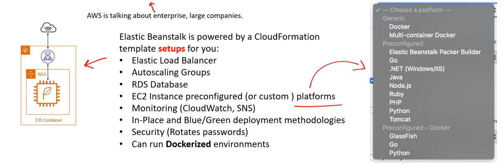

# AWS - Developer and Deployment

[Back](../index.md)

- [AWS - Developer and Deployment](#aws---developer-and-deployment)
  - [Plaform-as-a-Service (PaaS)](#plaform-as-a-service-paas)
  - [Deployment Services](#deployment-services)
    - [`AWS Elatic Beanstalk` - Paas, Deploy Code, free](#aws-elatic-beanstalk---paas-deploy-code-free)
      - [Elastic Beanstalk – Health Monitoring(CloudWatch)](#elastic-beanstalk--health-monitoringcloudwatch)
    - [`AWS CodeDeploy` - Hybrid, app deploy and upgrade](#aws-codedeploy---hybrid-app-deploy-and-upgrade)
    - [`AWS Systems Manager (SSM)` - commands, patch \& configure Server, Hybrid](#aws-systems-manager-ssm---commands-patch--configure-server-hybrid)
      - [Systems Manager (SSM) Session Manager](#systems-manager-ssm-session-manager)
    - [`AWS OpsWorks` - as SSM with Chef \& Puppet](#aws-opsworks---as-ssm-with-chef--puppet)
  - [Developer Services](#developer-services)
    - [`AWS CodeCommit` - Code repository](#aws-codecommit---code-repository)
    - [`AWS CodeBuild` - Compile, serverless](#aws-codebuild---compile-serverless)
    - [`AWS CodePipeline` - Pipline](#aws-codepipeline---pipline)
    - [`AWS CodeArtifact` - dependencies](#aws-codeartifact---dependencies)
    - [`AWS CodeStar` - UI to start a project](#aws-codestar---ui-to-start-a-project)
    - [`AWS Cloud9` - IDE, pair programming](#aws-cloud9---ide-pair-programming)
    - [AWS Toolkit for VSCdoe](#aws-toolkit-for-vscdoe)
  - [Summary](#summary)

---

## Plaform-as-a-Service (PaaS)

- `Plaform-as-a-Service (PaaS)`

  - allows customers to develop, run, and manage application without the complexity of building and maintaining the infrastructure typically associated with developing and launching an app.

---

## Deployment Services

### `AWS Elatic Beanstalk` - Paas, Deploy Code, free

- `Elastic Beanstalk`

  - a **PaaS for deploying web-applications** with little-to-no knowledge of the underlying infrastucture so developer can focus on writing application code instead of setting up an automated deployment pipeline and DevOps tasks.

  - Choose a platform, upload code, and run **with little knowledge of the infrastructure.**

  - a developer centric view of deploying an application on AWS

- Beanstalk is **free** but you **pay for the underlying instances**

- Responsibility Model:

  - developer
    - Just the application **code**
  - AWS
    - **Instance** configuration / **OS** is handled by Beanstalk
    - **Deployment strategy** is configurable but performed by Elastic Beanstalk
    - Capacity **provisioning**
    - Load **balancing** & auto-**scaling**
    - Application **health-monitoring** & responsiveness

- Three architecture models:

  - **Single Instance** deployment: good for **dev**
  - **LB + ASG**: great for **production** or pre-production web applications
  - **ASG** only: great for **non-web apps** in production (workers, etc..)

- Support for many platforms
  - If not supported, you can write your custom platform (advanced)
    

#### Elastic Beanstalk – Health Monitoring(CloudWatch)

- Health agent pushes metrics to `CloudWatch`
- Checks for app health, publishes health events
- `Elastic Beanstalk` can be **used to monitor and to check the health of an environment.**

---

### `AWS CodeDeploy` - Hybrid, app deploy and upgrade

- We want to deploy our application automatically
- **Hybrid** service
  - Works with EC2 Instances
  - Works with On-Premises Servers
- Servers / Instances must be provisioned and configured ahead of time with the `CodeDeploy Agent`

---

### `AWS Systems Manager (SSM)` - commands, patch & configure Server, Hybrid

- Helps you manage your **EC2 and On-Premises systems at scale**
- Another **Hybrid** AWS service
- Get operational insights about the state of your infrastructure
- Suite of 10+ products
- Most important features are:
  - **Patching automation for enhanced compliance**
  - **Run commands across an entire fleet of servers**
- Store parameter configuration with the SSM Parameter Store
- Works for Linux, Windows, MacOS, and Raspberry Pi OS (Raspbian)

- We **need to install the `SSM agent`** onto the systems we control
- Installed by default on Amazon Linux AMI & some Ubuntu AMI
- If an instance can’t be controlled with SSM, it’s probably an issue with the SSM agent!
- Thanks to the SSM agent, we can **run commands, patch & configure our servers**

---

#### Systems Manager (SSM) Session Manager

- Allows you to **start a secure shell on your EC2 and on-premises servers**
- **No SSH access**, bastion hosts, or SSH keys needed
- **No port 22 needed** (better security)
- Supports Linux, macOS, and Windows
- Send session log data to S3 or `CloudWatch Logs`

---

### `AWS OpsWorks` - as SSM with Chef & Puppet

- `Chef` & `Puppet` help you perform server configuration automatically, or repetitive actions
- They work great with EC2 & On-Premises VM
- `AWS OpsWorks` = Managed `Chef` & `Puppet`
- It’s an **alternative to AWS SSM**
- Only provision standard AWS resources:
  - EC2 Instances, Databases, Load Balancers, EBS volumes…
  - In the exam: **Chef or Puppet needed => AWS OpsWorks**

---

## Developer Services

### `AWS CodeCommit` - Code repository

- Developers usually store code in a **repository**, **using the Git technology**
- A famous public offering is GitHub, AWS’ competing product is CodeCommit
- CodeCommit:
  - **Source-control** service that hosts **Git-based repositories**
  - Makes it easy to **collaborate** with others on code
  - The code changes are a**utomatically versioned**
- Benefits:
  - Fully managed
  - Scalable & highly available
  - Private, Secured, **Integrated with AWS**

---

### `AWS CodeBuild` - Compile, serverless

- **Code building service** in the cloud (name is obvious)
- **Compiles** source code, run **tests**, and **produces packages** that are ready to be deployed (by CodeDeploy for example)
- Benefits:
  - Fully managed, **serverless**
  - Continuously scalable & highly available
  - Secure
  - Pay-as-you-go pricing – **only pay for the build time**

---

### `AWS CodePipeline` - Pipline

- Orchestrate the different steps to have the code **automatically** pushed to production
- `Code => Build => Test => Provision => Deploy`
- Basis for **CICD (Continuous Integration & Continuous Delivery)**
- Benefits:
  - Fully managed, compatible with `CodeCommit`, `CodeBuild`, `CodeDeploy`, `Elastic Beanstalk`, `CloudFormation`, GitHub, 3rd-party services (GitHub…) & custom plugins…
- Fast delivery & rapid updates

---

### `AWS CodeArtifact` - dependencies

- `artifact management`
  - Storing and retrieving the code dependencies
- Traditionally you need to setup your own artifact management system
- CodeArtifact is a secure, scalable, and cost-effective artifact management for software development
- Works with **common dependency management tools** such as Maven, Gradle, npm, yarn, twine, pip, and NuGet
- **Developers and CodeBuild can then retrieve dependencies straight from CodeArtifact**

---

### `AWS CodeStar` - UI to start a project

- **Unified UI** to easily manage software development activities in one place
- “Quick way” to **get started to correctly set-up** CodeCommit, CodePipeline,
  CodeBuild, CodeDeploy, Elastic Beanstalk, EC2, etc…
- Can edit the code ”in-the-cloud” using `AWS Cloud9`

---

### `AWS Cloud9` - IDE, pair programming

- AWS Cloud9 is **a cloud IDE** (Integrated Development Environment) for writing, running
  and debugging code
- A cloud IDE can be used **within a web browser**, meaning you can work on your projects from your office, home, or anywhere with internet with no setup necessary
- AWS Cloud9 also allows for **code collaboration in real-time** (**pair programming**)

---

### AWS Toolkit for VSCdoe

- `AWS Toolkit`

  - an open-source plugin for VSCode to create, debug, deploy AWS resources.

- `AWS Explorer`: Explore a wide range of AWS resources to user's linked AWS Account.

- `AWS CDK Explorer`: Allows to explore user's stacks defined by CDK.

- `Amazon Elastic Container Service`: Provides IntelliSense for ECS task-definition files.

- `Serverless Applications`:Create, debug and deploy serverless applications via `SAM` and `CFN`

---

## Summary

- **Developer**

  - `Cloud9`:
    - Cloud **IDE** (Integrated Development Environment) with collab
  - `CodeCommit`:
    - Store code in private git **repository** (version controlled)
  - `CodeBuild`:
    - **Build & test** code in AWS
  - `CodeDeploy`:
    - Deploy code onto servers, **Hybrid**
  - `CodePipeline`:
    - Orchestration of **pipeline** (from **code to build to deploy**)
  - `CodeArtifact`:
    - Store software **packages / dependencies** on AWS
  - `CodeStar`:

    - Unified **view** for allowing developers to **do CICD and code**

- **Deployment**

- `CloudFormation`: (AWS only)
  - **Infrastructure as Code**, works with almost **all of AWS resources**
  - Repeat across Regions & Accounts
- `Beanstalk`: (AWS only)
  - **Platform as a Service (PaaS)**, limited to certain programming languages or Docker
  - Deploy code consistently with a known architecture: ex, ALB + EC2 + RDS
- `CodeDeploy` (**hybrid**):
  - deploy & upgrade any application onto servers
- `Systems Manager (hybrid)`:
  - patch, configure and run commands at scale
- `OpsWorks` (hybrid): managed Chef and Puppet in AWS

- `AWS CDK`:

  - Define your cloud infrastructure using a programming language

---

[TOP](#aws---developer-and-deployment)
