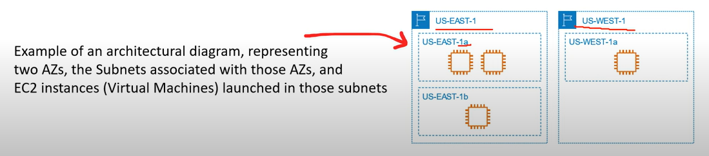
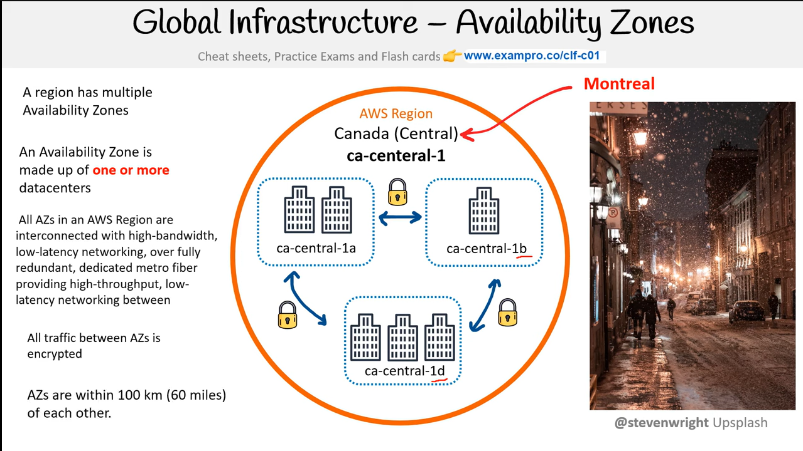

# AWS - Global Infrastructure

[Back](../index.md)

- [AWS - Global Infrastructure](#aws---global-infrastructure)
  - [Global Application](#global-application)
    - [Regional vs Global Services](#regional-vs-global-services)
    - [Global Applications Architecture](#global-applications-architecture)
  - [Global Services](#global-services)
    - [`Route 53` - DNS](#route-53---dns)
      - [Routing Policies](#routing-policies)
    - [`CloudFront` - CDN, DDoS](#cloudfront---cdn-ddos)
      - [CloudFront vs S3 Cross Region Replication](#cloudfront-vs-s3-cross-region-replication)
    - [`S3 Transfer Acceleration` - upload S3](#s3-transfer-acceleration---upload-s3)
    - [`Global Accelerator` - performance, short-cut](#global-accelerator---performance-short-cut)
      - [AWS Global Accelerator vs CloudFront](#aws-global-accelerator-vs-cloudfront)
  - [AWS Global Infrastructure](#aws-global-infrastructure)
    - [Region](#region)
    - [Availability Zones](#availability-zones)
    - [Edge Locations / Point of Presence (Pop)](#edge-locations--point-of-presence-pop)
      - [`Local Zones`](#local-zones)
      - [`Wavelength Zones`](#wavelength-zones)
      - [`AWS Ground Station`](#aws-ground-station)
      - [`AWS Outposts` - rack of servers, hybrid](#aws-outposts---rack-of-servers-hybrid)
    - [Global Network](#global-network)
      - [`Direct Connection Locations` - Connection on-premise and AWS](#direct-connection-locations---connection-on-premise-and-aws)
  - [AWS Government](#aws-government)
  - [AWS China](#aws-china)
  - [Fault Tolenrance](#fault-tolenrance)
  - [Data Residency](#data-residency)

---

## Global Application

- global application
  - an application **deployed in multiple geographies**
- On AWS: this could be **Regions** and / or **Edge Locations**

- **Advantages**
  - **Decreased Latency**
    - `Latency` is the time it takes for a network packet to reach a server
    - It takes time for a packet from Asia to reach the US
    - Deploy your applications **closer to your users** to decrease latency, better experience
  - **Disaster Recovery (DR)**
    - If an AWS region goes down (earthquake, storms, power shutdown, politics)…
    - You can **fail-over** to another region and have your application still working
    - A DR plan is important to increase the **availability** of your application
  - **Attack protection**: distributed global infrastructure is harder to attack

---

### Regional vs Global Services

- `Regional Services`

  - AWS scopes AWS Management Console on a selected Region.
  - It will determine where an AWS service will be launched and what will be seen in a console.
  - do not explicitly set the Region for a service at the time of creation.

- `Global Services`

  - some AWS Services operate across multiple regions and the region will be fixed to "Global"
  - e.g.:
    - `Amazon S3` (a single region must be explicitly chosen, such as S3 bucket)
    - `CloudFront` (a group of regions to be chosen, such as CloudFront Distribution)
    - `Route53`
    - `IAM` (has no concept of region)

---

### Global Applications Architecture

|                                  | Availability | Global Latency              | Difficulty |
| -------------------------------- | ------------ | --------------------------- | ---------- |
| Single Region, Single AZ         | Low          | High                        | Low        |
| Single Region, Multi AZ          | High         | High                        | Medium     |
| Multi Region, **Active-Passive** | High         | Read: Low, Write: High      | Medium     |
| Multi Region, **Active-Active**  | High         | **Read: High, Write: High** | Hight      |

---

## Global Services

### `Route 53` - DNS

- Route53 is a Managed **DNS (Domain Name System)**
- DNS is **a collection of rules and records** which helps clients understand **how to reach a server through URLs.**

- Feature
  - Domain Registration,
  - DNS,
  - Health Checks,
  - Routing Policy

#### Routing Policies

- `SIMPLE ROUTING POLICY`: No health checks, 唯一检查健康
- `WEIGHTED ROUTING POLICY`: 按权重
- `LATENCY ROUTING POLICY`: find the closest
- `FAILOVER ROUTING POLICY`: Disaster Recovery

---

### `CloudFront` - CDN, DDoS

- CloudFront **uses Edge Location to cache content**, and therefore bring more of your content closer to your viewers to improve read performance.

- `Content Delivery Network (CDN)`
- Improves **read performance**, content is **cached at the edge**
- Improves users experience
- 216 Point of Presence globally (edge locations)
- **DDoS protection** (because worldwide), integration with **Shield**, AWS **Web Application Firewall**

- **Origins**

  - **S3 bucket**

    - For distributing files and caching them at the edge
    - Enhanced **security** with `CloudFront Origin Access Control (OAC)` + S3 policy
    - OAC is replacing Origin Access Identity (OAI)
    - CloudFront can be used as an **ingress** (to upload files to S3)

  - **Custom Origin (HTTP)**
    - **Application Load Balancer**
    - **EC2 instance**
    - S3 website (must first enable the bucket as a** static S3 website)**
    - **Any HTTP backend** you want

---

#### CloudFront vs S3 Cross Region Replication

- **CloudFront**:

  - Global **Edge** network
  - Files are **cached for a TTL** (maybe a day)
  - Great for **static content** that must be available **everywhere**

- **S3 Cross Region Replication:**
  - Must be **setup** for each region you want replication to happen
  - Files are updated in near **real-time**
  - **Read only**
  - Great for **dynamic content** that needs to be available at low-latency **in few regions**

---

### `S3 Transfer Acceleration` - upload S3

- **Increase transfer speed by transferring** file to an AWS edge location which will forward the data to the **S3 bucket in the target region**

---

### `Global Accelerator` - performance, short-cut

- Improve global application **availability and performance** using the `AWS global network`
- Leverage the AWS internal network to optimize the route to your application (60% improvement)
- **2 Anycast IP are created** for your application and traffic is sent through Edge Locations
- The Edge locations send the traffic to your application

#### AWS Global Accelerator vs CloudFront

- They **both use the AWS global network and its edge locations** around the world
- Both services integrate with AWS **Shield for DDoS protection**.

- **CloudFront** – Content Delivery Network

  - Improves performance for your **cacheable content** (such as images and videos)
  - Content is **served at the edge**

- **Global Accelerator**
  - **No caching**, proxying packets at the edge to applications running in one or more AWS Regions.
  - **Improves performance** for a wide range of applications over **TCP or UDP**
  - Good for HTTP use cases that require **static IP addresses**
  - Good for HTTP use cases that required **deterministic, fast regional failover**

---

## AWS Global Infrastructure

- `Global Infrastructure`;

  - globally distributed **hardware and datacenters** that are physically network together to act as one large resource for the end customer.

- made up of resources:

  - Launched Regions
  - Availability Zones
  - Direct Connection Locations
  - Point of Presence
  - Local Zone
  - Wavelength Zones

- AWS Global Infrastructure: https://aws.amazon.com/about-aws/global-infrastructure/

---

### Region

- `Region`:

  - **geographically distinct locations** consiting of one or more Availability Zone.
  - For deploying applications and infrastructure

- Featrues:

  - Each region generally has **three `Availability Zones`**. (Some new users are limited to two. eg. US-West)
  - Not all **AWS Services** are available in all regions.
  - The **cost** of AWS services vary per region.
  - **New services** almost always become available first in `US-EAST`
  - All **billing information** appears in `US-EAST-1(North Virginia)`

- Factors to be considered to choose a region

  - Regulatory Compliance that this region meet
  - Cost of AWS services
  - Avaliable AWS services
  - distance or latency to end-users

- Diagram: 使用小旗子标记

  

---

### Availability Zones

- `Availability Zones`:

  - a **physical location** made up of one or more **detacenter**.
  - A region generally contains 3 AZ.

- `Datacenter`:

  - A secured building that contains hundreds of thousand of computers.
  - Datacenters within a region will be isolated from each other, but close enough to provide low-latency.

- It is a common practice to run workloads in at least 3 AZs to ensure services remain available in case one or two datecenters fail.

- Identifier:represented by a Region Code, followed by a letter.

  - e.g.: `us-east-1a`

- A `subnet` is associated with an AZ.

  - When launching a resource, users never choose an AZ, but a subnet which is associate to the AZ.

- Diagram: 虚线方框

  

- Region and Zone
  

---

### Edge Locations / Point of Presence (Pop)

- `Point of Presence (Pop)`:

  - for content delivery **as close as possible to users**
  - an **intermediate location** between as `AWS Region` and the `end user`, and this location could be a **datacenter or collection of hardware**.
  - For AWS, a `point of presence` is a **data center owned** by AWS or a trusted partner that is utilized by AWS Services related for content delivery or expediated upload.
  - POP resources are Edge Locations and Regional Edge Caches.

- `Edge Locations`:

  - datacenters that hold cached(copy) on the most popular files(e.g. web pages, images and videos) so that the delivery of distance to the end users are reduce.

- `Regional Edge Location`
  - datacenters that hold much larger caches of less-popular files to reduce a full round trip and also to reduce the cost of transfer fees.

- `Tier 1 Network`

  - a network that can reach every other network on the interest **without purchasing IP transit or paying for peering.**
  - `AWS AZ` are all redundantly connected to multiple tier-1 transit providers.

  

- AWS services using POP for content delivery or expediated upload.
  

---

#### `Local Zones`

- `Local Zone`:

  - **datacenters** located very close to a densely populated area to provide single-digit millisecond low latency performance for that area.

- Purpose of Local Zone

  - support highly-demanding applications sensitive to latencies

- Example: Los Angeles, California

  - the first Local Zone to be deployed.
  - It is logical extension of the US-West Region
  - The identifier looks like: `us-west-2-lax-1a`
  - Only specific AWS Service have been made available.

- Places AWS compute, storage, database, and other selected AWS services **closer
  to end users** to run latency-sensitive applications
- Extend your VPC to more locations – **“Extension of an AWS Region”**
- Compatible with EC2, RDS, ECS, EBS, ElastiCache, Direct Connect …
- Example:
  - AWS Region: N. Virginia (us-east-1)
  - AWS Local Zones: Boston, Chicago, Dallas, Houston, Miami, …

---

#### `Wavelength Zones`

- `AWS Wavelength Zones`

  - allows for edge-computing **on 5G networks**.
  - Applications will have ultra-low latency being as close as possible to the users.
  - User creates a Subnet tied to a Wavelength Zone and then can launch Virtual Machine(VMs) to the edge of the targeted 5G Networks.

- WaveLength Zones are infrastructure deployments embedded **within the telecommunications providers’ datacenters** at the edge of the 5G networks
- Brings AWS services to the edge of the 5G networks
- Example: EC2, EBS, VPC…
- **Ultra-low latency** applications through **5G** networks
- **Traffic doesn’t leave the Communication Service Provider’s (CSP) network**
- High-bandwidth and secure connection to the parent AWS Region
- **No additional charges or service agreements**
- Use cases:
  - Smart Cities, ML-assisted diagnostics, Connected Vehicles, Interactive Live Video Streams, AR/VR, Real-time Gaming, …

---

#### `AWS Ground Station`

- `AWS Ground Station`:

  - a fully managed service that lets user control satellite communication.

- Use case:
  

---

#### `AWS Outposts` - rack of servers, hybrid

- `AWS Outposts`:

  - a fully managed service that offers the same AWS infracture, AWS servicess, APIs, and tools to virtually any datacenter, co-location space, or on-premises facility for a truly consistent **hybrid** exprience.
  - is **rack of servers** running AWS Infrastructure **on users' physical location**.

- **Hybrid** Cloud:

  - businesses that keep an on-premises **infrastructure** alongside a cloud **infrastructure**

- Therefore, two ways of dealing with IT systems:

  - One for the **AWS cloud** (using the AWS console, CLI, and AWS APIs)
  - One for their **on-premises** infrastructure

- `AWS Outposts` are “**server racks**” that offers the
  same AWS infrastructure, services, APIs & tools
  to build your own applications **on-premises just as in the cloud**

- AWS will setup and manage “Outposts Racks” within your on-premises infrastructure and you can start leveraging AWS services on-premises

- **Responsibility**

  - You are responsible for the Outposts Rack **physical security**

- **Benefits**:
  - Low-**latency** access to on-premises systems
  - **Local data** processing
  - Data **residency**
  - **Easier migration** from on-premises to the cloud
  - Fully managed service
  - Some services that work on Outposts

---

### Global Network

- `AWS Global Network`:

  - represent the interconnections between AWS Global Infrastructure.
  - aka, `the backbone of AWS`
  - a private expressway, where things can move very fast between datacenters.

- Example services regarding to the Global Network:

  

---

#### `Direct Connection Locations` - Connection on-premise and AWS

- `AWS Direct Connect`:

  - a private/dedicated connection **between users' datacenter, office, co-location and AWS**.

- Advantages:

  - helps reduce netork costs and increase bandwidth throughtput. (greate for high traffic networks)
  - provides a more consistent network experience than a typical internet-based connection.(reliable and secure)

  

- `Direct Connect Locations` are trusted partnered **datacenters** that you can establish a dedicated high speed, low-latenecy connection from your on-premise to AWS.

- Users would use the `AWS Direct Connect service` to order and establish a connection.

---

## AWS Government

- `Public Sector`:

  - include pulic goods and governmental services such as military, law enforcement, infrastructure, public transit, public education, health care, and the government.
  - AWS can be utilized by public sector or organizations developing cloud workloads for the public sector.

- AWS achieves this by meeting regulatory compliance programs along with specific governmence and security controls.

- `Federal Risk and Authorization Management Program (FedRAMP)`

  - a US government-wide program that provides a standardized approach to security assessment, authorization, and continuous monitoring for cloud products and services.

- `GovCloud`:

  - special regions for US regulation.
  - A `Cloud Service Provider (CSP)` generally will offer an isolated region to run `FedRAMP` workloads.

- `AWS GovCloud Regions`
  - allow customers to host sensitive `Controlled Unclassfied Information` and other type of **regulated workloads**.

---

## AWS China

- AWS China is the AWS cloud offerings in Mainland China.
  - is completely isolate from AWS Global
  - domain: amazonaws.cn
  - users need have a Chinese Business License (ICP license)
  - Not all services are available. e.g.: Route53
  - not need to traverse the Great Firewall.

---

## Fault Tolenrance

总体意思:

1. Region 将相互分离是 fault level
2. AZ 分离, 是 fault domain,即 Failure Zone
3. 多 AZ 的 APP 更好保障.

- Terminology:

  - `fault domain`:
    - a section of a **network** that is vulnerable to damage if a critical device or system fails.
    - The purpose of a fault domain is that if a failure occurs it will not cascade outside that domain, limiting the damage possible.
    - Fault domains can be nested inside fault domains.
    - scope of a fault domain is up to Cloud Service Provider(CSPs) to define the boundaries. It could be:
      - specific servers in a rack
      - an entire rack in a datacenter
      - an entire room in a datacenter
      - the entire data center building

- `Fault level`:

  - a collection of fault domains.

  

- Each `Amazon Region` is designed to be **completely isolated** from the other Amazon Regions.
  - This achieves the greatest possible fault tolerance and stability.
- Each `Availability Zone` is isolated, but the Availability Zones in a Region are connected through low-latency links.
- Each `Availability Zone` is designed as an `independent failure zone`.

  - A `Failure Zone` is AWS describing a `Fault Domain`.

- `Failure Zone`:

  - `Availabilty Zones` are physically separated within a typical metropolitan region and are located in lower risk flood plains.
  - descrete uninterruptible power supply (UPS) and onsite backup generation facilities.
  - data centers located in different `Availability Zones` are designed to be supplied by independent substations to reduce the risk of an event on the power grid impacting more than one Availability Zone.
  - Availability Zones are all redundantly connected to multiple tier-1 transit providers.

- **Multi-AZ for Hight Avaliability**
  - if an application is partitioned across AZs, companies are better isolated and protected from issues such as power outages lightning strikes, tornadoes, earthquake and more.

---

## Data Residency

- `Data Residency`:

  - the physical or geographic **location** of where an organization or cloud **resources reside**.

- `Compliance Boundaries`:

  - A **regulatory compliance** (legal requirement) by a government or organization that describes where data and cloud **resources are allowed to reside**.

- `Data Sovereignty`:

  - jurisdictional control or legal authority that can be asserted over data because it's physical location is within jurisdictional boundaries.

- For workloads that need to meet compliance boundaries strictly defining the data residency of data and cloud resources in AWS can be used:
  - `AWS Outposts`
    - **physical rack of servers** that user can put in user's data center.
    - User's data will reside whenever the Outpost Pysically resides.
  - `AWS Config`:
    - a Policy as Code service.
    - User can create rules to continuous check AWS resources configuration. If rules deviate from userss expectations users are alerted or AWS Config can in some cases auto-remediate.
  - `IAM Policies`:
    - can be explicitly deny access to specific AWS regions. A `Service Control Policy` (SCP) are permissions applied organization wide.

---

[TOP](#aws---global-infrastructure)
