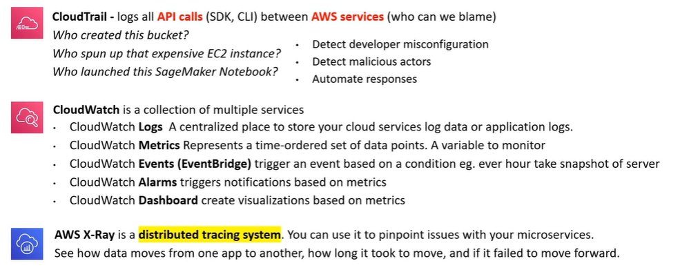
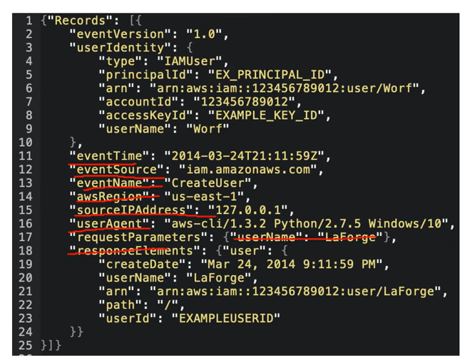
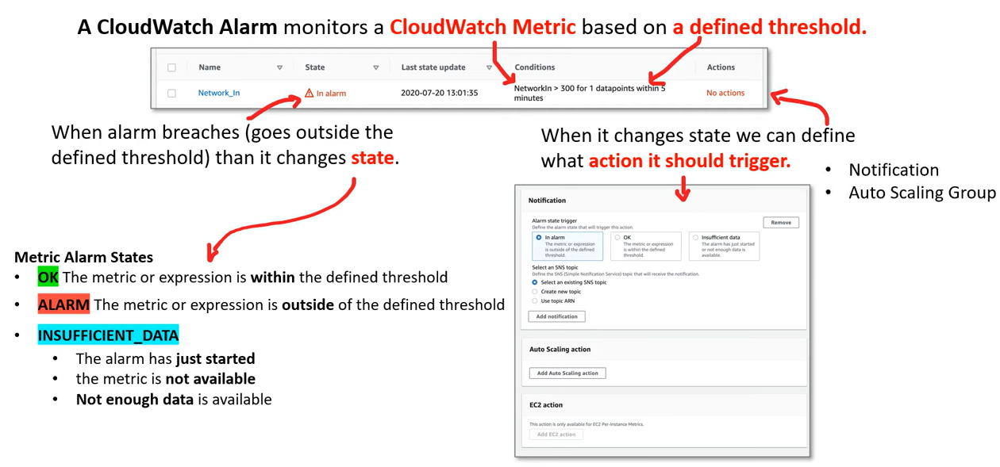
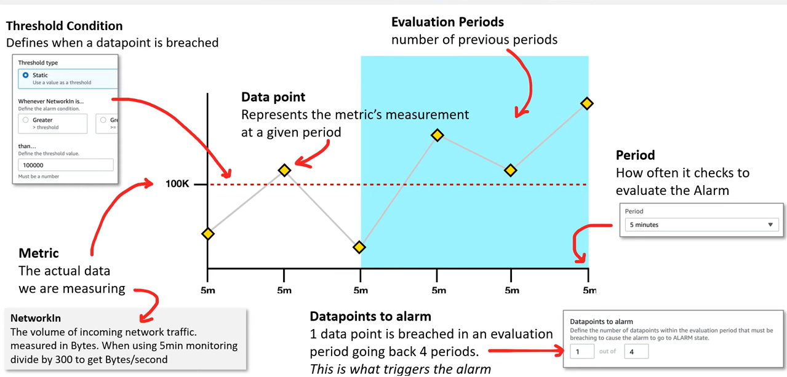
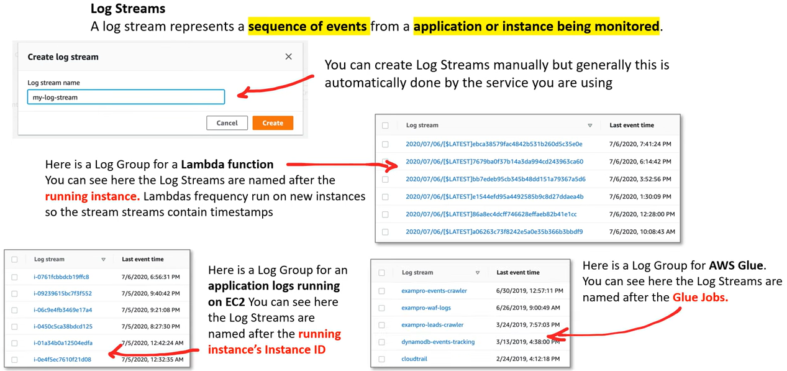
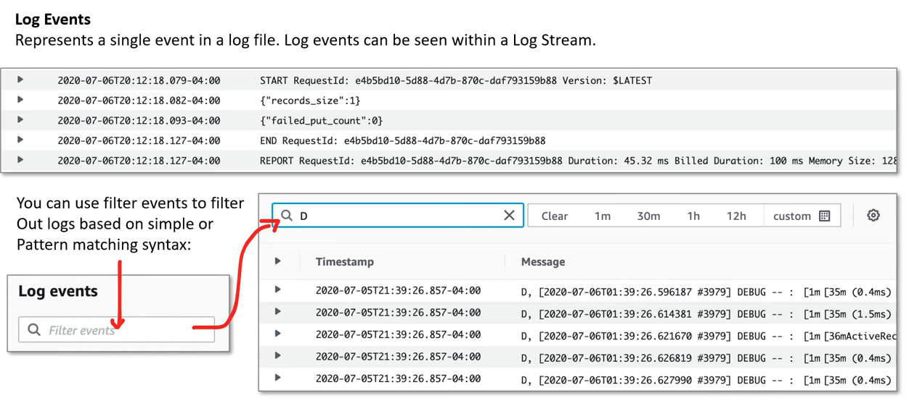
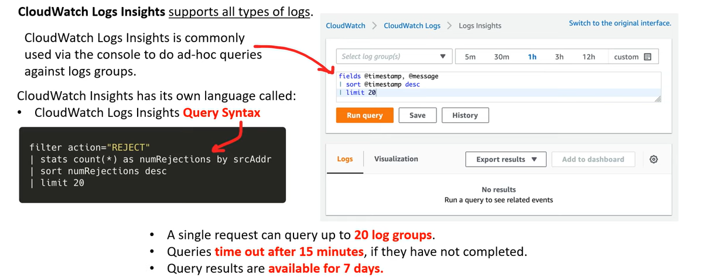
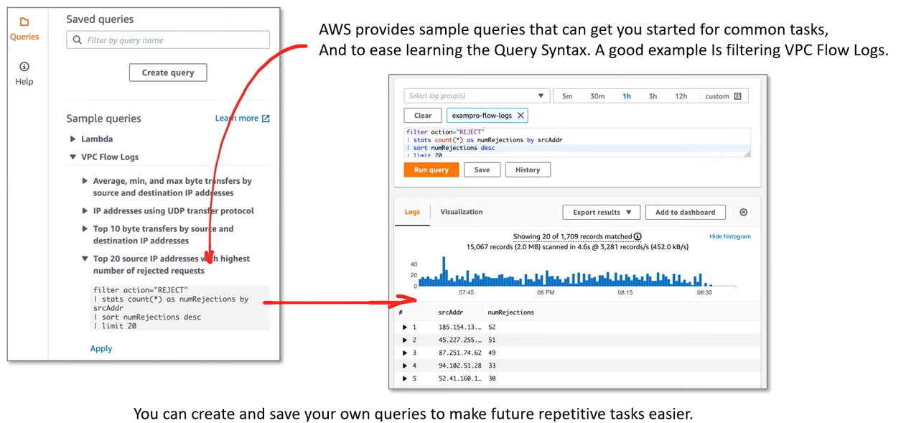
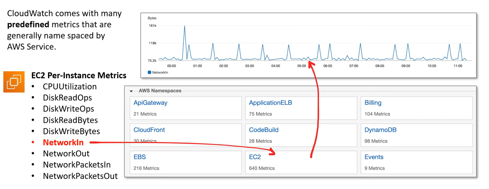

# AWS - Logging Services

[Back](../index.md)

- [AWS - Logging Services](#aws---logging-services)
  - [Logging Services](#logging-services)
  - [AWS CloudTrail](#aws-cloudtrail)
  - [CloudWatch](#cloudwatch)
    - [CloudWatch - Alarms](#cloudwatch---alarms)
    - [CloudWatch - Log](#cloudwatch---log)
    - [CloudWatch - Metrics](#cloudwatch---metrics)

---

## Logging Services

---

## AWS CloudTrail

- `AWS CloudTrail`

  - a service that enables governance, compliance, operational auditing, and risk auditing of AWS account.
  - used to monitor **API calls** and **Actions made** on an AWS account.
    - Where: Source IP Address
    - When: EventTime
    - Who: User, UserAgent
    - What: Region, Resource, Action

  

- CloudTrail is already logging by default and will collect logs for last 90 days via Event History.

- If user needs more than 90 days, user need to create a Trail.

  - Trails are output to S3 and have to use `Amazon Athena`.

  

---

## CloudWatch

### CloudWatch - Alarms

- `CloudWatch Alarm`

  - monitor a **CloudWatch Metric** based on a **defined threshold**.

  

  

---

### CloudWatch - Log

- `Log Streams`

  - A log stream represents a sequence of events from an application or instance being monitored.

---

- `Log Events`
  - represents a single event in a log file. Log events can be seen within a `Log Stream`.

---

- `CloudWatch Logs Insights`

  - enable to interactively search and analyze CloudWatch log data.

- Advantages
  - more robust **filtering** then using the simple filter events in a Log Stream.
  - Less burdensome then having to **export** logs to S3 and **analyze** them via Athena.

---

### CloudWatch - Metrics

- `CloudWatch Metric`

  - represents a **time-ordered set of data points**.
  - Its a variable that is monitored over time.

  

---

[TOP](#aws---logging-services)
