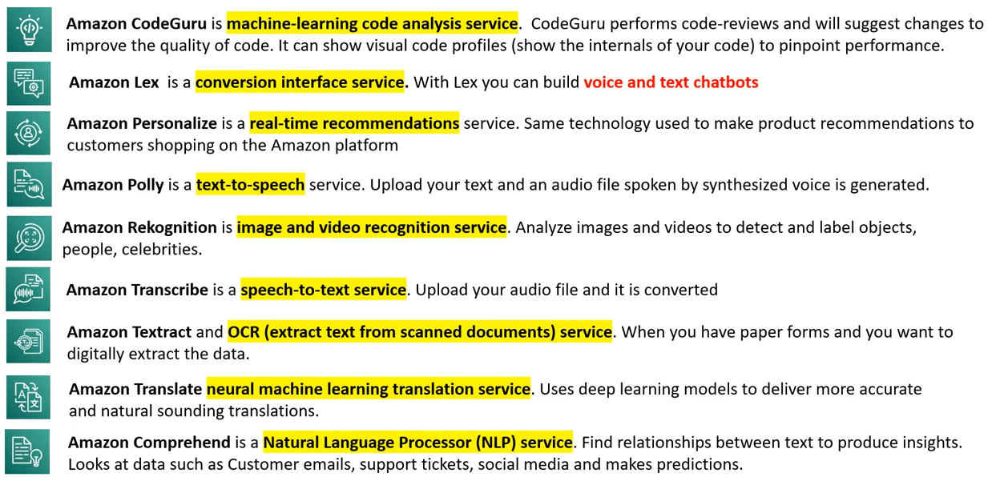
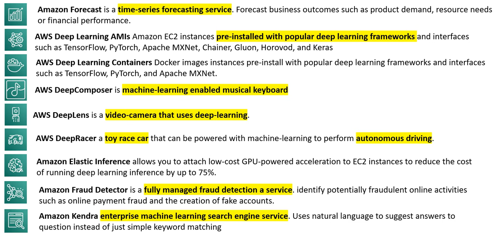
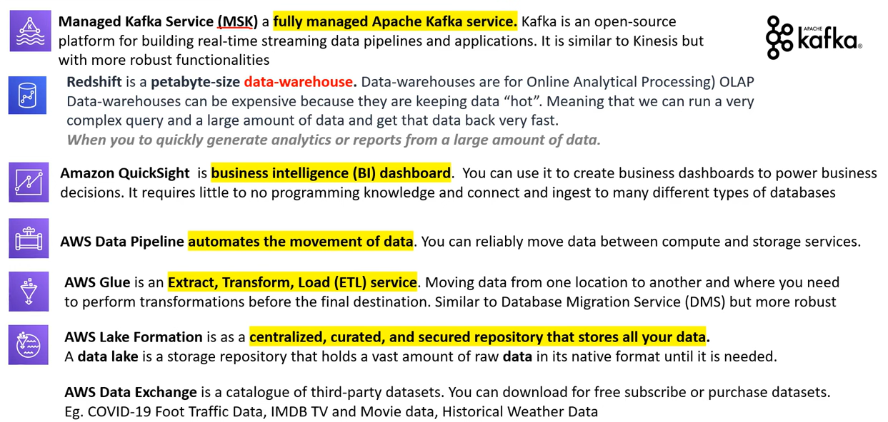
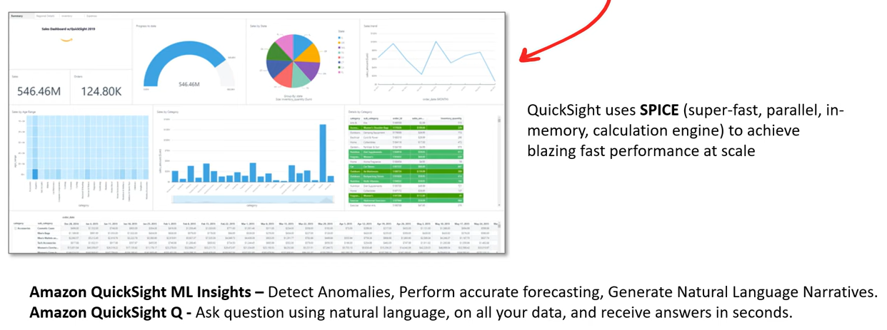

# AWS - ML, AI, And Big Data

[Back](../index.md)

- [AWS - ML, AI, And Big Data](#aws---ml-ai-and-big-data)
  - [Terminology](#terminology)
  - [`Amazon QuickSight`](#amazon-quicksight)
  - [`Amazon Rekognition` - object recognition](#amazon-rekognition---object-recognition)
  - [`Amazon Textract` - Scan \>\> text](#amazon-textract---scan--text)
  - [`Amazon Transcribe` - speech-to-text](#amazon-transcribe---speech-to-text)
  - [`Amazon Polly` - text-to-speech](#amazon-polly---text-to-speech)
  - [`Amazon Translate` - translation](#amazon-translate---translation)
  - [`Amazon Lex` - chatbots](#amazon-lex---chatbots)
  - [`Amazon Connect` - virtual contact center](#amazon-connect---virtual-contact-center)
  - [`Amazon Comprehend` - NLP, understand text](#amazon-comprehend---nlp-understand-text)
  - [`Amazon SageMaker` - ML Modeling](#amazon-sagemaker---ml-modeling)
  - [`Amazon Forecast` - predict for planning](#amazon-forecast---predict-for-planning)
  - [`Amazon Kendra` - document search engine](#amazon-kendra---document-search-engine)
  - [`Amazon Personalize` - real-time personalized recommendations](#amazon-personalize---real-time-personalized-recommendations)
  - [Summary](#summary)

---

## Terminology

- `Artificial Intelligence (AI)`

  - machines that perform jobs that mimic human behavior.

- `Machine Learning (ML)`

  - machines that get better at a task without explicit programming.

- `Deep Learning (DL)`

  - machines that have an artificial neural network inspired by the human brain to solve complex problems.

---

- `Big Data`

  - a term used to describe massive volumes of structured/unstructured data that is so large it is difficult to move and process using traditional database and software techniques.

- `Kafka`

  - an open-source platform for building real-time streaming data pipelines and applications.

- `Data Lake`
  - a storage repository that holds a vast amount of raw data in its native format until it is needed.

---

## `Amazon QuickSight`

- `Amazon QuickSight`
  - a Business Intelligence (BI) Dashboard that allows to ingest data from various AWS storage or database services to quickly visualize business data with minimal programming or data formula knowledge.

---

## `Amazon Rekognition` - object recognition

- **Find objects**, people, text, scenes in images and videos using ML
- Facial analysis and facial search to do user verification, people counting
- C**reate a database of “familiar faces”** or compare against celebrities
- Use cases:
  - Labeling
  - Content Moderation
  - Text Detection
  - Face Detection and Analysis (gender, age range, emotions…)
  - Face Search and Verification
  - Celebrity Recognition
  - Pathing (ex: for sports game analysis)

---

## `Amazon Textract` - Scan >> text

- Automatically **extracts text**, handwriting, and data from any **scanned documents** using AI and ML
- Extract data from forms and tables
- Read and process any type of document (PDFs, images, …)
- Use cases:
  - Financial Services (e.g., invoices, financial reports)
  - Healthcare (e.g., medical records, insurance claims)
  - Public Sector (e.g., tax forms, ID documents, passports)

---

## `Amazon Transcribe` - speech-to-text

- Automatically **convert speech to text**
- Uses a deep learning process called automatic speech recognition (ASR) to convert speech to text quickly and accurately
- Automatically **remove Personally Identifiable Information (PII)** using `Redaction`
- Supports Automatic Language Identification for **multi-lingual audio**
- Use cases:
  - transcribe customer service calls
  - automate closed captioning and subtitling
  - generate metadata for media assets to create a fully searchable archive

---

## `Amazon Polly` - text-to-speech

- Turn **text into lifelike speech** using deep learning
- Allowing you to **create applications that talk**

---

## `Amazon Translate` - translation

- **Natural** and accurate language translation
- Amazon Translate allows you **to localize content**
  - such as websites and applications for international users, and to easily translate large volumes of text efficiently.

---

## `Amazon Lex` - chatbots

- `Amazon Lex`: (same technology that powers Alexa)
- Automatic Speech Recognition (ASR) to convert **speech to text**
- **Natural** Language Understanding to recognize the intent of text, callers
- Helps build **chatbots, call center bots**

---

## `Amazon Connect` - virtual contact center

- Receive calls, **create contact flows**, cloud-based **virtual contact center**
- Can integrate with other CRM systems or AWS
- No upfront payments, 80% cheaper than traditional contact center solutions

---

## `Amazon Comprehend` - NLP, understand text

- For **Natural Language Processing – NLP**
- Fully managed and **serverless** service
- Uses machine learning to find **insights and relationships in text**
  - Language of the text
  - Extracts key phrases, places, people, brands, or events
  - Understands how positive or negative the text is
  - Analyzes text using tokenization and parts of speech
  - Automatically organizes a collection of text files by topic
- Sample use cases:
  - analyze customer interactions (**emails**) to find what leads to a positive or negative experience
  - Create and groups **articles** by topics that Comprehend will uncover

---

## `Amazon SageMaker` - ML Modeling

- `Amazon SageMaker`

  - a fully managed service to **build, train, and deploy machine learning model** at scale.
    - Apache MXNet on AWS, open-source deep learning framework.
    - TensorFlow on AWS, open-source machine intelligence library.
    - PyTorch on AWS, open-source machine learning framework.

- Fully managed service for developers / data scientists to **build ML models**
- Typically, difficult to do all the processes in one place + provision servers
- Machine learning process (simplified).

- `Amazon SageMaker Ground Truth`

  - a data-labeling service.
  - label a dataset that will be used to train machine learning models.

- `Amazon Augmented AI`

  - human-intervention review service.
  - When SageMaker's uses machine learning to make a prediction that is not confident it has the right answer queue up the predication for human review.

- label -> build -> Train and Tune -> ML model -> Apply model -> Prediction

---

## `Amazon Forecast` - predict for planning

- Fully managed service that uses ML to deliver **highly accurate forecasts**
- Example: predict the future sales of a raincoat
- 50% more accurate than looking at the data itself
- Reduce forecasting time from months to **hours**
- Use cases:
  - Product Demand Planning, Financial Planning, Resource Planning, …

---

## `Amazon Kendra` - document search engine

- Fully managed **document search** service powered by Machine Learning
- Extract answers from within a document (text, pdf, HTML, PowerPoint, MS Word, FAQs…)
- **Natural language** search capabilities
- Learn from user interactions/feedback to promote preferred results (Incremental Learning)
- Ability to manually fine-tune search results (importance of data, freshness, custom, …)

---

## `Amazon Personalize` - real-time personalized recommendations

- Fully managed ML-service to build apps with **real-time personalized recommendations**
- Example: personalized product recommendations/re-ranking, customized direct marketing
- Example: User bought gardening tools, provide recommendations on the next one to buy
- **Same technology used by Amazon.com**
- Integrates into existing websites, applications, SMS, email marketing systems, …
- Implement in days, not months (you don’t need to build, train, and deploy ML solutions)
- Use cases: retail stores, media and entertainment…

---

## Summary

- `Rekognition`
  - : face detection, labeling, celebrity **recognition**
- `Textract`:

  - **detect text** and data in documents

- `Transcribe`:
  - audio **to text** (ex: subtitles)
- `Polly`:
  - text **to audio**
- `Translate`:
  - **translations**
- `Lex`:
  - build conversational bots – **chatbots**
- `Connect`:
  - cloud **contact center**
- `Comprehend`:

  - natural language processing

- `SageMaker`:
  - machine learning for every developer and data scientist
- `Forecast`:
  - build highly accurate forecasts
- `Kendra`:
  - ML-powered search engine
- `Personalize`:
  - real-time personalized recommendations

---

[TOP](#aws---ml-ai-and-big-data)
