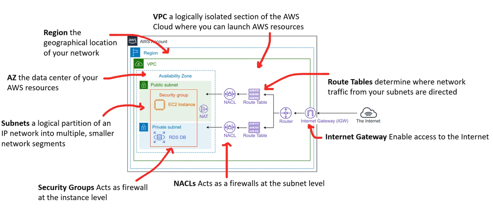
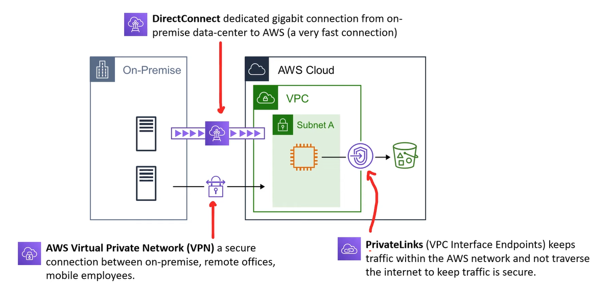
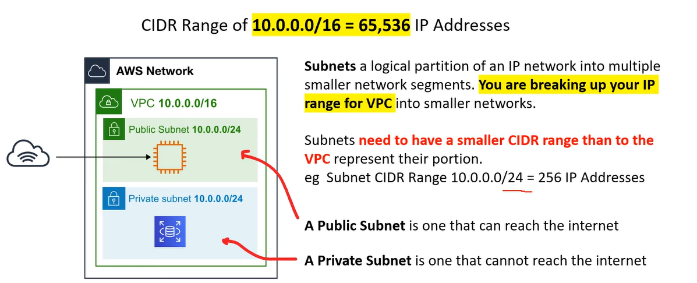
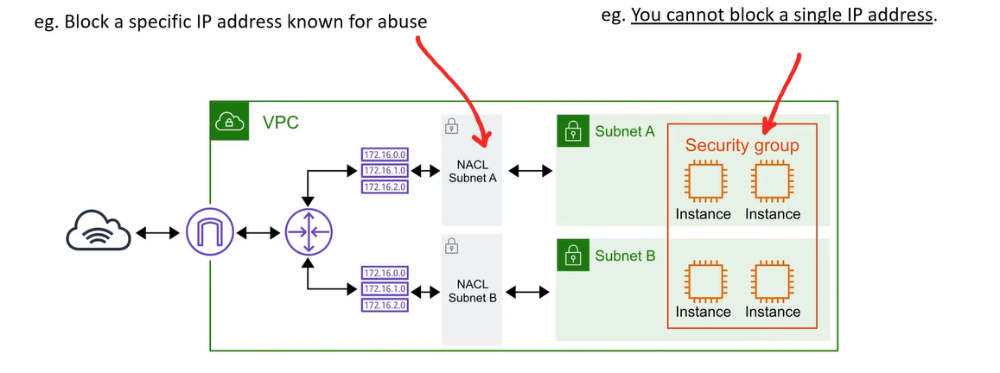

# AWS - Networking

[Back](../index.md)

- [AWS - Networking](#aws---networking)
  - [Cloud-Native Networking Services](#cloud-native-networking-services)
  - [Enterprise/Hybrid Networking](#enterprisehybrid-networking)
  - [VPC and Subnets](#vpc-and-subnets)
  - [Security Groups vs NACLs](#security-groups-vs-nacls)
  - [CloudFont](#cloudfont)

---

## Cloud-Native Networking Services

---

## Enterprise/Hybrid Networking

---

## VPC and Subnets

- `Virtual Private Cloud (VPC)`

  - a logically isolated section of the AWS Network where users launch AWS resources.
  - User chooses a range of IPs using CIDR Range.

- `Subnet`

  - break up a logical partition of an IP network into multiple smaller network segments.

- `Public Subnet`

  - the subnet can reach the internet.

- `Private Subnet`
  - the subnet cannot reach the internet.

---

## Security Groups vs NACLs

- `Network Access Control Lists (NACLs)`

  - acts as a virtual firewall at the subnet level.
  - user creates **Allow** and **Deny** rules
  - eg.Block a specific IP address known for abuse

- `Security Groups`
  - Acts as a virtual firewall at the instance level.
  - Implicitly **denies all traffic**.
  - user creates **only Allow** rules.
  - eg. allow an EC2 instance access on port 22 for SSH
  - eg. user cannot block a single IP address.

---

## CloudFont

- `Amazon CloudFront` is a **content delivery network** (CDN) service built for high performance, security, and developer convenience.

---

[TOP](#aws---networking)
