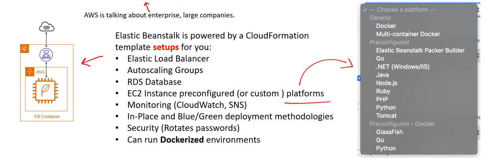

# AWS - Provisioning

[Back](../index.md)

- [AWS - Provisioning](#aws---provisioning)
  - [Provisioning Services](#provisioning-services)
  - [AWS Elatic Beanstalk](#aws-elatic-beanstalk)

---

## Provisioning Services

- `Provisioning`

  - the allocation or creation of resources and services to a customer.

- **AWS Provisioning Services** are responsible for setting up and then managing those AWS Services.

- `Elastic Beanstalk (EB)`

  - a `Platform-as-a-Service (PaaS)` to easily **deploy web-applications**.
  - EB will provision various AWS services, including EC2, S3,SNS, CloudWatch, EC2 Auto Scaling Groups, and Elestic Load Balancers.
  - like `Heroku`.

- `AWS OpsWorks`

  - a **configuration management service** that also provides managed instances of the open-source configuration managed software **Chef** and **Puppet**.

- `CloudFormation`

  - an **infrastructure modeling and provisioning service**.
  - Automate the provisioning of AWS Services by writing CloudFormation templates in either JSON or YAML files.(AKA `Infrastructure-as-Code(IaC)`)

- `AWS QuickStarts`

  - pre-made package that can launch and configure AWS compute, network, storage, and other services required to deploy a workload on AWS.

- `AWS Marketplace`

  - a **digital catalogue** of thousands of software listings from independent software vendors user can use to find, buy, test, and deploy software.

- `AWS Amplify`

  - a **mobile and web-application framework**, that will provision multiple AWS services as backend.

- `AWS App Runner`

  - a fully managed service that makes it easy for developers to quickly **deploy containerized web applications and APIs**, at scale and with no prior infrastructure experience required.

- `AWS Copilot`

  - a **command line interface (CLI)** that enables customers to quickly launch and easily manage **containerized applications** on AWS.

- `AWS CodeStar`

  - provides a unified user interface, enabling user to manage software developement activities in one place.
  - Easily launch common types of stackes, like LAMP.

- `AWS Cloud Development Kit (CDK)`
  - An Infrastructure-as-Code (IaC) tool. Allows to use user's favourite programming language.
  - Generates out CloudFormation templates as the means for IaC.

---

## AWS Elatic Beanstalk

- `Plaform-as-a-Service (PaaS)`

  - allows customers to develop, run, and manage application without the complexity of building and maintaining the infrastructure typically associated with developing and launching an app.

- `Elastic Beanstalk`

  - a **PaaS for deploying web-applications** with little-to-no knowledge of the underlying infrastucture so developer can focus on writing application code instead of setting up an automated deployment pipeline and DevOps tasks.
  - Choose a platform, upload code, and run with little knowledge of the infrastructure.

---

[TOP](#aws---provisioning)
