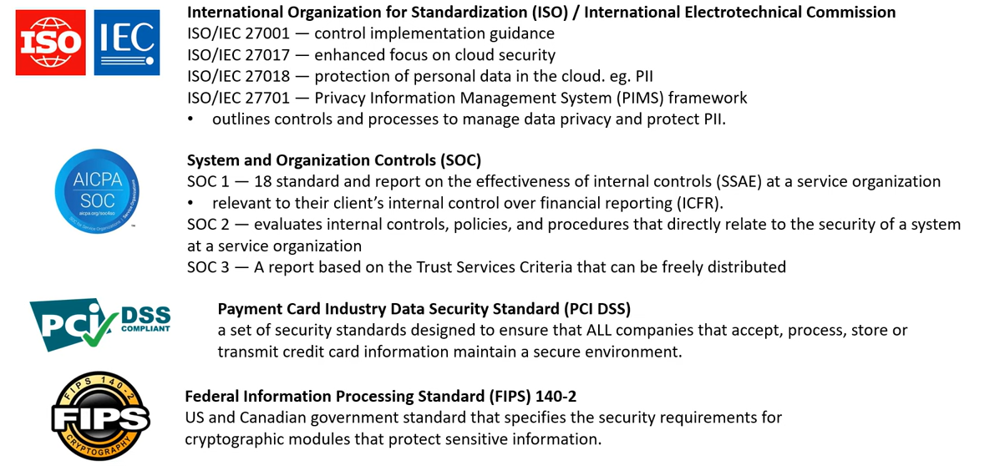

# AWS - Security

[Back](../index.md)

- [AWS - Security](#aws---security)
  - [Defense-In-Depth](#defense-in-depth)
  - [Security Principle: Confidentiality, Integrity, and Availability (CIA) triad](#security-principle-confidentiality-integrity-and-availability-cia-triad)
  - [Vulnerabilities](#vulnerabilities)
  - [Encryption](#encryption)
  - [Hashing and Salting](#hashing-and-salting)
  - [Digital Signatures and Signing](#digital-signatures-and-signing)
  - [Encryption In-Transit and At-Rest](#encryption-in-transit-and-at-rest)
  - [Common Compliance Programs](#common-compliance-programs)
  - [Penetration Testing](#penetration-testing)
  - [AWS Artifact](#aws-artifact)
  - [AWS Inspect](#aws-inspect)
  - [Distributed Denial of Service (DDos)](#distributed-denial-of-service-ddos)
  - [AWS Shield](#aws-shield)
  - [Amazon Guard Duty](#amazon-guard-duty)
  - [Amazon Macie](#amazon-macie)
  - [AWS Virtual Private Network (VPN)](#aws-virtual-private-network-vpn)
  - [AWS Web Application Firewall (WAF)](#aws-web-application-firewall-waf)
  - [Hardware Security Module](#hardware-security-module)
  - [AWS Key Management Service](#aws-key-management-service)
  - [CloudHSM](#cloudhsm)

---

## Defense-In-Depth

- The 7 Layers of Security
  - 1. Data
    - access to business and customer data, and encryption to protect data.
  - 2. Application
    - applications are secure and free of security valnerabilities.
  - 3. Compute
    - Access to virtual machines (ports, on-premise, cloud)
  - 4. Nextwork
    - limit communication between resources using segmentation and access controls
  - 5. Perimeter
    - distributed denial of service (DDoS) protection to filter large-scale attacks before they can cause a denial of service for users.
  - 6. Identity and access
    - controlling access to infrastructure and change control.
  - 7. Physical
    - Limiting access to a datacenter to only authorized personnel.

---

## Security Principle: Confidentiality, Integrity, and Availability (CIA) triad

- `Confidentiality, Integrity, and Availability (CIA) triad`

  - a model describing the foundation to **security principle** and their trade-off relationship.

- `Confidentiality`

  - a component of privacy that implements to protect user's data from unauthorized viewers.
  - In practice, it can be using **cryptographic keys to encrypt data**, and using keys to encrypt keys.

- `Integrity`

  - maintaining and assuring the accuracy and completeness of data over its entire lifecycle.
  - In practice, utilizing ACID compliant databases for valid transactions, utilizing tamper-evident or tamper proof `Hardware Security Modules (HSM)`.

- `Availability`
  - Information needs to be made be available when needed.
  - In practice: High Availability, Migtigating DDoS, Decryption access.

---

## Vulnerabilities

- `Vulnerabilities`
  - A hole or a weekness in the applications, which can be a design flaw or an implementation bug, that allows an attacker to cause harm to the stakeholders of an application.

---

## Encryption

- `Cryptography密码术`

  - the pratice and study of techniques for **secure communication** in the presence of **third parties**, called `adversary`
  - the **science of concealing messages** with a secret code.

- `Encryption密码术`

  - the process of encoding(scrabbling) information using a key and a cypher 密码 to store sensitive data in an unintelligible 费解的 format as a means of protection.
  - An encryption takes in **plaintext 明码文本** and produces **ciphertext 密文**.
  - the way to encrypt and decrypt data.

- `Cypher`

  - An algorithm that performs encryption or decryption.
  - synonymous with "code".

- `Ciphertext`

  - the result of encryption performed on plaintext via an algorithm.

- `Crytographic key`

  - a variable used in conjunction with an encryption algorithm in order to encrypt or decrypt data.

- `Symmetric Encryption对称加密`

  - The same key is used for encoding and decoding.
  - eg.`Advanced Encryption Standard (AES)高级加密标准`

  

- `Asymmetric Encryption`

  - Two keys are used. One to encode and one to decode.
  - eg. `Rivest-Shamir-Adleman (RSA)`

  

---

## Hashing and Salting

- `Hashing`

  - the process of using a mathematical function to convert **input data** into a **fixed-length output**.
  - Hashing can reduce the size of the store value.
  - Hasing is an **one-way process** and is **deterministic**.

- `Hashing function`

  - A function that accepts arbitrary size value and maps it to a fixed-size data structure.
  - A deterministic function always **returns the same output for the same input**.

- `Hashing functions` are **used to store passwords in database** so that a password does not reside in a plaintext format.

  - To authenticate a user, when a user inputs their password, it is hashed and the hash is compared to the store hashed. If they match then the user has successful logged in.

- Popular hashing functions are `MD5`, `SHA256`, and `Bcrypt`.

  - If attacks know what hashing function are used and steal a database, they could enumerated a dictionary of password to detemine the password.

- `Salting Passowrds`
  - A `salt` is a **random string** not known to the attacker that the hashing function accepts to **mitigate the deterministic nature** of hashing functions.

---

## Digital Signatures and Signing

- `Digital Signature`

  - a mathematical scheme to verify the authenticity of digital messages or document.

- `Digital signature` gives users tamper-evidence.

- Three algorithms to digital signatures:

  - `Key generation`, generates a public and private key.
  - `Signing`, the process of generating a digital signature with a **private key** and inputted message.
  - `Signing Verification`, verify the authenticity of the message with a **public key**.

  

- `SSH` uses a **public and private key** to authorize remote access into a remote machine.

  - eg.Virtual Machine, it is common to use `RSA(Asymmetric Encryption)`.
  - `ssh-keygen`, a well known command to generate a **public** and **private** key.
    - `ssh-keygen -t rsa`

- `Code Signing`

  - a process by which the software developer **signs** the applications and executables before releasing them.
  - by **placing a digital signature** onto the executable, program, software update or file.

- `Code Signing Certificate`
  - assesses whether the software that is being **downloaded comes directly** from the publisher.
  - ensures that the software **has not been tempered**and the user can safely download it.
  - proves the publisher’s **authenticity** and code **integrity**.
  - allows users to trust any upgrades, and all major browsers and operating systems support code signing.

---

## Encryption In-Transit and At-Rest

- `Encryption In-Transit`

  - defends data against potential attackers, after a connection is established and authenticated
  - Data that is secure when moving between locations.
  - Algorithms: TLS, SSL

- `Transport Layer Security (TLS)`

  - a **cryptographic protocol** that provides end-to-end security of data sent between applications over the Internet.
  - uses a combination of symmetric and asymmetric cryptography

- `Secure Sockets Layers (SSL)`

  - a **networking protocol** designed for securing connections between web clients and web servers over an insecure network.
  - It uses both **symmetric and asymmetric cryptography**.
  - provides **server** authentication and **client** authentication

- `Encryption At-Rest`
  - encryption that is used to help protect data that is **stored on a disk** (including solid-state drives) or backup media.
  - Data that is secure when residing on storage or within a database.
  - Algorithms: `AES`, `RSA`

---

## Common Compliance Programs

- `Compliance Programs`
  - a set of internal **policies and procedures** of a company to comply with laws, rules, and regulations or to uphold business reputation.

---

## Penetration Testing

- `Pen Testing`

  - An authorized simulated cyberattack on a computer system, performed to evaluate the security of the system.

- Pen Testing is allowed to be performed on AWS.

---

## AWS Artifact

- `AWS Artifact`
  - a self-serve portal for on-demand access to **AWS compliance reports**.
  - provides on-demand access to security and compliance reports from AWS

---

## AWS Inspect

- `Hardening`

  - In computer security, hardening is usually the process of securing a system by reducing its surface of vulnerability.
  - is common for Virtual Machines where user runs a collection of security checks, known as a `security benchmark`.

- `AWS Inspector`
  - runs a security benchmark against specific EC2 instances.
  - can perform both Network and Host Assessments.
  - can run a variety of security benchmarks.
    - install the AWS agent on EC2 instances.
    - Run an assessment for assessment target.
    - Review findings and remediate security issues.

---

## Distributed Denial of Service (DDos)

- `Distributed Denial of Service (DDos)`
  - A malicious attempt to disrupt normal traffic by flooding a website with large amounts of fake traffic.

---

## AWS Shield

- `AWS Shield`
  - a managed DDoS (Distributed Denial of Service) protection service that safeguards application running on AWS.

- Both plans integrate with `AWS Web Application Firewall (WAF)` to give **Layer 7 (Application) **protection.

---

## Amazon Guard Duty

- `IDS/IPS`

  - `Intrusion Detection System / Intrusion Protection System`
  - A device or software application that monitors a network or systems for malicious activity or policy violations.

- `Guard Duty`

  - a threat detection service that continuously **monitors** for malicious, suspicious activity and unauthorized behavior.
  - It uses Machine Learning to analyze AWS logs:
    - CloudTrail Logs
    - VPC Flow Logs
    - DNS Logs

- it will alert user of findings which user can automate a incident response via CloudWatch Events or with 3rd Party Services.

---

## Amazon Macie

- `Macie`

  - a fully managed service that continuously monitors **S3 data access** activity for anomalies, and generates detailed alerts when it detects risk of unquthorized access or inadvertent data leaks.

- Macie works by uses Machine Learning to Analyze CloudTrail logs.

---

## AWS Virtual Private Network (VPN)

- `AWS Virtual Private Network (VPN)`

  - allow to establish a secure and private tunnel from user's network or device to the AWS global network.

- 2 types

  - `AWS site-to-site vpn`

    - securely connect **on-premises network or branch office site** to **VPC**

  - `AWS Client VPN`
    - securely connect **users** to **AWS or on-premises networks**.

- `Internet Protocol Security (IPsec)`
  - a **secure network protocol suite** that **authenticates and encrypts the packets** of data to provide secure encrypted communication between two computers over an Internet Protocol network.
  - Used in `AWS VPN`

---

## AWS Web Application Firewall (WAF)

- `AWS Web Application Firewall (WAF)`

  - protect web applications from common web exploits.

- Write users their own rules to ALLOW or DENY traffic based on the contents of an HTTP requests.

- Can use a ruleset from a trusted AWS Security Partner in the AWS WAF rules Marketplace.
- Can be attached to either `CloudFront` or an `Application Load Balancer`.

---

## Hardware Security Module

- `Hardware Security Module`

  - its a **piece of hardware** designed to **store encrytion keys**.
  - HSM hold keys in memory and **never write them to disk**.

- HSM's that are **multi-tenant** are **FIPS 140-2 Level 2 Compliant**.

  - multiple customers virtually isolated on an HSM
  - `AWS KMS`

- HSM's that are **single-tenant** are **FIPS 140-2 Level 3 Compliant**.
  - single customer on a dedicated HSM
  - `AWS CloudHSM`

---

## AWS Key Management Service

- `AWS Key Management Service (KMS)`

  - a managed service that makes it easy to create and control the encryption keys used to encrypt data.

- KMS is a multi-tenant `HSM (Hardware Security Module)`
- Many AWS services are integrated to use KMS to **encrypt data** with a simple checkbox.
- KMS uses **Envelope Encryption**.

- `Envelope Encryption`
  - When user encrypt data, data is protected but user has to protect encryption key.
  - When user encrypt data key with a master key as an additional layer of security.

---

## CloudHSM

- `CloudHSM`

  - a single-tenant HSM as a service that automates hardware provisioning, software patching, high availability, and backups.

- `AWS CloudHSM` enables user to generate and use user's encryption keys on a FIPS 140-2 Level 3 validated hardware.

---

[TOP](#aws---security)
