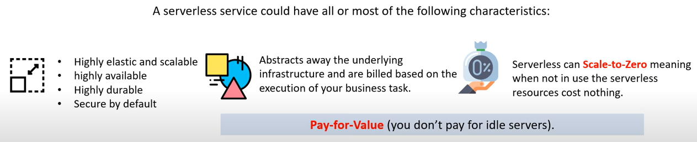
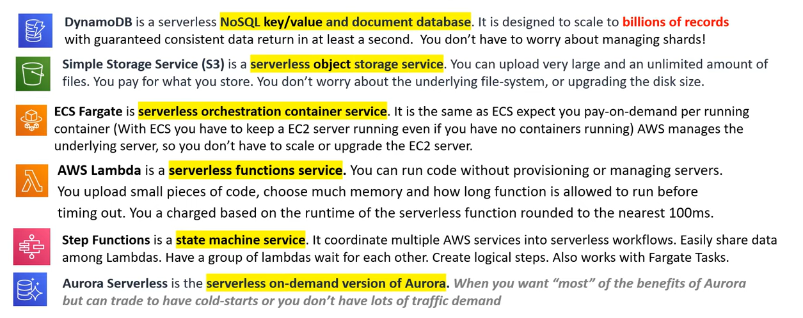

# AWS - Serverless

[Back](../index.md)

- [AWS - Serverless](#aws---serverless)
  - [Serverless](#serverless)

---

## Serverless

- `Serverless`

  - When the underlying servers, infrastructure and Operating System (OS) is taken care of by the Cloud Service Provider (CSP).

- Characteristics

  

- Examples of Serverless

  

---

[TOP](#aws---serverless)
