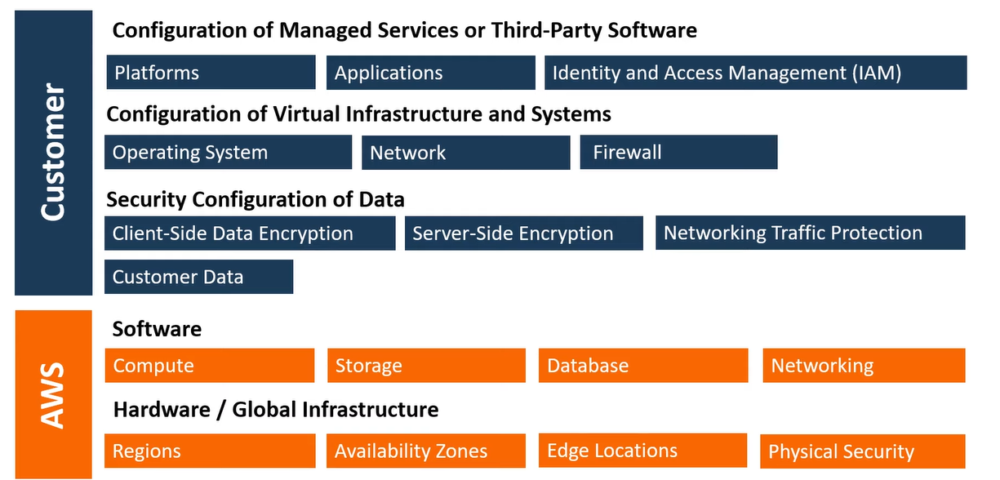
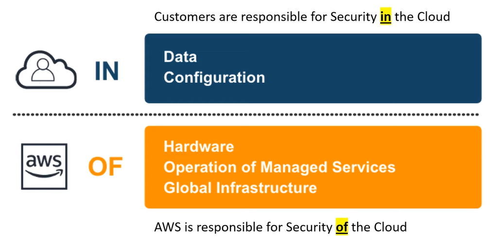
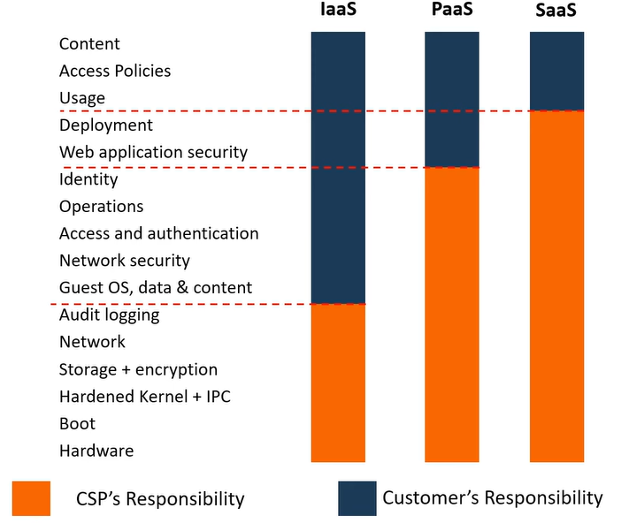
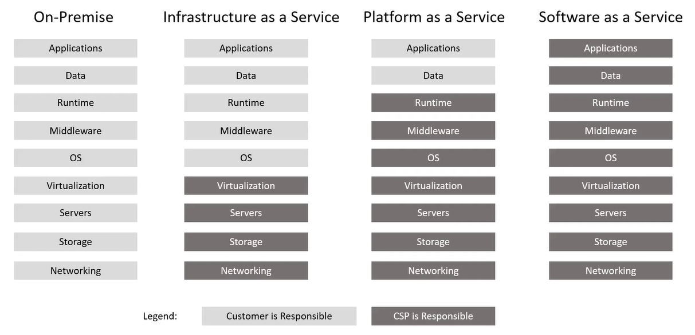
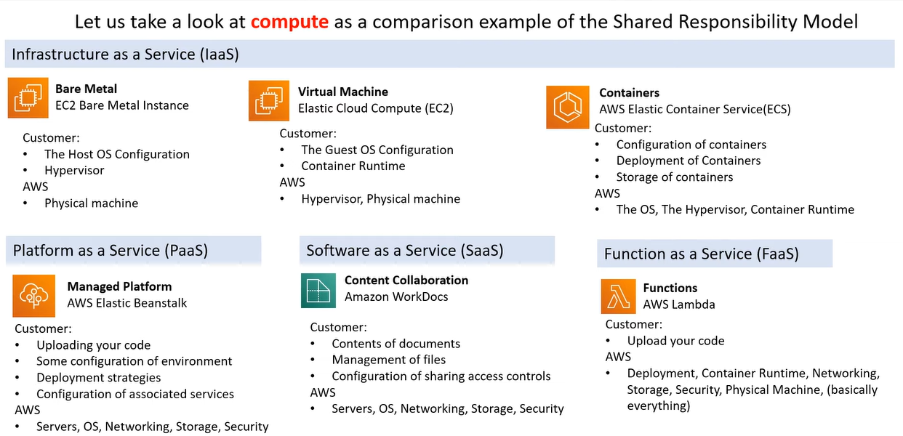
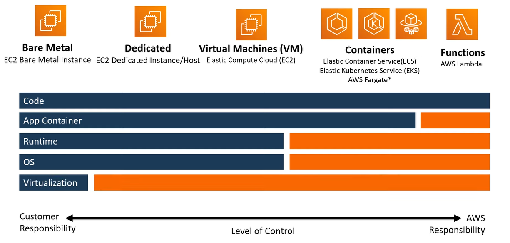
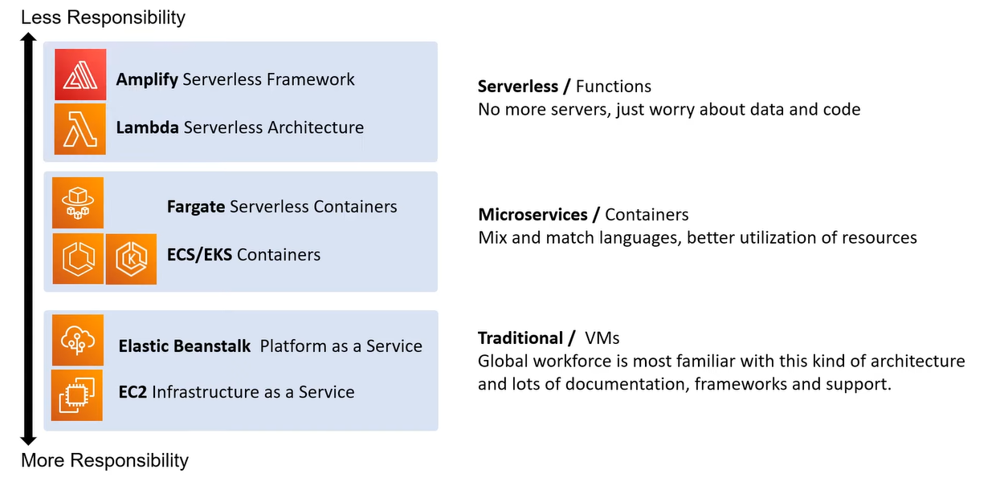

# AWS - Shared Responsibility Model

[Back](../index.md)

- [AWS - Shared Responsibility Model](#aws---shared-responsibility-model)
  - [AWS Shared Responsibility Model](#aws-shared-responsibility-model)
  - [Types of Cloud Computing Responsibility](#types-of-cloud-computing-responsibility)
  - [Example: Compute](#example-compute)
  - [Architecture](#architecture)

---

## AWS Shared Responsibility Model

- `Shared Responsibility Model`

  - a cloud security framework that defines the security obligations of the customer versa the Cloud Service Provider(CSP). e.g.AWS.
  - a simple visualization that helps determin <u>what the customer is responsible for</u> and <u>what the CSP is responsible for related to AWS</u>.

- Customer: responsibilty of **in** the cloud

  - if user can configure or store it then user are responsible for it.
  - The customer is responsible for the **data** and the **configuration** of access controls that resides in AWS.
  - The customer is responsible for the **configuration** of cloud services and **granting access** to users via permissions.

- CSP: responsibilty of **of** the cloud

  - If user cannot configure it, then CSPs is responsible for it.
  - is generally responsible for the **underlying Infrastructure**.

- The `type of cloud deployment model` and the `scope of cloud service category` can result in specialized `Shared Responsibility Models`.

- 简化

---

## Types of Cloud Computing Responsibility

---

## Example: Compute

---

## Architecture

---

[TOP](#aws---shared-responsibility-model)
