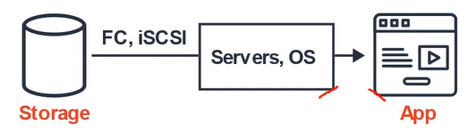
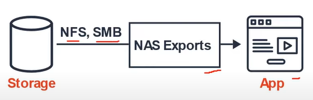
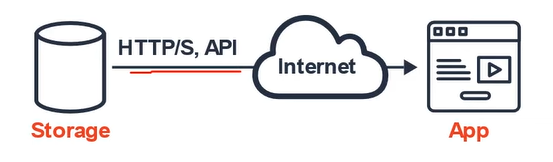

# AWS - EC2 Storage

[Back](../index.md)

- [AWS - EC2 Storage](#aws---ec2-storage)
  - [Elastic Block Store (EBS)](#elastic-block-store-ebs)
    - [Delete on Termination attribute](#delete-on-termination-attribute)
    - [EBS Snapshots](#ebs-snapshots)
  - [EC2 Instance Store](#ec2-instance-store)
  - [Elastic File System (EFS)](#elastic-file-system-efs)
    - [EFS Infrequent Access (EFS-IA)](#efs-infrequent-access-efs-ia)
  - [Amazon FSx – high-performance](#amazon-fsx--high-performance)
    - [Amazon FSx for Windows File Server](#amazon-fsx-for-windows-file-server)
    - [Amazon FSx for Lustre](#amazon-fsx-for-lustre)
  - [Shared Responsibility Model](#shared-responsibility-model)
  - [EC2 Instance Storage Summary](#ec2-instance-storage-summary)

---

## Elastic Block Store (EBS)

- `Elastic Block Store (EBS)` - Block

  - block-storage service **designed for EC2**
    - EBS used to be **accessible to a single EC2 instance only**, making it most like your physical hard drive.
  - allows your instances to **persist data**, even **after their termination**
  - Data is spilt into evenly split blocks
  - They can only be **mounted to one instance at a time** (at the CCP level)
    - Supports only a single write volume
  - They are **bound to a specific availability zone**
  - Directly accessed by the Operation System

- Free tier: **30 GB** of free EBS storage of type General Purpose (**SSD**) or Magnetic per month

- For user who needs a virtual hard drive attached to a VM.

  - Analogy: Think of them as a “network USB stick”
  - Website: https://aws.amazon.com/ebs/

  

- It’s a **network drive** (i.e. not a physical drive)

  - It **uses the network to communicate** the instance, which means there might be a bit of latency
  - It can be detached from an EC2 instance and attached to another one quickly

- It’s **locked to an Availability Zone (AZ)**

  - An EBS Volume in us-east-1a cannot be attached to us-east-1b 不能跨区接入
  - To move a volume across, you first need to **snapshot** it 能跨区移动

- Have a **provisioned capacity** (size in GBs, and IOPS)
  - You get billed for all the provisioned capacity
  - You can increase the capacity of the drive over time

---

### Delete on Termination attribute

- Controls the EBS behaviour **when an EC2 instance terminates**
  - By default, the **root EBS** volume is **deleted** (attribute enabled)
  - By default, any **other attached EBS** volume is **not deleted** (attribute disabled)
  - This can be controlled by the **AWS console / AWS CLI** 可改变
  - Use case: preserve root volume when instance is terminated 可将 root 变为不自动删除

---

### EBS Snapshots

- Make a **backup (snapshot)** of your EBS volume at a point in time
- Not **necessary to detach** volume to do snapshot, but recommended
- Can **copy snapshots across AZ** or Region

- `EBS Snapshot Archive`

  - Move a Snapshot to an ”**archive tier**” that is 75% **cheaper**
  - Takes within **24 to 72 hours** for restoring the archive

- `Recycle Bin` for EBS Snapshots
  - Setup rules to retain deleted snapshots so you can recover them after an accidental
    deletion
  - Specify **retention** (from 1 day to 1 year)

---

## EC2 Instance Store

- EBS volumes are network drives with good but “limited” performance
- If you need a **high-performance hardware disk**, use `EC2 Instance Store`

- `EC2 Instance Store`

  - Better I/O performance
  - **lose their storage** if they’re stopped (ephemeral)
  - Good for buffer / cache / scratch data / temporary content
  - **Risk of data loss** if hardware fails
  - Backups and Replication are **your responsibility**

---

## Elastic File System (EFS)

- `AWS Elastic File System (EFS)`

  - Managed **NFS (network file system)** that can be mounted on 100s of EC2
  - EFS works with **Linux** EC2 instances **in multi-AZ**
  - Highly available, scalable, expensive (3x gp2), **pay per use**, **no capacity planning**

  - EFS can be **mounted by multiple EC2** instances, meaning many virtual machines may store files within an EFS instance.
  - File is stored with data and metadata
  - Multiple connections via a network share
  - Supports multiple reads, writing locks the file.
  - For users who need a file-share where **multiple users or VMs** need to access the same drive.
  - Website: https://aws.amazon.com/efs/

  

---

### EFS Infrequent Access (EFS-IA)

- `EFS Infrequent Access (EFS-IA)`
  - Storage class that is **cost-optimized** for **files not accessed every day**
  - Up to 92% lower cost compared to EFS Standard
- EFS will automatically move your files to EFS-IA **based on the last time** they were accessed
- Enable EFS-IA with a **Lifecycle Policy**
  - Example: move files that are not accessed for 60 days to EFS-IA
  - Transparent to the applications accessing EFS 不会影响性能,全自动

---

- `Amazon Simple Storage Service (S3)` - Object

  - can also be **accessed by other cloud services**
  - is ideal for handling **large volumes of static data as well as complex queries**s.
  - Object is stored with data, metadata, and Unique ID
  - Scales with limited no file limit or storage limit.
  - Supports multiple reads and writes (no locks)
  - For users who just want to upload files, and not have to worry about underlying infrastracure. Not Intended for high IOPs.
  - Website: https://aws.amazon.com/s3/

  

---

## Amazon FSx – high-performance

- Launch **3rd party high-performance file systems** on AWS
- Fully managed service
- Types
  - `FSx for Lustre`
  - `FSx for Windows File Server`
  - `FSx for NetApp ONTAP`

---

### Amazon FSx for Windows File Server

- A fully managed, highly reliable, and scalable Windows native shared file system
- Built on **Windows File Server**
- Supports **SMB protocol** & Windows **NTFS**
- Integrated with **Microsoft Active Directory**
- Can be accessed from **AWS** or your **on-premise infrastructure**

---

### Amazon FSx for Lustre

- A fully managed, high-performance, scalable file storage for **High Performance Computing (HPC)**
- The name Lustre is derived from “**Linux**” and “cluster”
- Machine Learning, Analytics, Video Processing, Financial Modeling, …
- Scales up to 100s GB/s, millions of IOPS, sub-ms latencies

---

## Shared Responsibility Model

- AWS

  - Infrastructure
  - **Replication** for data for EBS volumes & EFS drives
  - Replacing **faulty hardware**
  - **Ensuring their employees** cannot access your data

- User
  - Setting up **backup / snapshot** procedures
  - Setting up data **encryption**
  - Responsibility of any **data** on the drives
  - Understanding the **risk of using EC2 Instance Store**

---

## EC2 Instance Storage Summary

- `EBS` volumes:
  - network drives attached to** one EC2 instance at a time**
  - Mapped to an **Availability Zones**
  - Can use `EBS Snapshots` for **backups** / **transferring** EBS volumes across AZ
- `AMI`: create ready-to-use EC2 instances with our customizations
  - `EC2 Image Builder`: automatically build, test and distribute AMIs
- `EC2 Instance Store`:
  - High performance hardware disk attached to our EC2 instance
  - Lost if our instance is stopped / terminated
- `EFS`: **network file system**, can be attached to 100s of instances in a region
  - `EFS-IA`: cost-optimized storage class for infrequent accessed files
- `FSx`: 3rd party high-performance file systems
  - `FSx for Windows`: Network File System for Windows servers
  - `FSx for Lustre`: High Performance Computing Linux file system

---

[TOP](#aws---ec2-storage)
