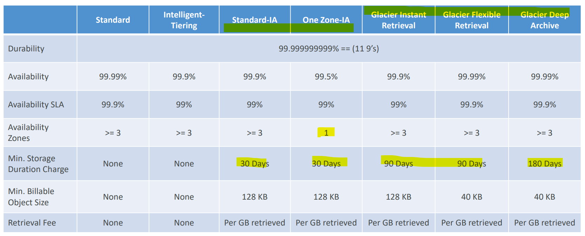
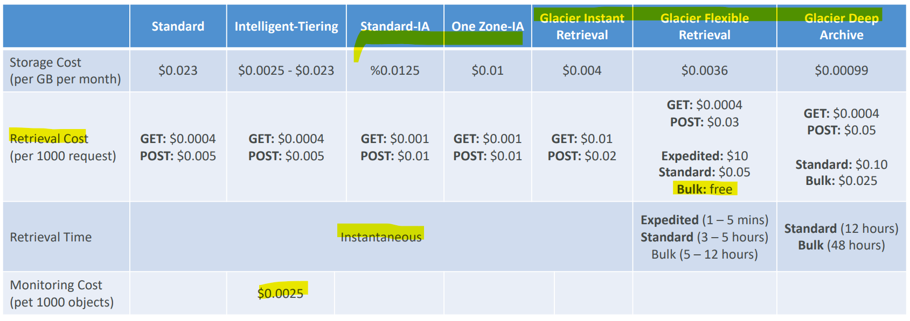
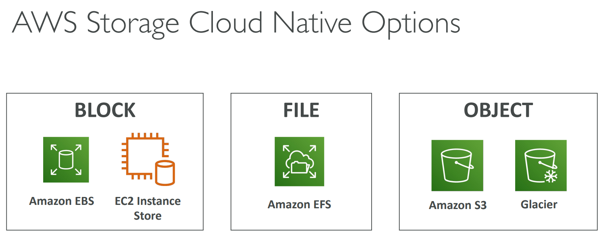
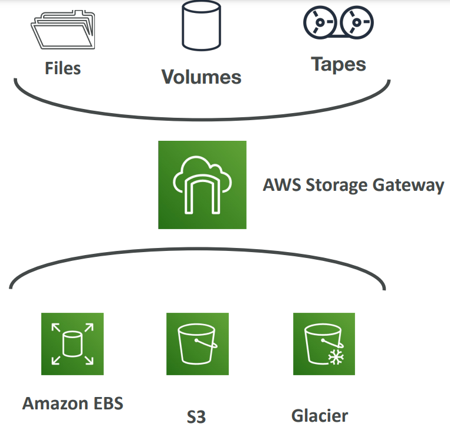

# AWS - S3

[Back](../index.md)

- [AWS - S3](#aws---s3)
  - [S3](#s3)
  - [Security](#security)
    - [Bucket Policies](#bucket-policies)
    - [Bucket settings for Block Public Access](#bucket-settings-for-block-public-access)
    - [Encryption](#encryption)
  - [Static Website Hosting](#static-website-hosting)
  - [Bucket Versioning 版本控制](#bucket-versioning-版本控制)
  - [Replication (CRR \& SRR)](#replication-crr--srr)
  - [S3 Storage Classes](#s3-storage-classes)
    - [Durability and Availability](#durability-and-availability)
    - [Standard – General Purpose](#standard--general-purpose)
    - [Infrequent Access](#infrequent-access)
      - [Standard-Infrequent Access (S3 Standard-IA)](#standard-infrequent-access-s3-standard-ia)
      - [One Zone-Infrequent Access (S3 One Zone-IA)](#one-zone-infrequent-access-s3-one-zone-ia)
    - [Glacier Storage Classes](#glacier-storage-classes)
      - [Glacier Instant Retrieval](#glacier-instant-retrieval)
      - [Glacier Flexible Retrieval](#glacier-flexible-retrieval)
      - [Glacier Deep Archive – for long term storage](#glacier-deep-archive--for-long-term-storage)
    - [Intelligent-Tiering](#intelligent-tiering)
    - [S3 Class Comparison](#s3-class-comparison)
  - [Shared Responsibility Model for S3](#shared-responsibility-model-for-s3)
  - [Other Storage](#other-storage)
    - [AWS Snow Family - Edge Location](#aws-snow-family---edge-location)
      - [Data migration](#data-migration)
      - [Edge computing](#edge-computing)
      - [AWS OpsHub - software](#aws-opshub---software)
    - [Storage Gateway](#storage-gateway)
      - [hybrid cloud](#hybrid-cloud)
      - [Storage Gateway](#storage-gateway-1)
  - [Summary](#summary)

---

## S3

- `Object Storage (Object-based Storage)`

  - the data storage architecture that manages data **as objects**, as opposed to other storage architectures:
    - `file system`, which manages data as a files and file hierachy
    - `block storage`, which manages data as blocks within sectors and tracks.

- `S3`

  - provides user with **unlimited** storage / ”**infinitely scaling**” storage

  - users don't need to think about the underlying infrastructure
  - The S3 console provides an interface for user to upload and access user's data.

- **`S3` Use cases**

  - Backup and storage
  - Disaster Recovery
  - Archive
  - Hybrid Cloud storage
  - Application hosting
  - Media hosting
  - Data lakes & big data analytics
  - Software delivery
  - Static website

- `S3 Object`

  - Ojbects contain data, like files.
  - Ojbect may consist of:

    - **Key**, FULL path of the object

      - `s3://my-bucket/my_file.txt`
      - `s3://my-bucket/my_folder1/another_folder/my_file.txt`
      - The key is composed of **prefix** + **object name**
      - s3://my-bucket/_my_folder1/another_folder/_**my_file.txt**
      - There’s no concept of “directories” within buckets (although the UI will trick you to think otherwise)
      - Just keys with very long names that contain slashes (“/”)

    - **Value**, the content of the body

      - Max. Object Size is 5TB (5000GB)
      - If uploading more than 5GB, must use “multi-part upload”

    - **Metadata**, list of text key / value pairs – system or user metadata
    - **Tags** (Unicode key / value pair – up to 10) – useful for security / lifecycle
    - **Version ID** (if versioning is enabled)

- `S3 Bucket`

  - Bucket hold object.
  - Amazon S3 allows people to store **objects** (files) in **“buckets”** (directories)
  - Buckets can also have folders which in turn hold objects.
  - S3 is a **universal** namespace so bucket names must be **unique**. (across all **regions** all **accounts**)
  - Buckets are defined at the **region level**
    - S3 looks like a global service but buckets are created in a region

- Individual object from 0 Bytes to 5 Terabytes in size.

---

## Security

- **User-Based**

  - `IAM Policies` – which API calls should be allowed for **a specific user** from IAM
  - Example:
    - **User Access** to S3 -IAM permissions
    - **EC2 instance** access - Use IAM Roles

- **Resource-Based**
  - `Bucket Policies` – bucket wide rules from the S3 console - **allows cross account**
    - Example: Use Bucket Policy
      - **Cross-Account Access**
      - **Public Access**
  - `Object Access Control List (ACL)` – finer grain (can be disabled)
  - `Bucket Access Control List (ACL)` – less common (can be disabled)
- Note: an **IAM principal can access** an S3 object if
  - The user **IAM permissions ALLOW** it **OR** the resource **policy ALLOWS** it
  - **AND** there’s **no explicit DENY**
- **Encryption**:
  - encrypt objects in Amazon S3 using encryption keys

---

### Bucket Policies

- JSON based policies

  - Resources: buckets and objects
  - Effect: Allow / Deny
  - Actions: Set of API to Allow or Deny
  - Principal: The **account or user** to apply the policy to

- Use `S3 bucket for policy` to:

  - Grant **public access** to the bucket
  - Force objects to be **encrypted at upload**
  - Grant access to another account (**Cross Account**)

---

### Bucket settings for Block Public Access

- These settings were created to **prevent company data leaks**
  - If you know your bucket should **never** be public, leave these on
  - Can be set at the account level

---

### Encryption

- `Server-Side Encryption`

  - Default
  - Server encrypts the file **after receiving it**

- `Client-Side Encryption`
  - Encrypts the file **Before uploading it**

---

## Static Website Hosting

- `Static Website Hosting`
  - S3 can host static websites and have them accessible on
    the Internet
- The website URL will be (depending on the region)
  - `http://bucket-name.s3-website-aws-region.amazonaws.com`
  - `http://bucket-name.s3-website.aws-region.amazonaws.com`
- If you get a `403 Forbidden error`, make sure the bucket
  policy **allows public reads**!

---

## Bucket Versioning 版本控制

- You can version your files in Amazon S3
- It is enabled **at the bucket level**
- **Same key overwrite** will change the “version”: 1, 2, 3…. 相同的文件名会覆盖
- It is best practice to version your buckets
  - Protect **against unintended deletes** (ability to restore a version)
  - **Easy roll back** to previous version
- Notes:
  - Any file that is not versioned **prior to enabling versioning will have version “null”**
  - **Suspending versioning does not delete** the previous versions

---

## Replication (CRR & SRR)

- Must **enable Versioning** in source and destination buckets
- Buckets can **be in different AWS accounts**
- Copying is **asynchronous**
- Must give proper **IAM permissions** to S3
- `Cross-Region Replication (CRR)`
- `Same-Region Replication (SRR)`
- Use cases:
  - `CRR` – compliance, lower latency access, replication across accounts
  - `SRR` – log aggregation, live replication between **production** and **test** accounts
- 效果: 一旦 source 更新, target 自动更新

---

## S3 Storage Classes

- `S3 Outposts` has its own storage clas.

- `Lifecycle Rules` can be used to define when S3 objects should be **transitioned** to another storage class or when objects should be deleted after some time.

### Durability and Availability

- **Durability 耐用性**:
  - High durability (99.999999999%, 11 9’s) of objects **across multiple AZ**
  - If you store 10,000,000 objects with Amazon S3, you can on average expect to incur a **loss of a single object** once every 10,000 years
  - **Same for all storage classes**
- **Availability**:

  - Measures how readily available a service is
  - Example: S3 standard has 99.99% availability = **not available** 53 minutes a year
  - **Varies depending on storage class**

- AWS offers a range of S3 storage classes that trade **Retrieval Time**, **Accessibility**, and **Durability** for Cheaper Storage.

### Standard – General Purpose

- 99.99% Availability
- default
- Used for **frequently accessed** data
- Low latency and high throughput
- Sustain 2 concurrent facility failures
  - Replicated across at least three AZs.
- Use Cases:

  - Big Data analytics, mobile & gaming applications, content distribution…

---

### Infrequent Access

- For data that is **less frequently accessed**, but requires **rapid access** when needed
- **Lower cost** than S3 Standard

#### Standard-Infrequent Access (S3 Standard-IA)

- 99.9% Availability
- Use cases: Disaster **Recovery, backups**

#### One Zone-Infrequent Access (S3 One Zone-IA)

- High durability (99.999999999%) in a **single AZ**;
- **data lost when AZ is destroyed**
- 99.5% Availability
- Use Cases:

  - Storing **secondary backup copies** of on-premise data, or data you can recreate

---

### Glacier Storage Classes

- Low-cost object storage meant for **archiving / backup**
- Pricing:
  - price for **storage** + object **retrieval cost**

#### Glacier Instant Retrieval

- Millisecond retrieval, great for data accessed **once a quarter**三个月
- **Minimum storage** duration of **90 days**

#### Glacier Flexible Retrieval

- Types – free
  - Expedited (1 to 5 minutes),
  - Standard (3 to 5 hours),
  - Bulk (5 to 12 hours)
- Minimum storage duration of **90 days**

#### Glacier Deep Archive – for long term storage

- Types
  - Standard (12 hours),
  - Bulk (48 hours)
- Minimum storage duration of **180 days**
- the **most cost-effective** for archiving data with **no retrieval time requirement**
---

### Intelligent-Tiering

- Small **monthly** monitoring and **auto-tiering fee**
- Moves objects automatically between Access Tiers based on usage
- There are **no retrieval charges** in S3 Intelligent-Tiering

- Tiers
  - Frequent Access tier (automatic): default tier
  - Infrequent Access tier (automatic): objects not accessed for 30 days
  - Archive Instant Access tier (automatic): objects not accessed for 90 days
  - Archive Access tier (optional): configurable from 90 days to 700+ days
  - Deep Archive Access tier (optional): config. from 180 days to 700+ days

---

### S3 Class Comparison

---

## Shared Responsibility Model for S3

- AWS

  - **Infrastructure** (global security, durability, availability, sustain concurrent loss of data in
    two facilities)
  - **Configuration** and **vulnerability** analysis
  - **Compliance** validation

- Usres
  - S3 **Versioning**
  - S3 Bucket **Policies**
  - S3 **Replication** Setup
  - **Logging** and **Monitoring**
  - S3 Storage **Classes**
  - Data **encryption** at rest and in transit

---

## Other Storage

### AWS Snow Family - Edge Location

- `AWS Snow Family`

  - **storage and compute devices** used to physically move data in or out the cloud when moving data over the internet or private connection it to slow, difficult, or costly.
  - Data is **delivered to S3**
  - Highly-secure, portable **devices** to collect and process data **at the edge**, and **migrate data** into and out of AWS

- AWS Snow Family: **offline devices** to perform data migrations
  - If it takes **more than a week** to transfer over the network, use Snowball devices!

#### Data migration

- `Snowcone`

  - two sizes:
    - 8TB of Storage (HHD)
    - 14TB of Storage (SSD)

- `Snowball Edge`

  - generally two types:
    - Storage Optimized, 80TB
    - Compute Optimized, 39.5TB
    - it's recommended to use a fleet of Snowballs to move **less than 10PBs** of data.

- `Snowmobile`

  - 100PB of storage
  - exabytes 艾字节 1 EB=1,000 PBs=1,000,000 TBs

---

#### Edge computing

- Snowcone & Snowcone SSD
  - wired or wireless access
  - USB-C power using a cord or the optional battery
- Snowball Edge – Compute Optimized
  - useful for video processing or machine learning
- Snowball Edge – Storage Optimized
  - Object storage clustering available
  - suited for **large-scale data migrations** (petabytes of data) and recurring transfer workflows, as well as **local computing with higher capacity** needs.

---

#### AWS OpsHub - software

- to manage your Snow Family Device

---

### Storage Gateway

#### hybrid cloud

- Part of your infrastructure is on-premises
- Part of your infrastructure is on the cloud
- This can be due to

  - Long cloud **migrations**
  - **Security** requirements
  - **Compliance** requirements
  - IT **strategy**

- Use AWS Storage Gateway to expose the S3 data on-premise

#### Storage Gateway

- **Bridge** between **on-premise data** and **cloud data in S3**
- Hybrid storage service to allow on- premises to seamlessly use the AWS Cloud
- Use cases:
  - disaster recovery, backup &
    restore, tiered storage
- Types of Storage Gateway:
  - File Gateway
  - Volume Gateway
  - Tape Gateway

---

## Summary

- Buckets vs Objects:
  - global unique name,
  - tied to a region
- S3 security:
  - IAM policy,
  - S3 Bucket Policy (public access),
  - S3 Encryption
- S3 Websites:
  - host a static website on Amazon S3
- S3 Versioning:
  - multiple versions for files,
  - prevent accidental deletes
- S3 Replication:
  - same-region or cross-region,
  - **must enable versioning**
- S3 Storage **Classes**:
  - Standard,
    - IA,
    - 1Z-IA,
    - Intelligent,
    - Glacier (Instant, Flexible, Deep)
- Snow Family:
  - import data onto S3 through a physical **device**,
  - edge computing
  - OpsHub: desktop application to manage Snow Family devices
- Storage Gateway:
  - **hybrid** solution to extend on-premises storage to S3

---

[TOP](#aws---s3)
