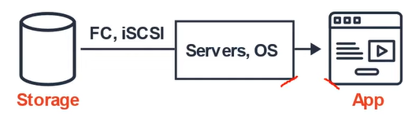
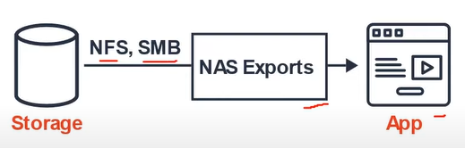
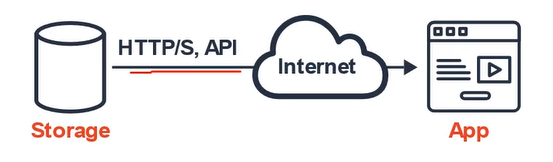

# AWS - Storage

[Back](../index.md)

- [AWS - Storage](#aws---storage)
  - [Types of Storage Services](#types-of-storage-services)
  - [S3](#s3)
  - [S3 Storage Classes](#s3-storage-classes)
  - [AWS Snow Family](#aws-snow-family)
  - [Storage Services](#storage-services)

---

## Types of Storage Services

- `Elastic Block Store (EBS)` - Block

  - block-storage service **designed for EC2**
    - EBS used to be **accessible to a single EC2 instance only**, making it most like your physical hard drive.
  - Data is spilt into evenly split blocks
  - Directly accessed by the Operation System
  - Supports only a single write volume
  - For user who needs a virtual hard drive attached to a VM.

  - Website: https://aws.amazon.com/ebs/

  

- `AWS Elastic File System (EFS)` - File

  - EFS can be **mounted by multiple EC2** instances, meaning many virtual machines may store files within an EFS instance.
  - File is stored with data and metadata
  - Multiple connections via a network share
  - Supports multiple reads, writing locks the file.
  - For users who need a file-share where **multiple users or VMs** need to access the same drive.
  - Website: https://aws.amazon.com/efs/

  

- `Amazon Simple Storage Service (S3)` - Object

  - can also be **accessed by other cloud services**
  - is ideal for handling **large volumes of static data as well as complex queries**s.
  - Object is stored with data, metadata, and Unique ID
  - Scales with limited no file limit or storage limit.
  - Supports multiple reads and writes (no locks)
  - For users who just want to upload files, and not have to worry about underlying infrastracure. Not Intended for high IOPs.
  - Website: https://aws.amazon.com/s3/

  

---

## S3

- `Object Storage (Object-based Storage)`

  - the data storage architecture that manages data **as objects**, as opposed to other storage architectures:
    - `file system`, which manages data as a files and file hierachy
    - `block storage`, which manages data as blocks within sectors and tracks.

- `S3`

  - provides user with unlimited storage.
  - users don't need to think about the underlying infrastructure
  - The S3 console provides an interface for user to upload and access user's data.

- `S3 Object`

  - Ojbects contain data, like files.
  - Ojbect may consist of:
    - **Key**, the name of the object
    - **Value**, the data itself made up of a sequence of bytes
    - **Version** ID, the version of object when versioning enabled.
    - **Metadata**, additional information attached to the object.

- `S3 Bucket`

  - Bucket hold object.
  - Buckets can also have folders which in turn hold objects.
  - S3 is a universal namespace so bucket names must be unique.

- Individual object from 0 Bytes to 5 Terabytes in size.

---

## S3 Storage Classes

- AWS offers a range of S3 storage classes that trade **Retrieval Time**, **Accessibility**, and **Durability** for Cheaper Storage.

- -> cheaper

  - **S3 Standard (default)**

    - Fast! 99.99% Availability, 11 9's Durability. Replicated across at least three AZs.

  - **S3 Intelligent Tiering**

    - Uses ML to analyze object usage and determine the appropriate storage class.
    - Data is moved to the most cost-effective access tier, without any performance impact or added overhead.

  - **S3 Standard-IA (Infrequent Access)**

    - Still Fast! Cheaper if you access files less than once a month.
    - Additional retrieval fee is applied. 50% less than Stanard (reduced availability)

  - **S3 One-Zone-IA**

    - Still Fast! Objects only exist in one AZ. Availability but cheaper than Standard IA by 20% less (Reduce durability) Data could get destroyed. A retrival fee is applied.

  - **S3 Glacier**

    - For long-term cold storage. Retrieval of data can take minutes to hours but the off is very cheap storage.

  - **S3 Glacier Deep Archive**
    - The lowest cost storage class. Data retrieval time is 12 hours.

- S3 Outposts has its own storage clas.

---

## AWS Snow Family

- `AWS Snow Family`

  - storage and compute devices used to physically move data in or out the cloud when moving data over the internet or private connection it to slow, difficult, or costly.
  - Data is delivered to S3

- `Snowcone`

  - two sizes:
    - 8TB of Storage (HHD)
    - 14TB of Storage (SSD)

- `Snowball Edge`

  - generally two types:
    - Storage Optimized, 80TB
    - Compute Optimized, 39.5TB

- `Snowmobile`
  - 100PB of storage

---

## Storage Services

---

[TOP](#aws---storage)
