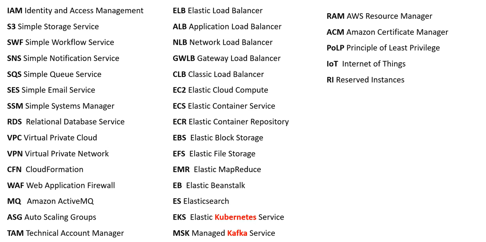
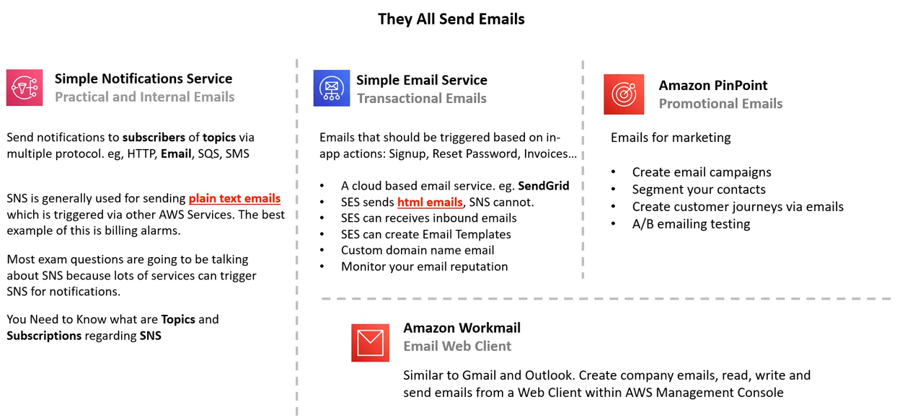
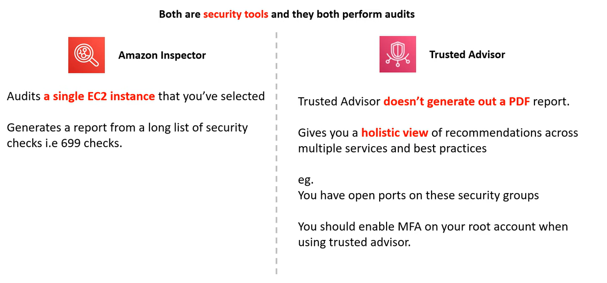
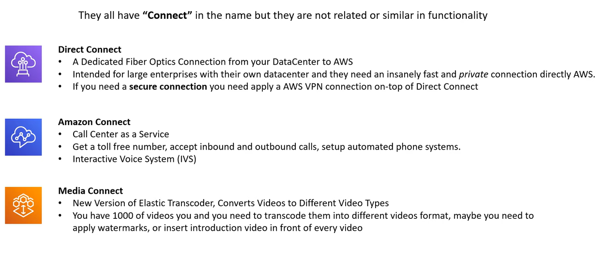
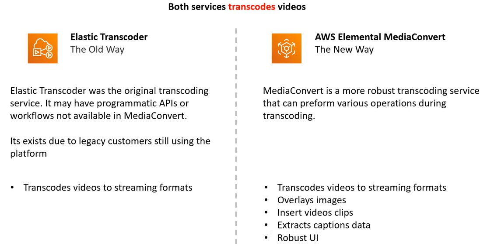
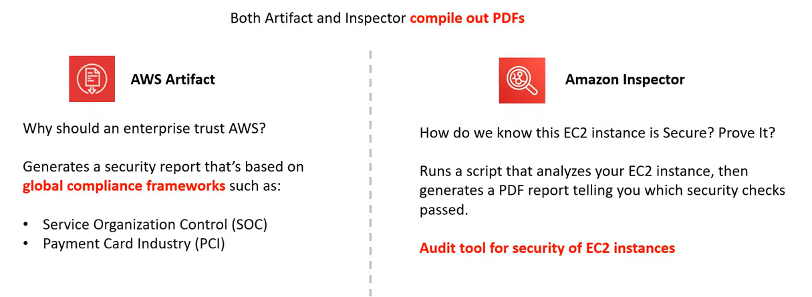
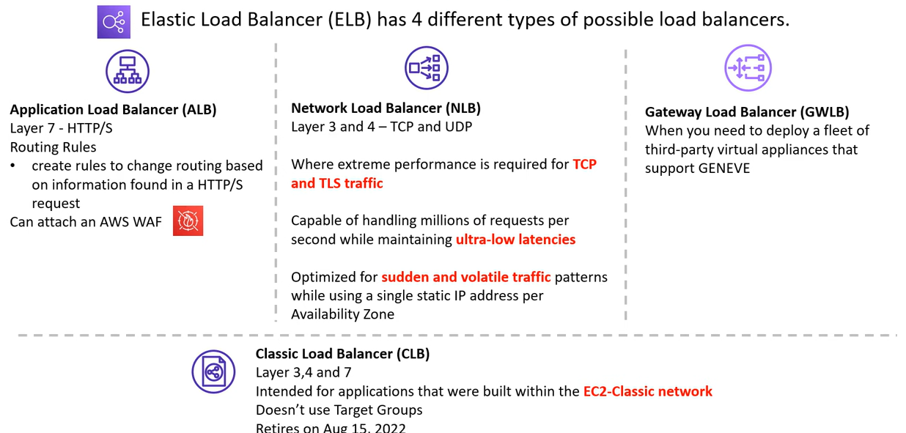

# AWS - Variation Study

[Back](../index.md)

- [AWS - Variation Study](#aws---variation-study)
  - [Initialism 词首字母缩略词](#initialism-词首字母缩略词)
  - [AWS Config vs AWS AppConfig](#aws-config-vs-aws-appconfig)
  - [SNS vs SQS](#sns-vs-sqs)
  - [SNS vs SES vs PinPoint vs Workmail](#sns-vs-ses-vs-pinpoint-vs-workmail)
  - [Amazon Inspector vs AWS Trusted Advisor](#amazon-inspector-vs-aws-trusted-advisor)
  - [Connect Named Services](#connect-named-services)
  - [Elastic Transcoder vs MediaConvert](#elastic-transcoder-vs-mediaconvert)
  - [AWS Artifact vs Amazon Inspector](#aws-artifact-vs-amazon-inspector)
  - [ELB Variants](#elb-variants)

---

## Initialism 词首字母缩略词

---

## AWS Config vs AWS AppConfig

| AWS config                                                                                       | AWS AppConfig                                                                              |
| ------------------------------------------------------------------------------------------------ | ------------------------------------------------------------------------------------------ |
| a governance tool for Compliance as Code (CoC)                                                   | used ro automat process of deploying application **configuration variable changes** to App |
| can create rules to check whether resources are configured the way as expected.                  | can write a validator to ensure the changed variable not to break web-app                  |
| If resources drift from expected, user can be notified or AWS Config can auto-remediate(correct) | can monitor deployments and automate integrations to catch errors or rollback              |

---

## SNS vs SQS

---

## SNS vs SES vs PinPoint vs Workmail

---

## Amazon Inspector vs AWS Trusted Advisor

---

## Connect Named Services

---

## Elastic Transcoder vs MediaConvert

---

## AWS Artifact vs Amazon Inspector

---

## ELB Variants

---

[TOP](#aws---variation-study)
