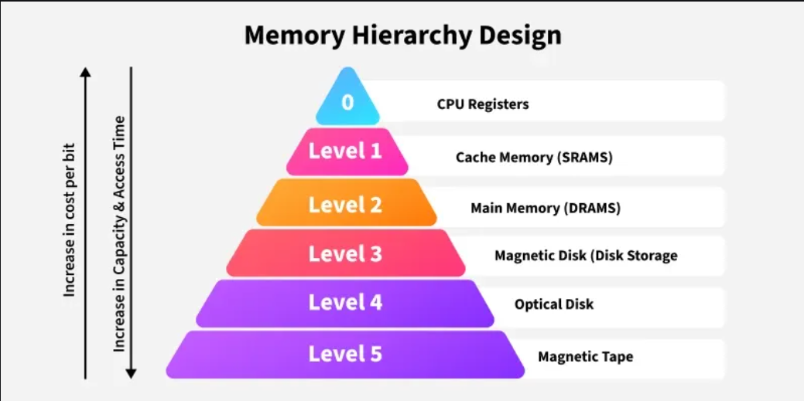
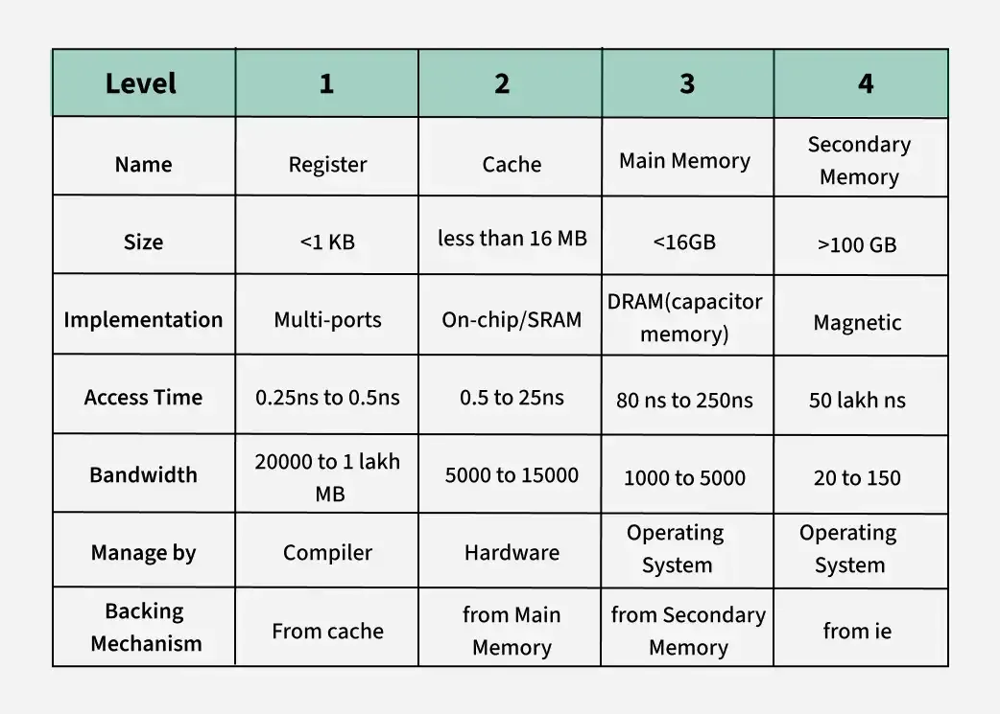

# Computer Architecture - Memory: Memory Hierarchy

[Back](../../index.md)

- [Computer Architecture - Memory: Memory Hierarchy](#computer-architecture---memory-memory-hierarchy)
  - [Memory Hierarchy](#memory-hierarchy)
    - [Characteristics](#characteristics)
  - [Primary Memory](#primary-memory)
    - [Registers](#registers)
    - [Cache Memory](#cache-memory)
    - [Main Memory](#main-memory)
  - [Secondary Memory](#secondary-memory)
    - [Secondary Storage](#secondary-storage)
    - [Magnetic Disk](#magnetic-disk)
    - [Magnetic Tape](#magnetic-tape)

---

## Memory Hierarchy

- `memory hierarchy`

  - a design of layered stack of storage to minimize the access time.
  - based on the locality of references
    - same data or nearby data is likely to be accessed again and again

- Benefits:

  - optimizing the memory available in the computer
    - divide into multiple levels that have different size, cost, etc
    - divide into vary types of memory that have different performance and storage value

- Types of Memory Hierarchy
  - `Primary Memory`/`Internal Memory`:
    - **directly accessible** by the processor
    - e.g., Main Memory, Cache Memory & CPU registers
  - `Secondary Memory`/`External Memory`:
    - accessible by the processor **via an I/O Module**
    - e.g., Magnetic Disk, Optical Disk, and Magnetic Tape

---

### Characteristics

- **Capacity**:
  - It is the global volume of information the memory can store.
  - As we move from **top to bottom** in the Hierarchy, the **capacity increases**.
- **Access Time**:
  - It is the **time interval** between the read/write request and the availability of the data.
  - As we move from **top to bottom** in the Hierarchy, the **access time increases**.
- **Performance**:
  - The Memory Hierarch design **ensures that frequently accessed data** is stored in **faster memory** to improve system performance.
- **Cost Per Bit**:
  - As we move from bottom to top in the Hierarchy, the **cost per bit increases** i.e. Internal Memory is costlier than External Memory.

---

## Primary Memory

### Registers

- `register` (寄存器)
  - small, high-speed memory units **located in the CPU**.
  - used to store the **most frequently used data and instructions**.
  - have the **fastest access time** and the **smallest storage capacity**, typically ranging from 16 to 64 bits.

---

### Cache Memory

- `Cache memory`

  - a small, fast memory unit located **close to the CPU**.
  - used to store **frequently used data and instructions** that have been **recently accessed from the main memory**.
  - designed to **minimize the time** it takes to **access data** by providing the CPU with quick **access to frequently used data**.

- hierarchy
  - `L1`: keep **immediately hot code/data**
    - used to Feed a core every cycle with `instructions (L1I)` and `data (L1D)`.
    - One `L1I` and one `L1D` **per core**
    - size: 16–64 KiB
    - very fast, lowest latency.
  - `L2`: hape the algorithm for **medium working sets**.
    - used to catch L1 misses; hold medium-sized working sets.
    - **One** unified L2 **per core**.
    - size: 256 KiB–2 MiB
    - Lower than L1
  - `L3/Last-Level Cache (LLC)`: keep **big read-mostly data** here and avoid cross-core invalidation.
    - Last on-package stop **before DRAM**; **shared across cores**; absorbs cross-core traffic.
    - Size: Many MiB
    - higher latency.

---

### Main Memory

- `Main memory`/`RAM (Random Access Memory)`

  - the **primary memory** of a computer system.
  - used to **store data and instructions** that are **currently in use** by the CPU.
  - has a **larger storage capacity** than cache memory, but it is **slower**.

- Types of Main Memory
  - `Static RAM`:
    - used to store the **binary information in flip flops(电路中的触发器)** and information **remains valid until power** is supplied.
    - has a **faster access time** and is used in **implementing** `cache memory`.
  - `Dynamic RAM`:
    - used to store the **binary information** as a **charge on the capacitor**(电容中的电荷).
    - requires refreshing circuitry to maintain the charge on the capacitors after a few milliseconds.
    - It contains **more memory cells** per unit area as compared to SRAM.

---

## Secondary Memory

### Secondary Storage

- `Secondary Storage`
  - used to store data and instructions that are **not currently in use** by the `CPU`.
  - a **non-volatile memory unit** that has a **larger storage capacity** than `main memory`.
  - has the **slowest access time** and is typically the **least expensive** type of memory in the memory hierarchy.
  - e.g., `hard disk drives (HDD)` and `solid-state drives (SSD)`

---

### Magnetic Disk

- `Magnetic Disk`
  - circular plates that are fabricated with either a metal or a plastic or a **magnetized material**.

---

### Magnetic Tape

- `Magnetic Tape`
  - a **magnetic recording device** that is covered with a **plastic film**.
  - used for the backup of data.
  - the access time for a computer is a little **slower** and therefore, it requires some amount of time for accessing the strip.

---
