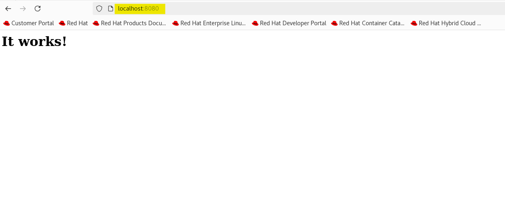
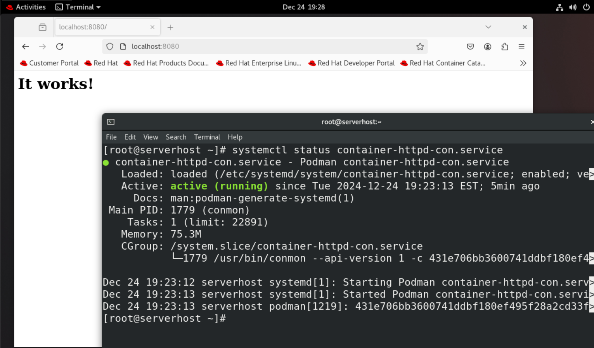

# Linux - Container: Package `podman`

[Back](../../index.md)

- [Linux - Container: Package `podman`](#linux---container-package-podman)
  - [Podman](#podman)
    - [Podman vs Docker](#podman-vs-docker)
    - [Common Podman Commands](#common-podman-commands)
    - [Package and Service](#package-and-service)
  - [Lab: Download Image](#lab-download-image)
  - [Lab: Run a container](#lab-run-a-container)
  - [Lab: Create container with a name](#lab-create-container-with-a-name)
  - [Lab: Manage container using systemd](#lab-manage-container-using-systemd)

---

## Podman

- `Podman (short for Pod Manager)`

  - an open-source **container management tool** developed by Red Hat.
  - It provides a **daemonless** alternative to Docker for building, running, and managing containers and pods.
  - Podman uses the same container image format as Docker and is compatible with `Open Container Initiative (OCI)` standards.

- `images`
  - used to create containers
- `pod`

  - a group of containers, similar to Kubernetes pods, enabling better control over multi-container applications.

- **Features**
  - **Daemonless Architecture:**
    - Unlike Docker, `Podman` does **not require a background daemon**.
    - Containers are run **as child processes** of the `Podman CLI`.
    - This architecture makes Podman more secure and lightweight.
  - **Rootless Containers:**
    - Podman supports running containers **as a non-root user**, enhancing security by **reducing the risk of privilege escalation**.
  - **OCI Compliance:**
    - Podman adheres to the OCI standards for container images and runtimes, ensuring portability and compatibility with other tools like Kubernetes.
  - **Docker-Compatible Commands:**
    - Many Docker commands work with Podman, making it easy for users to transition from Docker.
  - **Pods:**
    - Podman allows managing groups of containers as pods, similar to Kubernetes pods, enabling better control over multi-container applications.
  - **Built-In Systemd Integration:**
    - Podman can generate systemd service files to **manage containers as system services**.

### Podman vs Docker

| Feature                 | Podman                                 | Docker                                      |
| ----------------------- | -------------------------------------- | ------------------------------------------- |
| **Architecture**        | **Daemonless**                         | Daemon-based                                |
| **Rootless**            | Fully supports `rootless mode`         | Limited support                             |
| **Pods**                | Supports `pods` (native to Kubernetes) | No native pod support                       |
| **Systemd Integration** | Built-in systemd support               | Requires manual setup                       |
| **Security**            | More secure by default, no root daemon | Requires root daemon for full functionality |
| **Compatibility**       | Supports Docker images and commands    | Native support for Docker tools             |

---

### Common Podman Commands

- **Common Commands**

| CMD           | DESC                                      |
| ------------- | ----------------------------------------- |
| `podman -V`   | Check Podman Version                      |
| `podman info` | Display Podman related system information |

- **Registry Commands**

| Command                     | Description                                                          |
| --------------------------- | -------------------------------------------------------------------- |
| `podman search img_pattern` | Search for an image in a remote registry.                            |
| `podman pull img_url`       | Pull an image from a container registry (e.g., Docker Hub, Quay.io). |
| `podman push img_name`      | Push an image to a remote registry.                                  |

- **Local Image Management Commands**

| Command                             | Description                                                |
| ----------------------------------- | ---------------------------------------------------------- |
| `podman images`                     | List all available images locally.                         |
| `podman build -t tag_name .`        | Build an image from a Dockerfile in the current directory. |
| `podman rm img_name`                | Remove a local image.                                      |
| `podman inspect img_name`           | View detailed information about a local image.             |
| `podman tag img_name tag_name`      | Tag an image with a new name or tag.                       |
| `podman commit con_name image_name` | Create a new image from a container's current state.       |

- **Container Management Commands**

| Command                                                        | Description                                                   |
| -------------------------------------------------------------- | ------------------------------------------------------------- |
| `podman ps`                                                    | List all running containers.                                  |
| `podman ps -a`                                                 | List all containers, including stopped ones.                  |
| `podman run image_name`                                        | Run a container from an image.                                |
| `podman run -d image_name`                                     | Run a container in detached mode.                             |
| `podman run -it image_name`                                    | Run a container interactively.                                |
| `podman run -d --name con_name -p host_port:con_port img_name` | Run a Container                                               |
| `podman start con_name`                                        | Start a stopped container.                                    |
| `podman stop con_name`                                         | Stop a running container.                                     |
| `podman restart con_name`                                      | Restart a container.                                          |
| `podman rm con_name`                                           | Remove a container.                                           |
| `podman exec -it con_name bash`                                | Execute a command (e.g., a shell) inside a running container. |
| `podman logs con_name`                                         | View logs for a container.                                    |
| `podman stats con_name`                                        | Show resource usage statistics for running containers.        |
| `podman inspect con_name`                                      | View detailed information about a container.                  |
| `podman cp con_name:con_path host_dest`                        | Copy files from a container to the host.                      |
| `podman generate systemd --name con_name`                      | Generate a systemd Service File                               |

- **Pod Management Commands**

| Command                                  | Description                                                 |
| ---------------------------------------- | ----------------------------------------------------------- |
| `podman pod ps`                          | List all running pods.                                      |
| `podman pod ps -a`                       | List all pods, including stopped ones.                      |
| `podman pod top pod_name`                | Display active processes in a pod.                          |
| `podman pod create --name pod_name`      | Create a new pod.                                           |
| `podman pod rm pod_name`                 | Remove a pod (stops and removes all associated containers). |
| `podman run -dt --pod pod_name img_name` | Add a container to an existing pod and run it.              |
| `podman pod start pod_name`              | Start a stopped pod.                                        |
| `podman pod stop pod_name`               | Stop a running pod.                                         |
| `podman pod restart pod_name`            | Restart a pod.                                              |
| `podman pod inspect pod_name`            | View detailed information about a pod.                      |
| `podman pod logs pod_name`               | View logs from all containers in a pod.                     |
| `podman generate kube pod_name`          | Generate a Kubernetes YAML manifest for a pod.              |

---

### Package and Service

- Installing package

```sh
dnf install podman -y
rpm -qa | grep podman
# podman-gvproxy-4.9.4-18.module+el8.10.0+22417+2fb00970.x86_64
# podman-catatonit-4.9.4-18.module+el8.10.0+22417+2fb00970.x86_64
# podman-plugins-4.9.4-18.module+el8.10.0+22417+2fb00970.x86_64
# podman-4.9.4-18.module+el8.10.0+22417+2fb00970.x86_64

podman -v
# podman version 4.9.4-rhel
```

- Service

```sh

```

- To create Alias for docker using podman

```sh
alias docker=podman
```

---

## Lab: Download Image

```sh
# Search an image
podman search docker.io/library/httpd
# NAME                              DESCRIPTION
# docker.io/library/httpd           The Apache HTTP Server Project
# docker.io/manageiq/httpd          Container with httpd, built on CentOS for Ma...
# docker.io/paketobuildpacks/httpd
# docker.io/vulhub/httpd
# docker.io/jitesoft/httpd          Apache httpd on Alpine linux.
# docker.io/openquantumsafe/httpd   Demo of post-quantum cryptography in Apache...
# docker.io/openeuler/httpd
# docker.io/dockerpinata/httpd
# docker.io/centos/httpd
# docker.io/e2eteam/httpd
# docker.io/manasip/httpd
# docker.io/amd64/httpd             The Apache HTTP Server Project
# docker.io/futdryt/httpd
# docker.io/ppc64le/httpd           The Apache HTTP Server Project
# docker.io/9af925e7043/httpd
# docker.io/arm64v8/httpd           The Apache HTTP Server Project
# docker.io/arm32v7/httpd           The Apache HTTP Server Project
# docker.io/i386/httpd              The Apache HTTP Server Project
# docker.io/s390x/httpd             The Apache HTTP Server Project
# docker.io/tugboatqa/httpd         The Apache HTTP Server Project
# docker.io/signiant/httpd          httpd (apache2) base container with a custom...
# docker.io/inventis/httpd          apache container with support for https only
# docker.io/armhf/httpd             The Apache HTTP Server Project
# docker.io/publici/httpd           httpd:latest
# docker.io/vzwingmadomatic/httpd   Service frontal de l'application de domotiqu...

# List all local images before downloading
podman images
# REPOSITORY  TAG         IMAGE ID    CREATED     SIZE

# Download image
podman pull docker.io/library/httpd
# Trying to pull docker.io/library/httpd:latest...
# Getting image source signatures
# Copying blob 9bd25d4f7b77 done   |
# Copying blob bc0965b23a04 done   |
# Copying blob 4f4fb700ef54 done   |
# Copying blob d7ad38c6dd97 done   |
# Copying blob 79b49624e34b done   |
# Copying blob 7d9f97915db2 done   |
# Copying config 494b2b45fd done   |
# Writing manifest to image destination
# 494b2b45fd74cbf7eb7dc9cfeda02b26c9450e26719afaf1914635832217c4ce

# List all local images before downloading
podman images
# REPOSITORY               TAG         IMAGE ID      CREATED       SIZE
# docker.io/library/httpd  latest      494b2b45fd74  5 months ago  151 MB
```

---

## Lab: Run a container

```sh
# list all containers
podman ps
# CONTAINER ID  IMAGE       COMMAND     CREATED     STATUS      PORTS       NAMES

# run a con from an img
# -d: detach mode, detach the current terminal from the running container
# -t: allocates a pseudo-tty and attach to the standard input of the container.
# -p: Mapping Ports for External Usage
# an httpd port 80 can be mapped to the host port 8080
podman run -dt -p 8080:80/tcp docker.io/library/httpd

# confirm
podman ps
# CONTAINER ID  IMAGE                           COMMAND           CREATED         STATUS         PORTS                 NAMES
# d8cdeff2b178  docker.io/library/httpd:latest  httpd-foreground  28 seconds ago  Up 28 seconds  0.0.0.0:8080->80/tcp  zealous_perlman
```

- Confirm via browser



- debug by checking log

```sh
podman logs -l
# AH00558: httpd: Could not reliably determine the server's fully qualified domain name, using 10.88.0.2. Set the 'ServerName' directive globally to suppress this message
# AH00558: httpd: Could not reliably determine the server's fully qualified domain name, using 10.88.0.2. Set the 'ServerName' directive globally to suppress this message
# [Tue Dec 24 23:45:07.019966 2024] [mpm_event:notice] [pid 1:tid 1] AH00489: Apache/2.4.62 (Unix) configured -- resuming normal operations
# [Tue Dec 24 23:45:07.020107 2024] [core:notice] [pid 1:tid 1] AH00094: Command line: 'httpd -D FOREGROUND'
# 10.88.0.1 - - [24/Dec/2024:23:48:33 +0000] "GET / HTTP/1.1" 200 45
# 10.88.0.1 - - [24/Dec/2024:23:48:33 +0000] "GET /favicon.ico HTTP/1.1" 404 196
```

- Stop a container

```sh
# list all con
podman ps
# CONTAINER ID  IMAGE                           COMMAND           CREATED        STATUS        PORTS                 NAMES
# d8cdeff2b178  docker.io/library/httpd:latest  httpd-foreground  7 minutes ago  Up 7 minutes  0.0.0.0:8080->80/tcp  zealous_perlman

# stop a con
podman stop d8cdeff2b178
# d8cdeff2b178

# confirm
podman ps
# CONTAINER ID  IMAGE       COMMAND     CREATED     STATUS      PORTS       NAMES
```

- Run 2 cons with different ports

```sh
podman run -dt -p 8081:80/tcp docker.io/library/httpd
podman run -dt -p 8082:80/tcp docker.io/library/httpd

# confirm
podman ps
# CONTAINER ID  IMAGE                           COMMAND           CREATED         STATUS         PORTS                 NAMES
# 3fb8d076caae  docker.io/library/httpd:latest  httpd-foreground  13 seconds ago  Up 14 seconds  0.0.0.0:8081->80/tcp  amazing_nash
# 52e55e608970  docker.io/library/httpd:latest  httpd-foreground  11 seconds ago  Up 12 seconds  0.0.0.0:8082->80/tcp  wonderful_banzai

# stop one con
podman stop 52e55e608970 3fb8d076caae
# 3fb8d076caae
# 52e55e608970

# confirm
podman ps
# CONTAINER ID  IMAGE       COMMAND     CREATED     STATUS      PORTS       NAMES
```

---

## Lab: Create container with a name

```sh
# create a con from an img with a name
podman create --name httpd-con docker.io/library/httpd

# confirm: it donot display in the running list, but all list
podman ps
# CONTAINER ID  IMAGE       COMMAND     CREATED     STATUS      PORTS       NAMES

podman ps -a
# CONTAINER ID  IMAGE                           COMMAND           CREATED         STATUS                         PORTS                 NAMES
# d8cdeff2b178  docker.io/library/httpd:latest  httpd-foreground  17 minutes ago  Exited (0) 9 minutes ago       0.0.0.0:8080->80/tcp  zealous_perlman
# 3fb8d076caae  docker.io/library/httpd:latest  httpd-foreground  7 minutes ago   Exited (0) About a minute ago  0.0.0.0:8081->80/tcp  amazing_nash
# 52e55e608970  docker.io/library/httpd:latest  httpd-foreground  7 minutes ago   Exited (0) 5 minutes ago       0.0.0.0:8082->80/tcp  wonderful_banzai
# 43d5903bae4a  docker.io/library/httpd:latest  httpd-foreground  3 minutes ago   Created                                              httpd-con

# Start the container
podman start httpd-con
# httpd-con

# confirm
podman ps
# CONTAINER ID  IMAGE                           COMMAND           CREATED        STATUS         PORTS       NAMES
# 43d5903bae4a  docker.io/library/httpd:latest  httpd-foreground  6 minutes ago  Up 44 seconds              httpd-con
```

---

## Lab: Manage container using systemd

- Steps:
  - generate systemd unit file
  - copy the unit file into the systemd dir
- Purpose:
  - Can enable the container as a service in ssytemd

```sh
# generate a unit file
podman generate systemd --new --files --name httpd-con
# /root/container-httpd-con.service

# copy the systemd unit file
cp /root/container-httpd-con.service /etc/systemd/system
# confirm
ll /etc/systemd/system/container-httpd-con.service
# -rw-r--r--. 1 root root 760 Dec 24 19:12 /etc/systemd/system/container-httpd-con.service
systemctl list-unit-files | grep httpd-con
# container-httpd-con.service                                            disabled

# enable the service
systemctl enable container-httpd-con.service
# Created symlink /etc/systemd/system/default.target.wants/container-httpd-con.service → /etc/systemd/system/container-httpd-con.service.

# start the service
systemctl start container-httpd-con.service

# confirm
systemctl status container-httpd-con.service
# ● container-httpd-con.service - Podman container-httpd-con.service
#    Loaded: loaded (/etc/systemd/system/container-httpd-con.service; enabled; vendor preset: disab>
#    Active: active (running) since Tue 2024-12-24 19:16:45 EST; 4s ago
#      Docs: man:podman-generate-systemd(1)
#  Main PID: 10137 (conmon)
#     Tasks: 1 (limit: 22890)
#    Memory: 2.5M
#    CGroup: /system.slice/container-httpd-con.service
#            └─10137 /usr/bin/conmon --api-version 1 -c fa69ce22071f7297ad4855fda45c76e236ecce2f605>
# Dec 24 19:16:44 serverhost systemd[1]: Starting Podman container-httpd-con.service...
# Dec 24 19:16:45 serverhost systemd[1]: Started Podman container-httpd-con.service.
# Dec 24 19:16:45 serverhost podman[9980]: fa69ce22071f7297ad4855fda45c76e236ecce2f605a4fb87551ede0>
# lines 1-13/13 (END)
```

- Reboot and check if the service enable

```sh
systemctl status container-httpd-con.service
# ● container-httpd-con.service - Podman container-httpd-con.service
#    Loaded: loaded (/etc/systemd/system/container-httpd-con.service; enabled; ve>
#    Active: active (running) since Tue 2024-12-24 19:19:58 EST; 1min 12s ago
#      Docs: man:podman-generate-systemd(1)
#  Main PID: 1788 (conmon)
#     Tasks: 1 (limit: 22890)
#    Memory: 75.3M
#    CGroup: /system.slice/container-httpd-con.service
#            └─1788 /usr/bin/conmon --api-version 1 -c f867fcbc8fdfdc852dd28b9d06>

# Dec 24 19:19:56 serverhost systemd[1]: Starting Podman container-httpd-con.serv>
# Dec 24 19:19:58 serverhost systemd[1]: Started Podman container-httpd-con.servi>
# Dec 24 19:19:58 serverhost podman[1235]: f867fcbc8fdfdc852dd28b9d065d8c64f4c636>
# lines 1-13/13 (END)
```

- Confirm in browser



---

[TOP](#linux---container-package-podman)
