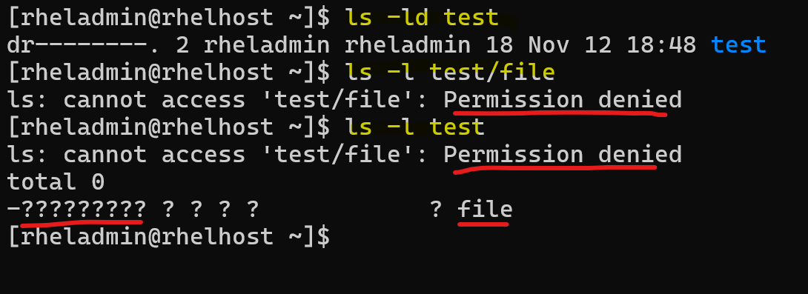

# Linux - File

[Back](../index.md)

---

- [Linux - File](#linux---file)
  - [File Property](#file-property)
    - [File name](#file-name)
    - [Hidden files](#hidden-files)
    - [File type](#file-type)
      - [`file`: display the file type](#file-display-the-file-type)
    - [File permissions](#file-permissions)
    - [Directory Permissions](#directory-permissions)
    - [`chmod`: Changing file Permissions](#chmod-changing-file-permissions)
    - [File Creation Mask](#file-creation-mask)
      - [`umask`: set file creation mask](#umask-set-file-creation-mask)
      - [`Setuid` mode: execute as the owner's permission](#setuid-mode-execute-as-the-owners-permission)
        - [Set Up `Setuid` for a file](#set-up-setuid-for-a-file)
      - [`Setgid` mode: execute as group permission](#setgid-mode-execute-as-group-permission)
        - [Set Up `Setgid` for a file](#set-up-setgid-for-a-file)
        - [Set Up `Setgid` for a directory](#set-up-setgid-for-a-directory)
      - [`Sticky Bit`](#sticky-bit)
        - [Set Up A `Sticky Bit`](#set-up-a-sticky-bit)
      - [Setting Special Permissions With Number Notation](#setting-special-permissions-with-number-notation)
    - [`chown`: change file owner and group](#chown-change-file-owner-and-group)
    - [`chgrp`: change group ownership](#chgrp-change-group-ownership)
    - [Symbolic Links](#symbolic-links)
  - [List files](#list-files)
    - [`ls`: List Files](#ls-list-files)
    - [`tree`: list in tree](#tree-list-in-tree)
  - [Search files and directories](#search-files-and-directories)
    - [`locate`: find files using index](#locate-find-files-using-index)
    - [`find`: advanced search](#find-advanced-search)
  - [Manage Files: Move, Copy, Delete](#manage-files-move-copy-delete)
  - [Display File Contents](#display-file-contents)
    - [Displaying All Content](#displaying-all-content)
    - [Searching Content in Files](#searching-content-in-files)
    - [`|`: Pips](#-pips)
      - [Search a user name in `/etc/passwd`](#search-a-user-name-in-etcpasswd)
    - [Sorting Text File Data](#sorting-text-file-data)
    - [Comparing Files](#comparing-files)
  - [Archive/Compress Files](#archivecompress-files)
  - [File's Disk Usage](#files-disk-usage)

---

## File Property

```sh
$ ls -l
# -rw-rw-r-- 1 jason users 10400 Sep 27 08:52 sales.data
```

- Permissions: `-rw-rw-r--`
- Number of links: `1`
- Owner name: `jason`
- Group name: `users`
- Number of bytes in the file: `10400`
- Last modification time: `Sep 27 08:52`
- File name: `sales.data`


---

### File name

- No spaces!
  - For some reason, some file names include spaces:
    - encapsulate the entire file name in quotes
      - e.g., `ls "my file"`, `ls 'my file'`
    - escape spaces using backslash(`\`)
      - e.g., `ls my\ file`
- Can include
  - `-`: Hyphens
  - `_`: Underscores
- CamelCase: capitalize the first letter of each word.

---

### Hidden files

- Hidden files begin with a period.
  - `.file_name`
- can use `ls -a` to list all hidden files.

---

### File type

- In Linux, the first character represents whether the file is a directory, file, link file, etc.

  - `d`: directory
  - `-`: file
  - `l`: link file / symbolic link
  - `b`: 则表示为装置文件里面的可供储存的接口设备(可随机存取装置)；
  - `c` 则表示为装置文件里面的串行端口设备，例如键盘、鼠标(一次性读取装置)。

---

#### `file`: display the file type

| Command         | Desc                                          |
| --------------- | --------------------------------------------- |
| `file filename` | Display type of a file                        |
| `file *`        | Display each file's type in current directory |

---

### File permissions


- three categories of permissions

| Symbol | Category |
| ------ | -------- |
| `u`    | User     |
| `g`    | Group    |
| `o`    | Other    |
| `a`    | All      |

- 3 types of permissions

| Symbol | Number | Permission on file      | On Directory                                             |
| ------ | ------ | ----------------------- | -------------------------------------------------------- |
| `r`    | 4      | Allow to read a file    | Allow to read file names                                 |
| `w`    | 2      | Allow to write a file   | Allow to modified entries                                |
| `x`    | 1      | Allow to execute a file | Allow to access to the contents and metadata for entries |

- By default:
  - `-rw-rw-r--`
  - `664`

---

### Directory Permissions

- Permissions on a **directory** can **effect** the **files** in the directory.
- Incorrect permissions on a directory can prevent the execution of a file.
  - If the file permissions look correct, start checking directory permissions.
  - Work your way up to the root.



> Directory permission prevents access to the file.
> Directory permission have read permission, allowing list file name, but cannot access to the metadata of the file.

---

### `chmod`: Changing file Permissions

- Permission is also known as mod

| Command                         | Desc                               |
| ------------------------------- | ---------------------------------- |
| `chmod u+x file_name`           | Add execute permission to the user |
| `chmod g+w file_name`           | Add write permission to the group  |
| `chmod o+r file_name`           | Add read permission to other       |
| `chmod a+rwx file_name`         | Add all permission to all          |
| `chmod a-rwx file_name`         | Revoke all permission from all     |
| `chmod a=x file_name`           | Set all permission to all          |
| `chmod a= file_name`            | Set none permission to all         |
| `chmod u+rwx,g-x,o+w file_name` | set Different permission           |
| `chmod u=rw,g=r,o= file_name`   | set Different permission           |
| `chmod 664 file_name`           | set permission with number         |
| `chmod 000 file_name`           | set permission with number         |
| `chmod 777 file_name`           | set full access for everyone       |

- `=`: set exact permission, no mentioned permission will be revoke.
- `-`/`+`: grant or revoke.
  - 褫夺原来没有的权限不会有错误信息。
  - 添加原来有的权限也不会有错误信息。

---

### File Creation Mask

- `File creation mask`
  - When a file is created, it is **assigned initial access permissions**.
- If you want to control the permissions that a program can set when it creates a file or directory, you can set a `file mode creation mask` using the `umask` command.
- If **no** mask were used permissions would be:
  - `777` for directories
  - `666` for files

#### `umask`: set file creation mask

- Sets the file creation mask to mode, if given.
- Use `-S` to for symbolic notation.

- vs `chmod`

  - `chmod`: adding, setting permissions
  - `umask`: turn off, subtract, or take away permissions.

- Special Modes:
  - umask `0022` is the same as umask `022`
  - chmod `0644` is the same as chmod `644`
- The special modes are:
  - **setuid**
  - **setgid**
  - **sticky**

| Command    | Desc                               |
| ---------- | ---------------------------------- |
| `umask`    | display the umask                  |
| `umas -S`  | display the umask in symbolic mode |
| `umas 007` | set the umask                      |

- 即默认权限：文件夹 777， 文件 666
  - 通过设置 mask 007， 则新建文件夹是 770， 新建文件是 660.
  - 通过 mask 遮挡而自定义默认的权限。
  - redhat 8 默认 mask： 002
    - 所以默认文件夹是 775， 文件是 664

---

#### `Setuid` mode: execute as the owner's permission

- `setuid` mode

  - a Linux **file permission setting** that allows a user to **execute** that file or program with the permission of the **owner** of that file.
  - primarily used to elevate the privileges of the current user.

- Example of setuid: `sudo` and `su` command

```sh
su - root
# show full path of sudo command

which sudo
# /usr/bin/sudo
# list the metadata of command
ll /usr/bin/sudo
# ---s--x--x. 1 root root 190992 Jan 26  2024 /usr/bin/sudo

which su
# /usr/bin/su
ll /usr/bin/su
# -rwsr-xr-x. 1 root root 50160 Feb  8  2024 /usr/bin/su
```

> Note:
>
> 1. this command is owned by root.
> 2. The `s` in the permission indicates that when a user **executes** this program, the operating system will execute that file not as the user, but as 'root'.
> 3. this allows a normal user to **perform elevated system functions** without having to log in as the root user.
> 4. Same servers the command `su`.

---

##### Set Up `Setuid` for a file

```sh
# create myfile
touch myfile
# list permissions
ll /home/rheladmin/myfile
# -rw-rw-r--. 1 rheladmin rheladmin 0 Nov 13 19:45 /home/rheladmin/myfile

# set setuid
chmod u+s /home/rheladmin/myfile
ll /home/rheladmin/myfile
# -rwSrw-r--. 1 rheladmin rheladmin 0 Nov 13 19:45 /home/rheladmin/myfile

#  add execute permission
chmod u+x /home/rheladmin/myfile
ll /home/rheladmin/myfile
# -rwsrw-r--. 1 rheladmin rheladmin 0 Nov 13 19:45 /home/rheladmin/myfile

#  revoke setuid
chmod u-s /home/rheladmin/myfile
ll /home/rheladmin/myfile
# -rwxrw-r--. 1 rheladmin rheladmin 0 Nov 13 20:32 /home/rheladmin/myfile
```

> Note:
>
> - The capital `S` signifies that the setuid **IS** set, but the user that owns the file **does not have execute permissions**.

- Set up setuid with one line command

```sh
chmod u+xs /home/rheladmin/myfile
ll /home/rheladmin/myfile
# -rwsrw-r--. 1 rheladmin rheladmin 0 Nov 13 19:48 /home/rheladmin/myfile
```

---

#### `Setgid` mode: execute as group permission

- `Setgid`

  - A process, when executed, will run as the group that owns the file.

- Example: `locate` command

```sh
which locate
# /usr/bin/locate
ll /usr/bin/locate
# -rwx--s--x. 1 root slocate 47128 Aug 12  2018 /usr/bin/locate
```

---

##### Set Up `Setgid` for a file

```sh
# create myfile2
touch myfile2
# list permissions
ll /home/rheladmin/myfile2
# -rw-rw-r--. 1 rheladmin rheladmin 0 Nov 13 19:49 /home/rheladmin/myfile2

# set setgid
chmod g+s /home/rheladmin/myfile2
ll /home/rheladmin/myfile2
# -rw-rwSr--. 1 rheladmin rheladmin 0 Nov 13 19:49 /home/rheladmin/myfile2

#  add execute permission
chmod g+x /home/rheladmin/myfile2
ll /home/rheladmin/myfile2
# -rw-rwsr--. 1 rheladmin rheladmin 0 Nov 13 19:49 /home/rheladmin/myfile2

#  revoke setgid
chmod g-s /home/rheladmin/myfile2
ll /home/rheladmin/myfile2
# -rw-rwxr--. 1 rheladmin rheladmin 0 Nov 13 20:34 /home/rheladmin/myfile2
```

> Note:
>
> - The capital `S` signifies that the setuid **IS** set, but the user that owns the file **does not have execute permissions**.

- Set up setuid with one line command

```sh
chmod g+xs /home/rheladmin/myfile2
ll /home/rheladmin/myfile2
# -rw-rwsr--. 1 rheladmin rheladmin 0 Nov 13 19:51 /home/rheladmin/myfile2
```

---

##### Set Up `Setgid` for a directory

```sh
mkdir /home/rheladmin/mydir
ll -d /home/rheladmin/mydir
# drwxrwxr-x. 2 rheladmin rheladmin 6 Nov 13 19:58 /home/rheladmin/mydir

sudo chgrp root /home/rheladmin/mydir/
sudo chmod g+s /home/rheladmin/mydir/   # sudo is required. Otherwise, it doesnot work without any error.
ll -d /home/rheladmin/mydir/
# drwxrwsr-x. 2 rheladmin root 6 Nov 13 20:47 /home/rheladmin/mydir/

# test by creating a file in mydir
touch /home/rheladmin/mydir/myfile3
ll /home/rheladmin/mydir/myfile3
# -rw-rw-r--. 1 rheladmin root 0 Nov 13 20:49 /home/rheladmin/mydir/myfile3
# note: the group of the file inherit from the directory.

# revoke
chmod g-s /home/rheladmin/mydir/
ll -d /home/rheladmin/mydir/
# drwxrwxr-x. 2 rheladmin root 21 Nov 13 20:49 /home/rheladmin/mydir/
```

---

#### `Sticky Bit`

- `sticky bit`

  - When this is set on a directory, the files in that directory can **only be removed by the owner**.

- A typical use of this is `/tmp/`. The `/tmp` directory can be written to by any user, but other users cannot delete the files of others.

```sh
ll -d /tmp/
# drwxrwxrwt. 18 root root 4096 Nov 13 20:09 /tmp/
```

> Notice that /tmp can be written to by everyone but has the `t` in place of the `x` at the end of the permissions list. This means it has the `sticky bit`.

---

##### Set Up A `Sticky Bit`

```sh
mkdir /home/rheladmin/mydir2
ls -ld /home/rheladmin/mydir2
# drwxrwxr-x. 2 rheladmin rheladmin 6 Nov 13 20:12 /home/rheladmin/mydir2

# setup
chmod +t /home/rheladmin/mydir2
ls -ld /home/rheladmin/mydir2
# drwxrwxr-t. 2 rheladmin rheladmin 6 Nov 13 20:12 /home/rheladmin/mydir2

# revoke
chmod -t /home/rheladmin/mydir2
ls -ld /home/rheladmin/mydir2
# drwxrwxr-x. 2 rheladmin rheladmin 6 Nov 13 20:51 /home/rheladmin/mydir2
```

---

#### Setting Special Permissions With Number Notation

- Number:
  - `setuid`: `4`
  - `setgid`: `2`
  - `sticky bit`: `1`

```sh
rm -f myfile
touch myfile
rm -rf mydir
mkdir mydir

# setuid for file
chmod 4755 myfile
ls -l myfile
# -rwsr-xr-x. 1 rheladmin rheladmin 0 Nov 13 20:19 myfile

# setgid for a file
chmod 2755 myfile
ls -l myfile
# -rwxr-sr-x. 1 rheladmin rheladmin 0 Nov 13 20:19 myfile

# setgid for a dir
chmod 2755 mydir
ls -ld mydir
# drwxr-sr-x. 2 rheladmin rheladmin 6 Nov 13 20:23 mydir

# setuid and setgid for a file
chmod 6755 myfile
ls -l myfile
# -rwsr-sr-x. 1 rheladmin rheladmin 0 Nov 13 20:19 myfile

# set sticky bit for dir
chmod 1755 mydir
ls -ld mydir
# drwxr-xr-t. 2 rheladmin rheladmin 6 Nov 13 20:23 mydir
```

---

### `chown`: change file owner and group

- 更改文件所有者（owner），也可以同时更改文件所属组。

| Command                     | Desc                                     |
| --------------------------- | ---------------------------------------- |
| `chown new_owner file_name` | Change the file's owner                  |
| `chown -R new_owner dir`    | Change the directory's owner recursively |
| `chown owner:group file`    | Change the file's owner and group        |

---

### `chgrp`: change group ownership

- New files belong to current user's **primary group**.

| Command                      | Desc                            |
| ---------------------------- | ------------------------------- |
| `chgrp group_name file_name` | change a file's group ownership |

---

### Symbolic Links

- `Symbolic Links`

  - A link **points to** the actual **file** or **directory**.
  - **as if it were the file**.
  - can be used to **create a shortcut**.
    - Use for long file or directory names.
    - Use to indicate the current version of software.

- Can use `ls -F` to indicate a symbolic link.

---

## List files

### `ls`: List Files

| Command      | Desc                                                           |
| ------------ | -------------------------------------------------------------- |
| `ls`         | List files and direcotry                                       |
| `ls -alht`   | List files and direcotry                                       |
| `ls -F`      | lists the contents and appends symbols to indicate file types. |
| `ls -t`      | lists files sored by time, most recent file placed at the top  |
| `ls -r`      | lists file wit reverse order.                                  |
| `ls -R`      | lists file recursively                                         |
| `ls -d`      | lists directory name, not contents                             |
| `ls --color` | Colorize the output                                            |

- `ls -F`

  - indicator appended:
    - `/`: Directory
    - `@`: Link
    - `*`: Executable

- `ls -p | grep -v /`:
  - List files only

---

### `tree`: list in tree

- `tree`:
  - list contents of directories **in a tree-like format**

| Commande  | Desc                  |
| --------- | --------------------- |
| `tree -d` | List directories only |
| `tree -C` | Colosize output       |

---

## Search files and directories

### `locate`: find files using index

- `locate pattern`:
  - find files by name
  - pattern is requried
  - `locate` if faster than `find`
    - queries an index
    - result are not in real time,非实时，与 index 的失效有关。
      - 新建的文件可能未被 index， 所以无法被 locate
    - 如需要实时，则使用 find

| Command          | Desc                                            |
| ---------------- | ----------------------------------------------- |
| `locate pattern` | Find files and directories matching the pattern |
| `locate uptime`  | matching the pattern                            |
| `locate upti`    | matching the pattern                            |

---

### `find`: advanced search

- `find`:
  - search for files in a directory hierarchy
  - find files match the expression
  - default: find all files in the current directory

| Command                                | Desc                                                           |
| -------------------------------------- | -------------------------------------------------------------- |
| `find`                                 | Find everything under the current directory                    |
| `find path -name file_name`            | Find files and directories matching pattern under the path     |
| `find /usr/sbin/ -name "*config"`      | Find the file that ends with "config"                          |
| `find path -iname file_name`           | ignore case                                                    |
| `find path -ls -name file_name`        | Performs ls on each of the found items                         |
| `find /usr -name "s*" -ls`             | comprehensive search                                           |
| `find path -mtime days`                | find files that are days old                                   |
| `find /usr -mtime +10 -mtime -90`      | find files that are more 10 days old but less than 90 days old |
| `find path -size num`                  | Finds file that are of size num                                |
| `find /usr -size +1M`                  | Finds file that are larger than 1M                             |
| `find -newer file_name`                | Finds file that are newer than file.                           |
| `find /etc -type d -newer /etc/passwd` | Find all directories that are newer than the passwd file       |
| `find -exec command {} \;`             | Run command against all the files that are found               |
| `find . -exec file {} \;`              | Execute file command on each items under the current directory |

---

## Manage Files: Move, Copy, Delete

| Command                          | Desc                                                         |
| -------------------------------- | ------------------------------------------------------------ |
| `mv source destination`          | Move/Rename file                                             |
| `mv -f source destination`       | Force to overwrite                                           |
| `mv -i source destination`       | Move/Rename file, prompt before overwrite                    |
| `mv -u source destination`       | Move only when the SOURCE file is newer than the destination |
| `cp source destination`          | Copy file                                                    |
| `cp source1 source2 destination` | Copy multiple files to a destination                         |
| `cp -f source destination`       | Force copy file                                              |
| `cp -i source destination`       | Copy file, prompt before overwrite                           |
| `cp -n source destination`       | do not overwrite an existing file                            |
| `rm file`                        | Remove file                                                  |
| `rm -f file`                     | Force to remove a file                                       |
| `rm -i file`                     | prompt before every removal                                  |

---

## Display File Contents

### Displaying All Content

| Command            | Desc                                                    |
| ------------------ | ------------------------------------------------------- |
| `cat file_name`    | Display all contents                                    |
| `cat -n file_name` | Display all contents with line numbers                  |
| `more file_name`   | Browse through a text file.                             |
| `less file`        | More features than more.                                |
| `head file`        | Output the first 10 line from the beginning of the file |
| `head -50 file`    | Output the first 50 line from the beginning of the file |
| `tail file`        | Output the last 10 line from the ending of the file     |
| `tail -50 file`    | Output the last 50 line from the ending of the file     |
| `tail -f file`     | Display data as it is being written to the file         |
| `strings`          | Display binary into human readable strings.             |

- `cat`: used for static file contents
- `tail -f`: view file in real time
  - e.g., view log file

---

### Searching Content in Files

| Command                  | Desc                                               |
| ------------------------ | -------------------------------------------------- |
| `grep pattern file`      | Display lines matching a pattern                   |
| `grep -i pattern file`   | Perform a search, **ignoring** case.               |
| `grep -c pattern file`   | **Count** the number of **occurrences** in a file. |
| `grep -n pattern file`   | Precede output with **line numbers**.              |
| `grep -v pattern file`   | Invert Match. Print lines that **don’t match**.    |
| `cut -d'delimiter' file` | Use delimiter as the field separator.              |
| `cut -fN file`           | Display the Nth field.                             |

```sh
cut -d" " -f1 file1
# facebook
# Instagram
# Twitter
# LinkedIn
# TikTok
# Snapchat
# Reddit
# Pinterest
# YouTube
# WhatsApp

cat file1 | grep -i music | cut -d' ' -f1
# TikTok
```

---

### `|`: Pips

- `|`

  - pipe symbol
  - `command-output | command-input`
  - take standard output from the preceding command and passes it as standard input to the following command.
    - The error message of the preceding command will not be passed to the second command by default.
    - If error message is needed, using the I/O direction.

- Example:

```sh
# the file content from the cat command will be the content of grep command
cat file | grep pattern
```

---

#### Search a user name in `/etc/passwd`

- Find all users named "rheladmin" in /etc/passwd.
- Print account name and real name.
- Print in alphabetical order by account name.
- Print in a tabular format.

```sh
grep -i rheladmin /etc/passwd | cut -d: -f1,5 | sort | tr ":" " " | column -t
```

---

### Sorting Text File Data

- `sort`:
  - alphabetically sort lines of text files
  - only sort text

| Command                | Desc                                |
| ---------------------- | ----------------------------------- |
| `sort file`            | sort from a file and display        |
| `sort file -o newfile` | sort and write result to FILE       |
| `sort -kF file`        | sort via a key. F: the field number |
| `sort -r file`         | sort in reverse order               |
| `sort -u file`         | sort unique                         |

- Example

```sh
cat > txtfile <<EOF
tags: credentials
site: facebook.com
user: bob
pass: Abee!
tags: credentials
EOF
cat txtfile

sort txtfile
# pass: Abee!
# site: facebook.com
# tags: credentials
# tags: credentials
# user: bob

sort -u txtfile
# pass: Abee!
# site: facebook.com
# tags: credentials
# user: bob

sort -ru txtfile
# user: bob
# tags: credentials
# site: facebook.com
# pass: Abee!

sort -u -k2 txtfile
# pass: Abee!
# user: bob
# tags: credentials
# site: facebook.com
```

---

### Comparing Files

| Command               | Desc                                |
| --------------------- | ----------------------------------- |
| `diff file1 file2`    | Compare two files line by line.     |
| `sdiff file1 file2`   | Side-by-side comparison. using `\|` |
| `vimdiff file1 file2` | Highlight differences in vim.       |

- `diff`
  - differences:
    - LineNumFile1-Action-LineNumFile2
    - Action: `(A)dd`, `(C)hange`, `(D)elete`
  - detailed:
    - `<`: Line from file1
    - `---`: separator
    - `>`: Line from file2

```sh
diff file1 file2
# 1,2c1
# < facebook
# < Instagram
# ---
# > Facebook
# 5c4
# < TikTok
# ---
# > 1TikTok
# 8d6
# < Pinterest
```

> Note:
>
> - 1,2c1: line 1,2 of file1 get changed from line 1 of file2
> - 8d6: file1's line 8 have been deleted from file2's line6

---

- `vimdiff`: display in 2 vim windows
  - `Ctrl-w`, `w`: Go to next window
  - `:q`: Quit (close current window)
  - `:qa`: Quit all (close both files)
  - `:qa!`: Force quit all

---

## Archive/Compress Files

| Command                    | Desc                                                       |
| -------------------------- | ---------------------------------------------------------- |
| `tar cf tar_file target`   | **Create** a tar archive from a target.                    |
| `tar cfzv tar_file target` | **Create** a tar archive from a target, using compression. |
| `tar tf tar_file`          | **Display** the table of contents (list).                  |
| `tar xf tar_file`          | **Extract** files from the archive.                        |
| `tar vxf tar_file`         | **Extract** files from the archive displaying a file list  |
| `gzip filename`            | Compress the files into `.gz` file                         |
| `gzip -v filename`         | Verbose output                                             |
| `gzip -k filename`         | Keep the original file                                     |
| `gzip -r directory`        | Compress all files in a directory                          |
| `gzip -9 filename`         | Change the compression level, from 1 to 9. Default 6       |
| `gunzip gz_file`           | Uncompress files.                                          |
| `gunzip -vk gz_file`       | Uncompress files and Verbose output, keep the gz file      |
| `zcat gz_file`             | displaying the contents of a gzip compressed file          |

- example

```sh
mkdir tardir
cd tardir
touch sheet.csv word.doc
cd ..
ll tardir

# create an archive file from tardir directory
tar cf tps.tar tardir

# list a tar file's content
tar tf tps.tar
# tardir/
# tardir/sheet.csv
# tardir/word.doc

# Extract files to /tmp
cd /tmp
tar xf /home/rheladmin/rhel/tps.tar
ll -d tardir
# drwxrwxr-x. 2 rheladmin rheladmin 39 Nov 13 21:50 tardir

# list files as extracting files
tar vxf /home/rheladmin/rhel/tps.tar
# tardir/
# tardir/sheet.csv
# tardir/word.doc

# create an archive file from tardir directory
tar cf tps.tar tardir

# archive without compress
tar cf arch.tar tardir/
tar czf archc.tar tardir/
ll -h
# -rw-rw-r--. 1 rheladmin rheladmin  70K Nov 13 22:12 archc.tar
# -rw-rw-r--. 1 rheladmin rheladmin 180K Nov 13 22:12 arch.tar
```

---

## File's Disk Usage

| Command          | Desc                                    |
| ---------------- | --------------------------------------- |
| `du`             | Estimates file usage in current path    |
| `du dir/file`    | Estimates file usage of a dir/file      |
| `du -k dir/file` | Display sizes in Kilobytes.             |
| `du -h dir/file` | Display sizes in human readable format. |

---

[TOP](#linux---file)
