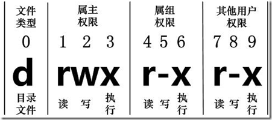
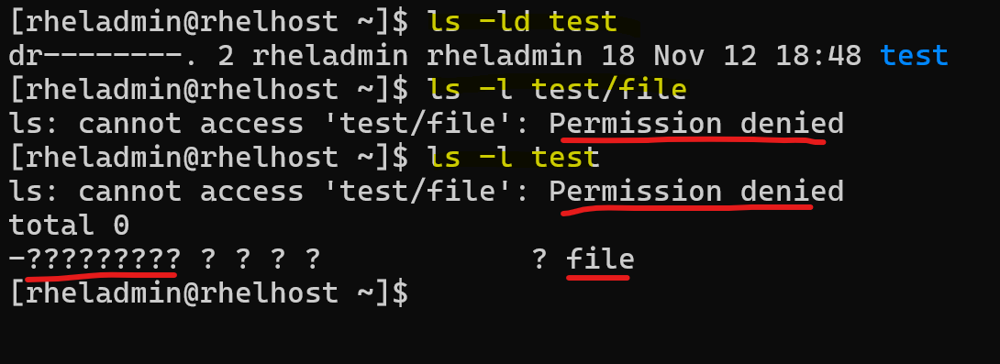

# Linux - File System: Fundamental

[Back](../../index.md)

---

- [Linux - File System: Fundamental](#linux---file-system-fundamental)
  - [File System](#file-system)
  - [File Property](#file-property)
    - [File name](#file-name)
  - [File type](#file-type)
    - [Hidden files](#hidden-files)
    - [Link](#link)
      - [Hard Link](#hard-link)
      - [Symbolic Links](#symbolic-links)
      - [Hard vs soft](#hard-vs-soft)
      - [Command](#command)
    - [`file`: display the file type](#file-display-the-file-type)
  - [Permissions](#permissions)
    - [File permissions](#file-permissions)
    - [Directory Permissions](#directory-permissions)
  - [File Creation Mask](#file-creation-mask)
    - [`umask`: set file creation mask](#umask-set-file-creation-mask)
    - [`Setuid` mode: execute as the owner's permission](#setuid-mode-execute-as-the-owners-permission)
      - [Set Up `Setuid` for a file](#set-up-setuid-for-a-file)
    - [`Setgid` mode: execute as group permission](#setgid-mode-execute-as-group-permission)
      - [Set Up `Setgid` for a file](#set-up-setgid-for-a-file)
      - [Set Up `Setgid` for a directory](#set-up-setgid-for-a-directory)
    - [`Sticky Bit`](#sticky-bit)
      - [Set Up A `Sticky Bit`](#set-up-a-sticky-bit)
    - [Setting Special Permissions With Number Notation](#setting-special-permissions-with-number-notation)
  - [File Management](#file-management)
    - [`chown`: change file owner and group](#chown-change-file-owner-and-group)
    - [`chgrp`: change group ownership](#chgrp-change-group-ownership)
    - [`chmod`: Changing file Permissions](#chmod-changing-file-permissions)
  - [Symbolic Links](#symbolic-links-1)

---

## File System

- `File System`
  - a system used by an operating system to manage files.
  - The system controls how data is saved or retrived.
- OS stores files and directory in an organized and structred way

---

## File Property

```sh
$ ls -l
# -rw-rw-r-- 1 jason users 10400 Sep 27 08:52 sales.data
```

- Permissions: `-rw-rw-r--`
- Number of links: `1`
- Owner name: `jason`
- Group name: `users`
- Number of bytes in the file: `10400`
- Last modification time: `Sep 27 08:52`
- File name: `sales.data`


---

### File name

- No spaces!
  - For some reason, some file names include spaces:
    - encapsulate the entire file name in quotes
      - e.g., `ls "my file"`, `ls 'my file'`
    - escape spaces using backslash(`\`)
      - e.g., `ls my\ file`
- Can include
  - `-`: Hyphens
  - `_`: Underscores
- CamelCase: capitalize the first letter of each word.

---

## File type

- In Linux, the first character represents whether the file is a directory, file, link file, etc.

  - `d`: directory
  - `-`: file
  - `l`: link file / symbolic link
  - `b`: 则表示为装置文件里面的可供储存的接口设备(可随机存取装置)；
  - `c` 则表示为装置文件里面的串行端口设备，例如键盘、鼠标(一次性读取装置)。

---

### Hidden files

- Hidden files begin with a period.
  - `.file_name`
- can use `ls -a` to list all hidden files.

---

### Link

- 2 Type of link:

  - Hard Link, default
  - Symbolic Link

- `inode`
  - `index node`
  - pointer or number of a file on the hard disk.

---

#### Hard Link

- `Hard Links`

  - connections made via `inode numbers` in the Linux file system.
  - Every `file` in a Linux filesystem is associated with an `index node (inode)`, which is a data structure **containing metadata** about the file.

- In a `hard link`, **multiple** filenames can **point** to the **same inode number**.

  - Example: If file A is a hard link to file B, both A and B share the same inode number and are equal in the file system.

- Feature:
  - **Equality**:
    - A and B are **treated equally** by the file system.
  - **Independence on Deletion**:
    - Deleting one does **not affect the other**.
    - The file's data and inode **persist until all** associated hard links are **deleted**.
  - **Multiple Path Names**:
    - A single file can have **multiple valid path names** via hard links.
- Advantages:

  - Protects **against accidental deletion**:
    - As long as one hard link remains, the file’s data is preserved.
  - When Files Are Deleted:
    - The file's data blocks and inode are **released only after the last** hard link is **removed**.

- Permission:
  - same as regular file `-rw-rw-r--`

---

#### Symbolic Links

- `Soft Links`/`Symbolic Links`

  - special files that **act as shortcuts** to another file.
  - They **store the path** to the target file rather than pointing to the same inode.
  - Example: If file A is a soft link to file B, their **inode numbers are different**, and A points to a different data block containing the path to B.

- Features:
  - **Shortcut-Like Behavior**
    - Similar to shortcuts in Windows, they **simply redirect** to the target file.
- **Separate Inodes**:
  - The inode numbers of the link and the target file are **different**.
- **Dependency**:
  - If the target file (B) is **deleted**, the soft link (A) remains but **points to an invalid location**.
- Advantages:
  - Can link to directories or files on different filesystems.
  - Useful for creating flexible paths without duplicating data.
- Limitations:

  - If the target is deleted or renamed, the soft link becomes **broken (invalid)**.

- Permission:
  - `lrwxrwxrwx`

---

#### Hard vs soft

| Feature    | Hard Links                                                 | Soft Links                                         |
| ---------- | ---------------------------------------------------------- | -------------------------------------------------- |
| Inode      | Share the **same** `inode` with the target file.           | Have a **different** `inode` from the target file. |
| Filesystem | Must be on the **same filesystem** as the target.          | Can **span across different** filesystems.         |
| Deletion   | Effect Target file deletion **doesn’t** affect hard links. | Becomes **invalid** if the target file is deleted. |
| Directory  | Support **Cannot link to directories**.                    | **Can** link to directories.                       |

- Use Cases
  - `Hard Links`:
    - Best for maintaining **multiple valid references** to critical files within the **same** filesystem.
  - `Soft Links`:
    - Ideal for creating shortcuts or referencing files **across different** filesystems.

---

#### Command

| CMD                 | DESC                                         |
| ------------------- | -------------------------------------------- |
| `ln file hlink`     | Create a hard link with different file name  |
| `ln target_file`    | Create a hard link with the same file name   |
| `ln -s file slink`  | Create a soft link with different file name  |
| `ln -s target_file` | Create a soft link with the same file name   |
| `ls -i`             | list inode numbers and identify linked files |

- Example

```sh
mkdir link_dir
cd link_dir

touch file
ln file hln
ln -s file sln
ls -li
total 0
# 20044951 -rw-rw-r--. 2 rheladmin rheladmin 0 Nov 19 21:28 file
# 20044951 -rw-rw-r--. 2 rheladmin rheladmin 0 Nov 19 21:28 hln
# 20044952 lrwxrwxrwx. 1 rheladmin rheladmin 4 Nov 19 21:28 sln -> file

echo "I am the file" >>file
cat file
# I am the file
cat hln
# I am the file
cat sln
# I am the file

rm -f file
cat hln
# I am the file
cat sln
# cat: sln: No such file or directory


ln link_dir/
# ln: link_dir/: hard link not allowed for directory

ln -s link_dir/ l_dir
cd l_dir
pwd
# /home/rheladmin/l_dir
```

---

### `file`: display the file type

| Command         | Desc                                          |
| --------------- | --------------------------------------------- |
| `file filename` | Display type of a file                        |
| `file *`        | Display each file's type in current directory |

---

## Permissions

### File permissions



- three categories of permissions

| Symbol | Category |
| ------ | -------- |
| `u`    | User     |
| `g`    | Group    |
| `o`    | Other    |
| `a`    | All      |

- 3 types of permissions

| Symbol | Number | Permission on file      | On Directory                                             |
| ------ | ------ | ----------------------- | -------------------------------------------------------- |
| `r`    | 4      | Allow to read a file    | Allow to read file names                                 |
| `w`    | 2      | Allow to write a file   | Allow to modified entries                                |
| `x`    | 1      | Allow to execute a file | Allow to access to the contents and metadata for entries |

- By default:
  - `-rw-rw-r--`
  - `664`

---

### Directory Permissions

- Permissions on a **directory** can **effect** the **files** in the directory.
- Incorrect permissions on a directory can prevent the execution of a file.
  - If the file permissions look correct, start checking directory permissions.
  - Work your way up to the root.



> Directory permission prevents access to the file.
> Directory permission have read permission, allowing list file name, but cannot access to the metadata of the file.

---

- Example

```sh
# run command via sudo

# create user dirowner
sudo useradd dirowner
echo "dirowner:dirowner4Test" | sudo chpasswd

# create user otheruser
sudo useradd otheruser
echo "otheruser:otheruser4Test" | sudo chpasswd

# switch to dirowner
su - dirowner
whoami
# dirowner

# create dir
mkdir -p /tmp/dir
# create file within the dir and change mode
touch /tmp/dir/file
chmod o-x /tmp/dir

# create script file and change mode
cat <<EOF > /tmp/dir/script.sh
#!/bin/bash
echo "Hello world"
EOF
cat /tmp/dir/script.sh
# #!/bin/bash
# echo "Hello world"
chmod o+x /tmp/dir/script.sh

ls -ld /tmp/dir
# drwxrwxr--. 2 dirowner dirowner 35 Nov 20 18:38 /tmp/dir
ls -l /tmp/dir/file
# -rw-rw-r--. 1 dirowner dirowner 0 Nov 20 18:38 /tmp/dir/file
ls -l /tmp/dir/script.sh
# -rw-rw-r-x. 1 dirowner dirowner 31 Nov 20 18:38 /tmp/dir/script.sh

# Test as otheruser
su - otheruser
whoami
# otheruser
ls /tmp/dir
# ls: cannot access '/tmp/dir/file': Permission denied
# ls: cannot access '/tmp/dir/script.sh': Permission denied
# file  script.sh
ls -dl /tmp/dir
# drwxrwxr--. 2 dirowner dirowner 35 Nov 20 18:38 /tmp/dir
ls -l /tmp/dir
# ls: cannot access '/tmp/dir/file': Permission denied
# ls: cannot access '/tmp/dir/script.sh': Permission denied
# total 0
# -????????? ? ? ? ?            ? file
# -????????? ? ? ? ?            ? script.sh
ls /tmp/dir/file
# ls: cannot access '/tmp/dir/file': Permission denied
ls -l /tmp/dir/file
# ls: cannot access '/tmp/dir/file': Permission denied
ls -l /tmp/dir/script.sh
# ls: cannot access '/tmp/dir/script.sh': Permission denied
bash /tmp/dir/script.sh
# bash: /tmp/dir/script.sh: Permission denied

# Correct the directory permission
# switch to dirowner
su - dirowner
whoami
# dirowner
chmod o+x /tmp/dir
ls -dl /tmp/dir
# drwxrwxr-x. 2 dirowner dirowner 35 Nov 20 18:38 /tmp/dir
ls -l /tmp/dir
# -rw-rw-r--. 1 dirowner dirowner  0 Nov 20 18:38 file
# -rw-rw-r-x. 1 dirowner dirowner 31 Nov 20 18:38 script.sh

# Verify
# switch to otheruser
su - otheruser
whoami
# otheruser
ls -l /tmp/dir
# -rw-rw-r--. 1 dirowner dirowner  0 Nov 20 18:38 file
# -rw-rw-r-x. 1 dirowner dirowner 31 Nov 20 18:38 script.sh

bash /tmp/dir/script.sh
# Hello world
```

---

## File Creation Mask

- `File creation mask`
  - When a file is created, it is **assigned initial access permissions**.
- If you want to control the permissions that a program can set when it creates a file or directory, you can set a `file mode creation mask` using the `umask` command.
- If **no** mask were used permissions would be:
  - `777` for directories
  - `666` for files

### `umask`: set file creation mask

- Sets the file creation mask to mode, if given.
- Use `-S` to for symbolic notation.

- vs `chmod`

  - `chmod`: adding, setting permissions
  - `umask`: turn off, subtract, or take away permissions.

- Special Modes:
  - umask `0022` is the same as umask `022`
  - chmod `0644` is the same as chmod `644`
- The special modes are:
  - **setuid**
  - **setgid**
  - **sticky**

| Command    | Desc                               |
| ---------- | ---------------------------------- |
| `umask`    | display the umask                  |
| `umas -S`  | display the umask in symbolic mode |
| `umas 007` | set the umask                      |

- 即默认权限：文件夹 777， 文件 666
  - 通过设置 mask 007， 则新建文件夹是 770， 新建文件是 660.
  - 通过 mask 遮挡而自定义默认的权限。
  - redhat 8 默认 mask： 002
    - 所以默认文件夹是 775， 文件是 664

---

### `Setuid` mode: execute as the owner's permission

- `setuid` mode

  - a Linux **file permission setting** that allows a user to **execute** that file or program with the permission of the **owner** of that file.
  - primarily used to elevate the privileges of the current user.

- Example of setuid: `sudo` and `su` command

```sh
su - root
# show full path of sudo command

which sudo
# /usr/bin/sudo
# list the metadata of command
ll /usr/bin/sudo
# ---s--x--x. 1 root root 190992 Jan 26  2024 /usr/bin/sudo

which su
# /usr/bin/su
ll /usr/bin/su
# -rwsr-xr-x. 1 root root 50160 Feb  8  2024 /usr/bin/su
```

> Note:
>
> 1. this command is owned by root.
> 2. The `s` in the permission indicates that when a user **executes** this program, the operating system will execute that file not as the user, but as 'root'.
> 3. this allows a normal user to **perform elevated system functions** without having to log in as the root user.
> 4. Same servers the command `su`.

---

#### Set Up `Setuid` for a file

```sh
# create myfile
touch myfile
# list permissions
ll /home/rheladmin/myfile
# -rw-rw-r--. 1 rheladmin rheladmin 0 Nov 13 19:45 /home/rheladmin/myfile

# set setuid
chmod u+s /home/rheladmin/myfile
ll /home/rheladmin/myfile
# -rwSrw-r--. 1 rheladmin rheladmin 0 Nov 13 19:45 /home/rheladmin/myfile

#  add execute permission
chmod u+x /home/rheladmin/myfile
ll /home/rheladmin/myfile
# -rwsrw-r--. 1 rheladmin rheladmin 0 Nov 13 19:45 /home/rheladmin/myfile

#  revoke setuid
chmod u-s /home/rheladmin/myfile
ll /home/rheladmin/myfile
# -rwxrw-r--. 1 rheladmin rheladmin 0 Nov 13 20:32 /home/rheladmin/myfile
```

> Note:
>
> - The capital `S` signifies that the setuid **IS** set, but the user that owns the file **does not have execute permissions**.

- Set up setuid with one line command

```sh
chmod u+xs /home/rheladmin/myfile
ll /home/rheladmin/myfile
# -rwsrw-r--. 1 rheladmin rheladmin 0 Nov 13 19:48 /home/rheladmin/myfile
```

---

### `Setgid` mode: execute as group permission

- `Setgid`

  - A process, when executed, will run as the group that owns the file.

- Example: `locate` command

```sh
which locate
# /usr/bin/locate
ll /usr/bin/locate
# -rwx--s--x. 1 root slocate 47128 Aug 12  2018 /usr/bin/locate
```

---

#### Set Up `Setgid` for a file

```sh
# create myfile2
touch myfile2
# list permissions
ll /home/rheladmin/myfile2
# -rw-rw-r--. 1 rheladmin rheladmin 0 Nov 13 19:49 /home/rheladmin/myfile2

# set setgid
chmod g+s /home/rheladmin/myfile2
ll /home/rheladmin/myfile2
# -rw-rwSr--. 1 rheladmin rheladmin 0 Nov 13 19:49 /home/rheladmin/myfile2

#  add execute permission
chmod g+x /home/rheladmin/myfile2
ll /home/rheladmin/myfile2
# -rw-rwsr--. 1 rheladmin rheladmin 0 Nov 13 19:49 /home/rheladmin/myfile2

#  revoke setgid
chmod g-s /home/rheladmin/myfile2
ll /home/rheladmin/myfile2
# -rw-rwxr--. 1 rheladmin rheladmin 0 Nov 13 20:34 /home/rheladmin/myfile2
```

> Note:
>
> - The capital `S` signifies that the setuid **IS** set, but the user that owns the file **does not have execute permissions**.

- Set up setuid with one line command

```sh
chmod g+xs /home/rheladmin/myfile2
ll /home/rheladmin/myfile2
# -rw-rwsr--. 1 rheladmin rheladmin 0 Nov 13 19:51 /home/rheladmin/myfile2
```

---

#### Set Up `Setgid` for a directory

```sh
mkdir /home/rheladmin/mydir
ll -d /home/rheladmin/mydir
# drwxrwxr-x. 2 rheladmin rheladmin 6 Nov 13 19:58 /home/rheladmin/mydir

sudo chgrp root /home/rheladmin/mydir/
sudo chmod g+s /home/rheladmin/mydir/   # sudo is required. Otherwise, it doesnot work without any error.
ll -d /home/rheladmin/mydir/
# drwxrwsr-x. 2 rheladmin root 6 Nov 13 20:47 /home/rheladmin/mydir/

# test by creating a file in mydir
touch /home/rheladmin/mydir/myfile3
ll /home/rheladmin/mydir/myfile3
# -rw-rw-r--. 1 rheladmin root 0 Nov 13 20:49 /home/rheladmin/mydir/myfile3
# note: the group of the file inherit from the directory.

# revoke
chmod g-s /home/rheladmin/mydir/
ll -d /home/rheladmin/mydir/
# drwxrwxr-x. 2 rheladmin root 21 Nov 13 20:49 /home/rheladmin/mydir/
```

---

### `Sticky Bit`

- `sticky bit`

  - When this is set on a directory, the files in that directory can **only be removed by the owner**.

- A typical use of this is `/tmp/`. The `/tmp` directory can be written to by any user, but other users cannot delete the files of others.

```sh
ll -d /tmp/
# drwxrwxrwt. 18 root root 4096 Nov 13 20:09 /tmp/
```

> Notice that /tmp can be written to by everyone but has the `t` in place of the `x` at the end of the permissions list. This means it has the `sticky bit`.

---

#### Set Up A `Sticky Bit`

```sh
mkdir /home/rheladmin/mydir2
ls -ld /home/rheladmin/mydir2
# drwxrwxr-x. 2 rheladmin rheladmin 6 Nov 13 20:12 /home/rheladmin/mydir2

# setup
chmod +t /home/rheladmin/mydir2
ls -ld /home/rheladmin/mydir2
# drwxrwxr-t. 2 rheladmin rheladmin 6 Nov 13 20:12 /home/rheladmin/mydir2

# revoke
chmod -t /home/rheladmin/mydir2
ls -ld /home/rheladmin/mydir2
# drwxrwxr-x. 2 rheladmin rheladmin 6 Nov 13 20:51 /home/rheladmin/mydir2
```

---

### Setting Special Permissions With Number Notation

- Number:
  - `setuid`: `4`
  - `setgid`: `2`
  - `sticky bit`: `1`

```sh
rm -f myfile
touch myfile
rm -rf mydir
mkdir mydir

# setuid for file
chmod 4755 myfile
ls -l myfile
# -rwsr-xr-x. 1 rheladmin rheladmin 0 Nov 13 20:19 myfile

# setgid for a file
chmod 2755 myfile
ls -l myfile
# -rwxr-sr-x. 1 rheladmin rheladmin 0 Nov 13 20:19 myfile

# setgid for a dir
chmod 2755 mydir
ls -ld mydir
# drwxr-sr-x. 2 rheladmin rheladmin 6 Nov 13 20:23 mydir

# setuid and setgid for a file
chmod 6755 myfile
ls -l myfile
# -rwsr-sr-x. 1 rheladmin rheladmin 0 Nov 13 20:19 myfile

# set sticky bit for dir
chmod 1755 mydir
ls -ld mydir
# drwxr-xr-t. 2 rheladmin rheladmin 6 Nov 13 20:23 mydir
```

---

## File Management

### `chown`: change file owner and group

- 更改文件所有者（owner），也可以同时更改文件所属组。

| Command                     | Desc                                     |
| --------------------------- | ---------------------------------------- |
| `chown new_owner file_name` | Change the file's owner                  |
| `chown -R new_owner dir`    | Change the directory's owner recursively |
| `chown owner:group file`    | Change the file's owner and group        |

---

### `chgrp`: change group ownership

- New files belong to current user's **primary group**.

| Command                         | Desc                                           |
| ------------------------------- | ---------------------------------------------- |
| `chgrp group_name file_name`    | change a file's group ownership                |
| `chgrp -R group_name file_name` | change directory's group ownership recursively |

---

### `chmod`: Changing file Permissions

- Permission is also known as mod

| Command                         | Desc                               |
| ------------------------------- | ---------------------------------- |
| `chmod u+x file_name`           | Add execute permission to the user |
| `chmod g+w file_name`           | Add write permission to the group  |
| `chmod o+r file_name`           | Add read permission to other       |
| `chmod a+rwx file_name`         | Add all permission to all          |
| `chmod a-rwx file_name`         | Revoke all permission from all     |
| `chmod a=x file_name`           | Set all permission to all          |
| `chmod a= file_name`            | Set none permission to all         |
| `chmod u+rwx,g-x,o+w file_name` | set Different permission           |
| `chmod u=rw,g=r,o= file_name`   | set Different permission           |
| `chmod 664 file_name`           | set permission with number         |
| `chmod 000 file_name`           | set permission with number         |
| `chmod 777 file_name`           | set full access for everyone       |

- `=`: set exact permission, no mentioned permission will be revoke.
- `-`/`+`: grant or revoke.
  - 褫夺原来没有的权限不会有错误信息。
  - 添加原来有的权限也不会有错误信息。

---

## Symbolic Links

- `Symbolic Links`

  - A link **points to** the actual **file** or **directory**.
  - **as if it were the file**.
  - can be used to **create a shortcut**.
    - Use for long file or directory names.
    - Use to indicate the current version of software.

- Can use `ls -F` to indicate a symbolic link.

---

[TOP](#linux---file-system-fundamental)
