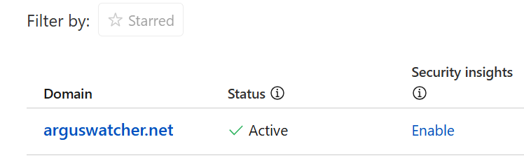
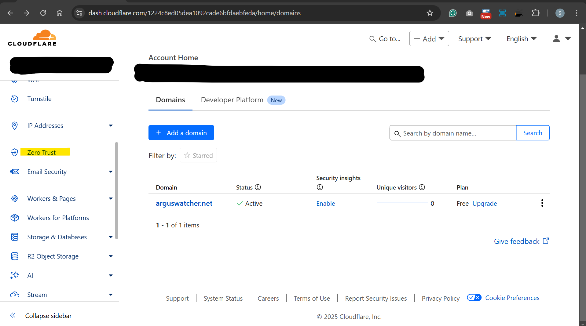

# Server - Web: Connect Homelab with `cloudflare`

[Back](../../index.md)

- [Server - Web: Connect Homelab with `cloudflare`](#server---web-connect-homelab-with-cloudflare)
  - [Homelab Server Configuration](#homelab-server-configuration)
  - [Cloudflare Configuration](#cloudflare-configuration)
    - [Update Nameserver](#update-nameserver)
    - [Create Cloudflare Tunnel](#create-cloudflare-tunnel)
    - [Disconnect Homelab](#disconnect-homelab)

---

## Homelab Server Configuration

- Parameters of homelab server

  - OS: `Oracle Linux Server 8.10`
  - Web software: `nginx`, start, enabled
  - Firewall: 80/tcp
  - Local address: `192.168.1.11`
  - Customized website: yes

- Confirm within the internal network

---

## Cloudflare Configuration

### Update Nameserver

1. With registar `AWS Route53`, register a domain `arguswatcher.net`
2. In `cloudflare`, add DNS record with the target domain name.
   - Copy the Nameservers addresses.
3. Within registar `AWS Route53`, update the nameservers.
   - Update the NS value: **`Route53`** > **Domains** > **Registered domains** > select domain name > **Details.Actions.Edit name servers**
   - **Donot** update the value in **Hosted zones**.

- Wait for a moment.
  - Status： Active

---

### Create Cloudflare Tunnel

- Dashboard > **Zero Trust**

- Create team name and choose plan.

- Create Tunnels

- Copy the codes for the local machine.

- Add Public hostname
  - the value of url is the ip addresses in the internal network.

- Run the codes at local

- Confirm by accessing domain

---

### Disconnect Homelab

- If disconnection is required, stop the cloudflare service in local machine.

- Confirm disconnection

---

[TOP](#server---web-connect-homelab-with-cloudflare)
