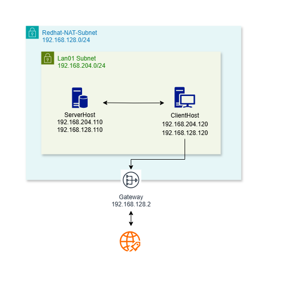

# Practice Infrastracture

[Back](../index.md)

## Diagram



---

## Server

```sh
su -

# create serveradmin user
useradd serveradmin
passwd serveradmin
usermod -aG wheel serveradmin

# Change hostname
hostnamectl set-hostname serverhost
hostnamectl

# assign NAT ip
nmcli connection show
nmcli connection down ens160
nmcli connection modify "ens160" ipv4.addresses "192.168.128.110/24"
nmcli connection modify "ens160" ipv4.gateway "192.168.128.2"
nmcli connection modify "ens160" ipv4.method manual
nmcli connection modify "ens160" ipv4.dns 8.8.8.8
nmcli connection modify "ens160" ifname "ens160"


# assign lan segment ip
nmcli connection down ens224

nmcli connection modify "ens224" ipv4.addresses "192.168.128.110/24"


nmcli connection modify "ens224" ipv4.addresses "192.168.204.110/24"
nmcli connection modify "ens224" ifname "ens224"
nmcli connection up ens224
nmcli connection del ens224
nmcli connection del ens160


nmcli connection add con-name "ens224" ifname "ens224" type ethernet ip4 "ip/mask" gw4 "gw_ip"
```