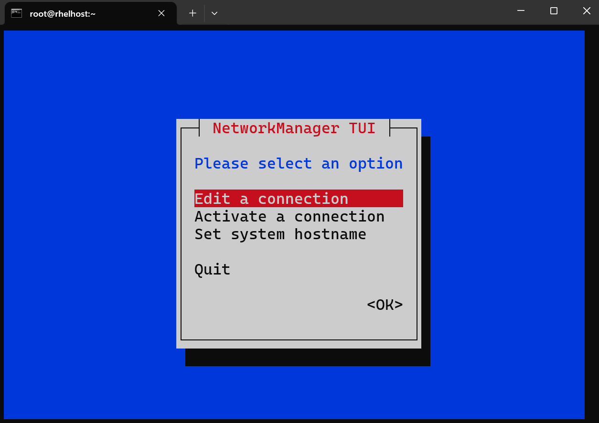
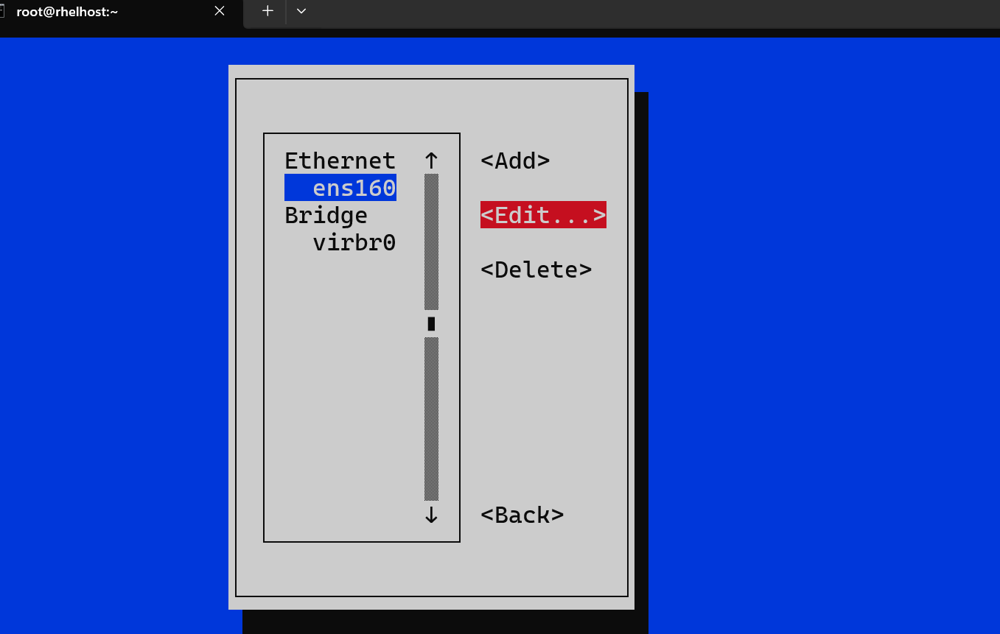

# Linux - Network: Configuration

[Back](../../index.md)

- [Linux - Network: Configuration](#linux---network-configuration)
  - [Networking Fundamental](#networking-fundamental)
    - [Terminologies](#terminologies)
    - [Network Components](#network-components)
  - [Network Configuration Tools](#network-configuration-tools)
    - [`nmtui`: Text Interface](#nmtui-text-interface)
    - [`nm-connection-editor`](#nm-connection-editor)
    - [GNOME Settings](#gnome-settings)
  - [Hostname](#hostname)
    - [`/etc/hostname`](#etchostname)
    - [Command](#command)
    - [Lab: Change Hostname](#lab-change-hostname)
  - [DNS Service](#dns-service)
    - [`/etc/hosts`](#etchosts)
    - [`/etc/nsswitch.conf`](#etcnsswitchconf)
    - [`/etc/resolv.conf`](#etcresolvconf)
    - [Command](#command-1)
    - [Lab: Step-by-Step Domain Name Resolution](#lab-step-by-step-domain-name-resolution)
    - [Lab: Setup DNS and Query Domain Name](#lab-setup-dns-and-query-domain-name)
  - [Connection](#connection)
    - [`/etc/sysconfig/network-scripts/`](#etcsysconfignetwork-scripts)
    - [Commond](#commond)

---

## Networking Fundamental

### Terminologies

- `IP (Internet Protocol)`
  - A set of rules governing the format of data sent over the internet or a local network.
  - It assigns unique addresses to devices and ensures data packets are routed to their correct destination.
- `Private IP`
  - An IP address used **within a private network** (e.g., home, school, or office LAN) that is not accessible directly from the internet.
- `Public IP`
  - An IP address that is **accessible over the internet** and is assigned by an Internet Service Provider (ISP) to a device or network for communication outside the private network.
- `Static IP`
  - An IP address that is **manually configured** and **remains constant** over time.
  - It is commonly used for servers and devices requiring a **permanent address**.
- `Dynamic IP`
  - An IP address **assigned automatically** by a `Dynamic Host Configuration Protocol (DHCP)` server.
  - These **addresses can change over time** as devices connect to and disconnect from the network.

---

### Network Components

- Components
  - `Network Interface`
    - a hardware or software component that connects a device to a network.
    - It's the point where two pieces of network equipment or protocol layers connect.
  - `MAC address`
    - a unique identifier assigned to a `network interface controller (NIC)` for use as a network address in communications within a network.
  - `Subnet mask`
    - a 32-bit binary number that's used to determine the destination of a network packet.
    - It's part of a network address and is always used with an Internet Protocol (IP) address.
  - `Gateway`
    - a piece of networking hardware or software **used in telecommunications networks** that allows data to flow from one discrete network to another.
  - `DNS (Domain Name System)`
    - The DNS translates **human-readable domain names** (e.g., www.example.com) into **IP addresses** (e.g., 192.0.2.1) that computers use to identify each other on a network.
    - It serves as the "phonebook" of the internet, enabling users to access websites using easy-to-remember names instead of numerical IP addresses.

---

## Network Configuration Tools

### `nmtui`: Text Interface

- Use command `nmtui`
  - can access via ssh
- Must as `root`





---

### `nm-connection-editor`

- user command `nm-connection-editor`
  - cannot access via ssh
  - only via console


---

### GNOME Settings


---

## Hostname

### `/etc/hostname`

- `/etc/hostname`
  - a simple text file that contains the system's hostname, which is a unique identifier for the machine on a network.
    - the hostname written as a single line.
  - **Stores** the static hostname for the system.
  - Used during **system boot** to set the hostname.

```conf
hostname
```

---

### Command

| CMD                                                              | Desc                                                                  |
| ---------------------------------------------------------------- | --------------------------------------------------------------------- |
| `hostname`                                                       | Display the Current Hostname                                          |
| `hostname -a`                                                    | Display the alias name                                                |
| `hostname -i`                                                    | Display IPv4 and IPv6 of the host.                                    |
| `hostname -I`                                                    | Display IPv4 of the host.                                             |
| `sudo hostname newhostname`                                      | Set a Temporary Hostname                                              |
| `hostnamectl`                                                    | Display Hostname Information                                          |
| `sudo hostnamectl set-hostname newhostname`                      | Sets a new hostname and updates the `/etc/hostname`                   |
| `sudo hostnamectl set-hostname "pretty_name" --pretty`           | Set the Pretty Hostname                                               |
| `sudo hostnamectl set-hostname newstatichostname --static`       | set a static hostname                                                 |
| `sudo hostnamectl set-hostname newtransienthostname --transient` | set a transient hostname (temporary hostname for the current session) |

- `hostname` command

  - only changes the hostname in the current session.
  - Changes made with the `hostname` command are **not persistent after a reboot** unless explicitly configured in `/etc/hostname` and `/etc/hosts`.

- `hostnamectl` command
  - a `systemd`-based utility for managing the hostname.
  - hostname information:
    - `Static hostname`: The permanent hostname set in `/etc/hostname`.
    - `Pretty hostname`: An optional, **human-readable** version of the hostname.
    - `Transient hostname`: A **temporary** hostname assigned **dynamically** (e.g., by DHCP).
    - `Icon name`: An optional system identifier, usually for graphical systems.

---

### Lab: Change Hostname

- Display current hostname

```sh
# display hostname
hostname
# rhelhost.localdomain

# display hostname info
hostnamectl
#  Static hostname: rhelhost.localdomain
#        Icon name: computer-vm
#          Chassis: vm
#       Machine ID: ca299475723c4510bf96994f9b0391d6
#          Boot ID: 8236fb4874fc4e958e092424c1617a84
#   Virtualization: vmware
# Operating System: Red Hat Enterprise Linux 8.10 (Ootpa)
#      CPE OS Name: cpe:/o:redhat:enterprise_linux:8::baseos
#           Kernel: Linux 4.18.0-553.30.1.el8_10.x86_64
#     Architecture: x86-64
```

- Change hostname only for current session

```sh
# Display hostname
hostname
# rhelhost.localdomain

# Change hostname temporarily
sudo hostname newhost

# view the hostname in cf
cat /etc/hostname
# rhelhost.localdomain

# reboot
systemctl reboot

# Display hostname
hostname
# rhelhost.localdomain

# view the hostname in cf
cat /etc/hostname
# rhelhost.localdomain
```

- Change hostname permanently

```sh
# Display hostname info
hostnamectl
#  Static hostname: rhelhost.localdomain
#        Icon name: computer-vm
#          Chassis: vm
#       Machine ID: ca299475723c4510bf96994f9b0391d6
#          Boot ID: db70d05de8e7435798baa3b443c97ea7
#   Virtualization: vmware
# Operating System: Red Hat Enterprise Linux 8.10 (Ootpa)
#      CPE OS Name: cpe:/o:redhat:enterprise_linux:8::baseos
#           Kernel: Linux 4.18.0-553.30.1.el8_10.x86_64
#     Architecture: x86-64


# Change the static hostname
sudo hostnamectl set-hostname newhostname

# Change pretty name
sudo hostnamectl set-hostname "pretty_name" --pretty

# Change transient name
sudo hostnamectl set-hostname newtransienthostname --transient

# Confirm
# hostname for current session
hostname
# newhostname

# confirm
cat /etc/hostname
# newhostname

hostnamectl
#    Static hostname: newhostname
#    Pretty hostname: pretty_name
# Transient hostname: newtransienthostname
#          Icon name: computer-vm
#            Chassis: vm
#         Machine ID: ca299475723c4510bf96994f9b0391d6
#            Boot ID: db70d05de8e7435798baa3b443c97ea7
#     Virtualization: vmware
#   Operating System: Red Hat Enterprise Linux 8.10 (Ootpa)
#        CPE OS Name: cpe:/o:redhat:enterprise_linux:8::baseos
#             Kernel: Linux 4.18.0-553.30.1.el8_10.x86_64
#       Architecture: x86-64


# reboot
systemctl reboot

# show hostname
hostname

cat /etc/hostname
# newhostname

hostnamectl
#  Static hostname: newhostname
#  Pretty hostname: pretty_name
#        Icon name: computer-vm
#          Chassis: vm
#       Machine ID: ca299475723c4510bf96994f9b0391d6
#          Boot ID: 5a82a02c3a634367991075db25be1cf1
#   Virtualization: vmware
# Operating System: Red Hat Enterprise Linux 8.10 (Ootpa)
#      CPE OS Name: cpe:/o:redhat:enterprise_linux:8::baseos
#           Kernel: Linux 4.18.0-553.30.1.el8_10.x86_64
#     Architecture: x86-64

```

---

## DNS Service

### `/etc/hosts`

- `/etc/hosts`
  - a **simple text file** used for `hostname-to-IP` **address mapping**.
  - used to resolve **hostnames** to **IP addresses** **before** querying a DNS server.
    - resolve hostnames **without** relying on DNS.
    - **Override** DNS for specific hostname-IP mappings.
    - setting **custom** hostname resolutions

```conf
IP_address  hostname  [aliases...]
```

---

### `/etc/nsswitch.conf`

- `/etc/nsswitch.conf` file

  - a system configuration file that **defines the order and methods** used by the system to resolve various types of information, such as hostnames, user accounts, and network services.
  - It specifies the name service switch configuration, which dictates **how Linux queries different databases** like DNS, NIS, and local files to obtain information.

- File Structure:
  - Each line consists of a database name followed by a list of sources and services to use in order.

```conf
database: source1 source2 source3
```

- **Common databases**:

  - `passwd`: Resolves user account information.
  - `shadow`: Resolves user password information.
  - `hosts`: Resolves hostnames to IP addresses.
  - `networks`: Network names and numbers
  - `group`: Resolves group account information.
  - `services`: Resolves network service names to port numbers.
  - `ethers`: Resolves Ethernet address to hostnames.
  - `netgroup`: Resolves NIS netgroups.
  - `protocols`: Resolves network protocols.
  - `aliases`: Resolves mail aliases.

- **Common sources**:

  - `files`: Refers to local files (e.g., /etc/hosts, /etc/passwd).
  - `dns`: Refers to DNS servers.
  - `nis`: Refers to NIS (Network Information Service).
  - `mdns`: Refers to Multicast DNS.
  - `ldap`: Refers to LDAP (Lightweight Directory Access Protocol).

- Default `Host`
  - system will first check the `/etc/hosts` file for hostname resolution.
  - If it doesn't find the entry there, it will then query DNS.

```conf
hosts: files dns
```

---

### `/etc/resolv.conf`

- `/etc/resolv.conf`

  - a file used to **configure DNS** (`Domain Name System`) settings.
  - It defines **how the system resolves domain names** to IP addresses by specifying the DNS servers and search domains.
  - It specifies:
    - The DNS servers to use for resolving domain names.
    - The search domains to append to unqualified hostnames.

- File format

```conf
option value
nameserver 8.8.8.8
```

- Common options:
  - `search`: Defines a list of domain names to append to unqualified hostnames for resolution.
  - `nameserver`: Specifies a **DNS server** by its IP address.
  - `domain`: Specifies the **default search domain**.
  - `options`: Allows additional resolver options, such as timeouts.
    - `options timeout:2 attempts:3`

---

### Command

| CMD                                                   | Desc                      |
| ----------------------------------------------------- | ------------------------- |
| `nmcli connection modify "id_name" ipv4.dns "dns_ip"` | Set the DNS ip            |
| `sudo nano /etc/resolv.conf`                          | Configure DNS server      |
| `grep "nameserver" /etc/resolv.conf`                  | Get DNS server            |
| `nslookup target_domain`                              | Query domain name servers |

---

### Lab: Step-by-Step Domain Name Resolution

- Configuration

```sh
cat /etc/nsswitch.conf | grep dns
# hosts:      files dns myhostname
# networks:   files dns

cat /etc/resolv.conf
# search localdomain
# nameserver 192.168.204.2
# nameserver 8.8.8.8

cat /etc/hosts
# 192.168.204.10 localdomain

hostname
# localdomain
```

---

- **Ping hostname**

```sh
ping localdomain
```

- Step-by-Step Domain Name Resolution

  - 1. Kernel looks the file `/etc/nsswitch.conf`

    - `hosts:      files dns myhostname`:
      - indicates that the system will resolve names in the following order
      - `files`: Local files like `/etc/hosts`.
      - `dns`: Queries DNS servers specified in `/etc/resolv.conf`.
      - `myhostname`: Resolves using the **local machine's hostname**.

  - 2. Check `/etc/hosts`:
    - The system first checks the `/etc/hosts` file for the localdomain hostname.
    - `192.168.204.10 localdomain`
      - Since localdomain is explicitly mapped to `192.168.204.10`, the system uses this entry and resolves localdomain **without further queries**.

---

- Ping a domain

```sh
ping abc.com
```

- Step-by-Step Domain Name Resolution

  - 1. Kernel looks the file `/etc/nsswitch.conf`
    - `hosts:      files dns myhostname`:
      - indicates that the system will resolve names in the following order
      - `files`: Local files like `/etc/hosts`.
      - `dns`: Queries DNS servers specified in `/etc/resolv.conf`.
      - `myhostname`: Resolves using the **local machine's hostname**.
  - 2. Check `/etc/hosts`:
    - this file does not contain the target domain
    - the system moves to the next method.
  - 3. Check `/etc/resolv.conf`
    - `search localdomain`: directive **appends** localdomain to single-label hostnames (e.g., resolving abc as `abc.localdomain` before querying DNS).
    - specify the DNS servers the system queries in order
      - `nameserver 192.168.204.2`: the gateway, possibly a **local DNS server or resolver**
      - `nameserver 8.8.8.8`: Google's public DNS

- Result Handling:
  - If a DNS server **returns** an IP address for abc.com, the system uses that IP.
  - If **no** DNS server can resolve abc.com, the resolution fails, and ping outputs an error like "**unknown host**."

---

### Lab: Setup DNS and Query Domain Name

- Setup DNS

```sh
nmcli device status
# DEVICE  TYPE      STATE                   CONNECTION
# ens160  ethernet  connected               ens160
# ens224  ethernet  connected               static_con

nmcli connection down ens160
nmcli connection modify ens160 ipv4.dns 8.8.4.4
nmcli connection show ens160 | grep "ipv4.dns:"
# ipv4.dns:                               8.8.4.4
nmcli connection up ens160

# confirm
grep "nameserver" /etc/resolv.conf
# nameserver 8.8.4.4
# nameserver 192.168.204.2
```

- Query Domain Name

```sh
# Get DNS server
grep "nameserver" /etc/resolv.conf
# nameserver 8.8.4.4
# nameserver 192.168.204.2

# query a domain name
nslookup google.com
# Server:         8.8.4.4
# Address:        8.8.4.4#53

# Non-authoritative answer:
# Name:   google.com
# Address: 172.217.1.14
# Name:   google.com
# Address: 2607:f8b0:400b:807::200e
```

---

## Connection

### `/etc/sysconfig/network-scripts/`

- `/etc/sysconfig/network-scripts/` directory

  - directory in primarily Red Hat-based distributions such as CentOS, Fedora, and RHEL
  - a directory contains configuration files and scripts used to manage network interfaces and related settings.

- Configuration Files

  - **Network Interface Configuration Files**

    - File name: `ifcfg-<interface_name>`
    - define the settings for each network interface, such as IP address, subnet mask, gateway, DNS servers, and whether the interface is enabled on boot.
    - Common fields:

      - `TYPE`: The type of connection (e.g., Ethernet, Bridge).
      - `BOOTPROTO`: The method of assigning an IP address (none, dhcp, static).
      - `NAME`: Interface name.
      - `DEVICE`: Name of the physical device (matches the interface name).
      - `ONBOOT`: Whether to activate the interface during boot (yes or no).

      ```conf
      TYPE=Ethernet
      PROXY_METHOD=none
      BROWSER_ONLY=no
      BOOTPROTO=dhcp
      DEFROUTE=yes
      IPV4_FAILURE_FATAL=no
      IPV6INIT=yes
      IPV6_AUTOCONF=yes
      IPV6_DEFROUTE=yes
      IPV6_FAILURE_FATAL=no
      IPV6_ADDR_GEN_MODE=eui64
      NAME=ens160
      UUID=bea1745d-c7f0-430a-a575-9c06f5d420a7
      DEVICE=ens160
      ONBOOT=yes
      DNS1=8.8.4.4
      ```

  - **Network Management Scripts**
    - used to start, stop, and manage network interfaces
  - **Route Configuration Files**
    - File name: `route-<interface>` or `route6-<interface>`
    - define static IPv4 or IPv6 routes for the associated interface.

---

### Commond

- Use `nmcli connection` command

---

[TOP](#linux---network-configuration)
