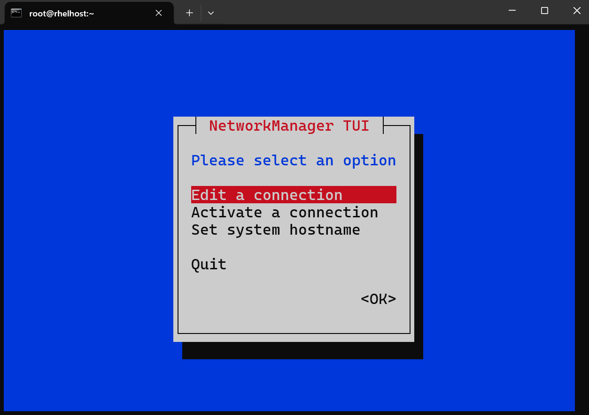
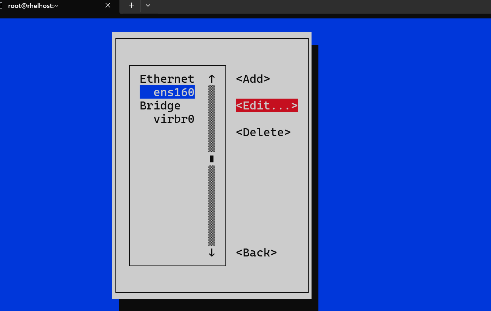
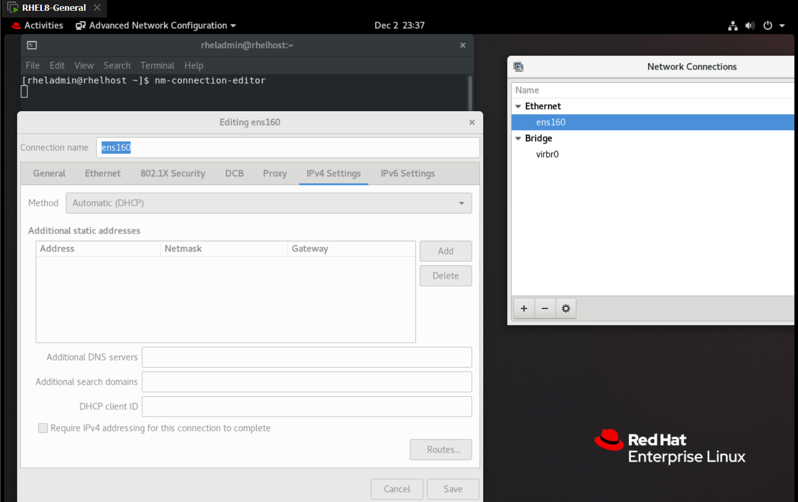

# Linux - Networking

[Back](../../index.md)

- [Linux - Networking](#linux---networking)
  - [Get Host IP](#get-host-ip)
  - [Change Host name](#change-host-name)
  - [Change Local DNS Server](#change-local-dns-server)
  - [Ping \& `nping`](#ping--nping)
  - [`nmap`](#nmap)
  - [`netstat`:Network connection](#netstatnetwork-connection)
  - [Networking Fundamental](#networking-fundamental)
    - [Networking Information](#networking-information)
  - [Network Components](#network-components)
    - [Network Interface](#network-interface)
    - [`ifconfig`](#ifconfig)
    - [`ip addr`](#ip-addr)
  - [`NetworkManager`](#networkmanager)
  - [Lab: Manully configure a static IP](#lab-manully-configure-a-static-ip)
  - [Lab: Adding Secondary static IP to an Interface](#lab-adding-secondary-static-ip-to-an-interface)
  - [`nmtui`: Text Interface](#nmtui-text-interface)
  - [`nm-connection-editor`](#nm-connection-editor)
  - [GNOME Settings](#gnome-settings)
  - [Network Files and Basic Commands](#network-files-and-basic-commands)

---

## Get Host IP

- Get IP from interface.

```sh
ifconfig        # displays the status of the currently active interfaces.
ifconfig -a     # display all interfaces which are currently available, even if down
ifconfig -s     # display a short list

ifconfig | grep "inet" # return ip addresses of all interfaces.
```

- Get and set ip for host.

```sh
hostname        # show the system's host name
hostname -a     # Display the alias name
hostname -i     # Display  the  network  address(es) of the host name.
hostname -i     # Display  the  network  address(es) of the host name.
hostname -I     # Display all network addresses of the host.
```

---

## Change Host name

```sh
sudo vi /etc/hostname       # configures the name of the local Linux system that is set during boot
sudo vi /etc/hosts       # a plain text file used in matching a fully qualified domain name (FQDN) with the server IP hosting a specific domain.
```

---

## Change Local DNS Server

```sh
sudo nano /etc/resolv.conf      # configure DNS server
grep "nameserver" /etc/resolv.conf      # get DNS server

nslookup target_domain      # query Internet domain name servers
```

---

## Ping & `nping`

- `ping`

```sh
ping dest_url   # a network utility used to test a host's reachability on an Internet Protocol (IP) network.
ping -i 4 dest_url   # Wait interval 4 seconds between sending each packet. R
ping -c 5 dest_url   # Stop after sending 5 count ECHO_REQUEST packets.
```

- `nping`
  - allows users to generate network packets of a wide range of protocols, letting them tune virtually any field of the protocol headers.

```sh
nping --tcp-connect -p 80 --rate 10000 -c 50 dest_url
# --tcp-connect: TCP connect mode
# -p:   ports to connect to.
# -rate: the number of probes that Nping should send per second.
# -c: the number of times that Nping should loop over target hosts (and in some cases target ports).
```

---

## `nmap`

- Network exploration tool and security / port scanner

```sh
nmap –v1 –Pn –T4 --max-retries 1 192.168.50.80
# -v:     Increases the verbosity level, causing Nmap to print more information about the scan in progress.
# -Pn:    Treat all hosts as online
# -Ｔ：     timing templates， aggressive (4)
# ---max-retries 1:    number of retransmissions allowed

nmap --script http-slowloris --max-parallelism 10 192.168.50.80
# --script http-slowloris：   Loads script, Slowloris is a denial-of-service attack program
# --max-parallelism 10:        control the total number of probes
```

---

| CMD                    | DESC                      |
| ---------------------- | ------------------------- |
| `tcpdump`              | dump traffic on a network |
| `tcpdump -i interface` | listen on the interface   |

---

## `netstat`:Network connection

| CMD            | DESC                    |
| -------------- | ----------------------- |
| `netstat -a`   | List all the connection |
| `netstat -au`  |                         |
| `netstat -rnv` |                         |

---

## Networking Fundamental

- `IP (Internet Protocol)`
  - A set of rules governing the format of data sent over the internet or a local network.
  - It assigns unique addresses to devices and ensures data packets are routed to their correct destination.
- `Private IP`
  - An IP address used **within a private network** (e.g., home, school, or office LAN) that is not accessible directly from the internet.
- `Public IP`
  - An IP address that is **accessible over the internet** and is assigned by an Internet Service Provider (ISP) to a device or network for communication outside the private network.
- `Static IP`
  - An IP address that is **manually configured** and **remains constant** over time.
  - It is commonly used for servers and devices requiring a **permanent address**.
- `Dynamic IP`
  - An IP address **assigned automatically** by a `Dynamic Host Configuration Protocol (DHCP)` server.
  - These **addresses can change over time** as devices connect to and disconnect from the network.

---

### Networking Information

| CMD                   | DESC                                                      |
| --------------------- | --------------------------------------------------------- |
| `ifconfig`            | Display the network interface information                 |
| `ifconfig -a`         | Display all network interface information                 |
| `ifconfig -s`         | Display a short list                                      |
| `netstat -rnv`        | Displays the kernel's IP routing table, including gateway |
| `nslookup google.com` | Displays DNS info                                         |

---

## Network Components

- Components

  - `Network Interface`

    - a hardware or software component that connects a device to a network.
    - It's the point where two pieces of network equipment or protocol layers connect.

  - `MAC address`
    - a unique identifier assigned to a `network interface controller (NIC)` for use as a network address in communications within a network.
  - `Subnet mask`
    - a 32-bit binary number that's used to determine the destination of a network packet.
    - It's part of a network address and is always used with an Internet Protocol (IP) address.
  - `Gateway`
    - a piece of networking hardware or software **used in telecommunications networks** that allows data to flow from one discrete network to another.
  - `DNS (Domain Name System)`
    - The DNS translates **human-readable domain names** (e.g., www.example.com) into **IP addresses** (e.g., 192.0.2.1) that computers use to identify each other on a network.
    - It serves as the "phonebook" of the internet, enabling users to access websites using easy-to-remember names instead of numerical IP addresses.

### Network Interface

### `ifconfig`

```sh
ifconfig
# ens160: flags=4163<UP,BROADCAST,RUNNING,MULTICAST>  mtu 1500
#         inet 192.168.204.153  netmask 255.255.255.0  broadcast 192.168.204.255
#         inet6 fe80::20c:29ff:fe5b:ce78  prefixlen 64  scopeid 0x20<link>
#         ether 00:0c:29:5b:ce:78  txqueuelen 1000  (Ethernet)
#         RX packets 166189  bytes 241795084 (230.5 MiB)
#         RX errors 0  dropped 0  overruns 0  frame 0
#         TX packets 13913  bytes 2465843 (2.3 MiB)
#         TX errors 0  dropped 0 overruns 0  carrier 0  collisions 0

# lo: flags=73<UP,LOOPBACK,RUNNING>  mtu 65536
#         inet 127.0.0.1  netmask 255.0.0.0
#         inet6 ::1  prefixlen 128  scopeid 0x10<host>
#         loop  txqueuelen 1000  (Local Loopback)
#         RX packets 0  bytes 0 (0.0 B)
#         RX errors 0  dropped 0  overruns 0  frame 0
#         TX packets 0  bytes 0 (0.0 B)
#         TX errors 0  dropped 0 overruns 0  carrier 0  collisions 0

# virbr0: flags=4099<UP,BROADCAST,MULTICAST>  mtu 1500
#         inet 192.168.122.1  netmask 255.255.255.0  broadcast 192.168.122.255
#         ether 52:54:00:c5:c9:4d  txqueuelen 1000  (Ethernet)
#         RX packets 0  bytes 0 (0.0 B)
#         RX errors 0  dropped 0  overruns 0  frame 0
#         TX packets 0  bytes 0 (0.0 B)
#         TX errors 0  dropped 0 overruns 0  carrier 0  collisions 0
```

---

- **Interface Name**:
  - the name of a physical or virtual network interface.
  - `ens160`
- `Flags: flags=4163<UP,BROADCAST,RUNNING,MULTICAST>`
  - **UP**: The interface is **enabled**.
  - **BROADCAST**: The interface **supports broadcasting**.
  - **RUNNING**: The interface is **operational**.
  - **MULTICAST**: The interface **supports multicast**.
- `MTU (Maximum Transmission Unit)`:
  - `mtu 1500`: the maximum size of packets (in bytes) that can be transmitted **without fragmentation**.
- **IPv4 Address Details**:
  - `inet: 192.168.204.153`: the IPv4 address assigned to the interface.
  - `netmask: 255.255.255.0`: the subnet mask.
  - `broadcast: 192.168.204.255`: the broadcast address.
- **IPv6 Address Details**:
  - `inet6: fe80::20c:29ff:fe5b:ce78`: the link-local IPv6 address.
  - `prefixlen 64`: Specifies the subnet mask for IPv6.
  - `scopeid`: Indicates the scope of the address (`<link>` means it's local to the link).
- **MAC Address**:
  - `ether 00:0c:29:5b:ce:78`: the Media Access Control (MAC) address of the interface.
- **Transmit Queue Length**
  - `txqueuelen 1000  (Ethernet)`: 1000 packets can be queued in the kernel for transmission before they are sent to the network hardware.
  - interface type is `Ethernet`
- **Statistics**:
  - `RX packets 166189`: The number of packets **received**.
  - `RX bytes 241795084 (230.5 MiB)`: Total data **received**.
  - `RX errors, dropped, overruns, frame`: All error counts for **received** packets are 0.
  - `TX packets 13913`: The number of packets **transmitted**.
  - `TX bytes 2465843 (2.3 MiB)`: Total data **transmitted**.
  - `TX errors, dropped, overruns, carrier, collisions`: All error counts for **transmitted** packets are 0.

---

- **Loopback Interface**
  - loopback interface used for **communication within** the local machine.
  - name: `lo`
- `Flags: flags=73<UP,LOOPBACK,RUNNING>`
  - `UP`: The interface is **enabled**.
  - `LOOPBACK`: Indicates it is a loopback interface.
  - `RUNNING`: The interface is operational.
- `MTU (Maximum Transmission Unit)`:
  - `mtu 65536` allows larger packet sizes since it does **not involve physical hardware**.

---

- **Bridge Interface**
  - Interface Name: `virbr0`
  - a **virtual bridge interface** used for virtual machines or containers.
- `Flags: flags=4099<UP,BROADCAST,MULTICAST>`
  - `UP`: The interface is enabled.
  - `BROADCAST`: Supports broadcasting.
  - `MULTICAST`: Supports multicast.
- `MTU (Maximum Transmission Unit)`:
  - `mtu 1500`: specifies the maximum packet size.

---

### `ip addr`

```sh
ip addr
# 1: lo: <LOOPBACK,UP,LOWER_UP> mtu 65536 qdisc noqueue state UNKNOWN group default qlen 1000
#     link/loopback 00:00:00:00:00:00 brd 00:00:00:00:00:00
#     inet 127.0.0.1/8 scope host lo
#        valid_lft forever preferred_lft forever
#     inet6 ::1/128 scope host
#        valid_lft forever preferred_lft forever
# 2: ens160: <BROADCAST,MULTICAST,UP,LOWER_UP> mtu 1500 qdisc mq state UP group default qlen 1000
#     link/ether 00:0c:29:5b:ce:78 brd ff:ff:ff:ff:ff:ff
#     altname enp3s0
#     inet 192.168.204.153/24 brd 192.168.204.255 scope global dynamic noprefixroute ens160
#        valid_lft 1287sec preferred_lft 1287sec
#     inet6 fe80::20c:29ff:fe5b:ce78/64 scope link noprefixroute
#        valid_lft forever preferred_lft forever
# 3: virbr0: <NO-CARRIER,BROADCAST,MULTICAST,UP> mtu 1500 qdisc noqueue state DOWN group default qlen 1000
#     link/ether 52:54:00:c5:c9:4d brd ff:ff:ff:ff:ff:ff
#     inet 192.168.122.1/24 brd 192.168.122.255 scope global virbr0
#        valid_lft forever preferred_lft forever
```

---

- **Loopback Interface**
  - logical interface for local communication within the system
  - name: `lo`
- **Flags**:
  - `<LOOPBACK>`: Marks this as the **loopback interface**.
  - `<UP>`: The interface is **enabled**.
  - `<LOWER_UP>`: The interface is **operational at the hardware level**.
- `MTU (Maximum Transmission Unit)`:
  - 65536:the maximum packet size (very large since it does not involve physical transmission).
- **Queue Discipline (qdisc)**:
  - `qdisc noqueue`: the interface does **not use a queuing mechanism** since there’s no traffic contention on the loopback interface.
- `State UNKNOWN`: the interface is operational but **doesn’t have a conventional carrier link** like physical interfaces.
- `Group default`: this interface belongs to the **default interface group**.
- `qlen 1000`: Transmit Queue Length, the maximum number of packets queued for transmission.

- `link/loopback 00:00:00:00:00:00`:
  - `loopback`: refers to the loopback interface, a loopback interface doesn’t interact with external networks.
  - The MAC address for loopback is always `00:00:00:00:00:00`, which is a reserved address indicating it does not have a physical hardware counterpart.
- `brd 00:00:00:00:00:00`:
  - `brd`: broadcast address, which is typically used in physical networks for broadcasting packets to all devices on a subnet.
  - For the loopback interface, the broadcast address is also `00:00:00:00:00:00`, as broadcasting is irrelevant for this purely internal interface.
- **IPv4 Address**:
  - `inet 127.0.0.1/8`: The loopback IPv4 address with a subnet mask of /8.
  - `scope host`: The address is **limited to the local host**.
  - `valid_lft forever, preferred_lft forever`: These addresses are **valid** and **preferred** indefinitely.
- **IPv6 Address**:

  - `inet6 ::1/128`: The loopback IPv6 address with a subnet mask of /128.
  - `scope host`: Same as IPv4, **limited to the local host**.

---

- `ens160` The name of a physical or virtual network interface.
- **Flags**:
  - `<BROADCAST>`: Supports broadcasting.
  - `<MULTICAST>`: Supports multicast traffic.
  - `<UP>`: The interface is enabled.
  - `<LOWER_UP>`: The physical link is active.
- `mtu 1500`: the standard Ethernet packet size.
- `qdisc mq`:
  - `qdisc`: Queue Discipline
  - `mq (multi-queue)`: the interface supports multiple transmit queues, often for better performance on multi-core systems.
- `state UP`: the interface is active and functioning.
- `group default`: the interface belongs to the default group.
- `qlen 1000`: Transmit Queue Length (qlen)is 1000 packets.
- **Hardware (Link Layer)**:
  - `link/ether: 00:0c:29:5b:ce:78`: the MAC address.
  - `brd: ff:ff:ff:ff:ff:ff`: the broadcast address.
- `altname enp3s0`:
  - Alternate Name, an alternate naming convention for the interface.
- **IPv4 Address**:
  - `inet 192.168.204.153/24`: The IP address with a subnet mask of /24.
  - `brd 192.168.204.255`: The broadcast address.
  - `scope global`: the address is globally routable.
  - `dynamic`: The address is assigned **dynamically** (likely via DHCP).
  - `noprefixroute`: No automatic creation of routes for this address.
  - `valid_lft 1287sec`: The **remaining time** (in seconds) the address is valid.
  - `preferred_lft 1287sec`: The remaining time (in seconds) the address is **preferred for outgoing connections**.
- **IPv6 Address**:
  - `inet6 fe80::20c:29ff:fe5b:ce78/64`: The link-local IPv6 address with a /64 subnet mask.
  - `scope link`: The address is only valid within the same link.
  - `noprefixroute`: No automatic route creation.
  - `valid_lft forever, preferred_lft forever`: The address is valid and preferred indefinitely.

---

- `virbr0`: A v**irtual bridge interface**, often used for virtual machines or containers.
- **Flags**:
  - `<NO-CARRIER>`: The interface is **not connected to a physical carrier**.
  - `<BROADCAST>`: Supports broadcasting.
  - `<MULTICAST>`: Supports multicast.
  - `<UP>`: The interface is enabled.
- `MTU 1500`: the standard packet size.
- `qdisc noqueue`:
  - qdisc: Queue Discipline
  - noqueue: no queuing mechanism since it’s a virtual interface.
- `state DOWN`:
  - interface is enabled but not operational.
- `group default`:
  - default Group
- `qlen 1000`
  - Transmit Queue Length (qlen)
- **Hardware (Link Layer)**:
  - `link/ether: 52:54:00:c5:c9:4d` the MAC address.
  - `brd: ff:ff:ff:ff:ff:ff`: the broadcast address.
- **IPv4 Address**:
  - `inet 192.168.122.1/24`: The IP address assigned to the bridge interface with a /24 subnet mask.
  - `brd 192.168.122.255`: The broadcast address.
  - `scope global`: The address is globally routable.
  - `valid_lft forever, preferred_lft forever`: The address is valid and preferred indefinitely.

---

## `NetworkManager`

- `NetworkManager`

  - a daemon that provides the default networking service in Linux.

- Package info:
  - `dnf info NetworkManager`
- File location:
  - `/usr/sbin/NetworkManager`
- Service
  - `systemctl status NetworkManager`
- Process
  - `ps -ef | grep NetworkManager`
- Tools to configure network manager
  - `nmcli`: Network manager command line interface
  - `nmtui`: Network manager text user interface
  - `nm-connection-editor`: Network manager GUI tool
  - `GNOME Settings`: GNOME desktop app.

| CMD            | DESC                                 |
| -------------- | ------------------------------------ |
| `nmcli c`      | Display NetworkManager's connections |
| `nmcli device` | Display all interface                |

---

## Lab: Manully configure a static IP

```sh
# get the ip before configuration
ip addr
# 192.168.204.153

# list all network interface
nmcli device
# DEVICE  TYPE      STATE                   CONNECTION
# ens160  ethernet  connected               ens160
# virbr0  bridge    connected (externally)  virbr0
# lo      loopback  unmanaged               --

# assign a static ip
nmcli connection modify nic_name ipv4.addresses ip_addr/mask
# nmcli connection modify ens160 ipv4.addresses 192.168.204.180/24

# assign a gateway
nmcli connection modify nic_name ipv4.gateway ip_addr
# nmcli connection modify ens160 ipv4.gateway 192.168.204.2

# change method
nmcli connection modify nic_name ipv4.method manual
# nmcli connection modify ens160 ipv4.method manual

# modify dns
nmcli connection modify nic_name ipv4.dns dns_ip
nmcli connection modify ens160 ipv4.dns 8.8.8.8

# put the nic down and up
nmcli connection down nic_name && nmcli connection up nic_name
nmcli connection down ens160 && nmcli connection up ens160

# verify
ip address show ens160
# 2: ens160: <BROADCAST,MULTICAST,UP,LOWER_UP> mtu 1500 qdisc mq state UP group default qlen 1000
#     link/ether 00:0c:29:5b:ce:78 brd ff:ff:ff:ff:ff:ff
#     altname enp3s0
#     inet 192.168.204.180/24 brd 192.168.204.255 scope global noprefixroute ens160
#        valid_lft forever preferred_lft forever
#     inet 192.168.204.153/24 brd 192.168.204.255 scope global secondary dynamic noprefixroute ens160
#        valid_lft 1770sec preferred_lft 1770sec
#     inet6 fe80::20c:29ff:fe5b:ce78/64 scope link noprefixroute
#        valid_lft forever preferred_lft forever
```

---

## Lab: Adding Secondary static IP to an Interface

```sh
# get all device status
nmcli device status
# DEVICE  TYPE      STATE                   CONNECTION
# ens160  ethernet  connected               ens160
# virbr0  bridge    connected (externally)  virbr0
# lo      loopback  unmanaged               --

# show the active connection
nmcli connection show --active
# NAME    UUID                                  TYPE      DEVICE
# ens160  bea1745d-c7f0-430a-a575-9c06f5d420a7  ethernet  ens160
# virbr0  92969d46-b49e-4579-a8b0-4091f2c06dbc  bridge    virbr0

# show the current ip
ifconfig | grep inet
# inet 192.168.204.180

# add a new ip
nmcli connection modify device_name +ipv4.addresses ip_add/mask
nmcli connection modify ens160 +ipv4.addresses 192.168.204.181/24

# reload the connection
nmcli connection reload
# same as down and up

# reboot
systemctl reboot

# verify
ip address show ens160
# 2: ens160: <BROADCAST,MULTICAST,UP,LOWER_UP> mtu 1500 qdisc mq state UP group default qlen 1000
#     link/ether 00:0c:29:5b:ce:78 brd ff:ff:ff:ff:ff:ff
#     altname enp3s0
#     inet 192.168.204.180/24 brd 192.168.204.255 scope global noprefixroute ens160
#        valid_lft forever preferred_lft forever
#     inet 192.168.204.181/24 brd 192.168.204.255 scope global secondary noprefixroute ens160
#        valid_lft forever preferred_lft forever
#     inet 192.168.204.153/24 brd 192.168.204.255 scope global secondary dynamic noprefixroute ens160
#        valid_lft 1761sec preferred_lft 1761sec
#     inet6 fe80::20c:29ff:fe5b:ce78/64 scope link noprefixroute
#        valid_lft forever preferred_lft forever
```

---

## `nmtui`: Text Interface

- Use command `nmtui`
  - can access via ssh
- Must as `root`





---

## `nm-connection-editor`

- user command `nm-connection-editor`
  - cannot access via ssh
  - only via console



---

## GNOME Settings


---

## Network Files and Basic Commands

- Files

  - `/etc/sysconfig/network-scripts/`
  - `/etc/hosts`
  - `/etc/hostname`
  - `/etc/resolv.conf`
  - `/etc/nsswitch.conf`

- Command

| CMD          | Desc |
| ------------ | ---- |
| `ping`       |      |
| `ifconfig`   |      |
| `ip`         |      |
| `ipup`       |      |
| `ipdown`     |      |
| `netstat`    |      |
| `traceroute` |      |
| `tcpdump`    |      |
| `nslookup`   |      |
| `dig`        |      |
| `ethtool`    |      |
