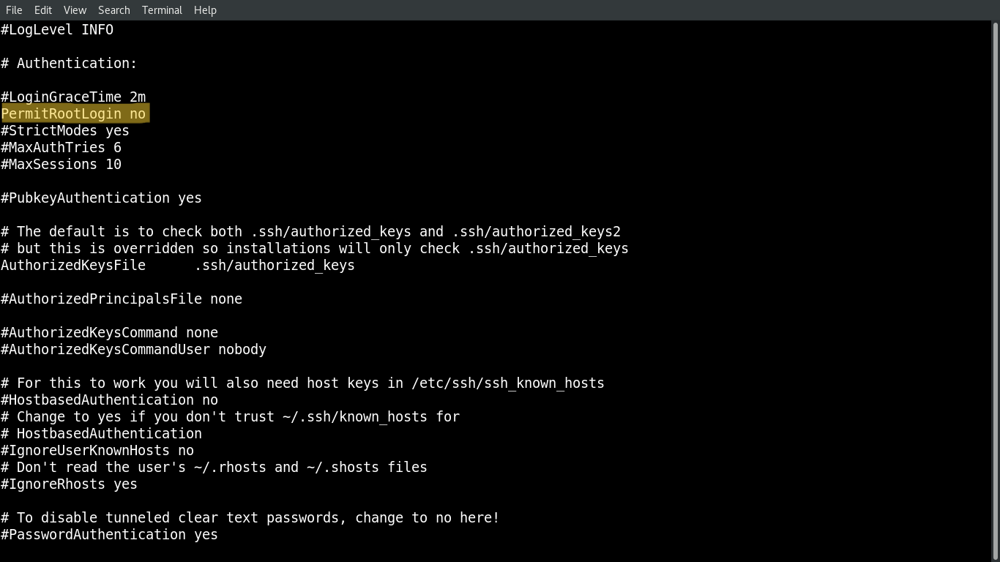

# Linux - Network: SSH

[Back](../../index.md)

- [Linux - Network: SSH](#linux---network-ssh)
  - [SSH Protocol](#ssh-protocol)
  - [`openssh` Package](#openssh-package)
    - [Components](#components)
    - [Package Commands](#package-commands)
    - [Service Commands](#service-commands)
    - [Configuration Files](#configuration-files)
    - [Common Command](#common-command)
  - [SSH Configurations](#ssh-configurations)
    - [Common Configuration](#common-configuration)
    - [Idle Timeout Interval](#idle-timeout-interval)
    - [Disable root login](#disable-root-login)
    - [Disable Empty Passwords](#disable-empty-passwords)
    - [Limit Users' SSH Access](#limit-users-ssh-access)
    - [Using a Custom Port Number](#using-a-custom-port-number)
    - [Access without Password (`SSH-Keys`)](#access-without-password-ssh-keys)
    - [Lab: Access with `ssh-keys`](#lab-access-with-ssh-keys)
  - [Lab: Install `openssh` on Redhat](#lab-install-openssh-on-redhat)
  - [Lab: Install `openssh` on Ubuntu](#lab-install-openssh-on-ubuntu)
  - [Lab: Generate Key](#lab-generate-key)

---

## SSH Protocol

- `SSH (Secure Shell)`

  - a **cryptographic network protocol** that allows secure remote login and other secure network services over an unsecured network.
  - widely used in Linux to manage servers, transfer files, and perform administrative tasks.
  - Port number: 22

---

## `openssh` Package

- `openssh`

  - a package that provides tools for secure remote login, remote command execution, and secure file transfer over a network using the `SSH (Secure Shell)` protocol.

- **Key Features**

  - **Encrypted Communication**:
    - Ensures data **integrity** and **confidentiality** during communication.
  - **Authentication Methods**:
    - Supports password-based, key-based, and other authentication mechanisms.
  - **Port Forwarding**:
    - Enables secure tunneling of network services.
  - **File Transfer**:
    - Includes tools like `scp` and `sftp` for secure file transfers.
  - **Remote Command Execution**:
    - Allows running commands on a remote machine without logging in interactively.

- **Document Ref**:

  - https://docs.oracle.com/en/operating-systems/oracle-linux/openssh/openssh-AboutOpenSSH.html#about-openssh

---

### Components

- `SSH Server (sshd)`:
  - The **server daemon** that **listens** for incoming SSH connections.
  - Configuration file: `/etc/ssh/sshd_config`.
- `SSH Client (ssh)`:
  - The **command-line client** used to **initiate** SSH connections to remote servers.
  - Configuration file: `~/.ssh/config`.
- **Secure File Transfer Tools**:
  - `scp`: `Secure Copy Protocol` for transferring files between systems.
  - `sftp`: `Secure File Transfer Protocol`, an interactive file transfer **client**.
- **Key Management Tools**:
  - `ssh-keygen`: **Generates** SSH **key pairs** for authentication.
  - `ssh-copy-id`: **Copies** `public keys` to a remote host for `key-based authentication`.
  - `ssh-agent`: A **key management agent** for managing `private keys` during a session.
  - `ssh-add`: **Adds** private keys to the `ssh-agent`.
  - `sshd-keygen`: **Generates** host keys for the SSH **server**.
  - `ssh-keyscan`: **Gathers** `public keys` from remote hosts.

---

### Package Commands

| Command                                | Description                                   |
| -------------------------------------- | --------------------------------------------- |
| `rpm -qa \| grep openssh`              | Check if the openssh package installed        |
| `dnf list installed openssh`           | Check if the openssh package installed        |
| `dnf list installed \| grep openssh`   | Check if the openssh package and dependencies |
| `apt list --installed \| grep openssh` | Check if the openssh package installed        |
| `dnf install -y openssh`               | Install openssh package                       |
| `apt install -y openssh`               | Install openssh package                       |

---

### Service Commands

- `openssh-server`
  - a suite of **network connectivity tools** that provides secure communications between systems.
- `sshd`:
  - The `OpenSSH server` component
  - The SSH daemon that listens for incoming SSH connections.

| Command                                          | Description                       |
| ------------------------------------------------ | --------------------------------- |
| `systemctl list-units \| grep sshd.service`      | Check the ssh service status      |
| `systemctl list-unit-files \| grep sshd.service` | Check the ssh service unit file   |
| `systemctl list-unit-files \| grep sshd.service` | Check the ssh service unit file   |
| `sudo systemctl status sshd`                     | Check the sshd status             |
| `sudo systemctl start sshd`                      | Start the sshd status             |
| `sudo systemctl enable sshd`                     | Enable the sshd status at startup |

---

### Configuration Files

- Client Configuration: `/etc/ssh/ssh_config`
- Server Configuration: `/etc/ssh/sshd_config`

---

### Common Command

- The tools include:

  - `scp` - Secure file copying. (Deprecated in Oracle Linux 9)
  - `sftp` - Secure **File Transfer** Protocol (FTP).
  - `ssh` - Secure shell to log on to or run a command on a remote system.
  - `sshd` - **Daemon** that listens for the OpenSSH services.
  - `ssh-keygen` - Creates RSA authentication **keys**.

- Connection

| Command                  | Description                                           |
| ------------------------ | ----------------------------------------------------- |
| `ssh user@ip`            | Connect remote instance using username and ip address |
| `ssh user@ip -p portNum` | SSH connection using custom port number               |

---

## SSH Configurations

- Configuration Files

- Location:

  - server-side settings: `/etc/ssh/sshd_config`
  - client-side settings: `ssh_config`

- To configure ssh:
  - 1. Login as `root`
  - 2. edit the configuration file in remote server `/etc/ssh/sshd_config`
  - 3. Restart `sshd` service: `systemctl restart sshd`


### Common Configuration

| Directives                        | Default                | Desc                                                          |
| --------------------------------- | ---------------------- | ------------------------------------------------------------- |
| `Port`                            | 22                     | the port on which SSH listens                                 |
| `ListenAddress`                   | 0.0.0.0                | local addresses the sshd service should listen on             |
| `AuthorizedKeysFile`              | ~/.ssh/authorized_keys | the location of the file containing a user’s authorized keys. |
| `PermitRootLogin`                 | yes                    | Whether enabling root login                                   |
| `PubkeyAuthentication`            | yes                    | Whether enable users to use key pair to login                 |
| `PasswordAuthentication`          | yes                    | Whether enable clients to login with a username and password  |
| `PermitEmptyPasswords`            | no                     | Whether enablethe use of null passwords.                      |
| `ChallengeResponseAuthentication` | yes                    | Whether enable challenge response authentication mechanism    |
| `UsePAM`                          | yes                    | Whether enable user authentication via PAM.                   |
| `X11Forwarding`                   | No                     | Whether enable remote access to graphical applications        |
| `SyslogFacility`                  | AUTH                   | Defines the facility code to be used                          |
| `LogLevel`                        | INFO                   | the level of criticality for the messages to be logged.       |

- Best practice

```conf
# Set PermitRootLogin to no to prohibit root from logging in with SSH. Then, elevate a user's privileges after logging in.
PermitRootLogin no

PasswordAuthentication no
```

---

### Idle Timeout Interval

- To avoid having an unattented SSH session
  - Once the interval has passed, the idle user will be automatically logged out.
- Login as `root`
- configuration file in remote server `/etc/ssh/sshd_config`
  - Restart `sshd` service: `systemctl restart sshd`

```conf
# sets the timeout interval for an SSH session
# 600 secs = 10 min
ClientAliveInterval 600
# the number of client alive messages that can be sent before the client disconnects and the session is terminated
ClientAliveCountMax 0
```

---

### Disable root login

- It disables any user to login to the system with root account.
- A secure measure to take for the first time setup.

```conf
# sets the timeout interval for an SSH session
PermitRootLogin no
```



---

### Disable Empty Passwords

- Prevent remote login from accounts with empty passwords.

```conf
PermitEmptyPasswords no
```

---

### Limit Users' SSH Access

- To limit the only users who need remote access

```conf
# AllowUsers user1 user2
```

---

### Using a Custom Port Number

- To secure the connection by using a custom port

```conf
Port 22
```

- Client access:
  - `ssh user@ip -p portNum`

---

### Access without Password (`SSH-Keys`)

- Advantage:

  - Avoid repetitive login
  - Enable automation through script

- Keys are generated at **user** level

  - common user
  - root

- Steps:
  - 1. Generate the key at Client side.
    - By default, the key is saved at the user level
      - private key: `~/.ssh/key_name`
      - public key: `~/.ssh/key_name.pub`
  - 2. Copy the key from Client to Server
    - The key is copy to the remote server
    - If the server login as the root, then the key will be placed in the `/root/.ssh/authorized_keys`
  - 3. Login to server from client.

---

### Lab: Access with `ssh-keys`

- Architecture:

  - Client: Redhat 8
  - Server: Ubuntu22

```sh
# Generate the key
ssh-keygen
# Generating public/private rsa key pair.
# Enter file in which to save the key (/home/rheladmin/.ssh/id_rsa):
# Enter passphrase (empty for no passphrase):
# Enter same passphrase again:
# Your identification has been saved in /home/rheladmin/.ssh/id_rsa.
# Your public key has been saved in /home/rheladmin/.ssh/id_rsa.pub.
# The key fingerprint is:

# copy the key
ssh-copy-id root@server_ip
# /usr/bin/ssh-copy-id: INFO: Source of key(s) to be installed: "/home/rheladmin/.ssh/id_rsa.pub"
# /usr/bin/ssh-copy-id: INFO: attempting to log in with the new key(s), to filter out any that are already installed
# /usr/bin/ssh-copy-id: INFO: 1 key(s) remain to be installed -- if you are prompted now it is to install the new keys
# root@server_ip's password:

# Number of key(s) added: 1

# Now try logging into the machine, with:   "ssh 'root@server_ip'"
# and check to make sure that only the key(s) you wanted were added.

# login without password
ssh root@server_ip
ssh root@192.168.204.156
```

---

## Lab: Install `openssh` on Redhat

- By default, openssh-server is installed out of the box.
- Install `openssh-server`

```sh
# list packages to verify installation
dnf list installed | grep ssh

# if needed to install
sudo dnf install openssh-server
```

---

- Start, Enable `sshd` Deamon

```sh
sudo systemctl start sshd   # Start the sshd service
sudo systemctl enable sshd    # configure it to start following a system reboot
```

---

- `sshd` Deamon

```sh
# start
sudo systemctl start sshd
# restart deamon after new configuration
sudo systemctl restart sshd
# status
sudo systemctl status sshd
```

---

- Firewall Configuration

- Configure the firewall to allow ssh connections.
  - allowing the port of SSH

```sh
# configure firewall settings
sudo firewall-cmd --permanent --add-service=ssh
# success

# reload the firewall to enable the new settings
sudo firewall-cmd --reload
sudo firewall-cmd --list-all
```

---

## Lab: Install `openssh` on Ubuntu

- Intall openssh-server

```sh
sudo apt-get -y update  # update packages
# update the local package index. It downloads package details from all set sources to refresh the package cache.
# sudo: Superuser Do,
# apt: package manager
# sudo apt: allows a root user to perform operations in the apt repository.
# sudo apt update: downloads package details from all set sources which are commonly listed in the /etc/apt/sources.list file and other files found in the /etc/apt/sources.list.d directory. As a result, apt package cache will be updated ensuring your system has the latest package information.
sudo apt-get -y install openssh-server  # install
```

- Check and enable ssh

```sh
sudo systemctl status ssh   # check status
sudo systemctl enable ssh --now   # enable and start the ssh service immediately
```

- Test for SSH: Connect the local host using SSH

```sh
ssh localhost   # build connection to localhost using SSH, pwd is required.
```

---

- Get the public url

```sh
curl ifconfig.me
```

- Connect to remote

```sh
ssh username@ip
```

---

## Lab: Generate Key

```sh
# on the client
# Generate RSA keys without a password (-N) and without detailed output (-q).
ssh-keygen -N "" -q

# confirm
# private key
cat ~/.ssh/id_rsa

# public key
cat ~/.ssh/id_rsa.pub

# copy public key to server
ssh-copy-id 192.168.128.50
# confirm the client know the host
cat ~/.ssh/known_hosts

# connect
ssh 192.168.128.50

# Confirm login attempt on server
tail /var/log/secure

# run server command in the client
ssh 192.168.128.50 hostname
ssh 192.168.128.50 nmcli c
```

[TOP](#linux---network-ssh)
