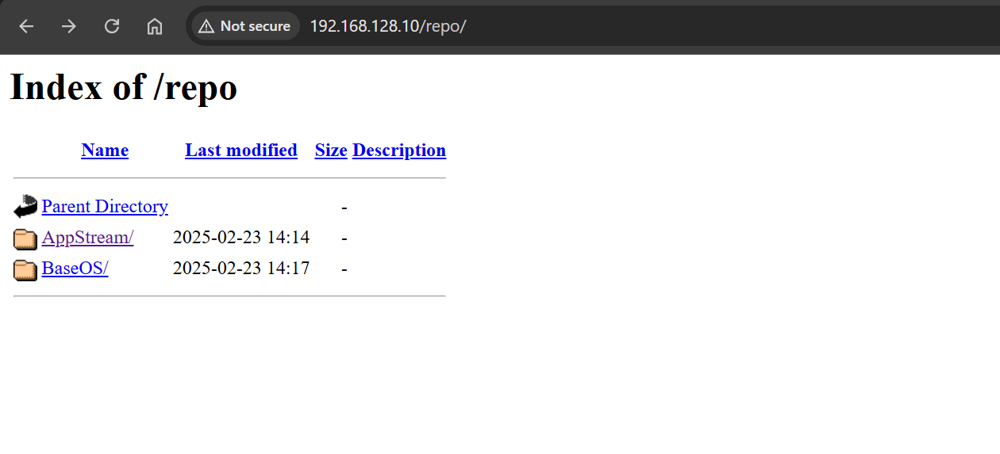

# Hands-on: Local Package Repository

[Back](../index.md)

- [Hands-on: Local Package Repository](#hands-on-local-package-repository)
  - [Install and Configure HTTP Server on Server-Host](#install-and-configure-http-server-on-server-host)
  - [Copy Packages to the Repository](#copy-packages-to-the-repository)
  - [Create YUM Repository](#create-yum-repository)
  - [Configure in Client](#configure-in-client)

---

## Install and Configure HTTP Server on Server-Host

```sh
# Install Apache (httpd)
dnf install httpd -y
systemctl enable --now httpd
systemctl status httpd

# Allow HTTP Traffic in Firewall
firewall-cmd --permanent --add-service=http
firewall-cmd --reload
firewall-cmd --list-services
# cockpit dhcpv6-client http ssh
```

---

## Copy Packages to the Repository

```sh
# Mount the RHEL 9 DVD on Server-Host
mount -o ro /dev/sr0 /mnt
df -Th /mnt
# Filesystem     Type     Size  Used Avail Use% Mounted on
# /dev/sr0       iso9660  9.9G  9.9G     0 100% /mnt

# Create a Directory for the Repository
mkdir -pv /var/www/html/repo/{BaseOS,AppStream}
# mkdir: created directory '/var/www/html/repo'
# mkdir: created directory '/var/www/html/repo/BaseOS'
# mkdir: created directory '/var/www/html/repo/AppStream'

# Copy Packages from the Mounted DVD
cp -r /mnt/BaseOS/Packages/* /var/www/html/repo/BaseOS
cp -r /mnt/AppStream/Packages/* /var/www/html/repo/AppStream
```

---

## Create YUM Repository

```sh
dnf install createrepo -y

# Generate Repository Metadata
createrepo /var/www/html/repo/BaseOS
# Directory walk started
# Directory walk done - 1156 packages
# Temporary output repo path: /var/www/html/repo/BaseOS/.repodata/
# Preparing sqlite DBs
# Pool started (with 5 workers)
# Pool finished
createrepo /var/www/html/repo/AppStream
# Directory walk started
# Directory walk done - 5657 packages
# Temporary output repo path: /var/www/html/repo/AppStream/.repodata/
# Preparing sqlite DBs
# Pool started (with 5 workers)
# Pool finished
# confirm
ls /var/www/html/repo/BaseOS/repodata/
ls /var/www/html/repo/AppStream/repodata/

# Set Correct Permissions
chmod -R 755 /var/www/html/repo/
chown -R apache:apache /var/www/html/repo/

ls -ld /var/www/html/repo
# drwxr-xr-x. 4 apache apache 37 Feb 23 14:12 /var/www/html/repo

systemctl restart httpd

# confirm locally
curl -I http://192.168.128.10/repo/
# HTTP/1.1 200 OK
# Date: Sun, 23 Feb 2025 19:20:00 GMT
# Server: Apache/2.4.62 (Red Hat Enterprise Linux)
# Content-Type: text/html;charset=ISO-8859-1
```

- confirm with browser: http://192.168.128.10/repo/



---

## Configure in Client

```sh
cat > /etc/yum.repos.d/local.repo<<EOF
[local-baseos]
name=Local BaseOS Repository
baseurl=http://192.168.128.10/repo/BaseOS
enabled=1
gpgcheck=0

[local-appstream]
name=Local AppStream Repository
baseurl=http://192.168.128.10/repo/AppStream
enabled=1
gpgcheck=0
EOF

dnf repolist
# Updating Subscription Management repositories.
# repo id                              repo name
# local-appstream                      Local AppStream Repository
# local-baseos                         Local BaseOS Repository

# confirm
dnf list available --disablerepo="*" --enablerepo="local-baseos"
dnf list available --disablerepo="*" --enablerepo="local-appstream"
```
