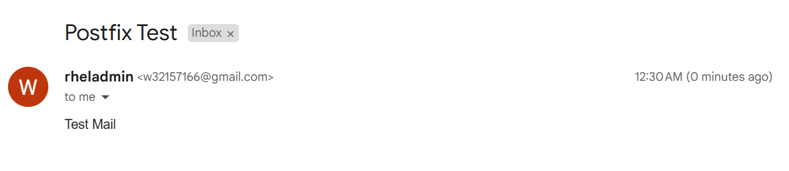

# Project - Sending Gmail using `postfix` on `Redhat8`

[Back](../../index.md)

- [Project - Sending Gmail using `postfix` on `Redhat8`](#project---sending-gmail-using-postfix-on-redhat8)
  - [Install Package](#install-package)
  - [Add Gmail Credential](#add-gmail-credential)
    - [Create Credential File](#create-credential-file)
    - [Convert the credential file into db file](#convert-the-credential-file-into-db-file)
    - [Change permission and ownership of the credential file](#change-permission-and-ownership-of-the-credential-file)
  - [`Postfix` Configuration](#postfix-configuration)
    - [Backup configuration file](#backup-configuration-file)
    - [Configure](#configure)
    - [Start `Postfix` service](#start-postfix-service)
  - [Test by sending email](#test-by-sending-email)

---

## Install Package

```sh
su - root

# install package
yum install -y postfix mailx

# # verify
rpm -qa | grep postfix
rpm -qa | grep mailx
```

---

## Add Gmail Credential

### Create Credential File

```sh
vi /etc/postfix/sasl/sasl_passwd
```

- Add credential

```conf
[smtp.gmail.com]:587 email@gmail.com:password
```

---

### Convert the credential file into db file

```sh
postmap /etc/postfix/sasl/sasl_passwd
ll /etc/postfix/sasl
# -rw-r--r--. 1 root root    58 Nov 22 00:20 sasl_passwd
# -rw-r--r--. 1 root root 12288 Nov 22 00:22 sasl_passwd.db
```

---

### Change permission and ownership of the credential file

- Change permission

```sh
# change ownership
chown root:root /etc/postfix/sasl/sasl_passwd

# limited only the root user can read and write the credential file
chmod 600 /etc/postfix/sasl/*
ll /etc/postfix/sasl/*
# -rw-------. 1 root root    58 Nov 22 00:20 /etc/postfix/sasl/sasl_passwd
# -rw-------. 1 root root 12288 Nov 22 00:22 /etc/postfix/sasl/sasl_passwd.db
```

---

## `Postfix` Configuration

### Backup configuration file

- Backup `/etc/postfix/main.cf`

```sh
cp /etc/postfix/main.cf /etc/postfix/main.cf_bkp
```

---

### Configure

```sh
vi /etc/postfix/main.cf
```

```conf
# configure relay host
relayhost = [smtp.gmail.com]:587

# configure hostname
myhostname = rhelhost.localdomain

# specify location of sasl_passwd file
smtp_sasl_password_maps = hash:/etc/postfix/sasl/sasl_passwd

# Enable SASL authentication for postfix
smtp_sasl_auth_enable = yes
smtp_tls_security_level = encrypt

# Prevent anonymous authentication
smtp_sasl_security_options = noanonymous
```

---

### Start `Postfix` service

```sh
systemctl enable postfix.service
systemctl start postfix.service
systemctl status postfix.service
```

---

## Test by sending email

- Send email

```sh
echo "Test Mail" | mail -s "Postfix Test" target@gmail
```



- Send email with attachment

```sh
# create a text file
vi /home/rheladmin/note.txt
# Hello world

echo "Test Mail" | mail -s "Postfix Test" -a /home/rheladmin/note.txt target@gmail
```

---

- Automatically send email

```sh
vi /etc/cron.hourly/auto-email

# * * * * * echo "Test Auto Email." | mail -s "Test Auto Email - $(date)" target@gmail

crontab -l /etc/cron.hourly/auto-email
```


---

[TOP](#project---sending-gmail-using-postfix-on-redhat8)
