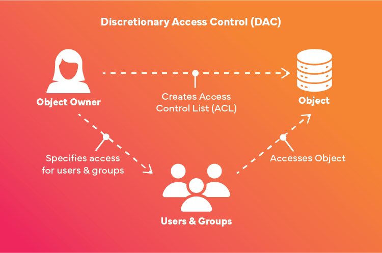
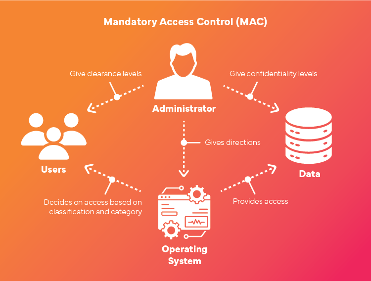

# Linux - SELinux

[Back](../../index.md)

- [Linux - SELinux](#linux---selinux)
  - [SELinux](#selinux)
    - [`Mandatory Access Control (MAC)`](#mandatory-access-control-mac)
    - [SELinux types](#selinux-types)
    - [vs `Discretionary Access Control (DAC)`](#vs-discretionary-access-control-dac)
    - [Architecture](#architecture)
  - [States and Modes](#states-and-modes)
    - [Configuration File `/etc/selinux/config`](#configuration-file-etcselinuxconfig)
    - [Common Commands](#common-commands)
    - [Lab: Change SELinux status](#lab-change-selinux-status)

---

## SELinux

- `Security Enhanced Linux (SELinux)`

  - provides an **additional layer** of system security.
  - It was originally developed by the `United States National Security Agency (NSA)` as a way to enforce the principle of `least privilege` and limit the potential damage of exploited vulnerabilities.

- **Benefits**:

  - Enhances system security **by limiting the actions** that processes can perform.
  - Protects **against privilege escalation** and exploits.
  - Helps mitigate the impact of vulnerabilities by **containing compromised processes**.

- **Challenges**:
  - Complex configuration and management.
  - May cause disruptions if improperly configured or if policies conflict with legitimate application behavior.

---

### `Mandatory Access Control (MAC)`

- `SELinux context` / `SELinux label`:

  - a **special security label** associated with every **process** and system **resource**
  - an identifier which abstracts away the system-level details and focuses on the **security properties** of the entity.
    - provide a consistent way of **referencing objects** in the `SELinux policy`
    - removes any ambiguity that can be found in other identification methods

- `SELinux policy`

  - a series of rules which use these contexts to define **how processes can interact with each other** and the various system **resources**.
  - By **default**, the policy does **not allow any interaction** unless a rule explicitly grants access.

- `Mandatory Access Control (MAC)`

  - an access policy using `SELinux context`

- `SELinux contexts` have several **fields**:
  - user,
  - role,
  - type,
  - and security level.

---

### SELinux types

- `SELinux types`
  - used by the most common policy rule to **define the allowed interactions between processes and system resources**
  - usually end with `_t`.
  - e.g.,
    - the type name for the web server: `httpd_t`
    - type context for files and directories in `/var/www/html/`: `httpd_sys_content_t`
    - type contexts for files and directories in `/tmp` and `/var/tmp/`: `tmp_t`
    - type context for web server **ports**: `http_port_t`
  - e.g., a policy has
    - a rule that permits Apache (the **web server process** running as `httpd_t`) to access **files and directories** with a context normally found in `/var/www/html/` and other web server directories (`httpd_sys_content_t`).
    - **no allow rule** in the policy for files normally found in `/tmp` and `/var/tmp/`, so access is **not permitted**.
    - With SELinux, even if Apache is **compromised**, and a malicious script gains access, it is still **not able to** access the `/tmp` directory.


---

### vs `Discretionary Access Control (DAC)`

- `Discretionary Access Control (DAC)`
  - The **standard access policy** based on the **user**, **group**, and other **permissions**
  - does not enable system administrators to create comprehensive and fine-grained security policies
    - e.g., restricting specific applications to only viewing log files, while allowing other applications to append new data to the log files
  - **Users** have more control over their data, and can grant permissions to others.
  - **resource owners** can grant permissions at their own discretion.
  - traditional, flexible, and scalable
    - can be vulnerable to security **risks**
  - typical command `chmod`



---

- `Mandatory Access Control (MAC)`
  - A system enforces strict **policies that restrict access** based on the sensitivity of the data and the user's clearance.
  - **administrators** control access based on predefined security labels.
    - **access** is determined by a single individual based on **predetermined rules**
  - SELinux enforces **system-wide policies** that cannot be altered by individual users.
  - more **secure** than DAC, but can be **time-consuming to implement**.



---

### Architecture

- `SELinux` is a `Linux Security Module (LSM)` that is built into the Linux kernel.
- The **SELinux subsystem** in the kernel is driven by **a security policy** which is controlled by the administrator and loaded at boot.
- All security-relevant, kernel-level access operations on the system are **intercepted** by SELinux and examined in the **context** of the loaded security policy.

  - If the loaded policy **allows** the operation, it continues.
  - Otherwise, the operation is **blocked** and the process receives an error.

- `Access Vector Cache (AVC)`
  - the cached SELinux decisions, such as allowing or disallowing access
  - When using these cached decisions, SELinux policy rules need to be **checked less**, which increases performance.
  - Remember that SELinux policy rules have **no effect** if `DAC` rules **deny** access first.

---

## States and Modes

- SELinux can operate in three modes:
  - `Enforcing`
    - **default**, recommended
    - Policies are **enforced**, and access violations are **blocked** and **logged**.
    - enforcing the loaded security policy on the entire system
  - `Permissive`:
    - Policies are **not enforced**, but **violations are logged**.
    - not actually deny any operations
    - not recommended for production systems
    - Useful for debugging and testing policies.
  - `Disabled`:
    - SELinux is **turned off**, and **no** policies are **enforced** or **logged**.
    - enforcing the SELinux policy: avoid
    - labeling any persistent objects: avoids
      - such as labeling files, making it difficult to enable SELinux in the future.
    - strongly discouraged

---

### Configuration File `/etc/selinux/config`

- Persist the configuration for reboot.
- Path: `/etc/selinux/config`
- Parameter:
  - `SELINUX=enforcing`
  - `SELINUX=permissive`
  - `SELINUX=disabled`
- Best practise:

  - create **snapshot** of VM before modifying config file

- CF:
  - By default: SELinux mode is `enforcing`

```sh
# This file controls the state of SELinux on the system.
# SELINUX= can take one of these three values:
#     enforcing - SELinux security policy is enforced.
#     permissive - SELinux prints warnings instead of enforcing.
#     disabled - No SELinux policy is loaded.
SELINUX=enforcing
# SELINUXTYPE= can take one of these three values:
#     targeted - Targeted processes are protected,
#     minimum - Modification of targeted policy. Only selected processes are protected.
#     mls - Multi Level Security protection.
SELINUXTYPE=targeted
```

---

### Common Commands

| CMD                                   | DESC                                    |
| ------------------------------------- | --------------------------------------- |
| `sestatus`/`getenforce`               | Check SELinux Status                    |
| `setenforce enforcing`/`setenforce 1` | Temporarily Enable enforcing SELinux    |
| `setenforce permissive`               | Temporarily set Permissive SELinux Mode |
| `setenforce 0`                        | Temporarily set Permissive SELinux Mode |
| `semanage permissive -a httpd_t`      | Make the httpd_t domain permissive      |

- Change SELinux Mode Persistently
  - `/etc/selinux/config`
  - `SELINUX=enforcing`

---

### Lab: Change SELinux status

```sh
# Check the SELinux status
sestatus
# SELinux status:                 enabled
# SELinuxfs mount:                /sys/fs/selinux
# SELinux root directory:         /etc/selinux
# Loaded policy name:             targeted
# Current mode:                   enforcing
# Mode from config file:          enforcing
# Policy MLS status:              enabled
# Policy deny_unknown status:     allowed
# Memory protection checking:     actual (secure)
# Max kernel policy version:      33

# Check if SELinux enforce
getenforce
# Enforcing
```

- Disable SELinux permanently

```sh
# backup cf before editing
cp /etc/selinux/config /etc/selinux/config.bak

# get cf
cat /etc/selinux/config
# # This file controls the state of SELinux on the system.
# # SELINUX= can take one of these three values:
# #     enforcing - SELinux security policy is enforced.
# #     permissive - SELinux prints warnings instead of enforcing.
# #     disabled - No SELinux policy is loaded.
# SELINUX=enforcing
# # SELINUXTYPE= can take one of these three values:
# #     targeted - Targeted processes are protected,
# #     minimum - Modification of targeted policy. Only selected processes are protected.
# #     mls - Multi Level Security protection.
# SELINUXTYPE=targeted

# edit cf
vi /etc/selinux/config
# SELINUX=disabled

# confirm
cat /etc/selinux/config | grep SELINUX=
# SELINUX=disabled
sestatus
# SELinux status:                 enabled
# SELinuxfs mount:                /sys/fs/selinux
# SELinux root directory:         /etc/selinux
# Loaded policy name:             targeted
# Current mode:                   enforcing
# Mode from config file:          disabled
# Policy MLS status:              enabled
# Policy deny_unknown status:     allowed
# Memory protection checking:     actual (secure)
# Max kernel policy version:      33


# restart
reboot
sestatus
# SELinux status:                 disabled
getenforce
# Disabled
```

---
