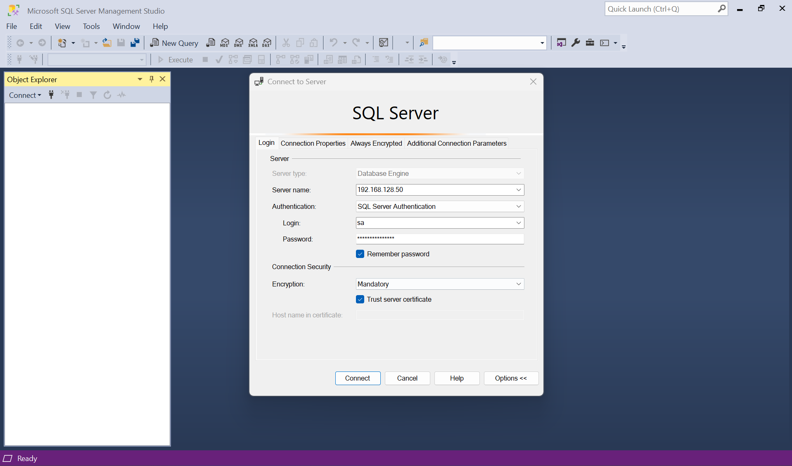
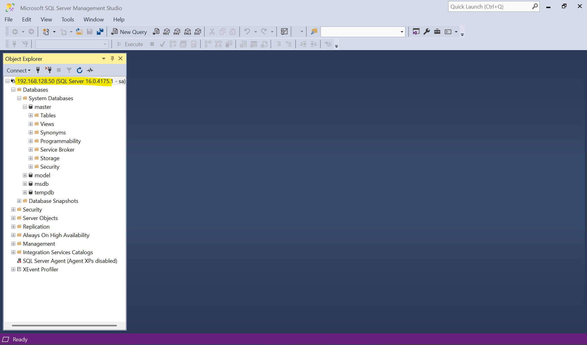

# Install SQL Server in OEL 8.10

[Back](../../index.md)

- [Install SQL Server in OEL 8.10](#install-sql-server-in-oel-810)
  - [Configure Network](#configure-network)
  - [Install SQL Server](#install-sql-server)
  - [Install the SQL Server command-line tools](#install-the-sql-server-command-line-tools)
  - [SSMS login](#ssms-login)

---

## Configure Network

```sh
# Configure Server Network
nmcli c down ens160
nmcli c modify ens160 ipv4.addresses 192.168.128.50/24
nmcli c modify ens160 ipv4.dns 192.168.128.2
nmcli c modify ens160 ipv4.gateway 192.168.128.2
nmcli c modify ens160 ipv4.method manual
nmcli c modify ens160 connection.autoconnect yes
nmcli c up ens160

hostnamectl set-hostname Argus-HomeLab
echo "192.168.128.50 Argus-HomeLab" >> /etc/hosts

dnf upgrade -y
```

## Install SQL Server

```sh
# Download the SQL Server 2022 (16.x) Red Hat 8 repository configuration file:
curl -o /etc/yum.repos.d/mssql-server.repo https://packages.microsoft.com/config/rhel/8/mssql-server-2022.repo

# Run the following command to install SQL Server:
yum install -y mssql-server

#  follow the prompts to set the sa password and choose your edition
/opt/mssql/bin/mssql-conf setup
# ...
# Enter the SQL Server system administrator password:
# Confirm the SQL Server system administrator password:
# Configuring SQL Server...

# ForceFlush is enabled for this instance.
# ForceFlush feature is enabled for log durability.
# Created symlink /etc/systemd/system/multi-user.target.wants/mssql-server.service → /usr/lib/systemd/system/mssql-server.service.
# Setup has completed successfully. SQL Server is now starting.

systemctl status mssql-server
# ● mssql-server.service - Microsoft SQL Server Database Engine
#    Loaded: loaded (/usr/lib/systemd/system/mssql-server.service; enabled; vendor preset: disabled)
#    Active: active (running) since Sat 2025-03-01 21:25:48 EST; 29s ago
#      Docs: https://docs.microsoft.com/en-us/sql/linux
#  Main PID: 10076 (sqlservr)
#     Tasks: 172
#    Memory: 863.1M
#    CGroup: /system.slice/mssql-server.service
#            ├─10076 /opt/mssql/bin/sqlservr
#            └─10108 /opt/mssql/bin/sqlservr

# Mar 01 21:25:51 Argus-HomeLab sqlservr[10108]: [64B blob data]
# Mar 01 21:25:51 Argus-HomeLab sqlservr[10108]: [158B blob data]
# Mar 01 21:25:51 Argus-HomeLab sqlservr[10108]: [155B blob data]
# Mar 01 21:25:51 Argus-HomeLab sqlservr[10108]: [193B blob data]
# Mar 01 21:25:51 Argus-HomeLab sqlservr[10108]: [66B blob data]
# Mar 01 21:25:51 Argus-HomeLab sqlservr[10108]: [75B blob data]
# Mar 01 21:25:51 Argus-HomeLab sqlservr[10108]: [96B blob data]
# Mar 01 21:25:51 Argus-HomeLab sqlservr[10108]: [100B blob data]
# Mar 01 21:25:51 Argus-HomeLab sqlservr[10108]: [71B blob data]
# Mar 01 21:25:51 Argus-HomeLab sqlservr[10108]: [124B blob data]

# open the SQL Server port
firewall-cmd --zone=public --add-port=1433/tcp --permanent
firewall-cmd --reload
```

---

## Install the SQL Server command-line tools

```sh
# Download the Microsoft Red Hat repository configuration fil
curl https://packages.microsoft.com/config/rhel/9/prod.repo | sudo tee /etc/yum.repos.d/mssql-release.repo

# install mssql-tools18 with the unixODBC developer package.
yum install -y mssql-tools18 unixODBC-devel

#  make sqlcmd and bcp accessible from the bash shell for login sessions
# modify your PATH in the ~/.bash_profile file with the following command:
echo 'export PATH="$PATH:/opt/mssql-tools18/bin"' >> ~/.bash_profile
source ~/.bash_profile
```

- Connect locally

```sh
sqlcmd -S localhost -U sa -C
Password:
# 1> select name from master.sys.databases
# 2> go
# name
# --------------------------------------------------------------------------------------------------------------------------------
# master
# tempdb
# model
# msdb
```

---

## SSMS login




