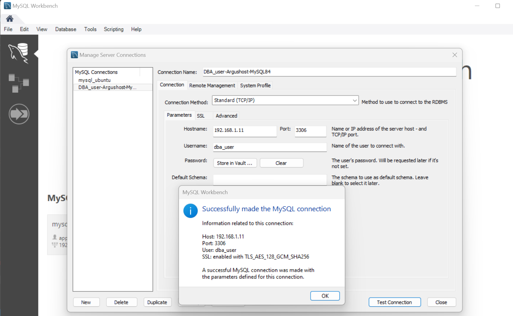
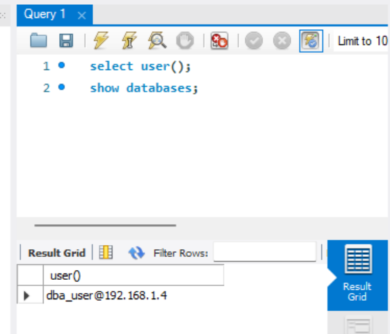

# Server - Database: `mysql` on `Oracle Linux 8`

[Back](../../index.md)

- [Server - Database: `mysql` on `Oracle Linux 8`](#server---database-mysql-on-oracle-linux-8)
  - [Install MySQL Package](#install-mysql-package)
    - [Adding the MySQL Yum Repository](#adding-the-mysql-yum-repository)
    - [Disabling the Default MySQL Module](#disabling-the-default-mysql-module)
    - [Installing MySQL](#installing-mysql)
  - [Starting the MySQL Server](#starting-the-mysql-server)
    - [Starting MySQL Service](#starting-mysql-service)
    - [The initial start up of the server](#the-initial-start-up-of-the-server)
  - [Configure Firewall for MySQL](#configure-firewall-for-mysql)
  - [Access MySQL via Workbench](#access-mysql-via-workbench)

---

- ref:
  - https://dev.mysql.com/doc/refman/8.4/en/linux-installation-yum-repo.html

## Install MySQL Package

- Get the OS information

```sh
cat /etc/redhat-release; cat /etc/oracle-release
# Red Hat Enterprise Linux release 8.10 (Ootpa)
# Oracle Linux Server release 8.10
```

---

### Adding the MySQL Yum Repository

```sh
# download mysql 84
wget https://dev.mysql.com/get/mysql84-community-release-el8-1.noarch.rpm
# --2025-01-05 20:06:19--  https://dev.mysql.com/get/mysql84-community-release-el8-1.noarch.rpm
# Resolving dev.mysql.com (dev.mysql.com)... 23.10.170.232, 2001:4958:304:293::2e31, 2001:4958:304:2a0::2e31
# Connecting to dev.mysql.com (dev.mysql.com)|23.10.170.232|:443... connected.
# HTTP request sent, awaiting response... 302 Moved Temporarily
# Location: https://repo.mysql.com//mysql84-community-release-el8-1.noarch.rpm [following]
# --2025-01-05 20:06:19--  https://repo.mysql.com//mysql84-community-release-el8-1.noarch.rpm
# Resolving repo.mysql.com (repo.mysql.com)... 184.31.29.212, 2001:4958:304:1a1::1d68, 2001:4958:304:196::1d68, ...
# Connecting to repo.mysql.com (repo.mysql.com)|184.31.29.212|:443... connected.
# HTTP request sent, awaiting response... 200 OK
# Length: 15364 (15K) [application/x-redhat-package-manager]
# Saving to: ‘mysql84-community-release-el8-1.noarch.rpm’

# mysql84-community-releas 100%[================================>]  15.00K  --.-KB/s    in 0s

# 2025-01-05 20:06:20 (190 MB/s) - ‘mysql84-community-release-el8-1.noarch.rpm’ saved [15364/15364]


# Install the downloaded RPM
yum localinstall -y mysql84-community-release-el8-1.noarch.rpm
# Last metadata expiration check: 0:14:39 ago on Sun 05 Jan 2025 07:52:55 PM EST.
# Dependencies resolved.
# ==================================================================================================
#  Package                            Architecture    Version           Repository             Size
# ==================================================================================================
# Installing:
#  mysql84-community-release          noarch          el8-1             @commandline           15 k

# Transaction Summary
# ==================================================================================================
# Install  1 Package

# Total size: 15 k
# Installed size: 17 k
# Downloading Packages:
# Running transaction check
# Transaction check succeeded.
# Running transaction test
# Transaction test succeeded.
# Running transaction
#   Preparing        :                                                                          1/1
#   Installing       : mysql84-community-release-el8-1.noarch                                   1/1
#   Running scriptlet: mysql84-community-release-el8-1.noarch                                   1/1
#    Warning: native mysql package from platform vendor seems to be enabled.
#     Please consider to disable this before installing packages from repo.mysql.com.
#     Run: yum module -y disable mysql

#   Verifying        : mysql84-community-release-el8-1.noarch                                   1/1

# Installed:
#   mysql84-community-release-el8-1.noarch

# Complete!


# check that the MySQL Yum repository has been successfully added
sudo yum repolist enabled | grep mysql.*-community
# mysql-8.4-lts-community       MySQL 8.4 LTS Community Server
# mysql-connectors-community    MySQL Connectors Community
# mysql-tools-8.4-lts-community MySQL Tools 8.4 LTS Community
```

---

### Disabling the Default MySQL Module

```sh
sudo yum module disable -y mysql
# MySQL 8.4 LTS Community Server                                    1.5 MB/s | 634 kB     00:00
# MySQL Connectors Community                                        456 kB/s | 143 kB     00:00
# MySQL Tools 8.4 LTS Community                                     834 kB/s | 296 kB     00:00
# Dependencies resolved.
# ==================================================================================================
#  Package                Architecture          Version                Repository              Size
# ==================================================================================================
# Disabling modules:
#  mysql

# Transaction Summary
# ==================================================================================================
# Complete!
```

---

### Installing MySQL

```sh
# installs the package for MySQL server
sudo yum install -y mysql-community-server
```

---

## Starting the MySQL Server

### Starting MySQL Service

```sh
sudo systemctl start mysqld
sudo systemctl enable mysqld
sudo systemctl status mysqld
# ● mysqld.service - MySQL Server
#    Loaded: loaded (/usr/lib/systemd/system/mysqld.service; enabled; vendor preset: disabled)
#    Active: active (running) since Sun 2025-01-05 20:17:20 EST; 10s ago
#      Docs: man:mysqld(8)
#            http://dev.mysql.com/doc/refman/en/using-systemd.html
#   Process: 28118 ExecStartPre=/usr/bin/mysqld_pre_systemd (code=exited, status=0/SUCCESS)
#  Main PID: 28265 (mysqld)
#    Status: "Server is operational"
#     Tasks: 35 (limit: 48017)
#    Memory: 479.9M
#    CGroup: /system.slice/mysqld.service
#            └─28265 /usr/sbin/mysqld

# Jan 05 20:16:41 argushost systemd[1]: Starting MySQL Server...
# Jan 05 20:17:20 argushost systemd[1]: Started MySQL Server.
```

---

### The initial start up of the server

```sh
# view the log of initial start up of the server
sudo cat /var/log/mysqld.log
# 2025-01-06T01:17:01.753172Z 6 [Note] [MY-010454] [Server] A temporary password is generated for root@localhost: dj_eTjDfa8cl
# 2025-01-06T01:17:14.992717Z 0 [System] [MY-015018] [Server] MySQL Server Initialization - end.
# 2025-01-06T01:17:15.050241Z 0 [System] [MY-015015] [Server] MySQL Server - start.
# 2025-01-06T01:17:15.316359Z 0 [System] [MY-010116] [Server] /usr/sbin/mysqld (mysqld 8.4.3) starting as process 28265
# 2025-01-06T01:17:15.337645Z 1 [System] [MY-013576] [InnoDB] InnoDB initialization has started.
# 2025-01-06T01:17:19.055290Z 1 [System] [MY-013577] [InnoDB] InnoDB initialization has ended.
# 2025-01-06T01:17:20.398487Z 0 [Warning] [MY-010068] [Server] CA certificate ca.pem is self signed.
# 2025-01-06T01:17:20.398541Z 0 [System] [MY-013602] [Server] Channel mysql_main configured to support TLS. Encrypted connections are now supported for this channel.
# 2025-01-06T01:17:20.546051Z 0 [System] [MY-011323] [Server] X Plugin ready for connections. Bind-address: '::' port: 33060, socket: /var/run/mysqld/mysqlx.sock
# 2025-01-06T01:17:20.546127Z 0 [System] [MY-010931] [Server] /usr/sbin/mysqld: ready for connections. Version: '8.4.3'  socket: '/var/lib/mysql/mysql.sock'  port: 3306  MySQL Community Server - GPL.
# [sfong@argushost ~]$ sudo cat /var/log/mysqld.log
# 2025-01-06T01:16:48.156864Z 0 [System] [MY-015017] [Server] MySQL Server Initialization - start.
# 2025-01-06T01:16:48.159306Z 0 [System] [MY-013169] [Server] /usr/sbin/mysqld (mysqld 8.4.3) initializing of server in progress as process 28149
# 2025-01-06T01:16:48.234190Z 1 [System] [MY-013576] [InnoDB] InnoDB initialization has started.
# 2025-01-06T01:16:51.700366Z 1 [System] [MY-013577] [InnoDB] InnoDB initialization has ended.
# 2025-01-06T01:17:01.753172Z 6 [Note] [MY-010454] [Server] A temporary password is generated for root@localhost: dj_eTjDfa8cl
# 2025-01-06T01:17:14.992717Z 0 [System] [MY-015018] [Server] MySQL Server Initialization - end.
# 2025-01-06T01:17:15.050241Z 0 [System] [MY-015015] [Server] MySQL Server - start.
# 2025-01-06T01:17:15.316359Z 0 [System] [MY-010116] [Server] /usr/sbin/mysqld (mysqld 8.4.3) starting as process 28265
# 2025-01-06T01:17:15.337645Z 1 [System] [MY-013576] [InnoDB] InnoDB initialization has started.
# 2025-01-06T01:17:19.055290Z 1 [System] [MY-013577] [InnoDB] InnoDB initialization has ended.
# 2025-01-06T01:17:20.398487Z 0 [Warning] [MY-010068] [Server] CA certificate ca.pem is self signed.
# 2025-01-06T01:17:20.398541Z 0 [System] [MY-013602] [Server] Channel mysql_main configured to support TLS. Encrypted connections are now supported for this channel.
# 2025-01-06T01:17:20.546051Z 0 [System] [MY-011323] [Server] X Plugin ready for connections. Bind-address: '::' port: 33060, socket: /var/run/mysqld/mysqlx.sock
# 2025-01-06T01:17:20.546127Z 0 [System] [MY-010931] [Server] /usr/sbin/mysqld: ready for connections. Version: '8.4.3'  socket: '/var/lib/mysql/mysql.sock'  port: 3306  MySQL Community Server - GPL.
```

- Get temporary password

```sh
sudo grep 'temporary password' /var/log/mysqld.log
# 2025-01-06T01:17:01.753172Z 6 [Note] [MY-010454] [Server] A temporary password is generated for root@localhost: dj_eTjDfa8cl
```

- Login mysql

```sh
# get mysql version
mysql --version
# mysql  Ver 8.4.3 for Linux on x86_64 (MySQL Community Server - GPL)

# Log in to the MySQL shell as the root user using the temp pwd
mysql -u root -p

# You must reset your password using ALTER USER statement
ALTER USER 'root'@'localhost' IDENTIFIED BY 'MyNewPass';
FLUSH PRIVILEGES;
exit
```

- Create DBA user

```sh
# Create admin user account
# create user for network access for all users
CREATE USER 'dba_user'@'%' IDENTIFIED BY 'DbaPass';
# Grant PRIVILEGES to admin user
GRANT ALL PRIVILEGES ON *.* TO 'dba_user'@'%';
# list user GRANTS
SHOW GRANTS FOR 'dba_user'@'%';
# Reload all the privileges
FLUSH PRIVILEGES;

exit
```

---

## Configure Firewall for MySQL

```sh
sudo firewall-cmd --state
# running
sudo firewall-cmd --add-service=mysql --permanent
# success
sudo firewall-cmd --reload
# success
sudo firewall-cmd --list-all
```

---

## Access MySQL via Workbench




