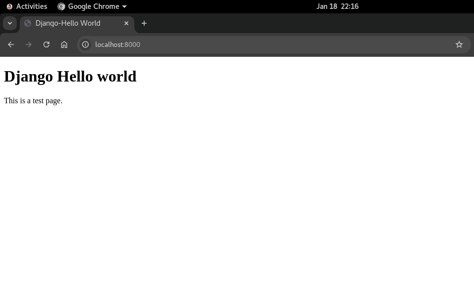
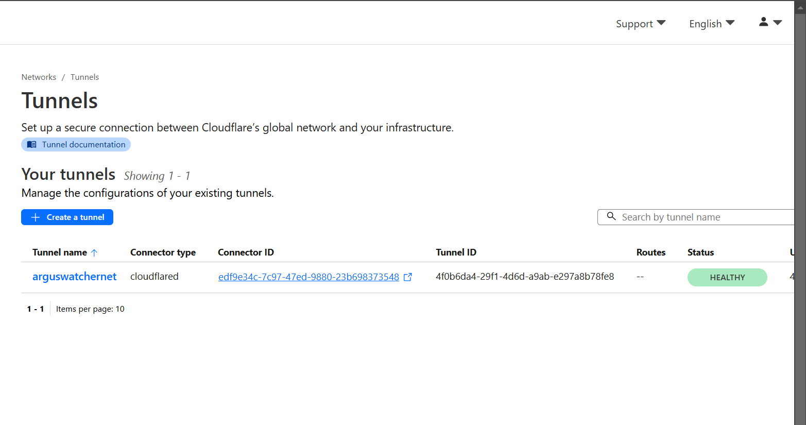

# Web Application - Django-Nginx-Gunicorn-OL8

[Back](../../index.md)

- [Web Application - Django-Nginx-Gunicorn-OL8](#web-application---django-nginx-gunicorn-ol8)
  - [System Version](#system-version)
  - [Create Django Project](#create-django-project)
  - [Configure Gunicorn](#configure-gunicorn)
  - [Configure Nginx](#configure-nginx)
  - [Troubleshot SELinux](#troubleshot-selinux)
  - [Setup Cloudflare Tunnel](#setup-cloudflare-tunnel)

---

## System Version

```sh
cat oracle-release
# Oracle Linux Server release 8.10
```

---

## Create Django Project

- For security, create a user dedicated to the django project

```sh
useradd django_demo_admin
passwd django_demo_admin
```

- Create hello world Django project

```sh
mkdir -p /home/django_demo_admin/app

# create venv
python3 -m venv /home/django_demo_admin/app/.env
source /home/django_demo_admin/app/.env/bin/activate

# install django
pip install django
# create django project
django-admin startproject hello_world /home/django_demo_admin/app/
# test
python3 /home/django_demo_admin/app//manage.py runserver 8000
```

- Update view

```sh
cat > /home/django_demo_admin/app/hello_world/views.py <<EOF
from django.views.generic.base import TemplateView

# View of home page
class HomeView(TemplateView):
    template_name = "index.html"     # the template of this view
    extra_context = {'title': "Django-Hello World"}    # the title of HTML
EOF
```

- Update URLs

```sh
cat > /home/django_demo_admin/app/hello_world/urls.py <<EOF
from django.contrib import admin
from django.urls import path
from .views import HomeView

urlpatterns = [
    path('', HomeView.as_view(), name="home"),    # Define home url
    path('admin/', admin.site.urls),     # define admin url
]
EOF
```

- Create html

```sh
mkdir -p /home/django_demo_admin/app/templates
cat > /home/django_demo_admin/app/templates/index.html <<EOF
<!DOCTYPE html>
<html>
<head>
<title>{{title}}</title>
</head>
<body>

<h1>Django Hello world</h1>
<p>This is a test page.</p>

</body>
</html>
EOF
```

- update configure for template

```sh
mkdir -p /home/django_demo_admin/app/static/

vi /home/django_demo_admin/app/hello_world/settings.py
# TEMPLATES = [
#     {
#         'BACKEND': 'django.template.backends.django.DjangoTemplates',
#         'DIRS': [Path(BASE_DIR, 'templates'),],    # define project level template
#         'APP_DIRS': True,  # By default, templates are manged at App Level
#     },
# # ...
# ]

# # Static files (CSS, JavaScript, images)
# # URL referring to static files
# STATIC_URL = '/static/'
# # project level static
# STATICFILES_DIRS = [BASE_DIR / 'static', ]
# # absolute path to the directory for deployment
# STATIC_ROOT = Path(BASE_DIR, 'collectstatic')

# ALLOWED_HOSTS = ['<server-ip>', 'localhost']
```

- Collect static files

```sh
python3 /home/django_demo_admin/app/manage.py collectstatic
# 128 static files copied to '/home/django_demo_admin/app/collectstatic'.
```

- Test locally

```sh
python3 /home/django_demo_admin/app/manage.py runserver 8000
```



- Database Migration

```sh
python3 /home/django_demo_admin/app/manage.py makemigrations
python3 /home/django_demo_admin/app/manage.py migrate
```

- Create super user

```sh
python3 /home/django_demo_admin/app/manage.py createsuperuser
```

- Change ownership of the project dir

```sh
chown django_demo_admin:django_demo_admin -R /home/django_demo_admin/app
```

---

## Configure Gunicorn

```sh
# Activate virtual env
source /home/django_demo_admin/app/.env/bin/activate
# install gunicorn package
pip install gunicorn

# test
# move to manage.py dir
cd /home/django_demo_admin/app
# Access the server at http://<server-ip>:8000. If it works, proceed to create a Gunicorn systemd service.
gunicorn --bind 0.0.0.0:8000 hello_world.wsgi
# [2025-01-18 22:29:28 -0500] [823442] [INFO] Starting gunicorn 21.2.0
# [2025-01-18 22:29:28 -0500] [823442] [INFO] Listening at: http://0.0.0.0:8000 (823442)
# [2025-01-18 22:29:28 -0500] [823442] [INFO] Using worker: sync
# [2025-01-18 22:29:28 -0500] [823445] [INFO] Booting worker with pid: 823445
```

- Create gunicorn server cf

```sh
# Create a Gunicorn service file
cat > /etc/systemd/system/gunicorn.service << EOF
[Unit]
Description=gunicorn daemon for Django Hello World
After=network.target

[Service]
User=django_demo_admin
Group=django_demo_admin
WorkingDirectory=/home/django_demo_admin/app/
ExecStart=/home/django_demo_admin/app/.env/bin/gunicorn \
  --workers 3 \
  --bind unix:/home/django_demo_admin/app/hello_world.sock hello_world.wsgi

[Install]
WantedBy=multi-user.target
EOF
```

- Reload systemd, start, and enable Gunicorn:

```sh
systemctl daemon-reload
systemctl start gunicorn
systemctl enable gunicorn
systemctl status gunicorn
```

---

## Configure Nginx

```sh
dnf upgrade -y
dnf install nginx

systemctl enable --now nginx
systemctl status nginx
```

---

```sh
cat > /etc/nginx/conf.d/django_hello_world.conf <<EOF
server {
    listen 80;
    server_name localhost 192.168.1.11;

    location = /favicon.ico { access_log off; log_not_found off; }
    location /static/ {
        root /home/django_demo_admin/app/collectstatic/;
    }

    location / {
        # include proxy_params;
        # proxy_pass      http://${APP_HOST}:${APP_PORT};
        proxy_pass http://unix:/home/django_demo_admin/app/hello_world.sock;
    }
}
EOF

# test syntax
nginx -t
# nginx: the configuration file /etc/nginx/nginx.conf syntax is ok
# nginx: configuration file /etc/nginx/nginx.conf test is successful

systemctl restart nginx
systemctl status nginx
# ● nginx.service - The nginx HTTP and reverse proxy server
#    Loaded: loaded (/usr/lib/systemd/system/nginx.service; disabled; vendor preset: disabled)
#    Active: active (running) since Sat 2025-01-18 22:51:56 EST; 5s ago
#   Process: 7230 ExecStart=/usr/sbin/nginx (code=exited, status=0/SUCCESS)
#   Process: 7228 ExecStartPre=/usr/sbin/nginx -t (code=exited, status=0/SUCCESS)
#   Process: 7226 ExecStartPre=/usr/bin/rm -f /run/nginx.pid (code=exited, status=0/SUCCESS)
#  Main PID: 7231 (nginx)
#     Tasks: 5 (limit: 48017)
#    Memory: 4.9M
#    CGroup: /system.slice/nginx.service
#            ├─7231 nginx: master process /usr/sbin/nginx
#            ├─7232 nginx: worker process
#            ├─7233 nginx: worker process
#            ├─7234 nginx: worker process
#            └─7235 nginx: worker process

# Jan 18 22:51:56 argushost systemd[1]: Starting The nginx HTTP and reverse proxy server...
# Jan 18 22:51:56 argushost nginx[7228]: nginx: the configuration file /etc/nginx/nginx.conf syntax>
# Jan 18 22:51:56 argushost nginx[7228]: nginx: configuration file /etc/nginx/nginx.conf test is su>
# Jan 18 22:51:56 argushost systemd[1]: Started The nginx HTTP and reverse proxy server.
```

---

## Troubleshot SELinux

- When restarting gunicorn or nginx

```sh
# if nginx is not permitted, update the SELinux context.
semanage fcontext -a -t httpd_sys_content_t "/home/django_demo_admin/app(/.*)?"
restorecon -Rv /home/django_demo_admin/app

systemctl restart nginx
systemctl status nginx

# if the gunicorn restart fails
# locat cause
grep "denied" /var/log/audit/audit.log
# type=AVC msg=audit(1737259737.848:563): avc:  denied  { execute } for  pid=8796 comm="(gunicorn)" name="gunicorn" dev="dm-2" ino=537810513 scontext=system_u:system_r:init_t:s0 tcontext=unconfined_u:object_r:httpd_sys_content_t:s0 tclass=file permissive=0

# Generate Human-Readable Explanations
grep denied /var/log/audit/audit.log | audit2why
# type=AVC msg=audit(1737259281.678:445): avc:  denied  { execute } for  pid=8194 comm="(gunicorn)" name="gunicorn" dev="dm-2" ino=537810513 scontext=system_u:system_r:init_t:s0 tcontext=unconfined_u:object_r:httpd_sys_content_t:s0 tclass=file permissive=0

#         Was caused by:
#                 Unknown - would be allowed by active policy
#                 Possible mismatch between this policy and the one under which the audit message was generated.

#                 Possible mismatch between current in-memory boolean settings vs. permanent ones.

# type=AVC msg=audit(1737259737.848:563): avc:  denied  { execute } for  pid=8796 comm="(gunicorn)" name="gunicorn" dev="dm-2" ino=537810513 scontext=system_u:system_r:init_t:s0 tcontext=unconfined_u:object_r:httpd_sys_content_t:s0 tclass=file permissive=0

#         Was caused by:
#                 Unknown - would be allowed by active policy
#                 Possible mismatch between this policy and the one under which the audit message was generated.

#                 Possible mismatch between current in-memory boolean settings vs. permanent ones.

#  View Troubleshooting Suggestions
sealert -a /var/log/audit/audit.log
# ausearch -c 'gunicorn' --raw | audit2allow -M my-gunicorn
# semodule -X 300 -i my-gunicorn.pp

# restart
systemctl restart gunicorn
systemctl status nginxgunicorn
# ● gunicorn.service - gunicorn daemon for Django Hello World
#    Loaded: loaded (/etc/systemd/system/gunicorn.service; enabled; vendor preset: disabled)
#    Active: active (running) since Sat 2025-01-18 23:33:15 EST; 9s ago
#  Main PID: 10960 (gunicorn)
#     Tasks: 4 (limit: 48017)
#    Memory: 89.6M
#    CGroup: /system.slice/gunicorn.service
#            ├─10960 /home/django_demo_admin/app/.env/bin/python3 /home/django_demo_admin/app/.env/>
#            ├─10963 /home/django_demo_admin/app/.env/bin/python3 /home/django_demo_admin/app/.env/>
#            ├─10964 /home/django_demo_admin/app/.env/bin/python3 /home/django_demo_admin/app/.env/>
#            └─10967 /home/django_demo_admin/app/.env/bin/python3 /home/django_demo_admin/app/.env/>
# Jan 18 23:33:15 argushost systemd[1]: Started gunicorn daemon for Django Hello World.
# Jan 18 23:33:15 argushost gunicorn[10960]: [2025-01-18 23:33:15 -0500] [10960] [INFO] Starting gu>
# Jan 18 23:33:15 argushost gunicorn[10960]: [2025-01-18 23:33:15 -0500] [10960] [INFO] Listening a>
# Jan 18 23:33:15 argushost gunicorn[10960]: [2025-01-18 23:33:15 -0500] [10960] [INFO] Using worke>
# Jan 18 23:33:15 argushost gunicorn[10963]: [2025-01-18 23:33:15 -0500] [10963] [INFO] Booting wor>
# Jan 18 23:33:15 argushost gunicorn[10964]: [2025-01-18 23:33:15 -0500] [10964] [INFO] Booting wor>
```

- Test


---

## Setup Cloudflare Tunnel

- Create Tunnel



- install package


```sh
# install
curl -L --output cloudflared.rpm https://github.com/cloudflare/cloudflared/releases/latest/download/cloudflared-linux-x86_64.rpm &&

sudo yum localinstall -y cloudflared.rpm &&

sudo cloudflared service install <hash_code>

# confirm
systemctl status cloudflared
# ● cloudflared.service - cloudflared
#    Loaded: loaded (/etc/systemd/system/cloudflared.service; enabled; vendor preset: disabled)
#    Active: active (running) since Sat 2025-01-18 22:48:53 EST; 51min ago
#  Main PID: 1526 (cloudflared)
#     Tasks: 10 (limit: 48017)
#    Memory: 52.1M
#    CGroup: /system.slice/cloudflared.service
#            └─1526 /usr/bin/cloudflared --no-autoupdate tunnel run --token eyJhIjoiMTIyNGM4ZWQwNWR>

# Jan 18 22:48:53 argushost cloudflared[1526]: 2025-01-19T03:48:53Z INF ICMP proxy will use fe80::5>
# Jan 18 22:48:53 argushost cloudflared[1526]: 2025-01-19T03:48:53Z INF ICMP proxy will use 192.168>
# Jan 18 22:48:53 argushost cloudflared[1526]: 2025-01-19T03:48:53Z INF ICMP proxy will use fe80::5>
# Jan 18 22:48:53 argushost cloudflared[1526]: 2025-01-19T03:48:53Z INF Starting metrics server on >
# Jan 18 22:48:53 argushost cloudflared[1526]: 2025-01-19T03:48:53Z INF Registered tunnel connectio>
# Jan 18 22:48:53 argushost systemd[1]: Started cloudflared.
# Jan 18 22:48:53 argushost cloudflared[1526]: 2025-01-19T03:48:53Z INF Registered tunnel connectio>
# Jan 18 22:48:54 argushost cloudflared[1526]: 2025-01-19T03:48:54Z INF Updated to new configuratio>
# Jan 18 22:48:54 argushost cloudflared[1526]: 2025-01-19T03:48:54Z INF Registered tunnel connectio>
# Jan 18 22:48:55 argushost cloudflared[1526]: 2025-01-19T03:48:55Z INF Registered tunnel connectio>
```

- Create public subdomain


- Test


---

[TOP](#web-application---django-nginx-gunicorn-ol8)
