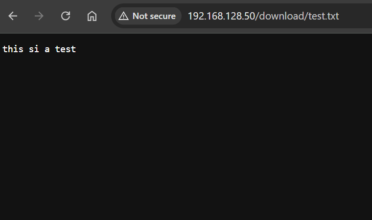

# File Download: Nginx + RHEL8

[Back](../../index.md)

- [File Download: Nginx + RHEL8](#file-download-nginx--rhel8)
  - [Requirement](#requirement)
  - [Configure Nginx](#configure-nginx)

---

## Requirement

- Allow files in a web server to download via http.

---

## Configure Nginx

```sh
# install
dnf install nginx -y
systemctl start nginx
systemctl enable nginx
systemctl status nginx

# create dir for downloadable files
mkdir -p /usr/share/nginx/html/download
# create test file
vi /usr/share/nginx/html/download/test.txt
# set permission
chown -R nginx:nginx /usr/share/nginx/html/download
chmod -R 755 /usr/share/nginx/html/download

# Update the Nginx Configuration
nano /etc/nginx/nginx.conf
# add entry within the server block:
# location /download/ {
#         root /usr/share/nginx/html;
#         autoindex on; # Optional: enables directory listing
#     }

# Test the configuration
nginx -t
# Reload Nginx
systemctl reload nginx

# Enable the HTTP service in the firewall
sudo firewall-cmd --permanent --add-service=http
sudo firewall-cmd --reload
```


---

- Test in client



- Test download

```sh
wget http://192.168.128.50/download/test.txt
# --2025-01-23 11:52:54--  http://192.168.128.50/download/test.txt
# Connecting to 192.168.128.50:80... connected.
# HTTP request sent, awaiting response... 200 OK
# Length: 15 [text/plain]
# Saving to: ‘test.txt’

# test.txt                 100%[================================>]      15  --.-KB/s    in 0s

# 2025-01-23 11:52:54 (479 KB/s) - ‘test.txt’ saved [15/15]
```