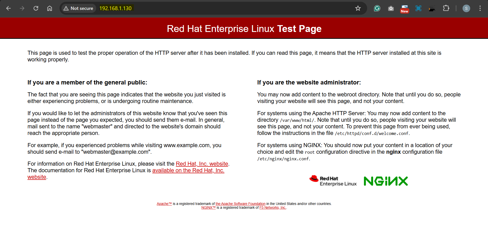

# Server - Web: `nginx` on `Redhat8`

[Back](../../index.md)

- [Server - Web: `nginx` on `Redhat8`](#server---web-nginx-on-redhat8)
  - [Nginx](#nginx)
  - [Installation](#installation)
  - [Custom Default Page](#custom-default-page)

---

## Nginx

- `NGINX`
  - a web server software
- Features

  - Web server
  - Reverse proxy
  - Load balancer

- Using the default configuration, `NGINX` runs as a web server on port `80` and provides content from the `/usr/share/nginx/html/` directory.

- Ref:
  - [Setting up and configuring NGINX](https://docs.redhat.com/en/documentation/red_hat_enterprise_linux/8/html/deploying_different_types_of_servers/setting-up-and-configuring-nginx_deploying-different-types-of-servers)

---

## Installation

- Red Hat uses `Application Streams` to provide different versions of NGINX.
- Steps:
  - Install NGINX
  - Open the required ports in the firewall
  - Enable and start the nginx service

1. Display the available NGINX module streams

```sh
sudo yum module list nginx
# Updating Subscription Management repositories.
# Last metadata expiration check: 2:04:32 ago on Sat 14 Dec 2024 08:37:46 PM EST.
# Red Hat Enterprise Linux 8 for x86_64 - AppStream (RPMs)
# Name                 Stream                 Profiles                 Summary
# nginx                1.14 [d]               common [d]               nginx webserver
# nginx                1.16                   common [d]               nginx webserver
# nginx                1.18                   common [d]               nginx webserver
# nginx                1.20                   common [d]               nginx webserver
# nginx                1.22                   common [d]               nginx webserver
# nginx                1.24                   common [d]               nginx webserver

# Hint: [d]efault, [e]nabled, [x]disabled, [i]nstalled
```

- If you want to install a different stream than the default, select the stream:

```sh
# select 1.20
sudo yum module enable nginx:1.20

# confirm
sudo yum module list nginx
# Red Hat Enterprise Linux 8 for x86_64 - AppStream (RPMs)
# Name                 Stream                 Profiles                 Summary
# nginx                1.14 [d]               common [d]               nginx webserver
# nginx                1.16                   common [d]               nginx webserver
# nginx                1.18                   common [d]               nginx webserver
# nginx                1.20 [e]               common [d]               nginx webserver
# nginx                1.22                   common [d]               nginx webserver
# nginx                1.24                   common [d]               nginx webserver

# Hint: [d]efault, [e]nabled, [x]disabled, [i]nstalled


yum info nginx
# Available Packages
# Name         : nginx
# Epoch        : 1
# Version      : 1.20.1
# Release      : 1.module+el8.8.0+20359+9bd89172.1
# Architecture : x86_64
# Size         : 593 k
# Source       : nginx-1.20.1-1.module+el8.8.0+20359+9bd89172.1.src.rpm
# Repository   : rhel-8-for-x86_64-appstream-rpms
# Summary      : A high performance web server and reverse proxy server
# URL          : http://nginx.org/
# License      : BSD
# Description  : Nginx is a web server and a reverse proxy server for HTTP, SMTP, POP3 and
#              : IMAP protocols, with a strong focus on high concurrency, performance and low
#              : memory usage.
```

2. Install the nginx package:

```sh
# install
sudo yum install -y nginx

# confirm
yum list installed nginx
# Not root, Subscription Management repositories not updated
# Installed Packages
# nginx.x86_64     1:1.20.1-1.module+el8.8.0+20359+9bd89172.1      @rhel-8-for-x86_64-appstream-rpms
```

3. Enable the nginx service to start automatically when the system boots:
   - Optional: Start the nginx service:

```sh
sudo systemctl enable nginx
sudo systemctl start nginx

systemctl is-enabled nginx
# enabled
sudo systemctl status nginx
# ● nginx.service - The nginx HTTP and reverse proxy server
#    Loaded: loaded (/usr/lib/systemd/system/nginx.service; enabled; vendor preset: disabled)
#    Active: active (running) since Sat 2024-12-14 23:17:08 EST; 5s ago
#   Process: 5536 ExecStart=/usr/sbin/nginx (code=exited, status=0/SUCCESS)
#   Process: 5534 ExecStartPre=/usr/sbin/nginx -t (code=exited, status=0/SUCCESS)
#   Process: 5532 ExecStartPre=/usr/bin/rm -f /run/nginx.pid (code=exited, status=0/SUCCESS)
#  Main PID: 5537 (nginx)
#     Tasks: 5 (limit: 22891)
#    Memory: 4.9M
#    CGroup: /system.slice/nginx.service
#            ├─5537 nginx: master process /usr/sbin/nginx
#            ├─5538 nginx: worker process
#            ├─5539 nginx: worker process
#            ├─5540 nginx: worker process
#            └─5541 nginx: worker process

# Dec 14 23:17:08 serverhost systemd[1]: Starting The nginx HTTP and reverse proxy server...
# Dec 14 23:17:08 serverhost nginx[5534]: nginx: the configuration file /etc/nginx/nginx.conf synta>
# Dec 14 23:17:08 serverhost nginx[5534]: nginx: configuration file /etc/nginx/nginx.conf test is s>
# Dec 14 23:17:08 serverhost systemd[1]: Started The nginx HTTP and reverse proxy server.
```

4. Open the ports on which NGINX should provide its service in the firewall.
   - open the default ports for HTTP (port 80) and HTTPS (port 443) in firewalld, enter:

```sh
sudo firewall-cmd --permanent --add-port={80/tcp,443/tcp}
# success
sudo firewall-cmd --reload
# success

# confirm
sudo firewall-cmd --list-ports
# 80/tcp 443/tcp
```

5. Verify
   - `http://ip_address`



---

## Custom Default Page

- Create a custom page

```sh
mkdir -p /var/www/html/argushost

cat > /var/www/html/argushost/index.html <<EOF
<!DOCTYPE html>
<html>
<head>
<title>Argushost</title>
</head>
<body>
<h1>Argushost</h1>
<p>This is a <b>test</b> page.</p>
</body>
</html>
EOF
```

- Update configure file

```sh
vi /etc/nginx/nginx.conf
# root         /var/www/html/argushost;
```

- configure SELinux

```sh
semanage fcontext -a -t httpd_sys_content_t "/var/www/html/argushost(/.*)?"
restorecon -Rv /var/www/html/argushost/
```

- Restart nginx

```sh
systemctl restart nginx
```

---

[TOP](#server---web-nginx-on-redhat8)
