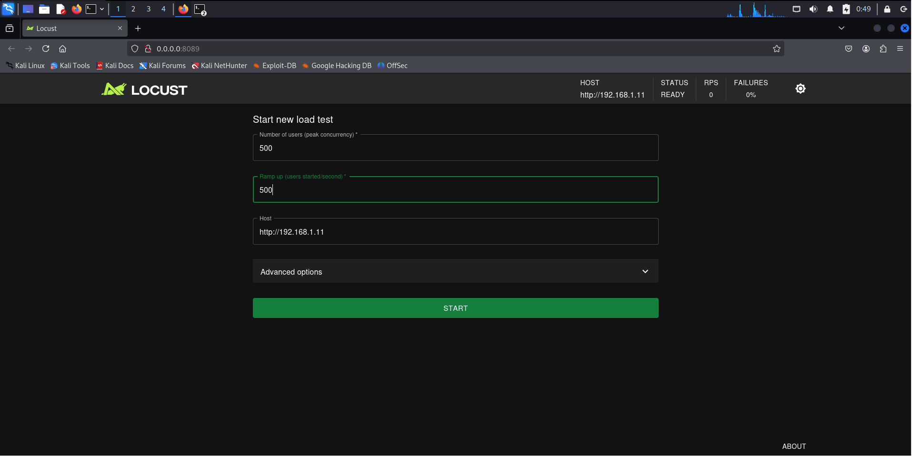
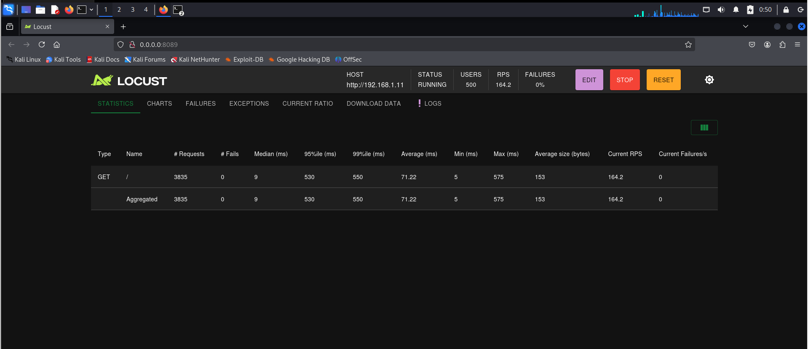
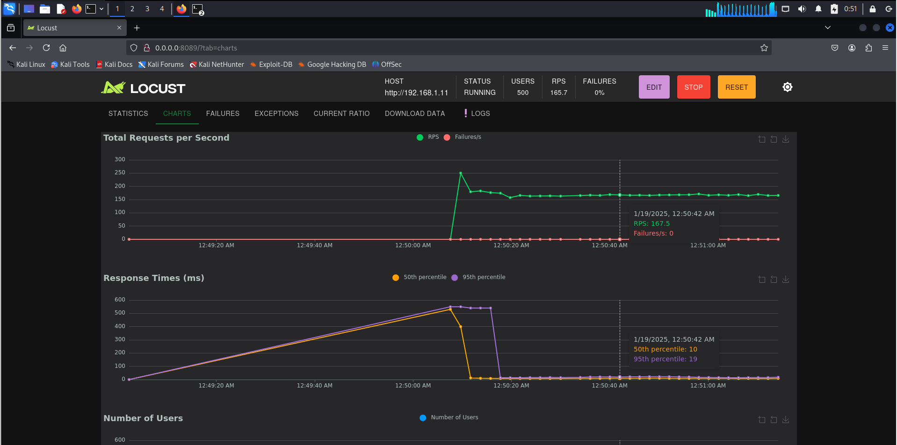
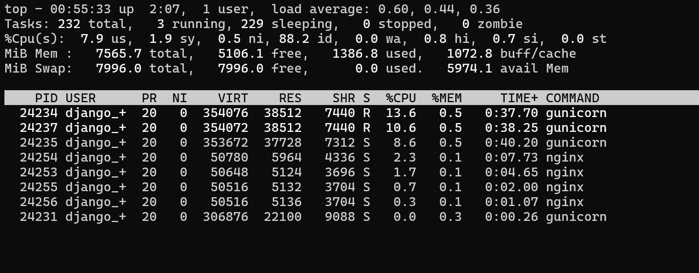
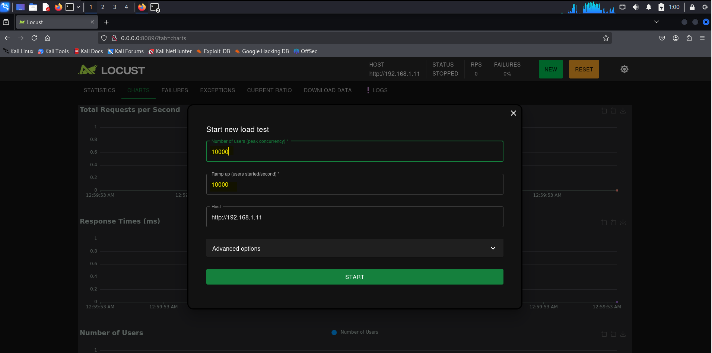
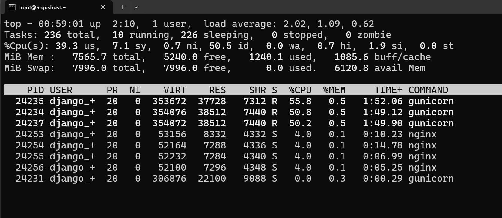

# Web Application - Test Django

[Back](../../index.md)

- [Web Application - Test Django](#web-application---test-django)
  - [Architecture](#architecture)
  - [Configure `locust`](#configure-locust)

---

## Architecture

- Target server:
  - ol8
  - django+gunicorn+nginx
  - ip: 192.168.1.11
- Tester Machine
  - kali
  - ip: 192.168.1.0/24

---

## Configure `locust`

- Install Locust

```sh
pip install locust
```

- Create a Locust Test Script

```sh
cat > /home/kali/locustfile.py <<EOF
from locust import HttpUser, TaskSet, task, between

class UserBehavior(TaskSet):
    @task
    def index(self):
        self.client.get("/")  # Replace with your app's endpoint.

class WebsiteUser(HttpUser):
    tasks = [UserBehavior]
    wait_time = between(1, 5)  # Simulates user delay.
EOF

# add x permission
chmod +x /home/kali/locustfile.py
```

- Run Locust: Start the Locust server:

```sh
locust -f locustfile.py --host=http://192.168.1.11
# [2025-01-19 00:48:37,121] kali/INFO/locust.main: Starting Locust 2.32.6
# [2025-01-19 00:48:37,122] kali/INFO/locust.main: Starting web interface at http://0.0.0.0:8089

```

- Configure test parameters



- Start test



- Chart



---

- On the target server

```sh
top
```



---

- Update new parameters





---
