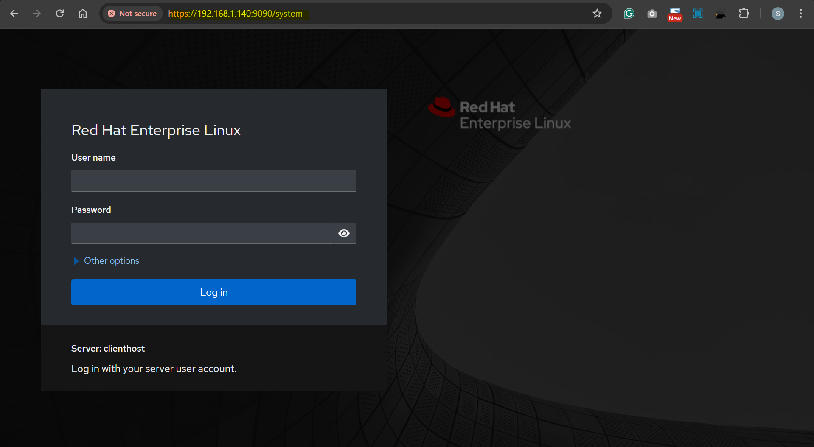
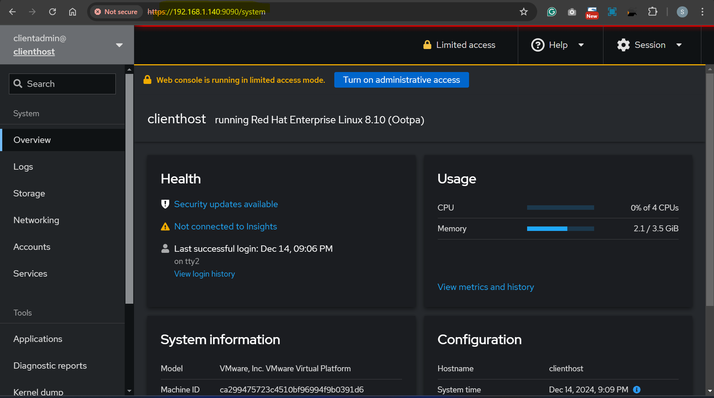
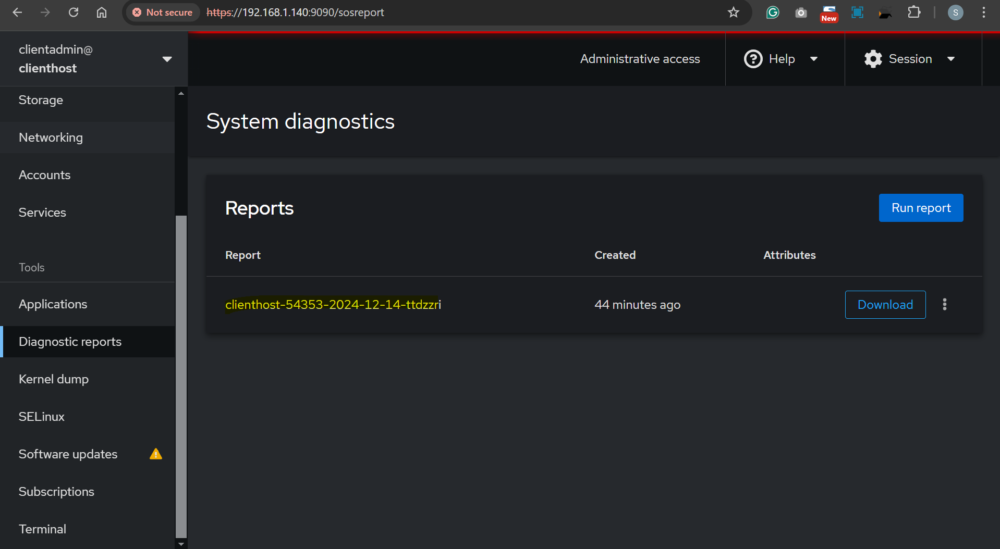
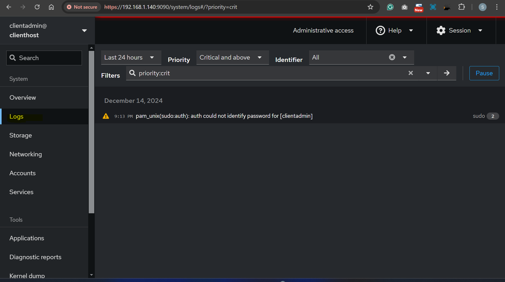
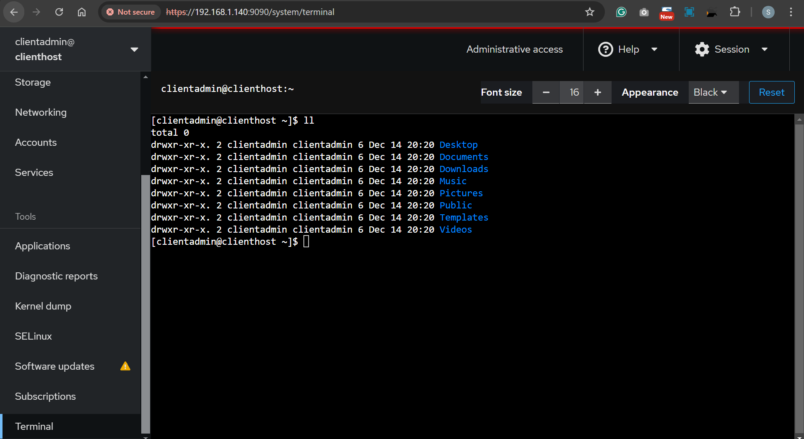

# Linux - Software Management: Utility `Cockpit`

[Back](../../index.md)

- [Linux - Software Management: Utility `Cockpit`](#linux---software-management-utility-cockpit)
  - [`Cockpit`](#cockpit)
    - [Command](#command)
  - [Lab: Manage system via `cockpit`](#lab-manage-system-via-cockpit)

---

## `Cockpit`

- `Cockpit`

  - a **web-based interface** for managing Linux systems, particularly useful for tasks involving servers.
  - **simplifies** system administration and provides **insights** into how underlying tools and commands work by providing a graphical user interface accessible through a web browser.

- Main Features:
  - **Monitor** system performance (CPU, memory, disk I/O, etc.).
  - Manage **users** and **groups**.
  - Configure **network** settings.
  - Manage **storage** and file systems.
  - Handle **software** updates.
  - Control system **services** (start, stop, restart).
  - Monitor system **logs**.
  - Interact with a **terminal** for command-line access.

---

### Command

- **Package (Installed by default)**

```sh
rpm -qa | grep cockpit
sudo yum install cockpit
yum list instelled cockpit
```

- **Service**

```sh
sudo systemctl start cockpit.socket
sudo systemctl enable cockpit.socket
sudo systemctl status cockpit.socket
```

- Access Cockpit
  - URL: `https://<server-ip>:9090`
  - Log in using your system's user credentials (e.g., root or an admin user).

---

## Lab: Manage system via `cockpit`

- Check cockpit service

```sh
sudo systemctl status cockpit.socket
# ● cockpit.socket - Cockpit Web Service Socket
#    Loaded: loaded (/usr/lib/systemd/system/cockpit.socket; enabled; vendor preset: disabled)
#    Active: active (listening) since Sat 2024-12-14 21:04:25 EST; 45min ago
#      Docs: man:cockpit-ws(8)
#    Listen: [::]:9090 (Stream)
#     Tasks: 0 (limit: 22890)
#    Memory: 1.0M
#    CGroup: /system.slice/cockpit.socket
#
# Dec 14 21:04:25 clienthost systemd[1]: Starting Cockpit Web Service Socket.
# Dec 14 21:04:25 clienthost systemd[1]: Listening on Cockpit Web Service Socket.
```

- Access cockpit website











---

[TOP](#linux---software-management-utility-cockpit)
