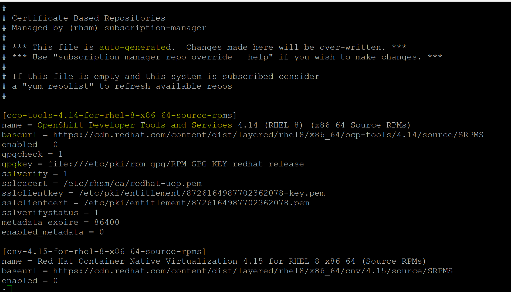

# Linux - Software Management: Package

[Back](../../index.md)

---

- [Linux - Software Management: Package](#linux---software-management-package)
  - [Package \& Package Manager](#package--package-manager)
  - [Local Repository](#local-repository)
    - [`createrepo` Tool](#createrepo-tool)
    - [**!Lab: Create a Local Repository**](#lab-create-a-local-repository)
  - [System Upgrade/Patch Management](#system-upgradepatch-management)
    - [`yum update` vs `yum upgrade`](#yum-update-vs-yum-upgrade)
    - [`dnf update` and `dnf upgrade`](#dnf-update-and-dnf-upgrade)
  - [RPM(Red Hat Package Manager)](#rpmred-hat-package-manager)
    - [Configuration File](#configuration-file)
    - [Common Command](#common-command)
    - [Lab: Install, Get CF, and Remove `nginx` Manually](#lab-install-get-cf-and-remove-nginx-manually)
  - [YUM (Yellowdog Updater, Modified)](#yum-yellowdog-updater-modified)
    - [Configuration File](#configuration-file-1)
    - [Common Command](#common-command-1)
    - [YUM vs. RPM](#yum-vs-rpm)
  - [DNF(Dandified Yum)](#dnfdandified-yum)
    - [Configuration Files](#configuration-files)
    - [Common Command](#common-command-2)
    - [Lab: Install and Remove `nginx`](#lab-install-and-remove-nginx)
  - [`DEB` Distro](#deb-distro)
    - [`APT`: Advanced Packaging Tool](#apt-advanced-packaging-tool)
    - [`dpkg`: low-level package manager](#dpkg-low-level-package-manager)

---

## Package & Package Manager

- `Software`

  - a set of instructions, programs, or data used to **operate** computers and **execute** specific tasks.
  - It is intangible, meaning you cannot physically touch it.
  - categorized into:
    - System Software
    - Application Software
    - Utility Software

- `Package`

  - a bundled collection of files, scripts, and metadata that makes it easier **to distribute, install, and manage software or libraries**.
  - Usually contains **executable files**, **libraries**, **configuration files**, and **dependencies**.
  - use `package managers` to handle packages

- `Package Manager`

  - used to installs, upgrades, and removes packages
  - Manages dependencies
  - Keeps track of what is installed
  - Types:
    - **RPM distros**:
      - `yum`/`dnf`(RHEL, CentOS)
    - **DEB distros**
      - `apt`(Unbuntu)
    - Programming languages: `pip` for python

---

## Local Repository

- `Local Repository`
  - a repository **stored on a local filesystem or within a local network** (e.g., an NFS share or HTTP server) that allows to manage software packages for RPM-based Linux systems.
  - It acts as a **private repository** for installing, updating, or distributing RPM packages without relying on external or remote repositories.

---

### `createrepo` Tool

- `createrepo`

  - a command-line utility used to **create the metadata files** required to **turn a directory** of RPM files into a **usable YUM/DNF repository**.

- Features

  - Metadata Generation
    - Generates a repodata directory containing repomd.xml and related metadata files for dependency resolution.
  - Incremental Updates
    - Efficiently updates metadata when new RPMs are added without regenerating everything.
    - `createrepo --update /repo/local/`
  - GPG Key Integration
    - Can sign metadata with GPG keys for secure package management.

- Commands

| Command                                      | Description                                              |
| -------------------------------------------- | -------------------------------------------------------- |
| `createrepo /path/to/repo`                   | Creates a repository in the specified directory.         |
| `createrepo --update /path/to/repo`          | Updates the repository metadata when new RPMs are added. |
| `createrepo --checksum sha256 /path/to/repo` | Changes the checksum type used in metadata.              |

---

### **!Lab: Create a Local Repository**

- Create a dir for repo and copy packages

```sh
su -

# create dir for repo
mkdir /localrepo

# copy the package to the repo dir
```

- Configure

```sh
# remove the package info in yum cf
rm -rf /etc/yum.repos.d/*

# create a local repo cf
vi /etc/yum.repos.d/local.repo

# [centos7]
# name=cento7
# baseurl=file:///localrepo/
# enabled=1
# gpgcheck=0
```

- Install and create repo

```sh
# install
yum install -y createrepo

# create repo
createrepo /localrepo/

# clean old repo
yum clean all

# list all repo pacakges
yum repolist all

# install a package from a local repo
yum install tomcat
```

---

## System Upgrade/Patch Management

- For Major version, like 5,6,7, system upgreade command is not available.
- For Minor version, like 7.3 to 7.4, system can be upgreaded.

```sh
yum update -y
```

---

### `yum update` vs `yum upgrade`

- `update`: preserve packages
  - **Updates** all installed packages to their latest versions **without removing any obsolete packages**.
    - Upgrades existing packages to newer versions.
    - Does not remove old dependencies or obsolete packages automatically.
    - Retains compatibility and avoids potentially disruptive changes.
- `upgrade`: delete packages
  - Performs a more comprehensive **update** by upgrading packages and **removing obsolete packages or dependencies** that are no longer needed.
    - Similar to yum update, but it also **removes older dependencies** or packages that are replaced or made obsolete by the update.
    - This can **potentially break compatibility** with some software.

---

### `dnf update` and `dnf upgrade`

- In DNF, the commands `update` and `upgrade` are **aliases**;
  - they perform the exact same operation.
  - Both commands:
    - **Update** all installed packages to the latest version available in the configured repositories.
    - **Remove** obsolete packages and handle dependencies automatically.

---

## RPM(Red Hat Package Manager)

- `RPM(Red Hat Package Manager)`

  - a package management system used in Linux distributions like `Red Hat Enterprise Linux (RHEL)`, `CentOS`, `Fedora`, and others.
  - It helps install, update, remove, and manage software packages on Linux systems.
  - a lower level command

- Features:

  - Binary Packages
    - RPM packages typically come in **binary form** (`.rpm` files), containing **precompiled software** and **metadata** like dependencies and versioning.
  - Dependency Resolution
    - RPM packages specify their dependencies, but the tool itself **does not resolve** them automatically. Tools like `yum` or `dnf` handle this.
  - Database of Installed Packages
    - RPM maintains a **local database of installed packages**, which makes it easy to query and verify installations.

---

### Configuration File

- Configuration File Path:
  - `/etc/rpm/`
  - used to store configuration files and macros related to the RPM (Red Hat Package Manager).
    - These files influence how RPM behaves during package installation, query, build, and other operations.

---

### Common Command

| CMD                     | DESC                                             |
| ----------------------- | ------------------------------------------------ |
| `rpm -qa`               | Lists all installed RPM packages.                |
| `rpm -q package_name`   | Queries information about an installed package.  |
| `rpm -qc package_name`  | List configuration file for an installed package |
| `rpm -qf /path/to/file` | Display the package to which the file belong     |
| `rpm -ql package_name`  | Lists all files installed by a package.          |
| `rpm -V package_name`   | Verifies the integrity of an installed package.  |
| `rpm -i package.rpm`    | Installs an RPM package.                         |
| `rpm -ivh package.rpm`  | Installs a package with a progress bar.          |
| `rpm -U package.rpm`    | Upgrades an existing package or installs it.     |
| `rpm -e package_name`   | Removes (erases) a package.                      |

---

### Lab: Install, Get CF, and Remove `nginx` Manually

- Download `nginx` manually or get the downloading url

```sh
cd ~
wget https://nginx.org/packages/rhel/8/x86_64/RPMS/nginx-1.26.2-1.el8.ngx.x86_64.rpm
# --2024-12-07 23:49:28--  https://nginx.org/packages/rhel/8/x86_64/RPMS/nginx-1.26.2-1.el8.ngx.x86_64.rpm
# Resolving nginx.org (nginx.org)... 52.58.199.22, 3.125.197.172, 2a05:d014:5c0:2600::6, ...
# Connecting to nginx.org (nginx.org)|52.58.199.22|:443... connected.
# HTTP request sent, awaiting response... 200 OK
# Length: 985716 (963K) [application/x-redhat-package-manager]
# Saving to: ‘nginx-1.26.2-1.el8.ngx.x86_64.rpm’

# nginx-1.26.2-1.el8.ngx.x 100%[=================================>] 962.61K  1.51MB/s    in 0.6s

# 2024-12-07 23:49:29 (1.51 MB/s) - ‘nginx-1.26.2-1.el8.ngx.x86_64.rpm’ saved [985716/985716]

ll
# -rw-r--r--. 1 root root 985716 Aug 14 02:04 nginx-1.26.2-1.el8.ngx.x86_64.rpm
```

- Install rpm package

```sh
rpm -hiv nginx-1.26.2-1.el8.ngx.x86_64.rpm
# warning: nginx-1.26.2-1.el8.ngx.x86_64.rpm: Header V4 RSA/SHA256 Signature, key ID 7bd9bf62: NOKEY
# Verifying...                          ################################# [100%]
# Preparing...                          ################################# [100%]
# Updating / installing...
#    1:nginx-1:1.26.2-1.el8.ngx         ################################# [100%]
# ----------------------------------------------------------------------

# Thanks for using nginx!

# Please find the official documentation for nginx here:
# * https://nginx.org/en/docs/

# Please subscribe to nginx-announce mailing list to get
# the most important news about nginx:
# * https://nginx.org/en/support.html

# Commercial subscriptions for nginx are available on:
# * https://nginx.com/products/

# ----------------------------------------------------------------------

# Confirm
rpm -qai | grep nginx
# Name        : nginx
# Source RPM  : nginx-1.26.2-1.el8.ngx.src.rpm
# Vendor      : NGINX Packaging <nginx-packaging@f5.com>
# URL         : https://nginx.org/
# nginx [engine x] is an HTTP and reverse proxy server, as well as
```

- Get CF

```sh
rpm -qc nginx
# /etc/logrotate.d/nginx
# /etc/nginx/fastcgi.conf
# /etc/nginx/fastcgi.conf.default
# /etc/nginx/fastcgi_params
# /etc/nginx/fastcgi_params.default
# /etc/nginx/koi-utf
# /etc/nginx/koi-win
# /etc/nginx/mime.types
# /etc/nginx/mime.types.default
# /etc/nginx/nginx.conf
# /etc/nginx/nginx.conf.default
# /etc/nginx/scgi_params
# /etc/nginx/scgi_params.default
# /etc/nginx/uwsgi_params
# /etc/nginx/uwsgi_params.default
# /etc/nginx/win-utf
```

- Remove the package

```sh
rpm -e nginx

# Confirm
rpm -qai | grep nginx
```

---

## YUM (Yellowdog Updater, Modified)

- `YUM (Yellowdog Updater, Modified)`:

  - a command-line **package manager** used to manage packages in the `.rpm` file format on RPM-based Linux distributions such as `Red Hat Enterprise Linux (RHEL)`, `CentOS`, and `Fedora`.
  - It simplifies the management of software packages by automatically **resolving dependencies** and **fetching packages** from repositories.
  - OS: RHEL 7 / CentOS 7 & Earlier

- Features
  - Automatic Dependency Resolution
    - Unlike the `rpm` command, YUM identifies and **resolves software dependencies** automatically during installation or updates.
  - Repository Management
    - YUM **fetches packages** from central or local repositories.
    - These repositories are configured in `.repo` files under `/etc/yum.repos.d/`.
  - Ease of Use
    - Simplifies common package management tasks such as installation, updates, and removals.
  - Group Installations
    - Allows installing groups of packages, such as Development Tools or Server.
  - History Tracking
    - Maintains a history of actions, enabling users to undo or redo package changes.

---

### Configuration File

- `yum` configuration files:
  - `/etc/yum.conf`

```conf
[main]
gpgcheck=1
installonly_limit=3
clean_requirements_on_remove=True
best=True
skip_if_unavailable=False
```

- Repository files path:
  - `/etc/yum.repos.d/`
  - A `.repo` file specifies the **base URL** or **mirror list** where YUM fetches packages.



- When issuing `yum` command, it instructs package manager to go online with the url defined in the configuration file to check, download, and install the package.
- Usually `yum` command requires Internet access
  - In some cases, repos are setup locally within the network.

---

### Common Command

| CMD                               | DESC                                                            |
| --------------------------------- | --------------------------------------------------------------- |
| `yum list available`              | Lists all available packages in the repository.                 |
| `yum history`                     | Displays a history of YUM transactions.                         |
| `yum clean all`                   | Cleans up cached files and metadata.                            |
| `yum upgrade -y`                  | update version of all package and **removes** outdated packages |
| `yum update -y`                   | Updates all installed packages to their latest versions.        |
| `yum search key_word`             | Search for string                                               |
| `yum info`                        | Display all info                                                |
| `yum info package_name_pattern`   | Display info of a package                                       |
| `yum list installed`              | List all installed package                                      |
| `yum list installed package_name` | List an installed package                                       |
| `yum install -y package_name`     | Install package                                                 |
| `yum upgrade -y package_name`     | Update a package                                                |
| `yum remove package_name`         | Removes a package and its dependencies.                         |

---

### YUM vs. RPM

| Feature             | YUM                                 | RPM                                         |
| ------------------- | ----------------------------------- | ------------------------------------------- |
| Dependency Handling | Automatically resolves dependencies | Does not handle dependencies automatically. |
| Repository Support  | Fetches packages from repositories  | Requires manual download of `.rpm` files.   |
| Usability           | More user-friendly                  | Requires manual management.                 |
| Internet Access     | Required                            | Not required                                |

---

## DNF(Dandified Yum)

- `DNF (Dandified YUM)`:

  - the next-generation **package manager** for RPM-based Linux distributions
  - replace `YUM` in systems like Red Hat Enterprise Linux (RHEL) 8, CentOS 8, and Fedora.

- OS: RHEL 8 / CentOS 8 & Later
- Compatibility with YUM
  - Retains compatibility with most YUM commands and repository configurations, easing the transition for users.

---

### Configuration Files

- DNF's configuration files path:
  - `/etc/dnf/`
- Main Configuration File
  - `/etc/dnf/dnf.conf`
  - Controls DNF behavior globally.

```sh
[main]
gpgcheck=1
installonly_limit=3
clean_requirements_on_remove=True
best=True
skip_if_unavailable=False
```

- Repository Configuration path:
  - `/etc/yum.repos.d/` (shared with YUM)

---

### Common Command

| CMD                             | DESC                                                    |
| ------------------------------- | ------------------------------------------------------- |
| `dnf system-upgrade`            | Upgrading the entire system to a newer release          |
| `dnf list`                      | Lists available, installed, or upgradable packages.     |
| `dnf history`                   | Displays the history of DNF transactions.               |
| `dnf clean all`                 | Cleans cached metadata and packages.                    |
| `dnf upgrade -y`                | Upgrades all installed packages to the latest versions. |
| `dnf search keyword`            | Searches for packages containing the keyword.           |
| `dnf info package_name_pattern` | Display info                                            |
| `dnf list installed`            | List all installed packages                             |
| `dnf list installed package`    | List an installed package                               |
| `dnf install -y package`        | Install package                                         |
| `dnf upgrade -y package`        | Update a package                                        |
| `dnf remove package`            | Remove package                                          |
| `dnf autoremove`                | Keep Your System Clean                                  |

---

### Lab: Install and Remove `nginx`

- Install

```sh
# Check if the package already has been installed
rpm -qa | grep nginx

# confirm Internet connection
ping -c3 google.com


# search package in the remove repositories
# return a list of packages container the target packages name.
dnf search nginx*

# query the package's information
dnf info nginx
# Updating Subscription Management repositories.
# Last metadata expiration check: 0:42:01 ago on Sat 07 Dec 2024 10:53:36 PM EST.
# Available Packages
# Name         : nginx
# Epoch        : 1
# Version      : 1.14.1
# Release      : 9.module+el8.0.0+4108+af250afe
# Architecture : x86_64
# Size         : 570 k
# Source       : nginx-1.14.1-9.module+el8.0.0+4108+af250afe.src.rpm
# Repository   : rhel-8-for-x86_64-appstream-rpms
# Summary      : A high performance web server and reverse proxy server
# URL          : http://nginx.org/
# License      : BSD
# Description  : Nginx is a web server and a reverse proxy server for HTTP, SMTP,
#              : POP3 and IMAP protocols, with a strong focus on high concurrency,
#              : performance and low memory usage.


# install nginx as super user
sudo dnf install -y nginx
# Updating Subscription Management repositories.
# Last metadata expiration check: 0:42:37 ago on Sat 07 Dec 2024 10:53:36 PM EST.
# Dependencies resolved.
# ================================================================================
#  Package                     Arch   Version
#                                          Repository                        Size
# ================================================================================
# Installing:
#  nginx                       x86_64 1:1.14.1-9.module+el8.0.0+4108+af250afe
#                                          rhel-8-for-x86_64-appstream-rpms 570 k
# Installing dependencies:
#  nginx-all-modules           noarch 1:1.14.1-9.module+el8.0.0+4108+af250afe
#                                          rhel-8-for-x86_64-appstream-rpms  24 k
#  nginx-filesystem            noarch 1:1.14.1-9.module+el8.0.0+4108+af250afe
#                                          rhel-8-for-x86_64-appstream-rpms  24 k
#  nginx-mod-http-image-filter x86_64 1:1.14.1-9.module+el8.0.0+4108+af250afe
#                                          rhel-8-for-x86_64-appstream-rpms  35 k
#  nginx-mod-http-perl         x86_64 1:1.14.1-9.module+el8.0.0+4108+af250afe
#                                          rhel-8-for-x86_64-appstream-rpms  46 k
#  nginx-mod-http-xslt-filter  x86_64 1:1.14.1-9.module+el8.0.0+4108+af250afe
#                                          rhel-8-for-x86_64-appstream-rpms  34 k
#  nginx-mod-mail              x86_64 1:1.14.1-9.module+el8.0.0+4108+af250afe
#                                          rhel-8-for-x86_64-appstream-rpms  64 k
#  nginx-mod-stream            x86_64 1:1.14.1-9.module+el8.0.0+4108+af250afe
#                                          rhel-8-for-x86_64-appstream-rpms  85 k
# Enabling module streams:
#  nginx                              1.14

# Transaction Summary
# ================================================================================
# Install  8 Packages

# Total download size: 881 k
# Installed size: 2.0 M
# Downloading Packages:
# (1/8): nginx-filesystem-1.14.1-9.module+el8.0.0  39 kB/s |  24 kB     00:00
# (2/8): nginx-mod-http-image-filter-1.14.1-9.mod 206 kB/s |  35 kB     00:00
# (3/8): nginx-all-modules-1.14.1-9.module+el8.0.  29 kB/s |  24 kB     00:00
# (4/8): nginx-1.14.1-9.module+el8.0.0+4108+af250 607 kB/s | 570 kB     00:00
# (5/8): nginx-mod-http-perl-1.14.1-9.module+el8. 236 kB/s |  46 kB     00:00
# (6/8): nginx-mod-stream-1.14.1-9.module+el8.0.0 270 kB/s |  85 kB     00:00
# (7/8): nginx-mod-http-xslt-filter-1.14.1-9.modu  65 kB/s |  34 kB     00:00
# (8/8): nginx-mod-mail-1.14.1-9.module+el8.0.0+4 128 kB/s |  64 kB     00:00
# --------------------------------------------------------------------------------
# Total                                           610 kB/s | 881 kB     00:01
# Running transaction check
# Transaction check succeeded.
# Running transaction test
# Transaction test succeeded.
# Running transaction
#   Preparing        :                                                        1/1
#   Running scriptlet: nginx-filesystem-1:1.14.1-9.module+el8.0.0+4108+af25   1/8
#   Installing       : nginx-filesystem-1:1.14.1-9.module+el8.0.0+4108+af25   1/8
#   Installing       : nginx-mod-http-image-filter-1:1.14.1-9.module+el8.0.   2/8
#   Running scriptlet: nginx-mod-http-image-filter-1:1.14.1-9.module+el8.0.   2/8
#   Installing       : nginx-mod-http-perl-1:1.14.1-9.module+el8.0.0+4108+a   3/8
#   Running scriptlet: nginx-mod-http-perl-1:1.14.1-9.module+el8.0.0+4108+a   3/8
#   Installing       : nginx-mod-http-xslt-filter-1:1.14.1-9.module+el8.0.0   4/8
#   Running scriptlet: nginx-mod-http-xslt-filter-1:1.14.1-9.module+el8.0.0   4/8
#   Installing       : nginx-mod-mail-1:1.14.1-9.module+el8.0.0+4108+af250a   5/8
#   Running scriptlet: nginx-mod-mail-1:1.14.1-9.module+el8.0.0+4108+af250a   5/8
#   Installing       : nginx-all-modules-1:1.14.1-9.module+el8.0.0+4108+af2   6/8
#   Installing       : nginx-1:1.14.1-9.module+el8.0.0+4108+af250afe.x86_64   7/8
#   Running scriptlet: nginx-1:1.14.1-9.module+el8.0.0+4108+af250afe.x86_64   7/8
#   Installing       : nginx-mod-stream-1:1.14.1-9.module+el8.0.0+4108+af25   8/8
#   Running scriptlet: nginx-mod-stream-1:1.14.1-9.module+el8.0.0+4108+af25   8/8
#   Verifying        : nginx-1:1.14.1-9.module+el8.0.0+4108+af250afe.x86_64   1/8
#   Verifying        : nginx-all-modules-1:1.14.1-9.module+el8.0.0+4108+af2   2/8
#   Verifying        : nginx-filesystem-1:1.14.1-9.module+el8.0.0+4108+af25   3/8
#   Verifying        : nginx-mod-http-image-filter-1:1.14.1-9.module+el8.0.   4/8
#   Verifying        : nginx-mod-http-perl-1:1.14.1-9.module+el8.0.0+4108+a   5/8
#   Verifying        : nginx-mod-http-xslt-filter-1:1.14.1-9.module+el8.0.0   6/8
#   Verifying        : nginx-mod-mail-1:1.14.1-9.module+el8.0.0+4108+af250a   7/8
#   Verifying        : nginx-mod-stream-1:1.14.1-9.module+el8.0.0+4108+af25   8/8
# Installed products updated.

# Installed:
#   nginx-1:1.14.1-9.module+el8.0.0+4108+af250afe.x86_64
#   nginx-all-modules-1:1.14.1-9.module+el8.0.0+4108+af250afe.noarch
#   nginx-filesystem-1:1.14.1-9.module+el8.0.0+4108+af250afe.noarch
#   nginx-mod-http-image-filter-1:1.14.1-9.module+el8.0.0+4108+af250afe.x86_64
#   nginx-mod-http-perl-1:1.14.1-9.module+el8.0.0+4108+af250afe.x86_64
#   nginx-mod-http-xslt-filter-1:1.14.1-9.module+el8.0.0+4108+af250afe.x86_64
#   nginx-mod-mail-1:1.14.1-9.module+el8.0.0+4108+af250afe.x86_64
#   nginx-mod-stream-1:1.14.1-9.module+el8.0.0+4108+af250afe.x86_64

# Complete!


# confirm pacakge has been installed
dnf list installed nginx
# Updating Subscription Management repositories.
# Installed Packages
# nginx.x86_64 1:1.14.1-9.module+el8.0.0+4108+af250afe @rhel-8-for-x86_64-appstream-rpms
which nginx
# /usr/sbin/nginx
```

- Remove

```sh
# remove package
sudo dnf remove -y nginx
# Updating Subscription Management repositories.
# Dependencies resolved.
# ===================================================================================================
#  Package    Arch   Version                                 Repository                         Size
# ===================================================================================================
# Removing:
#  nginx      x86_64 1:1.14.1-9.module+el8.0.0+4108+af250afe @rhel-8-for-x86_64-appstream-rpms 1.7 M
# Removing unused dependencies:
#  nginx-all-modules
#             noarch 1:1.14.1-9.module+el8.0.0+4108+af250afe @rhel-8-for-x86_64-appstream-rpms   0
#  nginx-filesystem
#             noarch 1:1.14.1-9.module+el8.0.0+4108+af250afe @rhel-8-for-x86_64-appstream-rpms   0
#  nginx-mod-http-image-filter
#             x86_64 1:1.14.1-9.module+el8.0.0+4108+af250afe @rhel-8-for-x86_64-appstream-rpms  29 k
#  nginx-mod-http-perl
#             x86_64 1:1.14.1-9.module+el8.0.0+4108+af250afe @rhel-8-for-x86_64-appstream-rpms  61 k
#  nginx-mod-http-xslt-filter
#             x86_64 1:1.14.1-9.module+el8.0.0+4108+af250afe @rhel-8-for-x86_64-appstream-rpms  25 k
#  nginx-mod-mail
#             x86_64 1:1.14.1-9.module+el8.0.0+4108+af250afe @rhel-8-for-x86_64-appstream-rpms 113 k
#  nginx-mod-stream
#             x86_64 1:1.14.1-9.module+el8.0.0+4108+af250afe @rhel-8-for-x86_64-appstream-rpms 171 k

# Transaction Summary
# ===================================================================================================
# Remove  8 Packages

# Freed space: 2.0 M
# Running transaction check
# Transaction check succeeded.
# Running transaction test
# Transaction test succeeded.
# Running transaction
#   Preparing        :                                                                           1/1
#   Running scriptlet: nginx-mod-http-image-filter-1:1.14.1-9.module+el8.0.0+4108+af250afe.x86   1/1
#   Erasing          : nginx-mod-http-image-filter-1:1.14.1-9.module+el8.0.0+4108+af250afe.x86   1/8
#   Erasing          : nginx-mod-http-perl-1:1.14.1-9.module+el8.0.0+4108+af250afe.x86_64        2/8
#   Erasing          : nginx-mod-http-xslt-filter-1:1.14.1-9.module+el8.0.0+4108+af250afe.x86_   3/8
#   Erasing          : nginx-mod-mail-1:1.14.1-9.module+el8.0.0+4108+af250afe.x86_64             4/8
#   Erasing          : nginx-mod-stream-1:1.14.1-9.module+el8.0.0+4108+af250afe.x86_64           5/8
#   Running scriptlet: nginx-1:1.14.1-9.module+el8.0.0+4108+af250afe.x86_64                      6/8
#   Erasing          : nginx-1:1.14.1-9.module+el8.0.0+4108+af250afe.x86_64                      6/8
#   Running scriptlet: nginx-1:1.14.1-9.module+el8.0.0+4108+af250afe.x86_64                      6/8
#   Erasing          : nginx-all-modules-1:1.14.1-9.module+el8.0.0+4108+af250afe.noarch          7/8
#   Erasing          : nginx-filesystem-1:1.14.1-9.module+el8.0.0+4108+af250afe.noarch           8/8
#   Running scriptlet: nginx-filesystem-1:1.14.1-9.module+el8.0.0+4108+af250afe.noarch           8/8
#   Verifying        : nginx-1:1.14.1-9.module+el8.0.0+4108+af250afe.x86_64                      1/8
#   Verifying        : nginx-all-modules-1:1.14.1-9.module+el8.0.0+4108+af250afe.noarch          2/8
#   Verifying        : nginx-filesystem-1:1.14.1-9.module+el8.0.0+4108+af250afe.noarch           3/8
#   Verifying        : nginx-mod-http-image-filter-1:1.14.1-9.module+el8.0.0+4108+af250afe.x86   4/8
#   Verifying        : nginx-mod-http-perl-1:1.14.1-9.module+el8.0.0+4108+af250afe.x86_64        5/8
#   Verifying        : nginx-mod-http-xslt-filter-1:1.14.1-9.module+el8.0.0+4108+af250afe.x86_   6/8
#   Verifying        : nginx-mod-mail-1:1.14.1-9.module+el8.0.0+4108+af250afe.x86_64             7/8
#   Verifying        : nginx-mod-stream-1:1.14.1-9.module+el8.0.0+4108+af250afe.x86_64           8/8
# Installed products updated.

# Removed:
#   nginx-1:1.14.1-9.module+el8.0.0+4108+af250afe.x86_64
#   nginx-all-modules-1:1.14.1-9.module+el8.0.0+4108+af250afe.noarch
#   nginx-filesystem-1:1.14.1-9.module+el8.0.0+4108+af250afe.noarch
#   nginx-mod-http-image-filter-1:1.14.1-9.module+el8.0.0+4108+af250afe.x86_64
#   nginx-mod-http-perl-1:1.14.1-9.module+el8.0.0+4108+af250afe.x86_64
#   nginx-mod-http-xslt-filter-1:1.14.1-9.module+el8.0.0+4108+af250afe.x86_64
#   nginx-mod-mail-1:1.14.1-9.module+el8.0.0+4108+af250afe.x86_64
#   nginx-mod-stream-1:1.14.1-9.module+el8.0.0+4108+af250afe.x86_64

# Complete!

# Confirm
dnf list installed nginx
# Updating Subscription Management repositories.
# Error: No matching Packages to list
```

---

## `DEB` Distro

### `APT`: Advanced Packaging Tool

- `apt`
  - Combination of `apt-cache` and `apt-get`

| CMD                          | DESC                                     |
| ---------------------------- | ---------------------------------------- |
| `apt`                        |                                          |
| `apt-get update`             | Update the local list of remote packages |
| `apt-get upgrade -y`         | Upgrade all installed packages           |
| `apt-get install -y package` | Install package                          |
| `apt-get remove package`     | Remove package, leaving configuration    |
| `apt-get purge package`      | Remove package, deleting configuration   |
| `apt-cache search string`    | Search for string                        |
| `apt-cache show package`     | Display information about the package    |
| `apt upgrade -y`             |                                          |
| `apt update -y`              |                                          |
| `apt search package`         |                                          |
| `apt install -y package`     |                                          |
| `apt purge package`          |                                          |
| `apt list --installed`       | List all packages                        |

- **Keep Your System Clean**
  - `apt autoremove`

---

### `dpkg`: low-level package manager

- `DPKG`
  - `Debian Package Manager`
  - a low-level package manager
  - allows users to install, build, remove, and manage Debian packages on Debian-based systems.

| CMD                     | DESC                           |
| ----------------------- | ------------------------------ |
| `dpkg -l`               | List the installed packages    |
| `dpkg -S /path/to/file` | List the file's package        |
| `dpkg -L package`       | List all the files in package  |
| `dpkg -i package.deb`   | Install the package            |
| `dpkg -r package`       | Remove (uninstall) the package |

---

[TOP](#linux---software-management-package)
