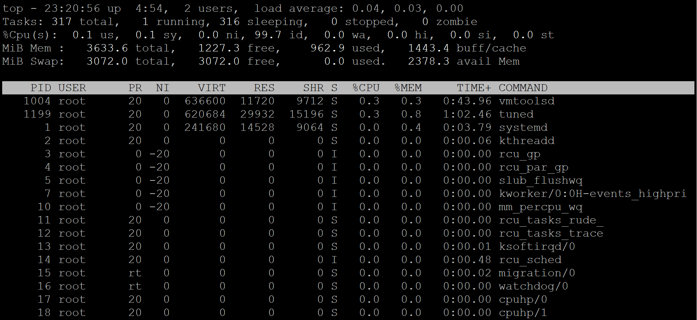

# Linux - Software: Process

[Back](../../index.md)

- [Linux - Software: Process](#linux---software-process)
  - [Terminologies](#terminologies)
    - [`daemon` vs `service`](#daemon-vs-service)
  - [Process](#process)
    - [Process states](#process-states)
  - [`top`: Display processes](#top-display-processes)
    - [System Summary](#system-summary)
    - [Process List](#process-list)
    - [Useful Interactions (While Running)](#useful-interactions-while-running)
  - [`ps`: Display processes information](#ps-display-processes-information)
  - [Process Common](#process-common)
  - [Background and Foreground Processes](#background-and-foreground-processes)
    - [Switch between foreground and background processes](#switch-between-foreground-and-background-processes)
    - [Common commands](#common-commands)
  - [Killing Processes](#killing-processes)
  - [Example: Switch Foreground and Background](#example-switch-foreground-and-background)
    - [Create a long running task.](#create-a-long-running-task)
    - [Bring process to Foreground](#bring-process-to-foreground)
    - [Send the jobs to Background](#send-the-jobs-to-background)
    - [Terminate the Jobs](#terminate-the-jobs)
  - [`lsof`: list files opened by processes](#lsof-list-files-opened-by-processes)
  - [Process Niceness](#process-niceness)
    - [Lab: Change process niceness](#lab-change-process-niceness)
    - [Lab: Renicing a Running Process](#lab-renicing-a-running-process)

---

## Terminologies

- `Command`

  - refers to an **instruction** you give to the **shell** (the command-line interface) to execute a specific task.
  - can be a simple program, part of a larger application, or a shell built-in command.
  - can be used to **invoke** programs or **trigger** scripts to perform actions on the system.
  - e.g.,
    - `ls`, `pwd`, `cat`

- `Script`

  - a series of `commands` written in a scripting language,
  - designed to automate tasks.
  - e.g.,
    - A Bash script (`backup.sh`) to back up files

- `Program`

  - a set of **instructions** or code written to perform a specific task when executed.
  - can be as simple as a **script** or a **compiled binary**.
  - A program is usually **a single executable file**, which can be run on its own.
  - can be **standalone** (e.g., a simple utility like cat), or they can form **part of** a larger application.
  - e.g.,
    - `/bin/ls`, `/usr/bin/vim`, `myscript.sh`.

- `Application`

  - a software designed to **perform specific tasks** for the user or another application.
  - typically includes a **user interface** and interacts with the operating system or other applications to fulfill its purpose.
  - e.g.,
    - Web browser (e.g., Chrome, Firefox)
    - Word processor (e.g., Microsoft Word)
    - Music player (e.g., Spotify)

- `Process`

  - an **instance** of a **program** running on a computer.
  - Each process has its own memory space and system resources allocated to it.
    - A `process` is an **independent program** running in its own memory space
  - e.g.,
    - A running instance of the `python` interpreter.
    - The `nginx` web server process serving HTTP requests.

- `Daemon`

  - a **background process** that **runs continuously** to perform specific tasks or services.
  - Daemons usually start at boot time and do not interact directly with users.
  - Often have names ending with a `d`. e.g.,
    - `sshd`: Handles incoming SSH connections.
    - `httpd`: Manages web server requests.
    - `crond`: Schedules tasks to run at specified times.

- `Threads`

  - the **smallest unit of execution** within a process.
  - A process can have multiple threads running concurrently, sharing the same memory space.
  - used to perform **multiple tasks simultaneously** within a single process, making them essential for **multitasking** and improving the **efficiency** of programs, especially in **multi-core systems**.
  - e.g.,
    - A web browser using multiple threads for rendering pages, handling user input, and downloading files.
    - A multithreaded application like a game that processes graphics, audio, and AI logic simultaneously.

- `Job`

  - a task or set of tasks that a system manages and executes.
  - In Unix-like systems, jobs often refer to tasks started by the shell and can be managed in the background or foreground.
  - e.g.,
    - A `wget` command downloading a file in the background
    - A data processing task scheduled by a job scheduler like `cron` or `at`.

- `systemd`

  - a collection of system management daemons, utilities, and libraries which serves as a replacement of System V init daemon.
  - the parent process of most of the daemons.

- `systemctl`:
  - a **systemd utility** that is responsible for controlling the `systemd` system and service manage.
  - Services are controlled by `systemctl`

---

### `daemon` vs `service`

- A `service` can consist of one or more `daemons` or other `processes` working together.

| Aspect     | Daemon                                          | Service                                       |
| ---------- | ----------------------------------------------- | --------------------------------------------- |
| Definition | A background process performing specific tasks. | A system-wide functionality or feature.       |
| Relation   | A daemon often underpins a service.             | A service may consist of one or more daemons. |
| Management | Managed as processes in the OS.                 | Managed via init systems like `systemctl`.    |
| Examples   | sshd, httpd, crond                              | "SSH service", "Web Server service"           |

- Think of a `daemon` as a **worker** and a `service` as the **job** they perform. For example:
  - Daemon: `httpd` (Apache daemon).
  - Service: The **web server functionality** provided by Apache.

---

## Process

- `Process`

  - In Linux, a `process` is a **running instance** of a **program** or **command**.

---

### Process states

- e five basic process states:

  - running,
  - sleeping,
  - waiting,
  - stopped,
  - and zombie.

- Processes can go through different states, including:
  - `Running`:
    - The process is either **running** or **ready to run**.
  - `Sleeping`:
    - The process is **waiting for a resource** to be available.
  - `Interruptible sleep`:
    - The process is **waiting on data**, such as input from the terminal.
  - `Uninterruptible sleep`:
    - The process is **waiting on something**, and **interrupting** could cause major **issues**.
  - `Stopped`:
    - The process is put **on hold** and **not responsive**.
  - `Zombie`:
    - The process is **dead** but the entry for the process is **still present** in the table.

---

## `top`: Display processes

- top (table of processes)
  - used for real-time viewing and monitoring of processes and system resources.

| Command           | Desc                                                  |
| ----------------- | ----------------------------------------------------- |
| `top`             | Display processes                                     |
| `top -dNUM`       | Set the delay between updates (default: `3` seconds). |
| `top -nNUM`       | Specify the number of updates before exiting.         |
| `top -u username` | Show processes for a specific user.                   |



### System Summary

- Line 1: uptime info
  - current time
  - uptime
  - number of login users
  - average system load over 1, 5, and 15 minutes.
- Line 2: Task info
  - `total`
  - `running`
  - `sleeping`
  - `stopped`
  - `zombie`
- Line 3: CPU Usage
  - `us`: CPU time % spent on **user processes**.
  - `sy`: CPU time % spent on **system (kernel) processes**.
  - `ni`: CPU time % spent on processes with **adjusted niceness**.
  - `id`: CPU time % spent **idle**.
  - `wa`: CPU time % **waiting for I/O** operations.
  - `hi`: CPU time % spent handling **hardware interrupts**.
  - `si`: CPU time % spent handling **software interrupts**.
  - `st`: CPU time % stolen **from the virtual machine** by the host.
- Line 4: Memory Usage Displays total,free, used, and buff/cache.
- Line 5: Swap Usage Displays total, used, free, and available memory.

---

### Process List

| Column    | Desc                                                                   |
| --------- | ---------------------------------------------------------------------- |
| `PID`     | Process ID, a unique identifier for the process.                       |
| `USER`    | The user who owns the process.                                         |
| `PR`      | The priority of the process (higher numbers mean lower priority).      |
| `NI`      | Niceness value, which affects process priority (highest:-20,lowest:19) |
| `VIRT`    | Virtual memory size.                                                   |
| `RES`     | Resident memory, the non-swappable physical memory                     |
| `SHR`     | Shared memory size, the memory shared with other processes.            |
| `S`       | Process state                                                          |
| `%CPU`    | CPU % being used by the process.                                       |
| `%MEM`    | RAM % being used by the process.                                       |
| `TIME+`   | Total CPU time consumed by the process (in minutes and seconds).       |
| `COMMAND` | The command name or path that initiated the process.                   |

- Process state:
  - `R`: Running
  - `S`: Sleeping
  - `D`: Uninterruptible sleep (usually I/O)
  - `T`: Stopped
  - `Z`: Zombie

---

### Useful Interactions (While Running)

| key | desc                                       |
| --- | ------------------------------------------ |
| `q` | Quit the top command.                      |
| `h` | Display help for key bindings.             |
| `k` | Kill a process (prompt for PID).           |
| `P` | Sort processes by CPU usage.               |
| `M` | Sort processes by memory usage.            |
| `T` | Sort processes by runtime.                 |
| `r` | Change the priority (renice) of a process. |
| `s` | Change the refresh rate.                   |

---

## `ps`: Display processes information

- ps (process status)

- List all

| Command                    | Desc                                               |
| -------------------------- | -------------------------------------------------- |
| `ps`                       | Display processes with the current terminal        |
| `ps -l`                    | Displays processes in long format                  |
| `ps -ef`                   | Display every processes in full format.            |
| `ps aux`                   | Displays detailed information about all processes. |
| `ps -o comm,pid,ppid,user` | Customized columns.                                |

- Filter

| Command                             | Desc                                                  |
| ----------------------------------- | ----------------------------------------------------- |
| `ps pid`                            | Display process with a given pid.                     |
| `ps -fC command`                    | Display process with a given command name.            |
| `ps -fu username`                   | Display processes owned by a specific effective user. |
| `ps -fU username`                   | Display processes owned by a specific real user.      |
| `ps -g root` / `ps -G root`         | Display processes owned by a specific group name.     |
| `ps aux \| grep command`            | Filters the output to find specific processes.        |
| `ps aux --sort=-%mem \| head -n 10` | Find the top memory-consuming process                 |
| `ps aux --sort=-%cpu \| head -n 10` | Find the top CPU-consuming process                    |

- Tree

| Command          | Desc                                |
| ---------------- | ----------------------------------- |
| `ps -eH`         | Display a process tree.             |
| `ps -e --forest` | Display a process tree.             |
| `pstree`         | Display processes in a tree format. |

- Common Commands

```sh
# Return top memory-consuming process
ps aux --sort=-%mem | head -n 10
# Find the top CPU-consuming process
ps aux --sort=-%cpu | head -n 10

# search details of a command
ps aux | grep command

# return the pid related to a command
pidof command
# kill process to release resources
kill -9 pid
```

---

- Common columns

  - `PID`: Process ID.
  - `PPID`: Parent Process ID (which process spawned it).
  - `UID`: User ID of the owner.
  - `TTY`: Terminal associated with the process.
  - `TIME`: CPU time consumed by the process.
  - `CMD`: Command that started the process.

- Process state:
  - `R`: Running.
  - `S`: Sleeping (idle).
  - `D`: Uninterruptible sleep (usually IO operations).
  - `I`: Idle kernel thread
  - `T`: Stopped or traced.
  - `Z`: Zombie (terminated but not cleaned up).

---

## Process Common

| CMD          | DESC                                     |
| ------------ | ---------------------------------------- |
| `pidof sshd` | list only the PID of a specific process. |
| `pgrep sshd` | list only the PID of a specific process. |

---

## Background and Foreground Processes

- 2 Types of processes:
  - `Foreground processes`:
    - Also known as `interactive processes`
    - these processes **depend on the user** for input.
  - `Background processes`:
    - Also known as `non-interactive` or `automatic processes`
    - these processes run **independently of the user**.

---

### Switch between foreground and background processes

| Shortcut    | Desc                                    |
| ----------- | --------------------------------------- |
| `command &` | **Start** command in **background**.    |
| `Ctrl-c`    | **Kill** the **foreground** process.    |
| `Ctrl-z`    | **Suspend** the **foreground** process. |

- Suspend:
  - not running in the background, but stop running.

---

### Common commands

| Command     | Desc                                        |
| ----------- | ------------------------------------------- |
| `bg`        | Send the current job to the background.     |
| `bg %num`   | Background a suspended process with number. |
| `fg`        | Foreground the last background process.     |
| `fg %num`   | Foreground a background process with number |
| `jobs`      | List jobs.                                  |
| `jobs -l`   | List jobs with PID.                         |
| `jobs %num` | List a job wit job number.                  |
| `kill`      | Kill a process by job number or PID.        |

- Symbol for jobs:
  - `%%`/`%+`: current job
  - `%-`: previous job

```sh
# list current job
jobs %%
jobs %+

# list previous job
jobs %-
```

- foreground a bg process
  - `fg %num`
  - `%num`: donot need `fg`

---

## Killing Processes

| Command                  | Desc                                           |
| ------------------------ | ---------------------------------------------- |
| `kill -l`                | Display a list of signals.                     |
| `Ctrl-c`                 | **Kills** the **foreground** proc.             |
| `kill %jobnum`           | Kill a process with its job num.               |
| `kill pid`               | Kill a process by id.                          |
| `kill $(pidof crond)`    | Kill a process by name.                        |
| `pkill crond`            | Kill a process by name.                        |
| `kill -9 $(pidof crond)` | Send signal 9 to crond.                        |
| `pkill -9 crond`         | Send signal 9 to crond.                        |
| `pkill -s SIGKILL crond` | Send signal 9 to crond.                        |
| `killall crond`          | Terminate all processes that match a criterion |

- Send a signal to a process.
  - default:
    - `kill -15 123` = `kill -TERM 123` = `kill 123`
  - `kill -9 123`

```sh
kill -l
# 1) SIGHUP       2) SIGINT       3) SIGQUIT      4) SIGILL       5) SIGTRAP
# 6) SIGABRT      7) SIGBUS       8) SIGFPE       9) SIGKILL     10) SIGUSR1
# 11) SIGSEGV     12) SIGUSR2     13) SIGPIPE     14) SIGALRM     15) SIGTERM
# 16) SIGSTKFLT   17) SIGCHLD     18) SIGCONT     19) SIGSTOP     20) SIGTSTP
# 21) SIGTTIN     22) SIGTTOU     23) SIGURG      24) SIGXCPU     25) SIGXFSZ
# 26) SIGVTALRM   27) SIGPROF     28) SIGWINCH    29) SIGIO       30) SIGPWR
# 31) SIGSYS      34) SIGRTMIN    35) SIGRTMIN+1  36) SIGRTMIN+2  37) SIGRTMIN+3
# 38) SIGRTMIN+4  39) SIGRTMIN+5  40) SIGRTMIN+6  41) SIGRTMIN+7  42) SIGRTMIN+8
# 43) SIGRTMIN+9  44) SIGRTMIN+10 45) SIGRTMIN+11 46) SIGRTMIN+12 47) SIGRTMIN+13
# 48) SIGRTMIN+14 49) SIGRTMIN+15 50) SIGRTMAX-14 51) SIGRTMAX-13 52) SIGRTMAX-12
# 53) SIGRTMAX-11 54) SIGRTMAX-10 55) SIGRTMAX-9  56) SIGRTMAX-8  57) SIGRTMAX-7
# 58) SIGRTMAX-6  59) SIGRTMAX-5  60) SIGRTMAX-4  61) SIGRTMAX-3  62) SIGRTMAX-2
# 63) SIGRTMAX-1  64) SIGRTMAX
```

---

## Example: Switch Foreground and Background

### Create a long running task.

- `vi /home/rheladmin/rhcsa/long_running_task.sh`

```sh
#!/bin/bash

# File to store logs
LOGFILE="task.log"

echo "Starting long-running task..."
echo "Logs will be saved to $LOGFILE"

# Loop for 5 minutes (10 iterations of 30 seconds)
for i in {1..100}; do
    echo "$(date): Iteration $i - Task is running..." >> $LOGFILE
    sleep 30
done

echo "Task completed!" >> $LOGFILE
echo "Task finished. Check $LOGFILE for details."
```

- Change mode

```sh
# Make the Script Executable
chmod +x /home/rheladmin/rhcsa/long_running_task.sh
```

- Run script in the background

```sh
# Run the Script 3 times in Background
./long_running_task.sh &
# [1] 9904
# [rheladmin@rhelhost rhcsa]$ Starting long-running task...
# Logs will be saved to task.log

./long_running_task.sh &
# [2] 9915
# [rheladmin@rhelhost rhcsa]$ Starting long-running task...
# Logs will be saved to task.log

./long_running_task.sh &
# [3] 9935
# [rheladmin@rhelhost rhcsa]$ Starting long-running task...
# Logs will be saved to task.log

# list background jobs
jobs
# [1]   Running                 ./long_running_task.sh &
# [2]-  Running                 ./long_running_task.sh &
# [3]+  Running                 ./long_running_task.sh &

ps -C long_running_task
# PID TTY          TIME CMD
# 9904 pts/0    00:00:00 long_running_ta
# 9915 pts/0    00:00:00 long_running_ta
# 9935 pts/0    00:00:00 long_running_ta
```

---

### Bring process to Foreground

```sh
# send the last jobs fg
fg
# ./long_running_task.sh

# suspend job last jobs
^Z
# [3]+  Stopped                 ./long_running_task.sh

jobs
# [1]   Running                 ./long_running_task.sh &
# [2]-  Running                 ./long_running_task.sh &
# [3]+  Stopped                 ./long_running_task.sh


# bring the job 2 using -
fg -
# ./long_running_task.sh
^Z
# [2]+  Stopped                 ./long_running_task.sh
jobs
# [1]   Running                 ./long_running_task.sh &
# [2]+  Stopped                 ./long_running_task.sh
# [3]-  Stopped                 ./long_running_task.sh

# bring the job 1 using number
fg 1
# ./long_running_task.sh
^Z
# [1]+  Stopped                 ./long_running_task.sh

jobs
# [1]+  Stopped                 ./long_running_task.sh
# [2]-  Stopped                 ./long_running_task.sh
# [3]   Stopped                 ./long_running_task.sh
```

---

### Send the jobs to Background

```sh
# bring the stopped jobs 1 running in bg
bg 1
# [1]+ ./long_running_task.sh &
jobs
# [1]-  Running                 ./long_running_task.sh &
# [2]+  Stopped                 ./long_running_task.sh
# [3]   Stopped                 ./long_running_task.sh

# bring the stopped jobs 2 running in bg
bg +
# [2]+ ./long_running_task.sh &
jobs
# [1]   Running                 ./long_running_task.sh &
# [2]-  Running                 ./long_running_task.sh &
# [3]+  Stopped                 ./long_running_task.sh

# bring the current stopped job running in bg
bg
# [3]+ ./long_running_task.sh &
jobs
# [1]   Running                 ./long_running_task.sh &
# [2]-  Running                 ./long_running_task.sh &
# [3]+  Running                 ./long_running_task.sh &
```

---

### Terminate the Jobs

```sh
kill %1
jobs
# [1]   Terminated              ./long_running_task.sh
# [2]-  Running                 ./long_running_task.sh &
# [3]+  Running                 ./long_running_task.sh &

ps -C long_running_task
# PID TTY          TIME CMD
# 9915 pts/0    00:00:00 long_running_ta
# 9935 pts/0    00:00:00 long_running_ta

kill -9 9915 9935
jobs
# [2]-  Killed                  ./long_running_task.sh
# [3]+  Killed                  ./long_running_task.sh
```

---

## `lsof`: list files opened by processes

- `lsof`: provides detailed information about files opened by processes.

| CMD                | DESC                                               |
| ------------------ | -------------------------------------------------- |
| `lsof`             | List all open files                                |
| `lsof -u username` | List open files for a specific user                |
| `lsof -p PID`      | List open files for a specific process ID (PID)    |
| `lsof file_name`   | List processes using a specific file               |
| `lsof -i:80`       | Find processes using a specific port               |
| `lsof -i`          | List network connections                           |
| `lsof /dev/sda1`   | List open files on a specific device or filesystem |

- Example

```sh
./long_running_task.sh &

lsof long_running_task.sh
# COMMAND     PID      USER   FD   TYPE DEVICE SIZE/OFF     NODE NAME
# long_runn 10407 rheladmin  255r   REG  253,0      373 19764850 long_running_task.sh
```

---

## Process Niceness

- 40 niceness values,

  - default niceness of 0.
  - -20 being the highest: most favorable
  - +19 being the lowest: the least favorable

- used by the process scheduler to adjust the execution time of the processes on the CPU.

- A higher niceness lowers the execution priority of a process, and a lower niceness increases it.

  - a process running at a higher priority gets more CPU attention.

- A child process **inherits** the niceness of its calling
  process in its priority calculation.

- internal mapping between niceness levels and priorities

---

- Viewing and Changing Process Niceness

`ps -efl`

---

### Lab: Change process niceness

```sh
# default niceness
nice
# 0

# To run the top command at a lower priority with a nice value of +2:
nice -n 2 top
# top - 14:32:57 up  7:35,  1 user,  load average: 0.00, 0.00, 0.00
# Tasks: 271 total,   1 running, 270 sleeping,   0 stopped,   0 zombie
# %Cpu(s):  0.2 us,  0.3 sy,  0.2 ni, 99.3 id,  0.0 wa,  0.0 hi,  0.0 si,  0.0 st
# MiB Mem :   1743.6 total,    204.9 free,    973.8 used,    740.4 buff/cache
# MiB Swap:   2048.0 total,   2045.2 free,      2.8 used.    769.8 avail Mem

#     PID USER      PR  NI    VIRT    RES    SHR S  %CPU  %MEM     TIME+ COMMAND
#     860 root      20   0  456400   8680   7152 S   0.7   0.5   1:01.95 vmtoolsd
#    6333 root      22   2  226016   4300   3412 R   0.3   0.2   0:00.14 top
#       1 root      20   0  172636  16436  10648 S   0.0   0.9   0:02.03 systemd
#       2 root      20   0       0      0      0 S   0.0   0.0   0:00.02 kthreadd

ps -el | grep top
# 4 S     0    6333    5913  0  82   2 - 56504 -      pts/0    00:00:00 top


nice -n -10 top
# top - 14:35:14 up  7:38,  2 users,  load average: 0.04, 0.02, 0.00
# Tasks: 277 total,   1 running, 276 sleeping,   0 stopped,   0 zombie
# %Cpu(s):  0.2 us,  0.2 sy,  0.0 ni, 99.2 id,  0.2 wa,  0.2 hi,  0.2 si,  0.0 st
# MiB Mem :   1743.6 total,    202.2 free,    976.4 used,    740.6 buff/cache
# MiB Swap:   2048.0 total,   2045.2 free,      2.8 used.    767.2 avail Mem

#     PID USER      PR  NI    VIRT    RES    SHR S  %CPU  %MEM     TIME+ COMMAND
#    6403 root      10 -10  226016   4300   3412 R   0.7   0.2   0:00.03 top
#    1712 gdm       20   0  603080  14968   9488 S   0.3   0.8   0:02.15 gsd-smartcard
#       1 root      20   0  172636  16436  10648 S   0.0   0.9   0:02.05 systemd

ps -el | grep top

ps -lC top
# F S   UID     PID    PPID  C PRI  NI ADDR SZ WCHAN  TTY          TIME CMD
# 4 S     0    6403    5913  0  70 -10 - 56504 -      pts/0    00:00:00 top
```

---

### Lab: Renicing a Running Process

```sh
# change the niceness of the running top session from -10 to +5, specify the PID (5572 from column 4 above) with the renice command.

renice 5 6469
# 6469 (process ID) old priority 0, new priority 5

top -p 6469
# top - 14:42:35 up  7:45,  2 users,  load average: 0.00, 0.00, 0.00
# Tasks:   1 total,   0 running,   1 sleeping,   0 stopped,   0 zombie
# %Cpu(s):  0.2 us,  0.2 sy,  0.2 ni, 99.3 id,  0.0 wa,  0.2 hi,  0.0 si,  0.0 st
# MiB Mem :   1743.6 total,    199.1 free,    979.5 used,    740.7 buff/cache
# MiB Swap:   2048.0 total,   2045.2 free,      2.8 used.    764.1 avail Mem

#     PID USER      PR  NI    VIRT    RES    SHR S  %CPU  %MEM     TIME+ COMMAND
#    6469 root      25   5  226016   4296   3408 S   0.7   0.2   0:00.15 top

ps 6469 -l
# F S   UID     PID    PPID  C PRI  NI ADDR SZ WCHAN  TTY        TIME CMD
# 4 S     0    6469    5913  0  85   5 - 56504 do_sel pts/0      0:00 top
```

---

[TOP](#linux---software-management-process)
