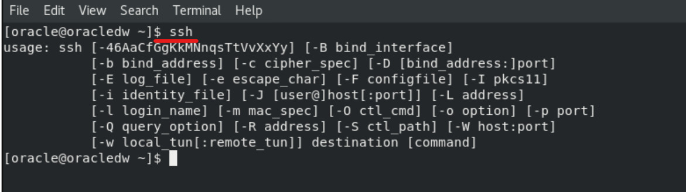

# Lab: Enable SSH

[Back](./index.md)

- [Lab: Enable SSH](#lab-enable-ssh)
  - [SSH](#ssh)
  - [Install Openssh](#install-openssh)

---

## SSH

- Default port: 22

| Command                  | Description                                           |
| ------------------------ | ----------------------------------------------------- |
| `ssh user@ip`            | Connect remote instance using username and ip address |
| `ssh user@ip -p portNum` | SSH connection using custom port number               |

- Check whether SSH untility is on Ubuntu



---

## Install Openssh

- Intall openssh-server

```sh
sudo apt-get -y update  # update packages
# update the local package index. It downloads package details from all set sources to refresh the package cache.
# sudo: Superuser Do,
# apt: package manager
# sudo apt: allows a root user to perform operations in the apt repository.
# sudo apt update: downloads package details from all set sources which are commonly listed in the /etc/apt/sources.list file and other files found in the /etc/apt/sources.list.d directory. As a result, apt package cache will be updated ensuring your system has the latest package information.
sudo apt-get -y install openssh-server  # in
```

- Check and enable ssh

```sh
sudo systemctl status ssh   # check status
sudo systemctl enable ssh --now   # enable and start the ssh service immediately
```

- Test for SSH: Connect the local host using SSH

```sh
ssh localhost   # build connection to localhost using SSH, pwd is required.
```

---

- Get the public url

```sh
curl ifconfig.me
```


- Connect to remote using Git Bash terminal

```sh
ssh username@ip
ssh oracle@142.214.88.41
```


---

[TOP](#lab-enable-ssh)
