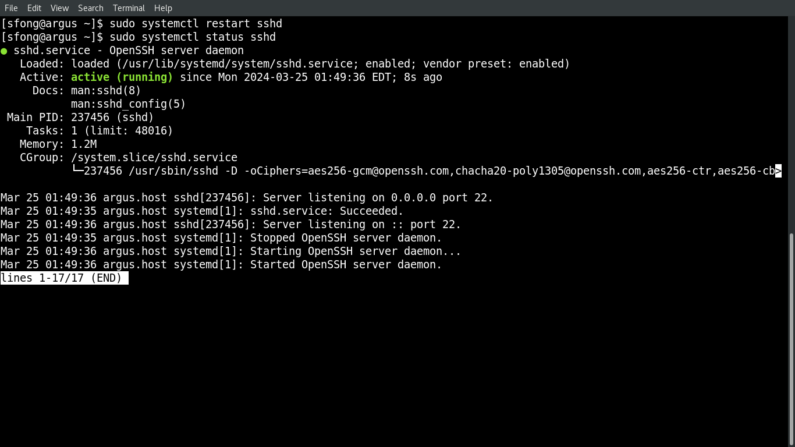
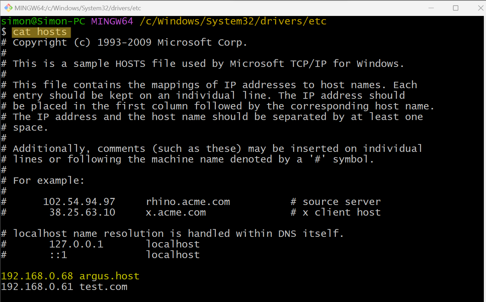
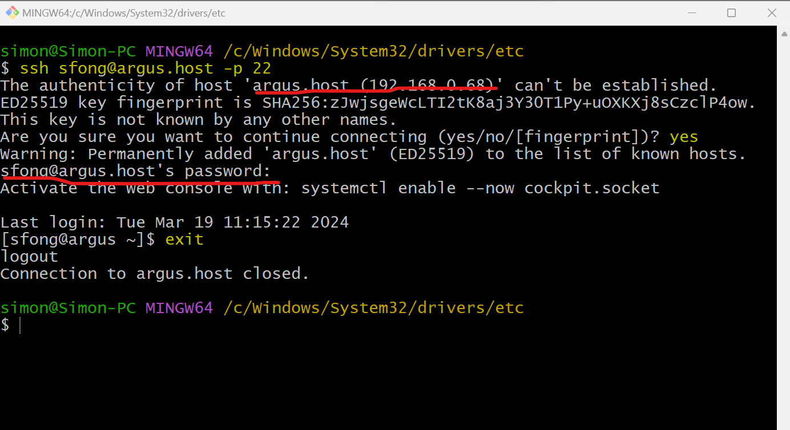
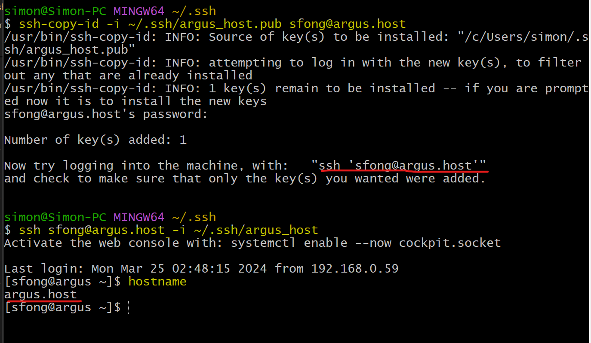
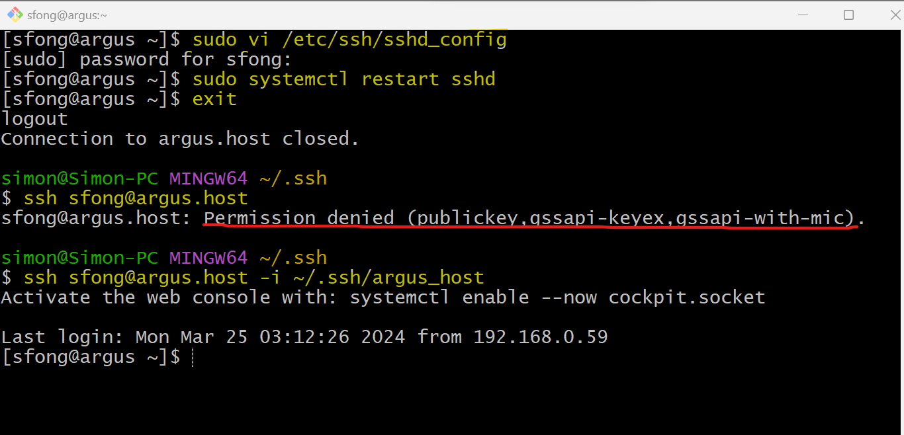

# Establish `SSH`

[Back](../index.md)

- [Establish `SSH`](#establish-ssh)
  - [SSH on Ubuntu](#ssh-on-ubuntu)
    - [Install Openssh](#install-openssh)
  - [SSH On Oracle Linux](#ssh-on-oracle-linux)
    - [`openssh-server`](#openssh-server)
    - [Verify `openssh-server` Installation](#verify-openssh-server-installation)
    - [Start, Enable `sshd` Deamon](#start-enable-sshd-deamon)
    - [Configuration Files](#configuration-files)
    - [`sshd` Deamon](#sshd-deamon)
    - [Firewall Configuration](#firewall-configuration)
    - [Lab: Create a SSH using password authentication](#lab-create-a-ssh-using-password-authentication)
      - [Server side](#server-side)
      - [Client](#client)
    - [Lab: Create a SSH using Key-pair Authentication](#lab-create-a-ssh-using-key-pair-authentication)
    - [Lab: Custom SSH port](#lab-custom-ssh-port)

---

## SSH on Ubuntu

- Default port: 22

| Command                  | Description                                           |
| ------------------------ | ----------------------------------------------------- |
| `ssh user@ip`            | Connect remote instance using username and ip address |
| `ssh user@ip -p portNum` | SSH connection using custom port number               |

- Check whether SSH untility is on Ubuntu


---

### Install Openssh

- Intall openssh-server

```sh
sudo apt-get -y update  # update packages
# update the local package index. It downloads package details from all set sources to refresh the package cache.
# sudo: Superuser Do,
# apt: package manager
# sudo apt: allows a root user to perform operations in the apt repository.
# sudo apt update: downloads package details from all set sources which are commonly listed in the /etc/apt/sources.list file and other files found in the /etc/apt/sources.list.d directory. As a result, apt package cache will be updated ensuring your system has the latest package information.
sudo apt-get -y install openssh-server  # in
```

- Check and enable ssh

```sh
sudo systemctl status ssh   # check status
sudo systemctl enable ssh --now   # enable and start the ssh service immediately
```

- Test for SSH: Connect the local host using SSH

```sh
ssh localhost   # build connection to localhost using SSH, pwd is required.
```

---

- Get the public url

```sh
curl ifconfig.me
```


- Connect to remote using Git Bash terminal

```sh
ssh username@ip
ssh oracle@142.214.88.41
```

---

## SSH On Oracle Linux

- When the physical connection with a system is required, the remote access can be enabled using `SSH`, aka `Secure Shell`.

- Server (Oracle Linux 8):
  - the machine to which the user wants to connect
- Client (Windows 11):
  - the machine from which the user is connecting

---

### `openssh-server`

- `openssh-server`
  - a suite of **network connectivity tools** that provides secure communications between systems.
- The tools include:

  - `scp` - Secure file copying. (Deprecated in Oracle Linux 9)
  - `sftp` - Secure **File Transfer** Protocol (FTP).
  - `ssh` - Secure shell to log on to or run a command on a remote system.
  - `sshd` - **Daemon** that listens for the OpenSSH services.
  - `ssh-keygen` - Creates RSA authentication **keys**.

- Doc:
  - https://docs.oracle.com/en/operating-systems/oracle-linux/openssh/openssh-AboutOpenSSH.html#about-openssh

---

### Verify `openssh-server` Installation

- By default, openssh-server is installed out of the box.

```sh
# list packages to verify installation
dnf list installed | grep ssh

# if needed to install
sudo dnf install openssh-server
```

---

### Start, Enable `sshd` Deamon

```sh
sudo systemctl start sshd   # Start the sshd service
sudo systemctl enable sshd    # configure it to start following a system reboot
```

---

### Configuration Files

- Location:
  - server-side settings: `/etc/ssh/sshd_config`
  - client-side settings: `ssh_config`

---

- `Port`

  - the port on which SSH listens
  - default: 22

- `PermitRootLogin`

  - Whether enabling root login
  - Default: yes
  - Best practice: `no`
    - Set PermitRootLogin to no to prohibit root from logging in with SSH. Then, elevate a user's privileges after logging in.
    - `PermitRootLogin no`

- `PubkeyAuthentication`

  - allow users to use key pair to login instead of passwords.
  - Best practise: yes
    - `PubkeyAuthentication yes`

- `PasswordAuthentication`
  - allow clients to login with a username and password defined on the server system.
  - Default: yes
  - Best practise: no
    - `PasswordAuthentication no`

---

### `sshd` Deamon

```sh
# start
sudo systemctl start sshd
# restart deamon after new configuration
sudo systemctl restart sshd
# status
sudo systemctl status sshd
```

---

### Firewall Configuration

- Configure the firewall to allow ssh connections.
  - allowing the port of SSH

```sh
# configure firewall settings
sudo firewall-cmd --permanent --add-service=ssh
# success

# reload the firewall to enable the new settings
sudo firewall-cmd --reload
```

---

### Lab: Create a SSH using password authentication

#### Server side

```sh
# list packages to verify installation
dnf list installed | grep ssh

sudo systemctl start sshd   # start deamon
```


---

- Disable root

```sh
sudo vi /etc/ssh/sshd_config
```

```conf
PermitRootLogin no
```


- Update deamon

```sh
sudo systemctl restart sshd   # restart deamon after new configuration
sudo systemctl status sshd
```



- Update firewall

```sh
sudo firewall-cmd --permanent --add-service=ssh
sudo firewall-cmd --reload
sudo firewall-cmd --list-all
```


- Get the IP address


---

#### Client

- OS: Window
- Terminal: Git bash

- Configure hosts on Client





```sh
# verify ssh
ssh -V
# OpenSSH_9.1p1, OpenSSL 1.1.1s  1 Nov 2022

ssh user_name@ip_address -p 22
```



---

### Lab: Create a SSH using Key-pair Authentication

- Client:
  - Create private key + public key
  - Keep the private key
- Server:
  - Keep the public key
  - Verfity the private key of a connection request
  - path of copied public key:
    - `~/.ssh.authorized_keys`

---

- Client Side

```sh
ssh-keygen    # generate rsa key pair

ls -al ~/.ssh   # confirm
```


```sh
ssh-copy-id -i ~/.ssh/key_file.pub user_name@ip_address   # copy pulic key to server side

# Connect to the remove server using key-pair
ssh user_name@ip_address -i ~/.ssh/key_file
```



---

- Disable password authentication after enabling key-paire authentication

```sh
sudo vi /etc/ssh/sshd_config
```

```conf
PasswordAuthentication no
PubkeyAuthentication yes
```


---

- Restart deamon and exit the current session
  - Reconnect to the remote server using password
    - Connect deney
  - Reconnect to the remote server using key-pair
    - Connect success

```sh
sudo systemctl restart sshd
exit

ssh user_name@ip_address
# permission denied

ssh user_name@ip_address -i ~/.ssh/key_file
# success
```



---

### Lab: Custom SSH port

- update ssh configuration file

```conf
Port 12345
```

---

```sh
# update deamon
sudo systemctl restart sshd   # restart deamon after new configuration
sudo systemctl status sshd    # return status

# update firewall
sudo firewall-cmd --add-port=12345/tcp --permanent
# update selinux
semanage port -a -t ssh_port -p tcp 12345
```

---

- Client

```sh
ssh user_name@ip_address -p 12345
```

---

[TOP](#establish-ssh)
