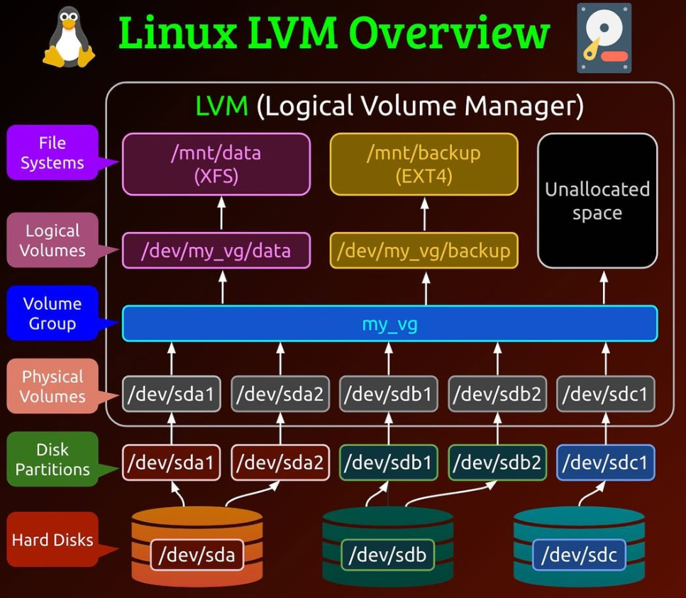

# Linux - Storage: Logical Volume Manager

[Back](../../index.md)

- [Linux - Storage: Logical Volume Manager](#linux---storage-logical-volume-manager)
  - [Logical Volume Manager (LVM)](#logical-volume-manager-lvm)
    - [Physical Volume](#physical-volume)
    - [Volume Group](#volume-group)
    - [Logical Volume](#logical-volume)
    - [File System](#file-system)
  - [Lab: Add Disk and Create LVM Partition](#lab-add-disk-and-create-lvm-partition)
    - [Add a New Hard Disk](#add-a-new-hard-disk)
    - [Identify New Device](#identify-new-device)
    - [Create New Partition](#create-new-partition)
    - [Create a Physical Volume](#create-a-physical-volume)
    - [Create New Volume Group](#create-new-volume-group)
    - [Create Logical Volume](#create-logical-volume)
    - [Format for New Filesystem](#format-for-new-filesystem)
    - [Mount New Filesystem](#mount-new-filesystem)
    - [Persist New Filesystem](#persist-new-filesystem)
  - [Lab: Add and Extend Disk with LVM](#lab-add-and-extend-disk-with-lvm)
    - [Add New Disk](#add-new-disk)
    - [Identify New Device](#identify-new-device-1)
    - [Create New Partition](#create-new-partition-1)
    - [Create Physical Volume from Partition](#create-physical-volume-from-partition)
    - [Identify target Logical Volume and Volume Group to Extend](#identify-target-logical-volume-and-volume-group-to-extend)
    - [Extend Volume Group by associating New Physical Volume](#extend-volume-group-by-associating-new-physical-volume)
    - [Extend target Logical Volume](#extend-target-logical-volume)
    - [Extend target Filesystem](#extend-target-filesystem)

---

## Logical Volume Manager (LVM)

- `Logical Volume Manager (LVM)`

  - a Linux **storage management tool** that allows system administrators to **create** logical storage **volumes**, or logical volumes, **from physical storage**.

- Advantages
  - **Flexibility**:
    - **Resize** `logical volumes` dynamically **without unmounting or restarting**.
  - **Snapshotting**:
    - **Create snapshots** for backups or testing.
  - **Striping**:
    - Improve performance by **spreading data** across multiple disks.
  - **Disk Management**:
    - Easily add or remove `physical volumes`.
  - **Better Disk Utilization**:
    - **Allocate** storage **as needed** instead of pre-defining fixed sizes

---



- `Physical Volume (PV)`:

  - Represents a physical storage **device or a partition** on a disk.
  - Example: `/dev/sda1`, `/dev/sda2`.

- `Volume Group (VG)`:

  - A pool of `physical volumes` grouped together.
  - Acts as a **container** for `logical volumes`.
  - Example: `my_vg`

- `Logical Volume (LV)`:

  - A **virtual partition** carved out of a `volume group`.
  - Example: `/dev/my_vg/data`.

---

### Physical Volume

| CMD                        | DESC                                          |
| -------------------------- | --------------------------------------------- |
| `pvdisplay`                | Display Physical Volume Information           |
| `pvdisplay device`         | Display a specific Physical Volume            |
| `pvs`                      | Display Physical Volume Statistics            |
| `pvs device`               | Display a specific Physical Volume Statistics |
| `pvcreate device`          | Create a Physical Volume                      |
| `pvresize device`          | Resize a Physical Volume                      |
| `pvmove /dev/sdb /dev/sdc` | Move Data Between Physical Volumes            |
| `pvremove device`          | Remove a Physical Volume                      |

---

### Volume Group

| CMD                          | DESC                                                 |
| ---------------------------- | ---------------------------------------------------- |
| `vgdisplay`                  | Display all Volume Group                             |
| `vgdisplay vg_name`          | Display a Volume Group                               |
| `vgs`                        | Display all Volume Group Statistics                  |
| `vgs vg_name`                | Display a Volume Group Statistics                    |
| `vgcreate vg_name pv_name`   | Create a Volume Group from a Physical Volume         |
| `vgcreate vg_name pv1 pv2`   | Create a Volume Group from multiple Physical Volumes |
| `vgextend vg_name pv_name`   | Add a Physical Volume to a Volume Group              |
| `vgreduce vg_name pv_name`   | Remove a Physical Volume from a Volume Group         |
| `vgremove vg_name`           | Remove a Volume Group                                |
| `vgchange -a y vg_name`      | Activate a Volume Group                              |
| `vgchange -a n vg_name`      | Deactivate a Volume Group                            |
| `vgrename old_name new_name` | Rename a Volume Group                                |
| `vgcfgbackup vg_name`        | Backup Volume Group Metadata                         |
| `vgcfgrestore vg_name`       | Restore Volume Group Metadata                        |

---

### Logical Volume

| CMD                                                     | DESC                                  |
| ------------------------------------------------------- | ------------------------------------- |
| `lvdisplay`                                             | Display Logical Volume Information    |
| `lvdisplay lv_path`                                     | Display a Logical Volume Information  |
| `lvs`                                                   | Display Logical Volume Metadata       |
| `lvs lv_path`                                           | Display a Logical Volume Metadata     |
| `lvcreate -L SIZE -n lv_name vg_name`                   | Create a Logical Volume               |
| `lvextend -L+SIZE lv_path`                              | Extend a Logical Volume               |
| `lvreduce -L-SIZE lv_path`                              | Reduce a Logical Volume               |
| `lvremove lv_path`                                      | Remove a Logical Volume               |
| `lvrename vg_name old_name new_name`                    | Rename a Logical Volume               |
| `lvcreate -L SIZE -s -n snapshot_name original_lv_name` | Create a Snapshot of a Logical Volume |
| `lvchange -ay lv_path`                                  | Activate a Logical Volume             |
| `lvchange -an lv_path`                                  | Deactivate a Logical Volume           |

---

### File System

| CMD                                 | DESC                                      |
| ----------------------------------- | ----------------------------------------- |
| `blkid fs_name`                     | Display file system type and UUID.        |
| `file -s fs_name`                   | Display the file system type of a device. |
| `df -h`                             | Display File System Usage                 |
| `mkfs.fs_type partition`            | Create a file system on a partition       |
| `mkfs.fs_type lv_path`              | Create a file system on a logical volume. |
| `resize2fs fs_name`                 | Increase ext4 size                        |
| `resize2fs fs_name new_size`        | Decrease ext4 size                        |
| `xfs_growfs fs_name`                | Increase XFS size                         |
| `mount fs_name dir`                 | Mount a file system to a directory.       |
| `mount -t ext4 fs_name mount_point` | Mount with a specific file system type    |
| `umount fs_name`                    | Unmount a File System                     |
| `umount mount_point`                | Unmount a File System                     |

---

## Lab: Add Disk and Create LVM Partition

### Add a New Hard Disk

- Add a new disk(1GB IDE)

---

### Identify New Device

```sh
lsblk
# NAME                   MAJ:MIN RM SIZE RO TYPE MOUNTPOINT
# sda                      8:0    0   2G  0 disk
# └─sda1                   8:1    0   2G  0 part /data
# sdb                      8:16   0   1G  0 disk
# nvme0n1                259:0    0  30G  0 disk
# ├─nvme0n1p1            259:1    0   1G  0 part /boot
# └─nvme0n1p2            259:2    0  29G  0 part
#   ├─rhel_rhelhost-root 253:0    0  26G  0 lvm  /
#   └─rhel_rhelhost-swap 253:1    0   3G  0 lvm  [SWAP]

fdisk -l
# Disk /dev/nvme0n1: 30 GiB, 32212254720 bytes, 62914560 sectors
# Units: sectors of 1 * 512 = 512 bytes
# Sector size (logical/physical): 512 bytes / 512 bytes
# I/O size (minimum/optimal): 512 bytes / 512 bytes
# Disklabel type: dos
# Disk identifier: 0xed2f4154

# Device         Boot   Start      End  Sectors Size Id Type
# /dev/nvme0n1p1 *       2048  2099199  2097152   1G 83 Linux
# /dev/nvme0n1p2      2099200 62914559 60815360  29G 8e Linux LVM


# Disk /dev/sdb: 1 GiB, 1073741824 bytes, 2097152 sectors
# Units: sectors of 1 * 512 = 512 bytes
# Sector size (logical/physical): 512 bytes / 512 bytes
# I/O size (minimum/optimal): 512 bytes / 512 bytes


# Disk /dev/sda: 2 GiB, 2147483648 bytes, 4194304 sectors
# Units: sectors of 1 * 512 = 512 bytes
# Sector size (logical/physical): 512 bytes / 512 bytes
# I/O size (minimum/optimal): 512 bytes / 512 bytes
# Disklabel type: dos
# Disk identifier: 0xca628ef4

# Device     Boot Start     End Sectors Size Id Type
# /dev/sda1        2048 4194303 4192256   2G 83 Linux


# Disk /dev/mapper/rhel_rhelhost-root: 26 GiB, 27913093120 bytes, 54517760 sectors
# Units: sectors of 1 * 512 = 512 bytes
# Sector size (logical/physical): 512 bytes / 512 bytes
# I/O size (minimum/optimal): 512 bytes / 512 bytes


# Disk /dev/mapper/rhel_rhelhost-swap: 3 GiB, 3221225472 bytes, 6291456 sectors
# Units: sectors of 1 * 512 = 512 bytes
# Sector size (logical/physical): 512 bytes / 512 bytes
# I/O size (minimum/optimal): 512 bytes / 512 bytes
```

> New device is `/dev/sdb`

---

### Create New Partition

```sh
fdisk /dev/sdb
# create new partion
n
# partition type is primary
p
# Display the partition table
p
# Disk /dev/sdb: 1 GiB, 1073741824 bytes, 2097152 sectors
# Units: sectors of 1 * 512 = 512 bytes
# Sector size (logical/physical): 512 bytes / 512 bytes
# I/O size (minimum/optimal): 512 bytes / 512 bytes
# Disklabel type: dos
# Disk identifier: 0xead41e87

# Device     Boot Start     End Sectors  Size Id Type
# /dev/sdb1        2048 2097151 2095104 1023M 83 Linux
# change partition's id
t
# list all hex codes
L
# 8e  Linux LVM
# Select Linux LVM
8e
# Changed type of partition 'Linux' to 'Linux LVM'.
# confirm
p
# Disk /dev/sdb: 1 GiB, 1073741824 bytes, 2097152 sectors
# Units: sectors of 1 * 512 = 512 bytes
# Sector size (logical/physical): 512 bytes / 512 bytes
# I/O size (minimum/optimal): 512 bytes / 512 bytes
# Disklabel type: dos
# Disk identifier: 0xead41e87

# Device     Boot Start     End Sectors  Size Id Type
# /dev/sdb1        2048 2097151 2095104 1023M 8e Linux LVM
# Save and exit
w
# The partition table has been altered.
# Calling ioctl() to re-read partition table.
# Syncing disks.


# Confirm
fdisk -l
# Disk /dev/sdb: 1 GiB, 1073741824 bytes, 2097152 sectors
# Units: sectors of 1 * 512 = 512 bytes
# Sector size (logical/physical): 512 bytes / 512 bytes
# I/O size (minimum/optimal): 512 bytes / 512 bytes
# Disklabel type: dos
# Disk identifier: 0xead41e87

# Device     Boot Start     End Sectors  Size Id Type
# /dev/sdb1        2048 2097151 2095104 1023M 8e Linux LVM
```

---

### Create a Physical Volume

```sh
# create a PV from a partition
pvcreate /dev/sdb1
#  Physical volume "/dev/sdb1" successfully created.

# confirm
pvdisplay
  # --- Physical volume ---
  # PV Name               /dev/nvme0n1p2
  # VG Name               rhel_rhelhost
  # PV Size               <29.00 GiB / not usable 3.00 MiB
  # Allocatable           yes (but full)
  # PE Size               4.00 MiB
  # Total PE              7423
  # Free PE               0
  # Allocated PE          7423
  # PV UUID               fF9nr1-dLGi-m8Ke-q6sT-cQYQ-Y0bQ-cuDcZM

  # "/dev/sdb1" is a new physical volume of "1023.00 MiB"
  # --- NEW Physical volume ---
  # PV Name               /dev/sdb1
  # VG Name
  # PV Size               1023.00 MiB
  # Allocatable           NO
  # PE Size               0
  # Total PE              0
  # Free PE               0
  # Allocated PE          0
  # PV UUID               FR9v0Z-Gpyu-U3g2-U4Bq-FmDx-N4rV-N56GOk
```

---

### Create New Volume Group

```sh
# create VG from a PV with a name
vgcreate vg_oracle /dev/sdb1
  # Volume group "vg_oracle" successfully created
# confirm
vgdisplay vg_oracle
  # --- Volume group ---
  # VG Name               vg_oracle
  # System ID
  # Format                lvm2
  # Metadata Areas        1
  # Metadata Sequence No  1
  # VG Access             read/write
  # VG Status             resizable
  # MAX LV                0
  # Cur LV                0
  # Open LV               0
  # Max PV                0
  # Cur PV                1
  # Act PV                1
  # VG Size               1020.00 MiB
  # PE Size               4.00 MiB
  # Total PE              255
  # Alloc PE / Size       0 / 0
  # Free  PE / Size       255 / 1020.00 MiB
  # VG UUID               LW1UW4-spXc-DYME-3vW0-5Mth-3Hb3-OkTTYj
```

---

### Create Logical Volume

```sh
# create LV from VG with a name
lvcreate -n lv_oracle --size 1000M vg_oracle
# Logical volume "lv_oracle" created.


# confirm
lvdisplay vg_oracle
  # --- Logical volume ---
  # LV Path                /dev/vg_oracle/lv_oracle
  # LV Name                lv_oracle
  # VG Name                vg_oracle
  # LV UUID                NrxBfX-I9kp-LN7d-43Da-XwFh-2Bgz-cA7OGl
  # LV Write Access        read/write
  # LV Creation host, time serverhost, 2024-12-19 23:09:27 -0500
  # LV Status              available
  # # open                 0
  # LV Size                1000.00 MiB
  # Current LE             250
  # Segments               1
  # Allocation             inherit
  # Read ahead sectors     auto
  # - currently set to     8192
  # Block device           253:2
```

---

### Format for New Filesystem

```sh
mkfs.xfs /dev/vg_oracle/lv_oracle
# meta-data=/dev/vg_oracle/lv_oracle isize=512    agcount=4, agsize=64000 blks
#          =                       sectsz=512   attr=2, projid32bit=1
#          =                       crc=1        finobt=1, sparse=1, rmapbt=0
#          =                       reflink=1    bigtime=0 inobtcount=0
# data     =                       bsize=4096   blocks=256000, imaxpct=25
#          =                       sunit=0      swidth=0 blks
# naming   =version 2              bsize=4096   ascii-ci=0, ftype=1
# log      =internal log           bsize=4096   blocks=1566, version=2
#          =                       sectsz=512   sunit=0 blks, lazy-count=1
# realtime =none                   extsz=4096   blocks=0, rtextents=0
```

---

### Mount New Filesystem

```sh
# create mount point
mkdir /oracle
# mount fs
mount /dev/vg_oracle/lv_oracle /oracle

# confirm
lsblk
# NAME                    MAJ:MIN RM  SIZE RO TYPE MOUNTPOINT
# sda                       8:0    0    2G  0 disk
# └─sda1                    8:1    0    2G  0 part /data
# sdb                       8:16   0    1G  0 disk
# └─sdb1                    8:17   0 1023M  0 part
#   └─vg_oracle-lv_oracle 253:2    0 1000M  0 lvm  /oracle
# nvme0n1                 259:0    0   30G  0 disk
# ├─nvme0n1p1             259:1    0    1G  0 part /boot
# └─nvme0n1p2             259:2    0   29G  0 part
#   ├─rhel_rhelhost-root  253:0    0   26G  0 lvm  /
#   └─rhel_rhelhost-swap  253:1    0    3G  0 lvm  [SWAP]

fdisk -l
# Disk /dev/nvme0n1: 30 GiB, 32212254720 bytes, 62914560 sectors
# Units: sectors of 1 * 512 = 512 bytes
# Sector size (logical/physical): 512 bytes / 512 bytes
# I/O size (minimum/optimal): 512 bytes / 512 bytes
# Disklabel type: dos
# Disk identifier: 0xed2f4154

# Device         Boot   Start      End  Sectors Size Id Type
# /dev/nvme0n1p1 *       2048  2099199  2097152   1G 83 Linux
# /dev/nvme0n1p2      2099200 62914559 60815360  29G 8e Linux LVM


# Disk /dev/sdb: 1 GiB, 1073741824 bytes, 2097152 sectors
# Units: sectors of 1 * 512 = 512 bytes
# Sector size (logical/physical): 512 bytes / 512 bytes
# I/O size (minimum/optimal): 512 bytes / 512 bytes
# Disklabel type: dos
# Disk identifier: 0xead41e87

# Device     Boot Start     End Sectors  Size Id Type
# /dev/sdb1        2048 2097151 2095104 1023M 8e Linux LVM


# Disk /dev/sda: 2 GiB, 2147483648 bytes, 4194304 sectors
# Units: sectors of 1 * 512 = 512 bytes
# Sector size (logical/physical): 512 bytes / 512 bytes
# I/O size (minimum/optimal): 512 bytes / 512 bytes
# Disklabel type: dos
# Disk identifier: 0xca628ef4

# Device     Boot Start     End Sectors Size Id Type
# /dev/sda1        2048 4194303 4192256   2G 83 Linux


# Disk /dev/mapper/rhel_rhelhost-root: 26 GiB, 27913093120 bytes, 54517760 sectors
# Units: sectors of 1 * 512 = 512 bytes
# Sector size (logical/physical): 512 bytes / 512 bytes
# I/O size (minimum/optimal): 512 bytes / 512 bytes


# Disk /dev/mapper/rhel_rhelhost-swap: 3 GiB, 3221225472 bytes, 6291456 sectors
# Units: sectors of 1 * 512 = 512 bytes
# Sector size (logical/physical): 512 bytes / 512 bytes
# I/O size (minimum/optimal): 512 bytes / 512 bytes


# Disk /dev/mapper/vg_oracle-lv_oracle: 1000 MiB, 1048576000 bytes, 2048000 sectors
# Units: sectors of 1 * 512 = 512 bytes
# Sector size (logical/physical): 512 bytes / 512 bytes
# I/O size (minimum/optimal): 512 bytes / 512 bytes
```

---

### Persist New Filesystem

```sh
# add new entry for new fs
vi /etc/fstab
# /dev/mapper/vg_oracle-lv_oracle         /oracle         xfs         defaults      0       0

# load fs from fstab
mount -a
# mount: (hint) your fstab has been modified, but systemd still uses
#        the old version; use 'systemctl daemon-reload' to reload.

# confirm
df -h
# Filesystem                       Size  Used Avail Use% Mounted on
# devtmpfs                         1.8G     0  1.8G   0% /dev
# tmpfs                            1.8G     0  1.8G   0% /dev/shm
# tmpfs                            1.8G  9.6M  1.8G   1% /run
# tmpfs                            1.8G     0  1.8G   0% /sys/fs/cgroup
# /dev/mapper/rhel_rhelhost-root    26G  7.3G   19G  28% /
# /dev/nvme0n1p1                  1014M  362M  653M  36% /boot
# /dev/sda1                        2.0G   24K  1.9G   1% /data
# tmpfs                            364M   12K  364M   1% /run/user/42
# tmpfs                            364M  4.0K  364M   1% /run/user/1001
# /dev/mapper/vg_oracle-lv_oracle  994M   40M  955M   4% /oracle
```

---

## Lab: Add and Extend Disk with LVM

- Scenario:

  - lv_oracle created and mounted on /oracle
  - lv_oracle almost full and require more space

- Solution:
  - Free up disk space by removing obsolete files.
  - Add new physical disk and mount on /oracle2
  - Create a new virtual disk and mount on /oracle2
  - Add new physical disk and extend /oracle via LVM

---

### Add New Disk

- Add 1GB IDE

---

### Identify New Device

```sh
lsblk
# NAME                    MAJ:MIN RM  SIZE RO TYPE MOUNTPOINT
# sda                       8:0    0    2G  0 disk
# └─sda1                    8:1    0    2G  0 part /data
# sdb                       8:16   0    1G  0 disk
# └─sdb1                    8:17   0 1023M  0 part
#   └─vg_oracle-lv_oracle 253:2    0 1000M  0 lvm  /oracle
# sdc                       8:32   0    1G  0 disk
# nvme0n1                 259:0    0   30G  0 disk
# ├─nvme0n1p1             259:1    0    1G  0 part /boot
# └─nvme0n1p2             259:2    0   29G  0 part
#   ├─rhel_rhelhost-root  253:0    0   26G  0 lvm  /
#   └─rhel_rhelhost-swap  253:1    0    3G  0 lvm  [SWAP]

fdisk -l
# Disk /dev/sdc: 1 GiB, 1073741824 bytes, 2097152 sectors
# Units: sectors of 1 * 512 = 512 bytes
# Sector size (logical/physical): 512 bytes / 512 bytes
# I/O size (minimum/optimal): 512 bytes / 512 bytes
```

---

### Create New Partition

```sh
fdisk /dev/sdc
n
p
p
# Disk /dev/sdc: 1 GiB, 1073741824 bytes, 2097152 sectors
# Units: sectors of 1 * 512 = 512 bytes
# Sector size (logical/physical): 512 bytes / 512 bytes
# I/O size (minimum/optimal): 512 bytes / 512 bytes
# Disklabel type: dos
# Disk identifier: 0xcf2ae31a

# Device     Boot Start     End Sectors  Size Id Type
# /dev/sdc1        2048 2097151 2095104 1023M 83 Linux

# Change the type
t
L
8e
p
# Disk /dev/sdc: 1 GiB, 1073741824 bytes, 2097152 sectors
# Units: sectors of 1 * 512 = 512 bytes
# Sector size (logical/physical): 512 bytes / 512 bytes
# I/O size (minimum/optimal): 512 bytes / 512 bytes
# Disklabel type: dos
# Disk identifier: 0xcf2ae31a

# Device     Boot Start     End Sectors  Size Id Type
# /dev/sdc1        2048 2097151 2095104 1023M 8e Linux LVM
w

# Confirm
lsblk
# NAME                    MAJ:MIN RM  SIZE RO TYPE MOUNTPOINT
# sda                       8:0    0    2G  0 disk
# └─sda1                    8:1    0    2G  0 part /data
# sdb                       8:16   0    1G  0 disk
# └─sdb1                    8:17   0 1023M  0 part
#   └─vg_oracle-lv_oracle 253:2    0 1000M  0 lvm  /oracle
# sdc                       8:32   0    1G  0 disk
# └─sdc1                    8:33   0 1023M  0 part
# nvme0n1                 259:0    0   30G  0 disk
# ├─nvme0n1p1             259:1    0    1G  0 part /boot
# └─nvme0n1p2             259:2    0   29G  0 part
#   ├─rhel_rhelhost-root  253:0    0   26G  0 lvm  /
#   └─rhel_rhelhost-swap  253:1    0    3G  0 lvm  [SWAP]

fdisk -l
# Disk /dev/sdc: 1 GiB, 1073741824 bytes, 2097152 sectors
# Units: sectors of 1 * 512 = 512 bytes
# Sector size (logical/physical): 512 bytes / 512 bytes
# I/O size (minimum/optimal): 512 bytes / 512 bytes
# Disklabel type: dos
# Disk identifier: 0xcf2ae31a

# Device     Boot Start     End Sectors  Size Id Type
# /dev/sdc1        2048 2097151 2095104 1023M 8e Linux LVM

```

---

### Create Physical Volume from Partition

```sh
pvcreate /dev/sdc1
  # Physical volume "/dev/sdc1" successfully created.

# confirm
pvs
  # PV             VG            Fmt  Attr PSize    PFree
  # /dev/nvme0n1p2 rhel_rhelhost lvm2 a--   <29.00g       0
  # /dev/sdb1      vg_oracle     lvm2 a--  1020.00m   20.00m
  # /dev/sdc1                    lvm2 ---  1023.00m 1023.00m
```

---

### Identify target Logical Volume and Volume Group to Extend

```sh
# identify target LV and VG
df -h
# /dev/mapper/vg_oracle-lv_oracle  994M   40M  955M   4% /oracle

# identify the PV
pvdispay
  # --- Physical volume ---
  # PV Name               /dev/sdb1
  # VG Name               vg_oracle
  # PV Size               1023.00 MiB / not usable 3.00 MiB

pvs
  # PV             VG            Fmt  Attr PSize    PFree
  # /dev/nvme0n1p2 rhel_rhelhost lvm2 a--   <29.00g     0
  # /dev/sdb1      vg_oracle     lvm2 a--  1020.00m 20.00m

# Identify VG
vgdisplay vg_oracle
  # --- Volume group ---
  # VG Name               vg_oracle
  # System ID
  # Format                lvm2
  # VG Size               1020.00 MiB
```

---

### Extend Volume Group by associating New Physical Volume

```sh
# extend target VG
vgextend vg_oracle /dev/sdc1
  # Volume group "vg_oracle" successfully extended

# confirm
vgdisplay
  # --- Volume group ---
  # VG Name               vg_oracle
  # System ID
  # Format                lvm2
  # VG Size               1.99 GiB
```

---

### Extend target Logical Volume

```sh
# list lv before extension
lvs /dev/mapper/vg_oracle-lv_oracle
  # LV        VG        Attr       LSize    Pool Origin Data%  Meta%  Move Log Cpy%Sync Convert
  # lv_oracle vg_oracle -wi-ao---- 1000.00m

# extend LV
lvextend -L+1024M /dev/mapper/vg_oracle-lv_oracle
  # Size of logical volume vg_oracle/lv_oracle changed from 1000.00 MiB (250 extents) to <1.98 GiB (506 extents).
  # Logical volume vg_oracle/lv_oracle successfully resized.

# confirm
lvs /dev/mapper/vg_oracle-lv_oracle
  # LV        VG        Attr       LSize  Pool Origin Data%  Meta%  Move Log Cpy%Sync Convert
  # lv_oracle vg_oracle -wi-ao---- <1.98g
```

---

### Extend target Filesystem

```sh
# before extension
df -h /dev/mapper/vg_oracle-lv_oracle
# Filesystem                       Size  Used Avail Use% Mounted on
# /dev/mapper/vg_oracle-lv_oracle  994M   40M  955M   4% /oracle

# extend fs
xfs_growfs /dev/mapper/vg_oracle-lv_oracle
# meta-data=/dev/mapper/vg_oracle-lv_oracle isize=512    agcount=4, agsize=64000 blks
#          =                       sectsz=512   attr=2, projid32bit=1
#          =                       crc=1        finobt=1, sparse=1, rmapbt=0
#          =                       reflink=1    bigtime=0 inobtcount=0
# data     =                       bsize=4096   blocks=256000, imaxpct=25
#          =                       sunit=0      swidth=0 blks
# naming   =version 2              bsize=4096   ascii-ci=0, ftype=1
# log      =internal log           bsize=4096   blocks=1566, version=2
#          =                       sectsz=512   sunit=0 blks, lazy-count=1
# realtime =none                   extsz=4096   blocks=0, rtextents=0
# data blocks changed from 256000 to 518144

# Confirm
df -h /dev/mapper/vg_oracle-lv_oracle
# Filesystem                       Size  Used Avail Use% Mounted on
# /dev/mapper/vg_oracle-lv_oracle  2.0G   47M  2.0G   3% /oracle
```

---

[TOP](#linux---storage-logical-volume-manager)
