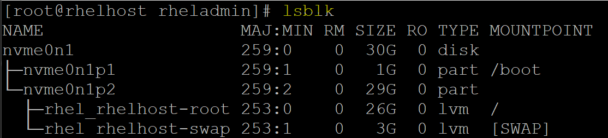
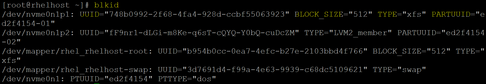

# Linux - Storage Fundamental

[Back](../../index.md)

- [Linux - Storage Fundamental](#linux---storage-fundamental)
  - [Storage Fundamental](#storage-fundamental)
  - [Display block device](#display-block-device)
  - [Display disk partitions](#display-disk-partitions)
  - [Display Filesystem Disk Usage](#display-filesystem-disk-usage)
    - [Explanation](#explanation)
    - [Commands](#commands)
  - [Display File Usage](#display-file-usage)

---

## Storage Fundamental

- Types of storage
  - Local Storage
  - SAN(Storage Area Network)
  - NAS(Network Attached Storage)

---

## Display block device

| Command                              | Description                                                             |
| ------------------------------------ | ----------------------------------------------------------------------- |
| `lsblk`                              | List information about block devices.                                   |
| `lsblk -l`                           | Shows a list-style output (each block device on one line).              |
| `lsblk -f`                           | Displays information about block devices, including filesystem type     |
| `lsblk -o NAME,SIZE,TYPE,MOUNTPOINT` | Customizes output columns (e.g., name, size, type, mountpoint).         |
| `lsblk -d`                           | Displays information about block devices but excludes their partitions. |
| `lsblk -r`                           | Excludes devices that are removable (e.g., USB drives).                 |
| `lsblk --output NAME,FSTYPE,UUID`    | Displays specified columns (name, filesystem type, and UUID).           |
| `sudo blkid`                         | Display all block devices attributes.                                   |
| `sudo blkid /dev/nvme0n1p1`          | Display a specific block device.                                        |





---

## Display disk partitions

| CMD                     | DESC                                                       |
| ----------------------- | ---------------------------------------------------------- |
| `smartctl -a /dev/sda1` | Display SMART health information for the disk `/dev/sda1`. |
| `fdisk -l`              | List partition tables of all disks                         |
| `fdisk device_name`     | Start editing a specific disk                              |

---

## Display Filesystem Disk Usage

- `df`
  - Display file system disk space usage

### Explanation

```sh
df

# Filesystem                     1K-blocks    Used Available Use% Mounted on
# devtmpfs                         1830312       0   1830312   0% /dev
# tmpfs                            1860416       0   1860416   0% /dev/shm
# tmpfs                            1860416    9768   1850648   1% /run
# tmpfs                            1860416       0   1860416   0% /sys/fs/cgroup
# /dev/mapper/rhel_rhelhost-root  27245572 7114196  20131376  27% /
# /dev/nvme0n1p1                   1038336  278688    759648  27% /boot
# tmpfs                             372080      12    372068   1% /run/user/42
# tmpfs                             372080       4    372076   1% /run/user/1000
```

- **Columns**

| Col            | Desc                                                                     |
| -------------- | ------------------------------------------------------------------------ |
| **Filesystem** | The file system or disk partition in use.                                |
| **1K-blocks**  | **Total space** in 1K blocks for the file system.                        |
| **Used**       | The **space currently used** (in 1K blocks).                             |
| **Available**  | The **space available** for use (in 1K blocks).                          |
| **Use%**       | The **percentage** of space **used**.                                    |
| **Mounted** on | The mount point where the file system is attached in the directory tree. |

---

- **Explanation of Filesystem Names**

| Filesystem Name                  | Type            | Purpose                                                                | Mounted on       |
| -------------------------------- | --------------- | ---------------------------------------------------------------------- | ---------------- |
| `/dev/mapper/rhel_rhelhost-root` | `ext4 (or LVM)` | The root file system where the operating system and user files reside. | `/`              |
| `/dev/nvme0n1p1`                 | `ext4`          | To **store boot files** like the kernel and initramfs.                 | `/boot`          |
| `devtmpfs`                       | `devtmpfs`      | for **device files** created by the kernel.                            | `/dev`           |
| `tmpfs`                          | `tmpfs`         | **shared memory** (RAM-based).                                         | `/dev/shm`       |
| `tmpfs`                          | `tmpfs`         | for **runtime data** like logs and PID files.                          | `/run`           |
| `tmpfs`                          | `tmpfs`         | for managing **control groups (cgroups)**.                             | `/sys/fs/cgroup` |
| `tmpfs`                          | `tmpfs`         | for **user-specific runtime data** (for user ID 42).                   | `/run/user/42`   |
| `tmpfs`                          | `tmpfs`         | for **user-specific runtime data** (for user ID 1000).                 | `/run/user/1000` |

---

- `tmpfs`
  - `temporary file system`
  - used for **storing temporary data in memory (RAM)**.
  - It is a **special type of file system** that doesn't store data on disk, but instead **resides in volatile memory**, which makes it very **fast** but **non-persistent**.
  - Once the system reboots, the contents of a tmpfs file system are lost.
- Features:

  - RAM-based:
    - **stores files in memory**, so it has very fast read and write operations compared to disk-based file systems.
  - Temporary:
    - The data is **temporary** and typically used for system or application **runtime data**.
  - Dynamic Size:
    - The size of tmpfs **can grow and shrink dynamically** based on the data stored in it.
    - It doesn’t have a fixed size like other file systems and is limited only by the available system memory.

- Examples:
  - `/dev/shm`:
    - used for **shared memory**, allowing processes to **communicate** with each other.
  - `/run`:
    - Used for runtime data like **system logs**, **process IDs**, or **temporary data for running processes**.
    - `/run/user/[user_id]`:
      - to store user-specific runtime data that doesn’t need to persist across reboots.
  - `/sys/fs/cgroup`
    - Used for **storing cgroup files** that manage and limit system resources for processes.

---

- `devtmpfs`

  - a special type of file system
  - used to **create and store** `device nodes` (special files **representing hardware devices** like disks, USB devices, network interfaces, etc.), which are used to interact with hardware components.
  - a temporary file system
    - it does **not persist** data across reboots.
  - **managed directly** by the `kernel`, which speeds up device initialization and simplifies the process of device node creation.

- **Purpose**:

  - **Dynamic Device Node Creation**:
    - When a **new device** is **detected** (e.g., when you plug in a USB device or add a hard drive), `devtmpfs` **creates** the corresponding `device node` automatically in the `/dev` directory.
    - e.g., if you connect a new USB device, devtmpfs creates a corresponding node like `/dev/sdb` or `/dev/ttyUSB0` for it.
  - **System Boot Process**:
    - During the boot process, `devtmpfs` provides the **initial set** of `device nodes` needed for the system to access devices like the `root file system`, essential **hardware drivers**, and other **kernel components**.
  - **Integration with `udev`**:
    - While `devtmpfs` provides the `initial device nodes`, the `udev daemon` **takes over** after the system boot to handle additional device events and rules for device node creation, removal, and management.

- Common Example:
  - `/dev`: the path that `devtmpfs` is mounted on and where `device files` are stored
    - `/dev/null`, `/dev/zero`: Special files used by applications for reading/writing.
    - `/dev/sda`, `/dev/sdb`: Disk devices.
    - `/dev/tty0`, `/dev/ttyUSB0`: Terminal devices.
    - `/dev/random`, `/dev/urandom`: Random number generators.

---

- `/dev/mapper/rhel_rhelhost-root`

  - a **logical volume** created using `LVM` (`Logical Volume Manager`) in Linux.
  - represents a `logical volume (LV)`that
    - is part of a `volume group (VG)`
    - is used to mount the `root file system` (`/`) of the operating system.

- Breakdown:
  - `/dev/mapper/`:
    - indicates that the device is managed by `LVM (Logical Volume Manager)`.
    - The `mapper directory` contains **device files** for `logical volumes` (LVM, encrypted devices, etc.).
    - The `mapper` is a **virtual device** that represents logical volumes, RAID volumes, and other block-level devices.
  - `rhel_rhelhost`:
    - the name of the `Volume Group (VG)` that contains the **logical volume**.
    - `Volume Group`
      - a collection of `physical volumes (PVs)` from which `logical volumes (LVs)` are **created**.
    - `rhel_rhelhost`:
      - the name of the `Volume Group` that was created **during the system installation** (likely associated with a Red Hat Enterprise Linux (RHEL) system).
  - `root`:
    - the name of the `Logical Volume (LV)` within the `Volume Group`.
    - A `logical volume` represents a **virtualized partition** or **file system**.
    - The `logical volume` named `root` typically **contains** the `root file system` (`/`), where the **operating system files** and **user data** are stored.
    - It is **the main partition** that the system **boots from**.

---

- `/dev/nvme0n1p1` at `/boot`

- mounted to the `/boot` directory, indicating its purpose to store files necessary for the system to boot.

---

### Commands

| Command                | Description                                  |
| ---------------------- | -------------------------------------------- |
| `df`                   | Report file system disk usage.               |
| `df -a`                | show all disk space usage                    |
| `df -h`                | Display disk usage in human-readable format. |
| `df -BM`               | Display disk usage in MB size                |
| `df -T`                | Include file system type in the output.      |
| `df -h \| sort -k5 -r` | sort disk usage by use%                      |

---

## Display File Usage

| Command              | Description                                                     |
| -------------------- | --------------------------------------------------------------- |
| `du`                 | Display space usage of the current directory.                   |
| `du --max-depth=num` | Display space usage only for `num` depth                        |
| `du target_dir`      | Display space usage of the target directory.                    |
| `du -sh target_dir`  | Summarize size of target directory in human-readable format.    |
| `du target_file`     | Display space usage of the target file.                         |
| `du -h target_file`  | Display space usage of the target file in human-readable format |

---

[TOP](#linux---storage-fundamental)
