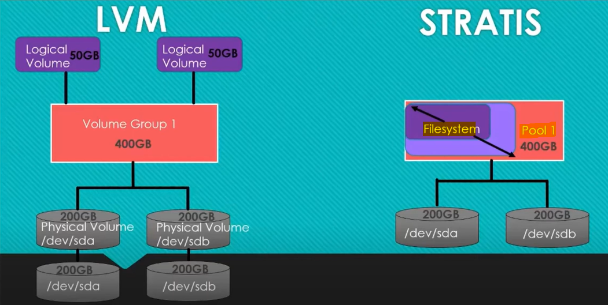

# Linux - Storage: Package `Stratis`

[Back](../../index.md)

- [Linux - Storage: Package `Stratis`](#linux---storage-package-stratis)
  - [Package `Stratis`](#package-stratis)
    - [Common Commands](#common-commands)
  - [Lab: Add and extend pool](#lab-add-and-extend-pool)
    - [Add New disk](#add-new-disk)
    - [Create a Stratis pool](#create-a-stratis-pool)
    - [Extend the pool](#extend-the-pool)
  - [Lab: Create and snapshot a filesystem](#lab-create-and-snapshot-a-filesystem)
    - [Create Filesystem](#create-filesystem)
    - [Mount file system](#mount-file-system)
    - [Persist Filesystem](#persist-filesystem)
    - [Create snapshot](#create-snapshot)

---

## Package `Stratis`

- `Stratis`

  - a **local storage management solution** introduced in `Red Hat Enterprise Linux (RHEL)` and other related distributions (like `CentOS` and `Fedora`).
  - **simplifies the management of storage** while providing advanced features such as **snapshots**, **thin provisioning**, and more.
  - **acts as a layer** over Linux `file systems` and `device-mapper` to provide an efficient and user-friendly way to manage storage.
  - use `thin provisioning` by **default**.
    - a storage management technique that **allocates** `physical storage` resources **on demand**, rather than pre-allocating them.

- Benefits

  - **Simplicity**:
    - Provides a straightforward interface for complex storage tasks.
  - **Efficiency**:
    - **Combines** features of **traditional** storage management tools (e.g., LVM, RAID) without requiring extensive configuration.
  - **Flexibility**:
    - Supports **dynamic resizing** and thin provisioning.
  - **Snapshots**:
    - Enables quick backups and rollbacks.

- **How Stratis Works**

  - Stratis operates in two layers:
    - `Storage Pool`:
      - created from one or more **block devices**.
      - This pool **aggregates storage capacity** from multiple devices.
    - `File Systems`:
      - created from the `storage pool`.
      - These are the mountable units.

- **vs `LVM`**



- Layers in LVM
  - device, PV, VG, LV, FS
- Layers in Stratis
  - device, Pool, FS

| Feature            | Stratis                         | LVM                                 |
| ------------------ | ------------------------------- | ----------------------------------- |
| Complexity         | Simple, high-level abstraction  | More complex, requires manual steps |
| Snapshots          | Built-in, easy to create        | Requires manual setup               |
| Thin Provisioning  | Automatic                       | Requires configuration              |
| Add more space     | Extend filesystem automatically | Extend manually                     |
| File System Choice | XFS (default)                   | Multiple file systems supported     |
| CLI Tool           | `stratis`                       | `lvcreate`, `vgcreate`, etc.        |

---

### Common Commands

- Package

```sh
dnf install stratis-cli stratisd -y
rpm -qa | grep stratis
```

- Service

```sh
sudo systemctl enable --now stratisd
sudo systemctl status stratisd
```

---

- **Storage Pool Commands**

| CMD                                               | DESC                                                   |
| ------------------------------------------------- | ------------------------------------------------------ |
| `stratis pool list`                               | List Existing Pools                                    |
| `stratis pool create pool_name /dev/sdb /dev/sdc` | Create a Storage Pool from block devices               |
| `stratis pool add-data pool_name /dev/sdd`        | Add a new block device to an existing pool             |
| `stratis pool destroy pool_name`                  | Delete a storage pool (must first remove file systems) |

- **File System Command**

| CMD                                                           | DESC                                 |
| ------------------------------------------------------------- | ------------------------------------ |
| `stratis filesystem list`                                     | List File Systems                    |
| `stratis filesystem create pool_name fs_name`                 | Create a file system from a pool     |
| `mount fs_path mount_point`                                   | Mount the file system to a directory |
| `stratis filesystem snapshot pool_name fs_name snapshot_name` | Create a snapshot of a file system   |
| `stratis filesystem destroy pool_name fs_name`                | Create a snapshot of a file system   |

---

## Lab: Add and extend pool

### Add New disk

- Add 2\*5GB IDE

```sh
# Confirm added devices
lsblk
# NAME                   MAJ:MIN RM SIZE RO TYPE MOUNTPOINT
# sda                      8:0    0   5G  0 disk
# sdb                      8:16   0   5G  0 disk
# nvme0n1                259:0    0  30G  0 disk
# ├─nvme0n1p1            259:1    0   1G  0 part /boot
# └─nvme0n1p2            259:2    0  29G  0 part
#   ├─rhel_rhelhost-root 253:0    0  26G  0 lvm  /
#   └─rhel_rhelhost-swap 253:1    0   3G  0 lvm  [SWAP]
```

---

### Create a Stratis pool

```sh
su -

# list before creation
stratis pool list
# Name   Total Physical   Properties   UUID

# create new pool from one device
stratis pool create pool1 /dev/sda

# confirm
stratis pool list
# Name                  Total Physical   Properties                                   UUID
# pool1   5 GiB / 37.63 MiB / 4.96 GiB      ~Ca,~Cr   85475a82-34b3-4f61-8e0c-d496d842a280
```

---

### Extend the pool

```sh
# list before extention
stratis pool list
# Name                  Total Physical   Properties                                   UUID
# pool1   5 GiB / 37.63 MiB / 4.96 GiB      ~Ca,~Cr   85475a82-34b3-4f61-8e0c-d496d842a280

# extend pool
stratis pool add-data pool1 /dev/sdb

# confirm
stratis pool list
# Name                   Total Physical   Properties                                   UUID
# pool1   10 GiB / 41.63 MiB / 9.96 GiB      ~Ca,~Cr   85475a82-34b3-4f61-8e0c-d496d842a280

# confirm all device
lsblk
# NAME                                                                      MAJ:MIN     RM  SIZE    RO  TYPE    MOUNTPOINT
# sda                                                                       8:0         0   5G      0   disk
# └─stratis-1-private-85475a8234b34f618e0cd496d842a280-physical-originsub   253:2       0  10G      0   stratis
#   ├─stratis-1-private-85475a8234b34f618e0cd496d842a280-flex-thinmeta      253:3       0  16M      0   stratis
#   │ └─stratis-1-private-85475a8234b34f618e0cd496d842a280-thinpool-pool    253:6       0  10G      0   stratis
#   ├─stratis-1-private-85475a8234b34f618e0cd496d842a280-flex-thindata      253:4       0  10G      0   stratis
#   │ └─stratis-1-private-85475a8234b34f618e0cd496d842a280-thinpool-pool    253:6       0  10G      0   stratis
#   └─stratis-1-private-85475a8234b34f618e0cd496d842a280-flex-mdv           253:5       0  16M      0   stratis
# sdb                                                                       8:16        0   5G      0   disk
# └─stratis-1-private-85475a8234b34f618e0cd496d842a280-physical-originsub   253:2       0  10G      0   stratis
#   ├─stratis-1-private-85475a8234b34f618e0cd496d842a280-flex-thinmeta      253:3       0  16M      0   stratis
#   │ └─stratis-1-private-85475a8234b34f618e0cd496d842a280-thinpool-pool    253:6       0  10G      0   stratis
#   ├─stratis-1-private-85475a8234b34f618e0cd496d842a280-flex-thindata      253:4       0  10G      0   stratis
#   │ └─stratis-1-private-85475a8234b34f618e0cd496d842a280-thinpool-pool    253:6       0  10G      0   stratis
#   └─stratis-1-private-85475a8234b34f618e0cd496d842a280-flex-mdv           253:5       0  16M      0   stratis
# nvme0n1                                                                   259:0       0  30G      0   disk
# ├─nvme0n1p1                                                               259:1       0   1G      0   part    /boot
# └─nvme0n1p2                                                               259:2       0  29G      0   part
#   ├─rhel_rhelhost-root                                                    253:0       0  26G      0   lvm     /
#   └─rhel_rhelhost-swap                                                    253:1       0   3G      0   lvm     [SWAP]
```

---

## Lab: Create and snapshot a filesystem

### Create Filesystem

```sh
# before creating fs
stratis filesystem list
# Pool Name   Name   Used   Created   Device   UUID

# create new fs
stratis filesystem create pool1 fs1

# confirm
stratis filesystem list
# Pool Name   Name   Used      Created             Device                   UUID
# pool1       fs1    545 MiB   Dec 20 2024 21:50   /dev/stratis/pool1/fs1   bbd0d5e8-9440-4192-b36d-5f50cf8258c8
```

---

### Mount file system

```sh
# before mounting
df -h
# Filesystem                      Size  Used Avail Use% Mounted on
# devtmpfs                        1.8G     0  1.8G   0% /dev
# tmpfs                           1.8G     0  1.8G   0% /dev/shm
# tmpfs                           1.8G  9.6M  1.8G   1% /run
# tmpfs                           1.8G     0  1.8G   0% /sys/fs/cgroup
# /dev/mapper/rhel_rhelhost-root   26G  7.5G   19G  29% /
# /dev/nvme0n1p1                 1014M  452M  563M  45% /boot
# tmpfs                           1.0M     0  1.0M   0% /run/stratisd/keyfiles
# tmpfs                           364M   12K  364M   1% /run/user/42
# tmpfs                           364M  4.0K  364M   1% /run/user/1001

# create mount point
mkdir /bigdata
mount /dev/stratis/pool1/fs1 /bigdata

# confirm
df -h
# Filesystem                                                                                       Size  Used Avail Use% Mounted on
# devtmpfs                                                                                         1.8G     0  1.8G   0% /dev
# tmpfs                                                                                            1.8G     0  1.8G   0% /dev/shm
# tmpfs                                                                                            1.8G  9.6M  1.8G   1% /run
# tmpfs                                                                                            1.8G     0  1.8G   0% /sys/fs/cgroup
# /dev/mapper/rhel_rhelhost-root                                                                    26G  7.5G   19G  29% /
# /dev/nvme0n1p1                                                                                  1014M  452M  563M  45% /boot
# tmpfs                                                                                            1.0M     0  1.0M   0% /run/stratisd/keyfiles
# tmpfs                                                                                            364M   12K  364M   1% /run/user/42
# tmpfs                                                                                            364M  4.0K  364M   1% /run/user/1001
# /dev/mapper/stratis-1-85475a8234b34f618e0cd496d842a280-thin-fs-bbd0d5e894404192b36d5f50cf8258c8  1.0T  7.2G 1017G   1% /bigdata

# the size above is 1.0T, which is default value in startis
# to query the actual size, use stratis filesystem list
stratis filesystem list
# Pool Name   Name   Used      Created             Device                   UUID
# pool1       fs1    545 MiB   Dec 20 2024 21:50   /dev/stratis/pool1/fs1   bbd0d5e8-9440-4192-b36d-5f50cf8258c8
```

---

### Persist Filesystem

- fs mounted should after the stratisd.service at boot.

```sh
vi /etc/fstab

# UUID=bbd0d5e8-9440-4192-b36d-5f50cf8258c8 /bigdata xfs defaults,x-systemd.requires=stratisd.service 0 0

# mount according to cf
mount -a

# list
df -h
# Filesystem                                                                                       Size  Used Avail Use% Mounted on
# devtmpfs                                                                                         1.8G     0  1.8G   0% /dev
# tmpfs                                                                                            1.8G     0  1.8G   0% /dev/shm
# tmpfs                                                                                            1.8G  9.6M  1.8G   1% /run
# tmpfs                                                                                            1.8G     0  1.8G   0% /sys/fs/cgroup
# /dev/mapper/rhel_rhelhost-root                                                                    26G  7.4G   19G  29% /
# /dev/nvme0n1p1                                                                                  1014M  452M  563M  45% /boot
# tmpfs                                                                                            1.0M     0  1.0M   0% /run/stratisd/keyfiles
# tmpfs                                                                                            364M   12K  364M   1% /run/user/42
# tmpfs                                                                                            364M  4.0K  364M   1% /run/user/1001
# /dev/mapper/stratis-1-85475a8234b34f618e0cd496d842a280-thin-fs-bbd0d5e894404192b36d5f50cf8258c8  1.0T  7.2G 1017G   1% /bigdata
```

---

### Create snapshot

```sh
# list before
stratis filesystem list
# Pool Name   Name   Used      Created             Device                   UUID
# pool1       fs1    545 MiB   Dec 20 2024 21:50   /dev/stratis/pool1/fs1   bbd0d5e8-9440-4192-b36d-5f50cf8258c8

# take snapshot
stratis filesystem snapshot pool1 fs1 fs1-snapshot01

# confirm
stratis filesystem list
# Pool Name   Name             Used      Created             Device                              UUID
# pool1       fs1              545 MiB   Dec 20 2024 21:50   /dev/stratis/pool1/fs1              bbd0d5e8-9440-4192-b36d-5f50cf8258c8
# pool1       fs1-snapshot01   545 MiB   Dec 20 2024 22:11   /dev/stratis/pool1/fs1-snapshot01   9be5b26b-080d-43d8-ba85-599e65b32011
```

---

[TOP](#linux---storage-package-stratis)
