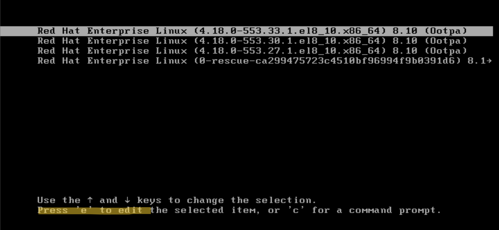
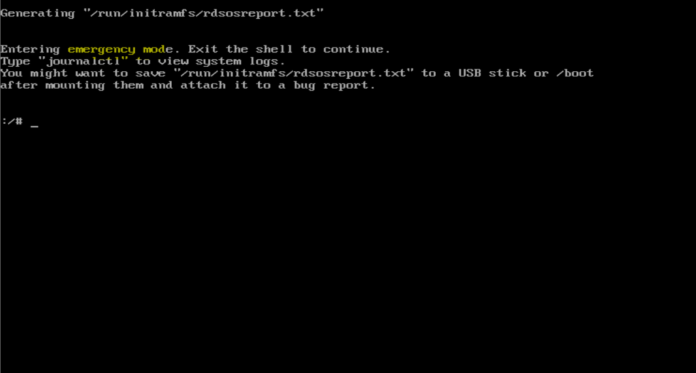
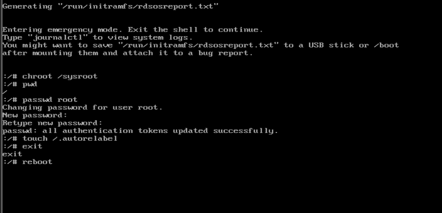
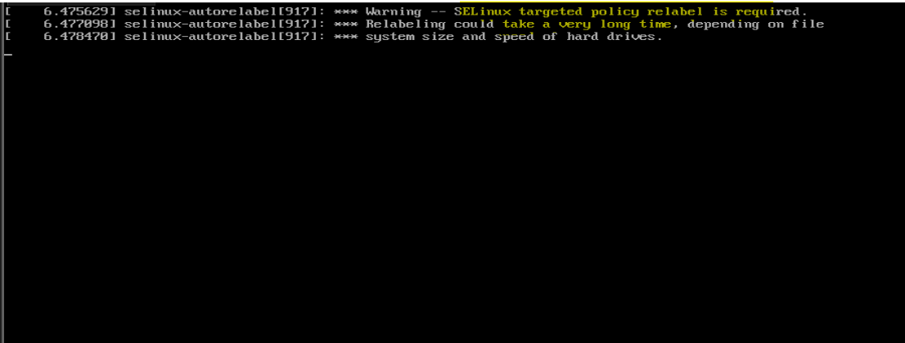

# Linux - System: Recover Root Password

[Back](../../index.md)

- [Linux - System: Recover Root Password](#linux---system-recover-root-password)
  - [Lab: Recover Root Password](#lab-recover-root-password)
  - [Lab: Repair Filesystem from corruption](#lab-repair-filesystem-from-corruption)

---

## Lab: Recover Root Password

- Steps
  - Restart machine
  - Edit Grub file
  - Change password
  - Reboot

---

1. Restart machine
2. Select kernel and press `e` to edit

3. Edit the Grub file
   - Find `ro`
   - Replace with `rw init=/sysroot/bin/sh`
   - Press `Ctrl+x` to start

4. The machine get started into single user mode.
   - Change the current root directory to /sysroot: `chroot /sysroot`
   - Change the root password: `passwd root`
   - Update the SELinux information: `touch /.autorelabel`
   - Exit the /sysroot: `exit`
   - Reboot the machine

5. Login the system as usual.
   - SELinux might take time for relabeling.

---

## Lab: Repair Filesystem from corruption

- Corruption can occur when

  - making mistake in `/etc` configuration file,
  - filesystem become corrupted at the disk level.

- When corruption occurs, the `systemd` will not be able to boot the system in the defined target and bring the system in emergency mode.

  - Admin can use the emergency target to diagnose and fix the issue, because no filesystem is mounted before the emergency shell.
  - After fixing filesytem issues with `etc/fstab`, run `systemctl daemon-reload` to reload.

- Common errors

| Error                                              | Result                                                                        |
| -------------------------------------------------- | ----------------------------------------------------------------------------- |
| Corrupt file system                                | systemd trigger an automatic fix for fs. If fails, bring into emergency shell |
| Nonexistent device or UUID refered in `/etc/fstab` | System waits for the device. If unavailable, bring into emergency shell       |
| Nonexistent mount point in `/etc/fstab`            | Bring into emergency shell                                                    |
| Incorrect mount option in `/etc/fstab`             | Bring into emergency shell                                                    |

---
