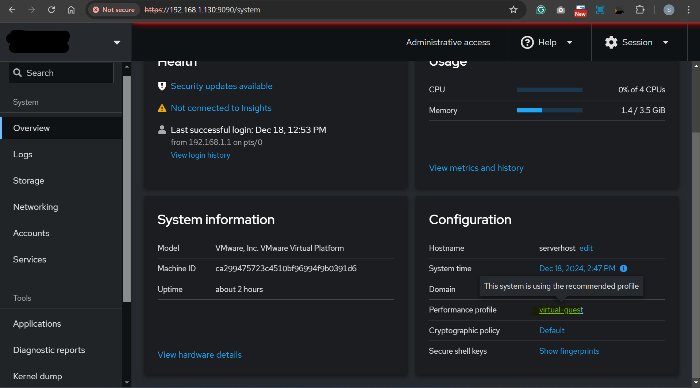
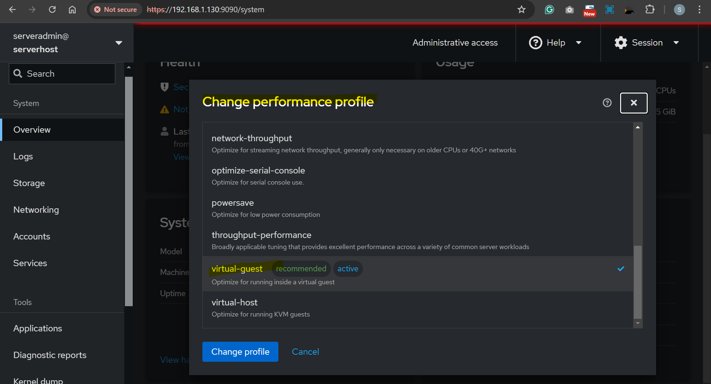

# Linux - System: Tune System Performance

[Back](../../index.md)

- [Linux - System: Tune System Performance](#linux---system-tune-system-performance)
  - [Tune System Performance](#tune-system-performance)
  - [Package `tuned`: Tuning by Profiles](#package-tuned-tuning-by-profiles)
    - [Predefined Profiles](#predefined-profiles)
    - [Command](#command)
  - [Lab: Tune System Performance by `tuned`](#lab-tune-system-performance-by-tuned)
    - [List all profiles and check active profile](#list-all-profiles-and-check-active-profile)
    - [Swith current profile](#swith-current-profile)
    - [Tune off and switch to recommended profile](#tune-off-and-switch-to-recommended-profile)
    - [Change profile via web console](#change-profile-via-web-console)
  - [Command `nice` and `renice`: Tuning by Priority of Processes](#command-nice-and-renice-tuning-by-priority-of-processes)
    - [Niceness and Priority](#niceness-and-priority)
    - [Check Niceness of Running Processes](#check-niceness-of-running-processes)
    - [Command](#command-1)
  - [Lab: Tuning by Prioritize Process](#lab-tuning-by-prioritize-process)

---

## Tune System Performance

---

## Package `tuned`: Tuning by Profiles

- `tuned`

  - a powerful tool designed for dynamic system performance tuning.
  - It **optimizes** system settings **automatically** based on **predefined profiles** tailored for different workloads and hardware configurations

- **Package**

```sh
rpm -qa | grep tuned
sudo yum install tuned
```

- **Service**
  - `tuned` daemon

```sh
sudo systemctl status tuned
sudo systemctl enable --now tuned
```

- CF dir

```sh
/etc/tuned
```

- Profile locate

- `/usr/lib/tuned`

---

### Predefined Profiles

- `Predefined profiles`
  - used for tuned service to automatically adjust sytem to get the best performance.

| Profile                  | Description                                                                   |
| ------------------------ | ----------------------------------------------------------------------------- |
| `balanced`               | Default profile balancing performance and power consumption.                  |
| `throughput-performance` | Optimized for high throughput workloads (e.g., databases, web servers).       |
| `latency-performance`    | Optimized for low latency workloads (e.g., real-time applications).           |
| `powersave`              | Minimizes power consumption, suitable for laptops or energy-efficient setups. |
| `virtual-guest`          | Optimized for virtual machines running as guests.                             |
| `virtual-host`           | Optimized for virtualization hosts managing VMs.                              |
| `desktop`                | Optimized for desktop systems, improving responsiveness.                      |
| `network-latency`        | Optimized for low-latency network environments.                               |
| `network-throughput`     | Optimized for high-throughput network environments.                           |
| `oracle`                 | Optimized for Oracle database workloads.                                      |
| `hpc-compute`            | Optimized for high-performance computing (HPC) environments.                  |

---

### Command

- `tuned-adm`: command-line interface, allowing administrators to apply, manage, and customize tuning profiles easily.

| CMD                              | DESC                                        |
| -------------------------------- | ------------------------------------------- |
| `tuned-adm list`                 | List Available Profiles                     |
| `tuned-adm active`               | Show Current Active Profile                 |
| `tuned-adm recommend`            | Recommend an Optimal Profile for the System |
| `tuned-adm profile profile_name` | Switch to a desired Profile                 |
| `tuned-adm off`                  | Turn Off Tuning                             |

---

## Lab: Tune System Performance by `tuned`

### List all profiles and check active profile

```sh
# Check Current Active Profile
tuned-adm active
# Current active profile: virtual-guest

# List Available Profiles
tuned-adm list
# Available profiles:
# - accelerator-performance     - Throughput performance based tuning with disabled higher latency STOP states
# - aws                         - Optimize for aws ec2 instances
# - balanced                    - General non-specialized tuned profile
# - desktop                     - Optimize for the desktop use-case
# - epyc-eda                    - Optimize for EDA compute workloads on AMD EPYC CPUs
# - hpc-compute                 - Optimize for HPC compute workloads
# - intel-sst                   - Configure for Intel Speed Select Base Frequency
# - latency-performance         - Optimize for deterministic performance at the cost of increased power consumption
# - network-latency             - Optimize for deterministic performance at the cost of increased power consumption, focused on low latency network performance
# - network-throughput          - Optimize for streaming network throughput, generally only necessary on older CPUs or 40G+ networks
# - optimize-serial-console     - Optimize for serial console use.
# - powersave                   - Optimize for low power consumption
# - throughput-performance      - Broadly applicable tuning that provides excellent performance across a variety of common server workloads
# - virtual-guest               - Optimize for running inside a virtual guest
# - virtual-host                - Optimize for running KVM guests
# Current active profile: virtual-guest
```

---

### Swith current profile

```sh
# switch to a profile
tuned-adm profile balanced
# confirm
tuned-adm active
# Current active profile: balanced
```

---

### Tune off and switch to recommended profile

```sh
# turn off tuned, means run system manually
tuned-adm off
# confirm, by checking the current profile
tuned-adm active
# No current active profile.

# get the recommended profile
tuned-adm recommend
# virtual-guest

# switch to recommended profile
tuned-adm profile virtual-guest
# confirm
tuned-adm active
# Current active profile: virtual-guest
```

---

### Change profile via web console

- https://ip:9090





---

## Command `nice` and `renice`: Tuning by Priority of Processes

- `nice` and `renice` commands

  - used to manage the priority of processes.
  - They influence how much **CPU time** a process gets relative to others **by adjusting its "niceness" value**.

- Package: `GNU Coreutils package`

---

### Niceness and Priority

- **Niceness Value** for a process:

  - **Default** : `0`.
  - **Highest** niceness: `19`
  - **Higher** niceness(e.g., 10, 19): Process runs with **lower** priority.
    - making it less CPU-intensive.
  - **Lower** niceness (e.g., -5, -20): Process runs with **higher** priority.
  - **Lowest** niceness: `-20`

- A **higher** `niceness value` means the process will take **less** CPU time, while a **lower** `niceness value` makes the process **more** CPU-intensive.

---

- **Priority** for a process:
  - The kernel calculates the priority of a process based on its niceness value.
  - `Actual priority` = `Niceness` + `Base priority` (managed by the kernel).

---

### Check Niceness of Running Processes

- `top` command:

  - `NI` Column:
    - `Nice Value`
      - priority of the task
    - range from -20 to 19
    - adjust by `nice` command
  - `PR` column
    - Priority(priority of the task with the rt values)
    - range from -99 to 39

- `ps` command to get Nice Value

```sh
ps axo pid,comm,nice,cls --sort=-nice
#   PID COMMAND          NI CLS
#    50 khugepaged       19  TS
#    49 ksmd              5  TS
#   970 rtkit-daemon      1  TS
#     1 systemd           0  TS
#     2 kthreadd          0  TS
#     6 kworker/0:0-eve   0  TS
#    11 rcu_tasks_rude_   0  TS
#    12 rcu_tasks_trace   0  TS
#    13 ksoftirqd/0       0  TS
#    14 rcu_sched         0  TS
#    15 migration/0       -  FF
#    16 watchdog/0        -  FF
#    17 cpuhp/0           0  TS
#    18 cpuhp/1           0  TS
#    19 watchdog/1        -  FF
#    20 migration/1       -  FF
#    21 ksoftirqd/1       0  TS
#    24 cpuhp/2           0  TS
#    25 watchdog/2        -  FF
#    26 migration/2       -  FF
```

---

### Command

- `renice` command:
  - used to change the niceness value of an already running process.

| CMD                       | DESC                                         |
| ------------------------- | -------------------------------------------- |
| `nice process_name`       | Run a Command with Default Niceness (`0`)    |
| `nice -n 10 process_name` | Run a Command with a Specific Niceness Value |
| `renice -n 10 1234`       | Change the Niceness of a Process             |
| `renice 10 -p 1234`       | Change the Niceness of a Process             |
| `renice 5 -p 1234 5678`   | Change Niceness for Multiple Processes       |
| `renice 10 -u username`   | Change Niceness for All Processes of a User  |
| `renice 5 -g 123`         | Change Niceness for a Process Group          |

- Privileges:

  - Only the `root` user can:
    - Start a process with a **negative niceness value** using `nice`.
    - **Decrease** (raise the priority) of a process using `renice`.
  - **Regular users** can:
    - **Increase** the niceness value (lower the priority) of their **own processes**.

- Real-World Use Cases
  - **Backup Jobs**:
    - Run backups with **higher** niceness (e.g., `nice -n 15`) to prevent them from affecting other processes.
  - **Critical Processes**:
    - Assign **lower** niceness (e.g., `nice -n -5`) to ensure critical tasks like databases or web servers get sufficient CPU time.
  - **Load Management**:
    - Use renice to **adjust** priorities **dynamically** when system resources are under heavy load.

---

## Lab: Tuning by Prioritize Process

```sh
# sets the process niceness to 15, making it less CPU-intensive.
nice -n 15 tar -czf backup.tar.gz /data

# run top by default, NI is 0
top
#     PID USER      PR  NI    VIRT    RES    SHR S  %CPU  %MEM     TIME+ COMMAND
#   11759 root      20   0  264296   4532   3652 R   0.7   0.1   0:00.04 top

# Run a Command with High Priority, NI is -5
sudo nice -n -5 top
#     PID USER      PR  NI    VIRT    RES    SHR S  %CPU  %MEM     TIME+ COMMAND
#   11996 root      15  -5  264296   4656   3776 R   1.0   0.1   0:00.17 top

# adjust priority of a process
renice -n 15 11996
# top display:
#     PID USER      PR  NI    VIRT    RES    SHR S  %CPU  %MEM     TIME+ COMMAND
#   11996 root      35  15  264296   4656   3776 R   0.7   0.1   0:00.35 top
```

---

[TOP](#linux---software-management-tune-system-performance)
