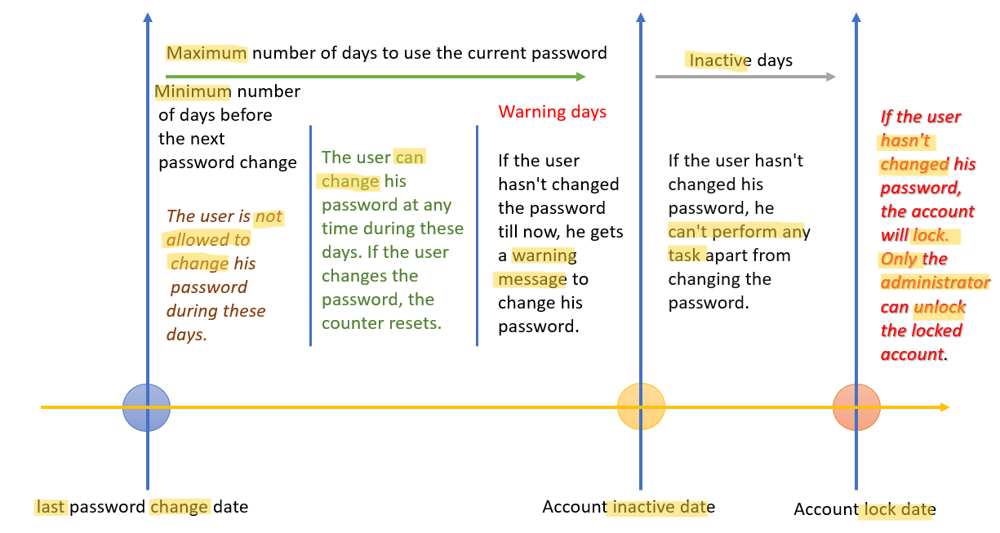

# Linux - User Management: Password

[Back](../../index.md)

- [Linux - User Management: Password](#linux---user-management-password)
  - [User Password](#user-password)
    - [User password configuration file: `/etc/shadow`](#user-password-configuration-file-etcshadow)
    - [Set Password for a user](#set-password-for-a-user)
    - [Set passwords for multiple users](#set-passwords-for-multiple-users)
    - [Set Password Age Policy for a user](#set-password-age-policy-for-a-user)
    - [Set a Default Password Age Policy: Using `/etc/login.defs`](#set-a-default-password-age-policy-using-etclogindefs)

---

## User Password

### User password configuration file: `/etc/shadow`

- `/etc/shadow`:

  - a system file that stores information about user **accounts** and their **encrypted passwords**.

- Secure Password Storage:

  - Passwords in `/etc/shadow` are stored as **hashed values**
  - Only the root user can read or modify this file, as its permissions are restricted for security.
    - `----------. 1 root root 1426 Nov 19 16:43 /etc/shadow`

- User-Specific Information:

  - It contains additional information related to password expiration, account lockouts, and more.

- Entry format:

```conf
username:password:last_change:min:max:warn:inactive:expire:
```

| Field         | Description                                                                       |
| ------------- | --------------------------------------------------------------------------------- |
| `username`    | The username of the account.                                                      |
| `password`    | The hashed password (or a special value like ! or \* if the account is disabled). |
| `last_change` | The date of the last password change, stored as days since 01/01/1970.            |
| `min`         | Minimum number of days before the password can be changed.                        |
| `max`         | Maximum number of days the password is valid before the user must change it.      |
| `warn`        | Number of days before expiration the user is warned to change the password.       |
| `inactive`    | Number of days after password expiration before the account is disabled.          |
| `expire`      | Absolute expiration date of the account (in days since 01/01/1970).               |

- Special Values in the Password Field:
  - `!` or `*`: Account is locked; the user cannot log in.
  - Empty field: No password is set (not secure for accounts with shell access).
- The **hash algorithm** is indicated by the **prefix** in the password field:
  - `$1$`: `MD5`
  - `$5$`: `SHA-256`
  - `$6$`: `SHA-512` (**default** on most modern systems).

---

### Set Password for a user

| CMD                   | DESC                                |
| --------------------- | ----------------------------------- |
| `usermod username -L` | Lock user's pwd                     |
| `usermod username -U` | Unlock user's pwd                   |
| `passwd`              | Modify pwd for the current user     |
| `passwd user`         | Modify pwd for a user               |
| `passwd user -l`      | Lock a user's pwd                   |
| `passwd user -u`      | Unlock a user's pwd                 |
| `passwd user -e`      | Expire a user's pwd                 |
| `passwd user -d`      | Delete a user's pwd                 |
| `passwd user -f`      | Force user to change pwd next login |

---

### Set passwords for multiple users

- `chpasswd` command:
  - reads **username-password pairs** from standard input (or a file) and updates the passwords for the specified users.
  - It's particularly useful for system administrators when setting or changing passwords for **multiple** users at once.
  - By default, using `SHA-512` for encryption

```sh
chpasswd [options]
[username]:[password]
```

| CMD                          | DESC                                                                                       |
| ---------------------------- | ------------------------------------------------------------------------------------------ |
| `chpasswd`                   | update passwords in batch mode                                                             |
| `cat pwd.txt \| chpasswd`    | update passwords from a file                                                               |
| `cat pwd.txt \| chpasswd -e` | passwords provided are already encrypted (hashed)                                          |
| `cat pwd.txt \| chpasswd -m` | forces the use of MD5 hashing                                                              |
| `chpasswd -c`                | **Validates** the password before it is stored.                                            |
| `chpasswd -R`                | Specifies the password file location.                                                      |
| `chpasswd -S`                | Displays the encrypted password to standard output instead of modifying the password file. |
| `chpasswd -c`                | Specifies the method to be used for encrypting the password.                               |
| `chpasswd -p`                | Specifies the **prefix** for the crypt(3) algorithm, e.g.,`.                               |
| `chpasswd -s`                | Uses the Blowfish encryption algorithm for the password                                    |

- `chpasswd -c`:

  - method for encryption:
    - `MD5`, `DES`, `SHA256`, `SHA512`, and `NONE`

- `chpasswd -p`:

  - prefix for crypt(3) algorithm
  - `$6$`for SHA512-CRYPT,`$5$`for SHA256-CRYPT, and`$2a$` for Blowfish

- Best Practise:

  - Always ensure the **input file** containing passwords is secured with appropriate permissions (`chmod 600`) **to prevent unauthorized access**.
  - **Use secure hashing mechanisms** (e.g., `SHA-512`, which is typically the **default**) to store passwords securely.
  - **Avoid** storing **plaintext** passwords in files; consider encrypting them before use.

- Example: import a list of users and passwords

```sh
sudo useradd user1
sudo useradd user2
sudo useradd user3

echo -e 'user1:Welcome1234\nuser2:Welcome1234\nuser3:Welcome1234' > /home/rheladmin/pwd.txt
cat /home/rheladmin/pwd.txt
# user1:Welcome1234
# user2:Welcome1234
# user3:Welcome1234

cat /home/rheladmin/pwd.txt | sudo chpasswd

tail -3 /etc/passwd
# user1:x:1003:1003::/home/user1:/bin/bash
# user2:x:1004:1004::/home/user2:/bin/bash
# user3:x:1005:1005::/home/user3:/bin/bash

sudo tail -3 /etc/shadow
```

---

### Set Password Age Policy for a user

- Password Age:



| Command                        | Description                                                                                     |
| ------------------------------ | ----------------------------------------------------------------------------------------------- |
| `chage username -l`            | Display the password aging information for the user.                                            |
| `chage username`               | Set password aging info in Interactive Mode                                                     |
| `chage username -d 2024-12-31` | Set the **last** password change date (format: YYYY-MM-DD or days since epoch).                 |
| `chage username -m 7`          | Set the **minimum** number of days before a user can change their password.                     |
| `chage username -M 90`         | Set the **maximum** number of days a password is valid before requiring a change.               |
| `chage username -W 10`         | Set the number of days before password expiration that the user will be **warned**.             |
| `chage username -E 2024-12-31` | Set the account **expiration** date (format: YYYY-MM-DD or `-1` for **no expiration**).         |
| `chage username -I 15`         | Set the number of **inactive** days after password expiration before the account is **locked**. |

- Example:

```sh
sudo useradd user1
echo -e "user1:user1234567" | sudo chpasswd

# display
sudo chage -l user1
# Last password change                                    : Nov 25, 2024
# Password expires                                        : never
# Password inactive                                       : never
# Account expires                                         : never
# Minimum number of days between password change          : 0
# Maximum number of days between password change          : 99999
# Number of days of warning before password expires       : 7

# Set a password age policy for user1
#   minimum password age: 7 days
#   maximum password age: 90 days
#   warning period: 10 day
#   inactive period days after password expiration: 15
sudo chage user1 -m 15 -M 120 -W 30 -I 10

# verify
sudo chage user1 -l
# Last password change                                    : Nov 25, 2024
# Password expires                                        : Mar 25, 2025
# Password inactive                                       : Apr 04, 2025
# Account expires                                         : never
# Minimum number of days between password change          : 15
# Maximum number of days between password change          : 120
# Number of days of warning before password expires       : 30

# verify in /etc/shadow file
grep user1 /etc/shadow
# user1:$6$jAHNMnu7qD/GSP$JaYbHsImlO.k12wCIVFHu7oHIqKRXy2Z/7.86WZ31/8ixkySQTP4nDXO0bh9zNUgcKY05Y96Yl/UlbnwJJkJT1:20052:15:120:30:10::
```

---

### Set a Default Password Age Policy: Using `/etc/login.defs`

- `/etc/login.defs` file's parameters
  - used to configure a default password age policy for every user in the system.

```sh
-rw-r--r--. 1 root root 3076 Nov 21  2023 /etc/login.defs
```

| Parameters      | Default | Desc                                                                              |
| --------------- | ------- | --------------------------------------------------------------------------------- |
| `PASS_MAX_DAYS` | `99999` | The **maximum** number of days a password is **valid** before it must be changed. |
| `PASS_MIN_DAYS` | `0`     | The **minimum** number of days required between password changes.                 |
| `PASS_WARN_AGE` | `7`     | The number of days before password expiration that the user is **warned**.        |
| `PASS_MIN_LEN`  | `5`     | Minimum acceptable password length.                                               |
