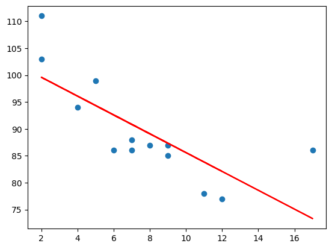
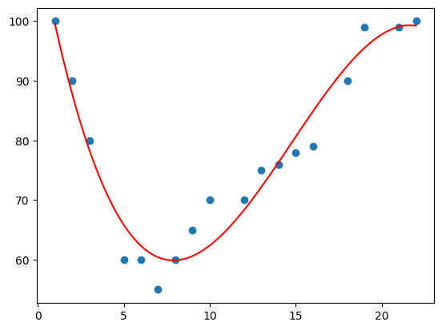
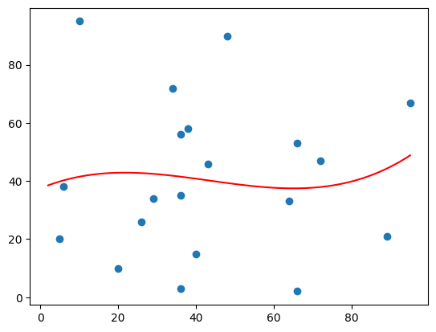

# Machine Learning - Regression

[back](./index.md)

- [Machine Learning - Regression](#machine-learning---regression)
  - [Regression](#regression)
  - [Linear Regression](#linear-regression)
    - [Example: Predict car age and speed](#example-predict-car-age-and-speed)
    - [Example: Bad Fit](#example-bad-fit)
  - [Polynomial Regression 多项式回归](#polynomial-regression-多项式回归)
    - [Example: Predict car age and speed](#example-predict-car-age-and-speed-1)
    - [Exmaple: Bad Fit](#exmaple-bad-fit)

---

## Regression

- `regression`: try to find the relationship between variables.

  - In Machine Learning, and in statistical modeling, that relationship is used to **predict the outcome of future events**.

---

## Linear Regression

- `Linear regression` to find <u>relationship</u> between **data-points** and to **draw a line of linear regression**.

  - This line can be used to predict future values.

- Import `SciPy` module

  - `stats.linregress()`: Calculate a linear least-squares regression for two sets of measurements.
    - Parameters:
      - x, y: Two sets of measurements.
    - result:
      - slope: Slope of the regression line.
      - intercept: Intercept of the regression line.
      - rvalue: The square of rvalue is equal to the coefficient 系数 of determination.
      - pvalue: The p-value for a hypothesis test whose null hypothesis is that the slope is zero
      - stderr: Standard error of the estimated slope (gradient)
      - intercept_stderr: Standard error of the estimated intercept

- **R for Relationship**

- **the coefficient of correlation**: `r`

  - the **relationship** between <u>the values of the x-axis</u> and <u>the values of the y-axis</u>

  - if there are no relationship the linear regression can not be used to predict anything.

  - The `r` value ranges from `-1` to `1`

    - `0`: no relationship
    - `1` and `-1`: 100% related

- **Predict Future Values**

  - use the gathered information to **predict future values**.
  - use the slope and intercept
  - in the folowing example, the function predict_speed return predict future value.

---

### Example: Predict car age and speed

```py
import matplotlib.pyplot as plt
from scipy import stats

age_list = [5, 7, 8, 7, 2, 17, 2, 9, 4, 11, 12, 9, 6]
speed_list = [99, 86, 87, 88, 111, 86, 103, 87, 94, 78, 77, 85, 86]

slope, intercept, r, p, std_err = stats.linregress(age_list, speed_list)

print("slope", slope)
print("intercept", intercept)
print("rvalue", r)
print("pvalue", p)
print("Standard error", std_err)

# slope -1.7512877115526118
# intercept 103.10596026490066
# rvalue -0.758591524376155
# pvalue 0.002646873922456106
# Standard error 0.453536157607742

# Create a function that uses the slope and intercept values to return a new value.
# This new value represents where on the y-axis the corresponding x value will be placed
# Predict Future Values

def predict_speed(x_age):
    return slope * x_age + intercept


# Run each value of the x array through the function.
# This will result in a new array with new values for the y-axis
predict_speed_list = list(map(predict_speed, age_list))

# Draw the original scatter plot:
plt.scatter(age_list, speed_list)
# Draw the line of linear regression
plt.plot(age_list, predict_speed_list, color='red')

plt.show()  # Display the diagram
```



- Note: The result `-0.76` shows that there is a relationship, not perfect, but it indicates that we could use linear regression in future predictions.

---

### Example: Bad Fit

- linear regression would not be the best method to predict future values

```py
# Bad Fit
import matplotlib.pyplot as plt
from scipy import stats

age_list = [89,43,36,36,95,10,66,34,38,20,26,29,48,64,6,5,36,66,72,40]
speed_list = [21,46,3,35,67,95,53,72,58,10,26,34,90,33,38,20,56,2,47,15]

slope, intercept, r, p, std_err = stats.linregress(age_list, speed_list)

print("slope", slope)
print("intercept", intercept)
print("rvalue", r)
print("pvalue", p)
print("Standard error", std_err)

# slope 0.01391658139845263
# intercept 40.452282828936454
# rvalue 0.01331814154297491
# pvalue 0.955558800440106
# Standard error 0.24627150586388075

def predict_speed(x_age):
    return slope * x_age + intercept


predict_speed_list = list(map(predict_speed, age_list))

plt.scatter(age_list, speed_list)
plt.plot(age_list, predict_speed_list, color='red')

plt.show()

```


- The result: `0.013` indicates a very **bad** relationship, and tells us that this data set is not suitable for linear regression.

---

## Polynomial Regression 多项式回归

- `Polynomial regression`: to find a **relationship** between <u>data-points</u> and to draw a line of polynomial regression.

- `numpy.poly1d()`:

  - A one-dimensional polynomial class.
  - Parameters:
    - c: The polynomial’s coefficients, in decreasing powers. 多项式系数, 从高次项到低次项.
  - Return:
    - a polynomial model object.

- `numpy.polyfit()`:

  - Least squares polynomial fit.
  - Parameters:
    - x: x-coordinates
    - y: y-coordinates of the sample points.
    - deg: Degree of the fitting polynomial 多项式项数. 二次项是 3.
  - Return:
    - Polynomial coefficients, highest power first.多项式系数

- `numpy.linspace()`:

  - create an evenly spaced sequence in a specified interval. 等差数列
  - Parameter:
    - start: The starting value of the sequence.
    - stop: The end value of the sequence
    - num: Number of samples to generate.
  - Return:
    - num equally spaced samples in the closed interval.

- **R-Squared**:
  - the **relationship** between the values of the x- and y-axis
  - The relationship is measured with a value called the `r-squared`.
  - The `r-squared` value ranges from `0` to `1`, where `0` means **no relationship**, and `1` means **100% related**.
  - `Sklearn` module will compute this value.

```py
# How well does my data fit in a polynomial regression?
import numpy
from sklearn.metrics import r2_score

age_list = [1, 2, 3, 5, 6, 7, 8, 9, 10, 12, 13, 14, 15, 16, 18, 19, 21, 22]
speed_list = [100, 90, 80, 60, 60, 55, 60, 65,
              70, 70, 75, 76, 78, 79, 90, 99, 99, 100]

predict_model = numpy.poly1d(numpy.polyfit(age_list, speed_list, 3))

# compute r-squared
print(r2_score(speed_list, predict_model(age_list)))
# 0.9432150416451026

# The result 0.94 shows that there is a very good relationship, and we can use polynomial regression in future predictions.


```

---

### Example: Predict car age and speed

```py
import numpy
import matplotlib.pyplot as plt

age_list = [1, 2, 3, 5, 6, 7, 8, 9, 10, 12, 13, 14, 15, 16, 18, 19, 21, 22]
speed_list = [100, 90, 80, 60, 60, 55, 60, 65,
              70, 70, 75, 76, 78, 79, 90, 99, 99, 100]

# make a polynomial model, 假设是3项,即最高次是2.
predict_model = numpy.poly1d(numpy.polyfit(age_list, speed_list, 3))

# specify how the line will display, we start at position 1, and end at position 22:
hypothesized_age = numpy.linspace(1, 22, 100)
# get a list of predict speed
predict_speed_list = predict_model(hypothesized_age)

# Draw the scatter plot of train dataset
plt.scatter(age_list, speed_list)

# Draw the line of polynomial regression
plt.plot(hypothesized_age, predict_speed_list, color='red')

plt.show()      # Display the diagram

```



---

### Exmaple: Bad Fit

```py
import numpy
import matplotlib.pyplot as plt

age_list = [89, 43, 36, 36, 95, 10, 66, 34, 38, 20,
            26, 29, 48, 64, 6, 5, 36, 66, 72, 40]
speed_list = [21, 46, 3, 35, 67, 95, 53, 72, 58, 10,
              26, 34, 90, 33, 38, 20, 56, 2, 47, 15]

predict_model = numpy.poly1d(numpy.polyfit(age_list, speed_list, 3))

assum_age_list = numpy.linspace(2, 95, 100)

plt.scatter(age_list, speed_list)
plt.plot(assum_age_list, predict_model(assum_age_list))
plt.show()


print(r2_score(speed_list, predict_model(age_list)))
# 0.009952707566680541
```



- The result: `0.00995` indicates a very bad relationship, and tells us that this data set is not suitable for polynomial regression.

---

[TOP](#linear-regression)
