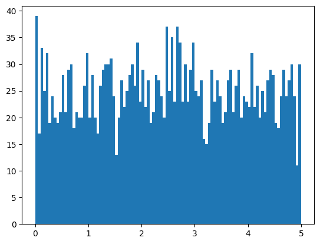
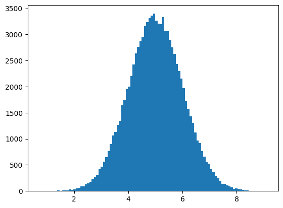
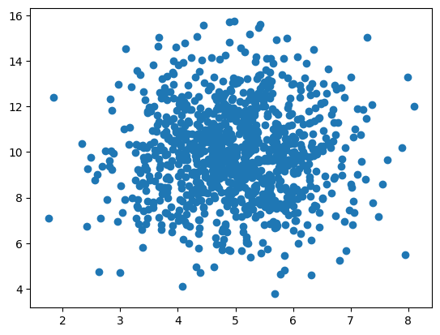
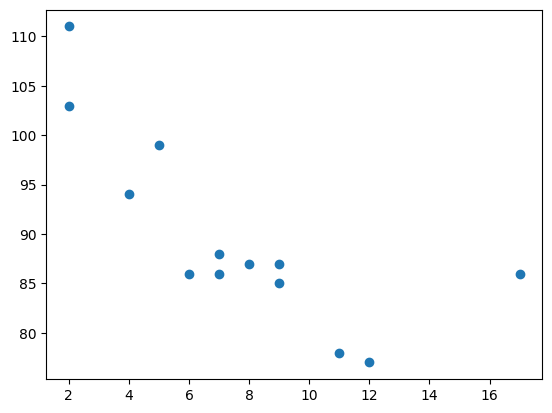
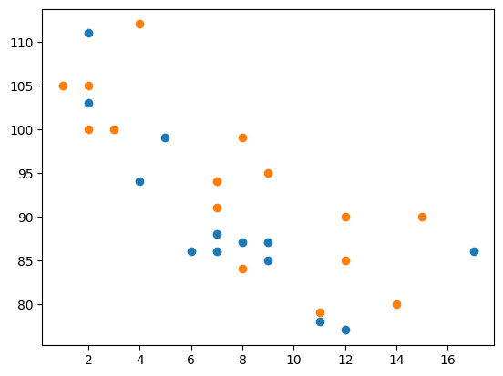
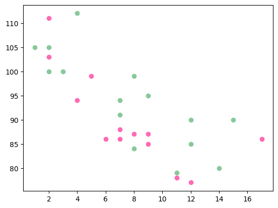
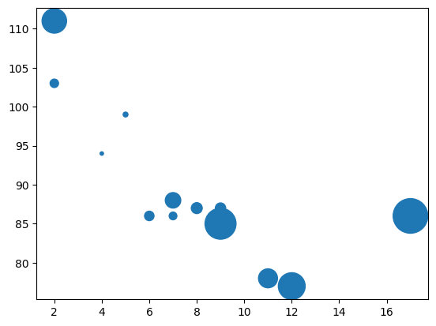

# Statistics

[Back](./index.md)

- [Statistics](#statistics)
  - [Mean 均值](#mean-均值)
  - [Median 中位数](#median-中位数)
  - [Mode 众数](#mode-众数)
  - [Variance 方差](#variance-方差)
  - [Standard Deviation 标准差](#standard-deviation-标准差)
  - [Percentile 百分位](#percentile-百分位)
  - [Uniform Distribution](#uniform-distribution)
  - [Normal Data Distribution 正太分布](#normal-data-distribution-正太分布)
  - [Random Data Distributions](#random-data-distributions)
  - [Visulization](#visulization)
    - [Example](#example)

---

## Mean 均值

- The mean value is the average value.
  - `sum/count`

```py
import numpy as np
speed = [99, 86, 87, 88, 111, 86, 103, 87, 94, 78, 77, 85, 86]
mean_speed = np.mean(speed)

print(mean_speed)    # 89.76923076923077
```

---

## Median 中位数

- The median value is the value in the middle, after you have sorted all the values.

  - If there are two numbers in the middle, divide the sum of those numbers by two.

```py
import numpy as np
speed = [99,86,87,88,111,86,103,87,94,78,77,85,86]
speed_median = np.median(speed)

print(speed_median)     # 87.0
```

---

## Mode 众数

- The Mode value is the value that **appears the most** number of times.

```py
from scipy import stats
speed = [99,86,87,88,111,86,103,87,94,78,77,85,86]
x = stats.mode(speed)

print(x)
# ModeResult(mode=array([86]), count=array([3]))
# The mode() method returns a ModeResult object that contains the mode number (86), and count (how many times the mode number appeared (3)).

```

---

## Variance 方差

- `Variance` is another number that indicates how spread out the values are.

  - the square root of the `variance` is the `standard deviation`!

```py
import numpy

speed01 = [86, 87, 88, 86, 87, 85, 86]
speed02 = [32, 111, 138, 28, 59, 77, 97]

variance_speed01 = numpy.var(speed01)
variance_speed02 = numpy.var(speed02)

std_speed01 = np.sqrt(variance_speed01)
std_speed02 = np.sqrt(variance_speed02)

print("\nVariance set speed01: {:.2f}".format(variance_speed01))
print("Std set speed01: {:.2f}".format(std_speed01))
print("\nVariance set speed02: {:.2f}".format(variance_speed02))
print("Std set speed02: {:.2f}".format(std_speed02))
```

---

## Standard Deviation 标准差

- `Standard deviation` is a number that describes **how spread out the values are**.

  - A **low** `standard deviation` means that <u>most of the numbers are close to the mean (average) value</u>.

  - A **high** `standard deviation` means that the values are <u>spread out over a wider range</u>.

- `numpy.std()`: calculate the standard deviation

```py
import numpy as np

speed01 = [86, 87, 88, 86, 87, 85, 86]
speed02 = [32, 111, 138, 28, 59, 77, 97]

std_speed01 = np.std(speed01)
mean_speed01 = np.mean(speed01)

std_speed02 = np.std(speed02)
mean_speed02 = np.mean(speed02)

print("Most of the values are within the range of standard deviation {0:.2f} from the mean value, which is {1:.2f}.".format(
    std_speed01, mean_speed01))
# Most of the values are within the range of standard deviation 0.90 from the mean value, which is 86.43.

print("Most of the values are within the range of standard deviation {0:.2f} from the mean value, which is {1:.2f}.".format(
    std_speed02, mean_speed02))
# Most of the values are within the range of standard deviation 37.85 from the mean value, which is 77.43.

```

---

## Percentile 百分位

- `Percentiles`: give a number that describes the value that a given percent of the values are lower than.

- 比此数据小的数据**个数**除以与此数据进行比较的数据个数**总数**。

- `numpy.percentile()`: find the percentiles.

```py
import numpy as np

ages = [5, 31, 43, 48, 50, 41, 7, 11, 15, 39,
        80, 82, 32, 2, 8, 6, 25, 36, 27, 61, 31]

percentile_75_ages = np.percentile(ages, 75)
percentile_90_ages = np.percentile(ages, 90)

num_ages = len(ages)
max_ages = np.max(ages)
min_ages = np.min(ages)
mean_ages = np.mean(ages)
std_ages = np.std(ages)

print("Number of data:\t{:d}".format(num_ages))
print("Maximum:\t{}".format(max_ages))
print("Minimum:\t{}".format(min_ages))
print("Mean:\t\t{:.2f}".format(mean_ages))

print("75% of data are lower than {}".format(percentile_75_ages))
print("90% of data are lower than {}".format(percentile_90_ages))

# Number of data:	21
# Maximum:	82
# Minimum:	2
# Mean:		32.38
# 75% of data are lower than 43.0
# 90% of data are lower than 61.0
```

---

## Uniform Distribution

- 均匀分布: 只在限定范围内，范围小，均匀分布

  1. Create an array of random number in uniform distribution
  2. Create a histogram

```py
import numpy
import matplotlib.pyplot as plt
# 1. Create an array containing 2500 random floats between 0 and 5:
random_list = numpy.random.uniform(0.0, 5.0, 2500)
print(random_list)

# 2. display data using a histogram with 100 bars
plt.hist(random_list, 100)
plt.show()
```



---

## Normal Data Distribution 正太分布

- `random.normal(loc=0.0, scale=1.0, size=None)`
  - Draw random samples from a normal (Gaussian) distribution.
  - `loc`: float, Mean (“centre”) of the distribution.均值
  - `scale`: float, Standard deviation (spread or “width”) of the distribution. Must be non-negative. 标准差
  - `size`: int, optional, Output shape

```py

# Normal Data Distribution

import numpy
import matplotlib.pyplot as plt
# 1.create an array of random float in normal distribution
# mean: 5
# std: 1.0
# size: 100000
x = numpy.random.normal(5.0, 1.0, 100000)

# create a histogram with 100 bars
plt.hist(x, 100)
plt.show()

```



---

## Random Data Distributions

1. create two arrays that are both filled with 1000 random numbers from a normal data distribution.
2. create a scatter plot

```py
import numpy as np
import matplotlib.pyplot as plt

x_list = np.random.normal(5.0, 1.0, 1000)
y_list = np.random.normal(10.0, 2.0, 1000)

plt.scatter(x_list, y_list)
plt.show()
```



- the dots are concentrated around the value 5 on the x-axis, and 10 on the y-axis.

- the spread is wider on the y-axis than on the x-axis.

---

## Visulization

- `histogram`

  - A histogram is a graph showing frequency distributions.
  - `matplotlib.pyplot.hist()`: Compute and plot a histogram.

- `scatter plot`
  - a diagram where each value in the data set is represented by a **dot**.
  - `matplotlib.pyplot.scatter()`: method to draw a scatter plot diagram

```py
# scatter plot
import matplotlib.pyplot as plt

x = [5, 7, 8, 7, 2, 17, 2, 9, 4, 11, 12, 9, 6]
y = [99, 86, 87, 88, 111, 86, 103, 87, 94, 78, 77, 85, 86]

plt.scatter(x, y)
plt.show()

```



```py
# Draw two plots on the same figure

import matplotlib.pyplot as plt
import numpy as np

# day one, the age and speed of 13 cars:
x = np.array([5, 7, 8, 7, 2, 17, 2, 9, 4, 11, 12, 9, 6])
y = np.array([99, 86, 87, 88, 111, 86, 103, 87, 94, 78, 77, 85, 86])
plt.scatter(x, y)

# day two, the age and speed of 15 cars:
x = np.array([2, 2, 8, 1, 15, 8, 12, 9, 7, 3, 11, 4, 7, 14, 12])
y = np.array([100, 105, 84, 105, 90, 99, 90, 95, 94, 100, 79, 112, 91, 80, 85])
plt.scatter(x, y)

plt.show()
```



### Example

- Color

```py
import matplotlib.pyplot as plt
import numpy as np

x = np.array([5, 7, 8, 7, 2, 17, 2, 9, 4, 11, 12, 9, 6])
y = np.array([99, 86, 87, 88, 111, 86, 103, 87, 94, 78, 77, 85, 86])
plt.scatter(x, y, color='hotpink')

x = np.array([2, 2, 8, 1, 15, 8, 12, 9, 7, 3, 11, 4, 7, 14, 12])
y = np.array([100, 105, 84, 105, 90, 99, 90, 95, 94, 100, 79, 112, 91, 80, 85])
plt.scatter(x, y, color='#88c999')

plt.show()
```



- Size

```py
import matplotlib.pyplot as plt
import numpy as np

x = np.array([5,7,8,7,2,17,2,9,4,11,12,9,6])
y = np.array([99,86,87,88,111,86,103,87,94,78,77,85,86])
sizes = np.array([20,50,100,200,500,1000,60,90,10,300,600,800,75])

plt.scatter(x, y, s=sizes)

plt.show()
```



---

[TOP](#statistics)
