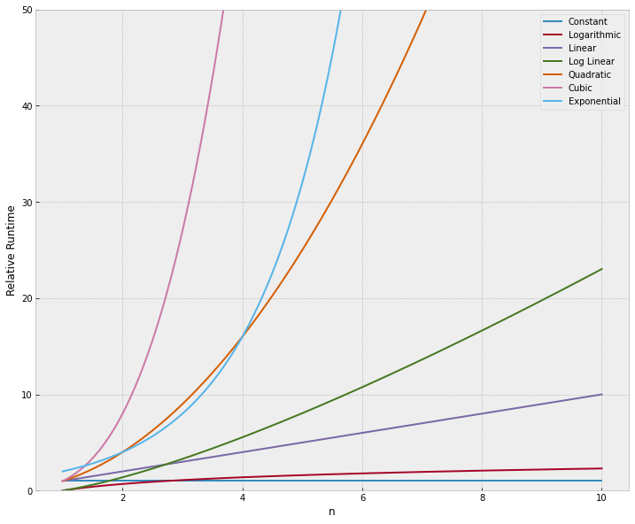

# Python - Data Structure & Algorithms

[Back](../index.md)

- [Python - Data Structure \& Algorithms](#python---data-structure--algorithms)
  - [Why analyze algorithms?](#why-analyze-algorithms)
  - [Big O Notation](#big-o-notation)
    - [Common Big-O functions](#common-big-o-functions)
    - [O(1) Constant](#o1-constant)
    - [O(n) Linear](#on-linear)
    - [O(n^2) Quadratic](#on2-quadratic)
  - [Space Complexity](#space-complexity)
  - [Dictionaries](#dictionaries)
  - [Big-O Cheat Sheet](#big-o-cheat-sheet)

---

## Why analyze algorithms?

- `algorithm`

  - a **procedure or formula** to solve a problem.

- **Analyze algorithms**

  - compare **the amount of space they take in memory**
  - compare **how much time it takes each function to run.**

---

## Big O Notation

- However, we can not use **"time to run"** as an objective measurement, because that will depend on the **speed of the computer itself and hardware capabilities.**

  - A good place to start would be to compare the number of assignments each algorithm makes, **Big-O**!

- `Big-O notation`

  - describes **_how quickly runtime will grow relative to the input as the input get arbitrarily large_**.

- Remember, we want to **_compare how quickly runtime will grows_**, _not compare exact runtimes_, since those can vary depending on hardware.

- Since we want to compare for a variety of input sizes, we are **only concerned with runtime grow _relative_ to the input.** This is why we use `n` for notation.

- As `n` gets arbitrarily large we **only worry about terms that will grow the fastest as `n` gets large**, to this point.
  - `Big-O` analysis is also known as **asymptotic analysis**

### Common Big-O functions

<table>
<tr>
    <th><strong>Big-O</strong></th>
    <th><strong>Name</strong></th>
</tr>
<tr>
    <td>1</td>
    <td>Constant</td>
</tr>
<tr>
    <td>log(n)</td>
    <td>Logarithmic</td>
</tr>
    <tr><td>n</td>
    <td>Linear</td>
</tr>
    <tr><td>nlog(n)</td>
    <td>Log Linear</td>
</tr>
    <tr><td>n^2</td>
    <td>Quadratic</td>
</tr>
    <tr><td>n^3</td>
    <td>Cubic</td>
</tr>
    <tr><td>2^n</td>
    <td>Exponential</td>
</tr>
</table>



- Clearly we want to choose algorithms that **stay away from any exponential, quadratic, or cubic behavior!**

- When it comes to `Big O notation` we _only care about the most significant terms_, remember as the input grows larger **only the fastest growing terms will matter.**

---

### O(1) Constant

- The function is constant because regardless of the list size, the function will **only ever take a constant step size.**

```py
def func_constant(values):
    '''
    Prints first item in a list of values.
    '''
    print(values[0])

func_constant([1,2,3])  # 1
```

---

### O(n) Linear

- The function runs in **O(n) (linear time)**.
  - This means that the number of operations taking place scales **linearly with n**

```py
def func_lin(lst):
    '''
    Takes in list and prints out all values
    '''
    for val in lst:
        print(val)

func_lin([1,2,3])

```

---

### O(n^2) Quadratic

- The function performs `n` operations for _every item in the list!_

- This means in total, we will perform `n` times `n` assignments, or `n^2`.
- You can see how dangerous this can get for very large inputs! This is why Big-O is so important to be aware of!

```py

def func_quad(lst):
    '''
    Prints pairs for every item in list.
    '''
    for item_1 in lst:
        for item_2 in lst:
            print(item_1,item_2)

lst = [0, 1, 2, 3]

func_quad(lst)
```

---

## Space Complexity

- The notation of **space complexity** is the same, but instead of checking the time of operations, we check **the size of the allocation of memory.**

---

## Dictionaries

Dictionaries in Python are an implementation of a **hash table**. They operate with keys and values, for example:

<table border="1">
<thead valign="bottom">
<tr class="row-odd"><th class="head">Operation</th>
<th class="head">Big-O Efficiency</th>
</tr>
</thead>
<tbody valign="top">
<tr class="row-even"><td>copy</td>
<td>O(n)</td>
</tr>
<tr class="row-odd"><td>get item</td>
<td>O(1)</td>
</tr>
<tr class="row-even"><td>set item</td>
<td>O(1)</td>
</tr>
<tr class="row-odd"><td>delete item</td>
<td>O(1)</td>
</tr>
<tr class="row-even"><td>contains (in)</td>
<td>O(1)</td>
</tr>
<tr class="row-odd"><td>iteration</td>
<td>O(n)</td>
</tr>
</tbody>
</table>

---

## Big-O Cheat Sheet

[Big-O Cheat Sheet](https://www.bigocheatsheet.com/)

---

[TOP](#python---data-structure--algorithms)
