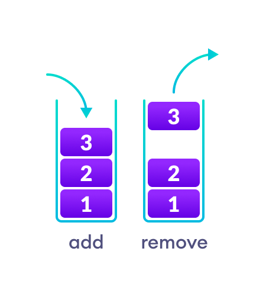
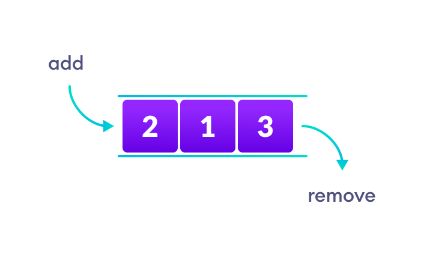
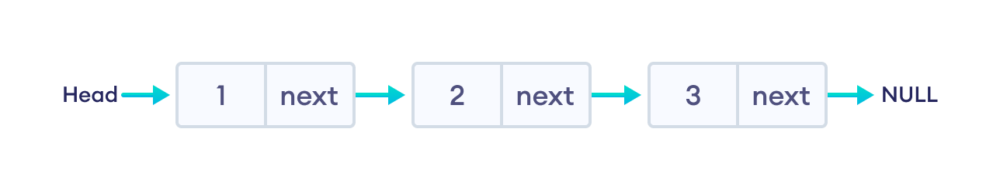
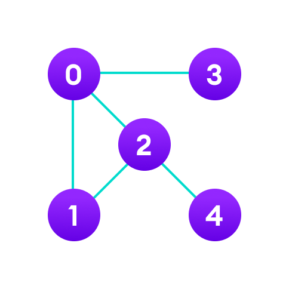

# Python - Data Structure & Algorithms

[Back](../index.md)

- [Python - Data Structure \& Algorithms](#python---data-structure--algorithms)
  - [Data Structure \& Algorithms](#data-structure--algorithms)
  - [Types of Data Structure](#types-of-data-structure)
  - [Linear data structure](#linear-data-structure)
    - [Array](#array)
    - [Stack](#stack)
    - [Queue](#queue)
    - [Linked List](#linked-list)
  - [Non linear data structures](#non-linear-data-structures)
    - [Graph](#graph)
    - [Tree](#tree)
  - [Linear Vs Non-linear Data Structures](#linear-vs-non-linear-data-structures)

---

- 总体思路总结:
  - 目的: 去执行某个任务
  - 方法: 采取一些列步骤 step

---

## Data Structure & Algorithms

- `computer program`

  - **a collection of instructions to perform a specific task.**
  - For this, a computer program may need to **store** data, **retrieve** data, and perform **computations** on the data.

- `data structure`

  - a **named location** that can be used to **store and organize data**.
  - a **way of arranging data** on a computer so that it can be accessed and updated efficiently.

- `Data structure` and `data types` are slightly different.

  - `Data structure` is the collection of `data types` arranged in a specific order.

- `algorithm`

  - **a collection of steps to solve a particular problem.**

- Learning `data structures` and `algorithms` allow us to **write efficient and optimized computer programs**.

---

## Types of Data Structure

- Basically, `data structures` are divided into **two categories**:

- **Linear data structure**

  - Array
  - Stack
  - Queue
  - Linked List

- **Non-linear data structure**

  - Graph
  - Trees

---

## Linear data structure

- In linear data structures, the elements are **arranged in sequence one after the other**. Since elements are arranged in particular order, they are easy to implement.

- However, when the **complexity** of the program increases, the linear data structures might not be the best choice because of operational complexities.

---

### Array

- In an array, elements in memory are **arranged in continuous memory**. All the elements of an array are of the same type. And, the type of elements that can be stored in the form of arrays is determined by the programming language.

---

### Stack

- In stack data structure, elements are **stored in the `LIFO` principle**.
  - That is, the **last element** stored in a stack will be removed **first**. It works just like a pile of plates where the last plate kept on the pile will be removed first.

---

### Queue

- Unlike stack, the queue data structure works **in the `FIFO` principle** where **first element** stored in the queue will be removed **first**.

---

### Linked List

- In linked list data structure, data elements are **connected through a series of nodes**. And, each node contains the **data items** and **address** to the next node.

---

## Non linear data structures

- Unlike linear data structures, elements in non-linear data structures are **not in any sequence**. Instead they are arranged **in a hierarchical manner** where one element will be connected to one or more elements.

---

### Graph

- In graph data structure, each node is called `vertex` and each vertex is **connected to other vertices through edges**.

---

### Tree

- Similar to a graph, a tree is also a collection of vertices and edges. However, in tree data structure, there can **only be one edge between two vertices**.

---

## Linear Vs Non-linear Data Structures

Now that we know about linear and non-linear data structures, let's see the major differences between them.

| Linear Data Structures                                       | Non Linear Data Structures                                                                   |
| ------------------------------------------------------------ | -------------------------------------------------------------------------------------------- |
| in sequential order, one after the other.                    | in non-sequential order (hierarchical manner).                                               |
| All the items are present on the single layer.               | The data items are present at different layers.                                              |
| can traverse all the elements sequentially in a single pass. | requires multiple runs. might not be possible to traverse all the elements in a single pass. |
| The memory utilization is not efficient.                     | Different structures utilize memory in different efficient ways depending on the need.       |
| Time complexity increase with the data size.                 | Time complexity remains the same.                                                            |
| Example: Arrays, Stack, Queue                                | Example: Tree, Graph, Map                                                                    |

---

[TOP](#python---data-structure--algorithms)
