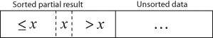
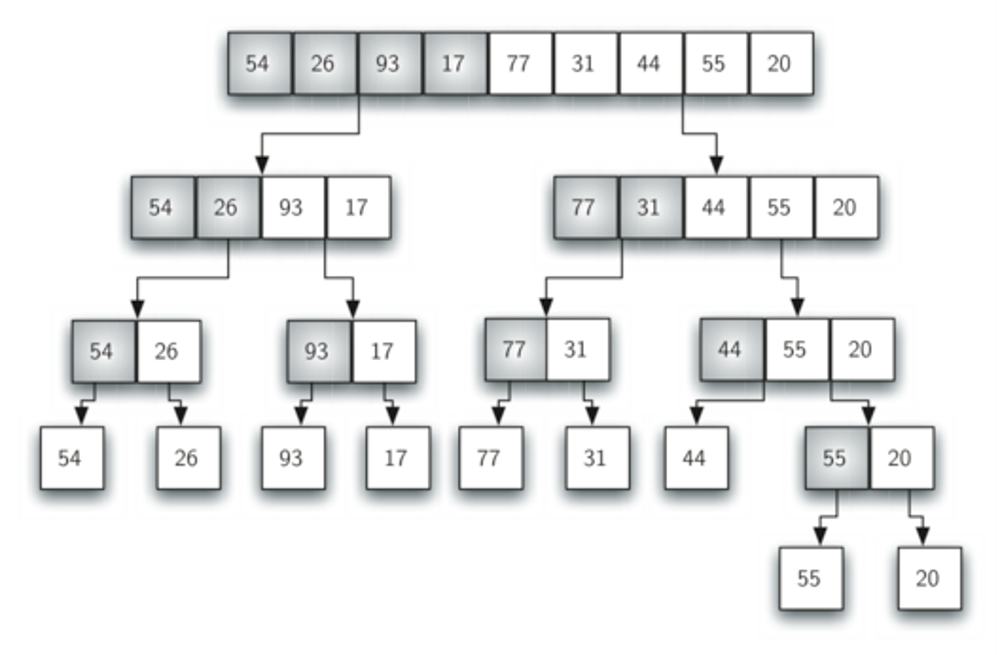
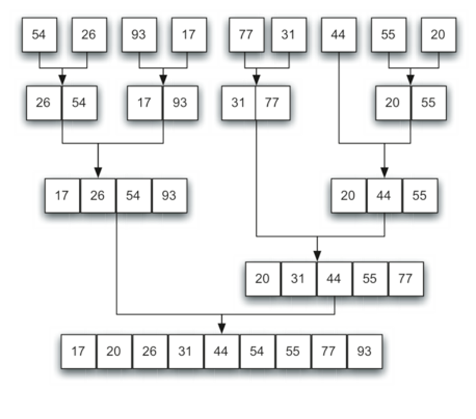
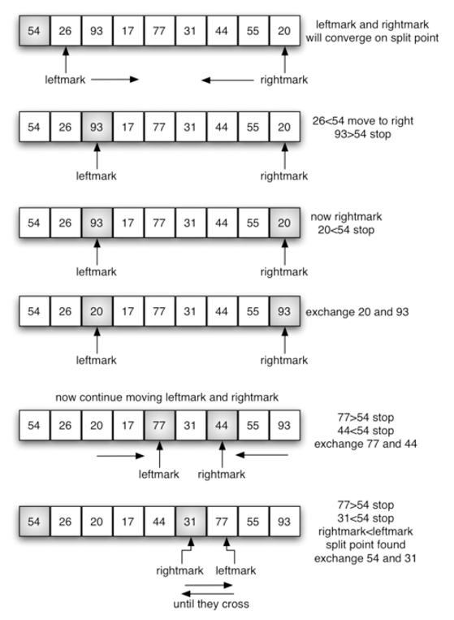

# DSA - Sort

[Back](../../index.md)

- [DSA - Sort](#dsa---sort)
  - [Bubble sort](#bubble-sort)
    - [Implement: Bubble sort](#implement-bubble-sort)
  - [Selection sort](#selection-sort)
    - [Implement: Selection sort](#implement-selection-sort)
  - [Insertion sort](#insertion-sort)
    - [Implement: Insertion sort](#implement-insertion-sort)
  - [Shell Sort](#shell-sort)
    - [Implement: Shell sort](#implement-shell-sort)
  - [Merge sort](#merge-sort)
    - [Implement: Merge Sort](#implement-merge-sort)
  - [Quick Sort](#quick-sort)
    - [Implement](#implement)
  - [Trick: Sort Two Sorted Arrays](#trick-sort-two-sorted-arrays)

---

## Bubble sort

- Algorithm

  - a simple sorting algorithm that repeatedly **steps through the input list element by element**, comparing the current element with the one after it, swapping their values if needed. - These passes through the list are repeated **until no swaps had to be performed** during a pass, meaning that the list has become fully sorted.
  - The algorithm, which is a comparison sort, is named for the way the larger elements "bubble" up to the top of the list.

- **Performance**

  - Best-case: array that is already sorted

    - comparison: `O(n)`
    - swap: `O(1)`

  - Worst-case: an array sorted in reverse order

    - comparison: `O(n^2)`
    - swap: `O(n^2)`

  - Average:
    - comparison: `O(n^2)`
    - swap: `O(n^2)`

---

### Implement: Bubble sort

- 思路:
  - 数学逻辑: 不等式传递性, a < b, b < c, 则 a < c.
  - 每次一次遍历都检查临近的数值大小.
  - 对当前 n 个成员遍历检查后, `arr[n-1]`是最大值. 所以下一次只需要对 n-1 个成员遍历即可.
  - 有时数组已经排序完毕, 但更加定义必须继续检查, 会浪费资源
    - 创建一个变量 last_swap, 用于记录最后一次 swap 的位置
    - 下一次遍历时, 只需遍历到该位置即可.

```py
def bubble_sort(arr):
    '''definition'''

    for n in range(len(arr)):

        for i in range(n):
            if arr[i] > arr[i+1]:
                arr[i], arr[i+1] = arr[i+1], arr[i]


def bubble_sort(arr):
    '''optimized'''
    # 根据定义, 没完成一次遍历, 右侧一定是较大值的sorted list,
    # 从最右len(arr)-1开始, 到左2, 即1, 所以range的参数是0; 步长是-1.
    for unsorted_index in range(len(arr)-1,0,-1):

        last_unsorted = unsorted_index

        # 每次遍历只需要针对unsorted即可, 所以只需要到前一次需要swap的地方
        for current_index in range(last_unsorted):
            if arr[current_index] > arr[current_index+1]:
                arr[current_index] , arr[current_index+1] = arr[current_index+1] , arr[current_index]
                last_unsorted = current_index


xList = [8, 4, 0, 3, 6]

bubble_sort(xList)
xList   # [0, 3, 4, 6, 8]
```

---

## Selection sort

- **Algorithm**

  - The algorithm divides the input list into two parts: a **sorted sublist** of items which is built up from left to right at the front (left) of the list and **a sublist of the remaining unsorted items** that occupy the rest of the list.
    - Initially, the sorted sublist is empty and the unsorted sublist is the entire input list.
    - The algorithm proceeds by **finding** the smallest (or largest, depending on sorting order) element in the unsorted sublist, **exchanging** (swapping) it with the leftmost unsorted element (putting it in sorted order), and **moving** the sublist boundaries one element to the right.

- **Performance**

  - Best-case: array that is already sorted

    - comparison: `O(n^2)`
    - swap: `O(1)`

  - Worst-case: an array sorted in reverse order

    - comparison: `O(n^2)`
    - swap: `O(n)`

  - Average:
    - comparison: `O(n^2)`
    - swap: `O(n)`

---

### Implement: Selection sort

```py
def selection_sort(arr):
    # 到len-1的原因是selection只需要从0到n-2即可,剩余的第n-1无需比较
    for n in range(len(arr)-1):
        # 假设开始指数是最小
        min_index = n

        # 遍历, 从第n个到最后一个.
        for k in range(n, len(arr)):
            if arr[min_index] > arr[k]:
                min_index = k       # 如果当前是最小, 则记住

        # 互换
        arr[n], arr[min_index] = arr[min_index], arr[n]

```

---

## Insertion sort

- **Algorithm**:

  - for an array with n items (`len(arr)=n`).
  - begin by assuming that a sorted list with the first item `arr[0]`
  - iterate for each item `arr(n)` in the unsorted list with index from 1 to n-1 by comparing the current item `arr(i)` with all items in the sorted list.

    - if current item is larger than specify item in the sorted list, this specify item shift to the right.Then insert the current item into the current index.
    - Otherwise, pass current iteration.

  - Diagram

    

    

- **Performance**

  - Best-case: array that is already sorted

    - comparison: `O(n)`
    - swap: `O(1)`

  - Worst-case: an array sorted in reverse order

    - comparison: `O(n^2)`
    - swap: `O(n^2)`

  - Average:
    - comparison: `O(n^2)`
    - swap: `O(n^2)`

- **Difference** with `selection sort`

  - `insertion sort`
    - scans **backwards** from the current key
    - requires more writes
  - `selection sort`
    - scans **forwards**
    - must always scan all remaining elements to find the absolute smallest element in the unsorted portion of the list

- **Efficient**
  - for (quite) small data sets

---

### Implement: Insertion sort

```py
def insertion_sort(arr):
    # 假设第一个item是sorted, 所以unsorted_index要从1开始,直到第n-1,所以是range(1,len())
    for unsorted_index in range(1, len(arr)):

        target_item = arr[unsorted_index]  # 当前

        # 遍历sorted list, 对比当前unsorted item
        sorted_index = unsorted_index -1     # 因为是从sorted list最大的开始比较,即是从当前的左一开始, 所以需要-1

        # 该处使用while, 等价于for+continue
        # while的条件:
        #   shift条件: 当前sorted小于target
        #   停止条件: sorted_index<0
        while target_item < arr[sorted_index] and sorted_index>=0:
            arr[sorted_index+1] = arr[sorted_index]
            sorted_index -=1

        # 将target插入到当前sorted
        # 如果进入遍历, 则sorted_index已经-1, 所以需要+1
        # 如果没有进入遍历, 则sorted本身就是unsorted_index -1, 相当于没有变化.
        arr[sorted_index+1] = target_item

```

---

## Shell Sort

- Algorithm

  - `shell sort` improves on the `insertion sort` by **breaking the original list into a number of smaller sublists**, each of which is sorted **using an insertion sort.**
  - The unique way that these sublists are chosen is **the key** to the shell sort. - Instead of breaking the list into sublists of contiguous items, the shell sort uses an increment i, sometimes called the `gap`, to create a sublist by choosing all items that are i items apart.

- **Performance**

  - Best-case: array that is already sorted

    - comparison: `O(nlogn)`
    - swap: `O(1)`

  - Worst-case: an array sorted in reverse order

    - comparison: `O(n^2)`
    - swap: `O(nlog^2n)`

  - Average:
    - comparison: `O(n^2)`
    - swap: depends on gap sequence

---

### Implement: Shell sort

- gap sequence

  - 使用`k/2`, k 是当前遍历的个数
  - 初始时每个 sublist 中的 item 个数是 2, 随后是 4,8,16,...
  - 初始时 sublist 个数是`n//2`, 随后是 `n//4`, `n//8`, `n//16`, ...

- 思路:
  - 根据 gap 分组
  - 对每个分组遍历, insertion sort
  - 将分组个数 number of sublist 减半, `gap=gap//2`
  - 直到 sublist 个数为 1 时, 停止遍历`while gap>0`
  - 即利用 insertion sort 对小 size 有高效率进行分组的排序, 直到对全部排序

```py

def shell_short(arr):

    # sublist的个数, 初始每个组有2个items,所以算法是n//2
    num_sublist= len(arr)//2

    # 递减sublist, 直到没有sublist, 即sublist=0
    while num_sublist>0:

        # 遍历所有sublist, 从0开始到最后一组
        for start_index in range(num_sublist):

            # 从当前的strat_index进行insertion sort, 步长是num_sublist
            gap_insertion_sort(arr, start_index, num_sublist)

        # sublist个数按照算法递减到0
        num_sublist = num_sublist//2


def gap_insertion_sort(arr, start, step):
    '''insertion sort from start for step'''
    # unsorted list
    # 注意:对每次insertion, 都是跨step,
    # 假设sorted是start, 所以unsorted从start+step开始
    for index in range(start+step, len(arr),step):
        current_item = arr[index]
        current_index = index

        # 由于是跨step排序, 所以当index<step时结束
        while current_item<arr[current_index - step] and current_index>=step:
            arr[current_index] = arr[current_index - step]
            current_index =current_index - step

        arr[current_index] = current_item
```

---

## Merge sort

- `Merge sort`

  - a **recursive** algorithm that continually splits a list in half.
    - If the list is empty or has one item, it is sorted by definition (the base case).
    - If the list has more than one item, we split the list and recursively invoke a merge sort on both halves.

- **Algorithm**

  - **Divide** the unsorted list into n sublists, each containing one element (a list of one element is considered sorted).
  - Repeatedly **merge** sublists to produce new sorted sublists **until there is only one sublist** remaining. This will be the sorted list.

- Diagram

  

  

- **Performance**

  - Best-case: array that is already sorted

    - Omega (n\log n)

  - Worst-case: an array sorted in reverse order

    - `O(nlogn)`

  - Average:
    - Theta (nlogn)

---

### Implement: Merge Sort

- 思路:
  - base case: len(arr)>1
    - 空数组[]: len(arr) ==0
    - 长度为一的数组[item]: len(arr) ==1
  - recursive case:
    - 二分数组
    - 对左右两个数组递归排序
    - 对左右两个数组合并排序

```py
def merge_sort(arr):

    # recursive case
    if len(arr) > 1:
        mid = len(arr)//2

        lefthalf = arr[:mid]
        righthalf = arr[mid:]

        merge_sort(lefthalf)
        merge_sort(righthalf)

        i = 0   # index counter, the current index of lefthalf
        j = 0   # index counter, the current index of righthalf
        k = 0   # index counter, the current index of joint arr to be returned

        # loop two arrays and insert items from the least
        while i < len(lefthalf) and j < len(righthalf):

            # If lefthalf item is less than righthalf item, then insert lefthalf item into arr
            if lefthalf[i] < righthalf[j]:
                arr[k] = lefthalf[i]
                i = i + 1       # current index of lefthalf increment

            # If righthalf item is less than or equal to lefthalf item, then insert righthalf item into arr
            else:
                arr[k] = righthalf[j]
                j = j + 1       # current index of righthalf increment
            k = k + 1       # current index of arr increment

        # loop two arrays and insert left over items of two arrays
        # if the current index did not reach the end of lefthalf
        while i < len(lefthalf):
            arr[k] = lefthalf[i]
            i = i + 1       # current index of lefthalf increment
            k = k + 1       # current index of arr increment

        # if the current index did not reach the end of righthalf
        while j < len(righthalf):
            arr[k] = righthalf[j]
            j = j + 1       # current index of righthalf increment
            k = k + 1       # current index of arr increment


arr = [4, 7, 9, 1, 6, 8]
merge_sort(arr)
print(arr)      # [1, 4, 6, 7, 8, 9]
```

---

## Quick Sort

- The `quick sort` uses divide and conquer to gain the same advantages as the merge sort, while **not using additional storage**.

- As a trade-off, however, it is possible that the list may **not be divided in half**.

  - When this happens, we will see that **performance is diminished**.

- `pivot value`

  - a value selected to **assist with splitting** the list.
  - simply use the first item in the list

- `split point`
  - The actual position, where the pivot value belongs in the final sorted list, will be used to **divide the list for subsequent**.



---

### Implement

```py
def quick_sort(arr):

    quick_sort_help(arr,0,len(arr)-1)

def quick_sort_help(arr,first,last):

    if first<last:


        splitpoint = partition(arr,first,last)

        quick_sort_help(arr,first,splitpoint-1)
        quick_sort_help(arr,splitpoint+1,last)


def partition(arr,first,last):

    pivotvalue = arr[first]

    leftmark = first+1
    rightmark = last

    done = False
    while not done:

        while leftmark <= rightmark and arr[leftmark] <= pivotvalue:
            leftmark = leftmark + 1

        while arr[rightmark] >= pivotvalue and rightmark >= leftmark:
            rightmark = rightmark -1

        if rightmark < leftmark:
            done = True
        else:
            temp = arr[leftmark]
            arr[leftmark] = arr[rightmark]
            arr[rightmark] = temp

    temp = arr[first]
    arr[first] = arr[rightmark]
    arr[rightmark] = temp


    return rightmark
```

---

## Trick: Sort Two Sorted Arrays

- 思路:
  - 因为已经 sorted, 所以 item 一定是从小排到大
  - 使用变量标记当前 index, 从小到大插入到新 arr
  - 对剩下的 items 插入到新 arr

```py
def sort_two_array(arr1, arr2):
    '''Join and sort two sorted arrys, including duplicate items'''
    i = 0   # index counter, the current index of arr1
    j = 0  # index counter, the current index of arr2
    k = 0   # index counter, the current index of joint arr to be returned

    arr = [None] * (len(arr1) + len(arr2))   # the arr to be returned

    # loop two arrays and insert items from the least
    while i < len(arr1) and j < len(arr2):

        # If arr1 item is less than arr2 item, then insert arr1 item into arr
        if arr1[i] < arr2[j]:
            arr[k] = arr1[i]
            i = i + 1       # current index of arr1 increment

        # If arr2 item is less than or equal to arr1 item, then insert arr2 item into arr
        else:
            arr[k] = arr2[j]
            j = j + 1       # current index of arr2 increment
        k = k + 1       # current index of arr increment

    # loop two arrays and insert left over items of two arrays
    # if the current index did not reach the end of arr1
    while i < len(arr1):
        arr[k] = arr1[i]
        i = i + 1       # current index of arr1 increment
        k = k + 1       # current index of arr increment

    # if the current index did not reach the end of arr2
    while j < len(arr2):
        arr[k] = arr2[j]
        j = j + 1       # current index of arr2 increment
        k = k + 1       # current index of arr increment

    return arr

arr1 = [1, 6, 8]
arr2 = [4, 7, 9]

sort_two_array(arr1, arr2)      # [1, 4, 6, 7, 8, 9]
```

---

[TOP](#dsa---sort)
