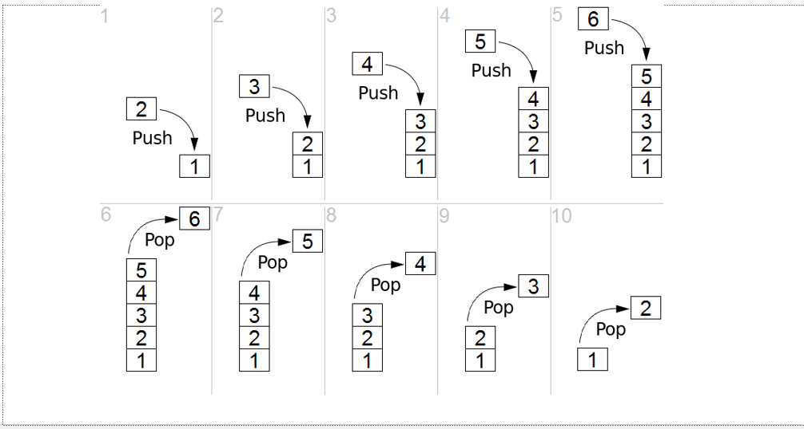

# DSA - Stack

[Back](../../index.md)

- [DSA - Stack](#dsa---stack)
  - [Stack](#stack)
  - [Implement Stack in Python](#implement-stack-in-python)
  - [Problem: Stack](#problem-stack)
    - [Implement a Stack](#implement-a-stack)
    - [Balanced Parentheses Check](#balanced-parentheses-check)
    - [Implement a Queue - Using Two Stacks](#implement-a-queue---using-two-stacks)

---

## Stack

- `stack`

  - an **ordered collection** of items where the addition of new items and the removal of existing items always takes place at the same end.
  - This end is commonly referred to as the `top`.
  - The end opposite the top is known as the `base`.

- The `base` of the stack is significant since items stored in the stack that are closer to the base represent those that have been in the stack **the longest**.
- **The most recently added** item is the one that is in position to be **removed first**.

- `Last-in first-out,(LIFO)`
  - the ordering principle of stack
  - an ordering **based on length of time** in the collection.
  - **Newer** items are near the **top**, while **older** items are near the **base**.



- The order of **insertion** is the **reverse** of the order of **removal**.

- For example, every web browser has a Back button.

---

## Implement Stack in Python

```py
class Stack(object):
    def __init__(self):
        self.items = []

    def push(self, obj):
        self.items.append(obj)

    def pop(self):
        return self.items.pop()

    def peek(self):
        return self.items[len(self.items)-1]

    def isEmpty(self):
        return self.items == []

    def size(self):
        return len(self.items)


print("\n--------Create--------\n")
s = Stack()

print("isEmpty\t", s.isEmpty())     # isEmpty  True


print("\n--------Add--------\n")

s.push(1)
s.push("two")

print("peek\t", s.peek())               # peek     two
print("size\t", s.size())               # size     2
print("isEmpty\t", s.isEmpty())         # isEmpty  False


print("\n--------Remove--------\n")

print("pop\t", s.pop())                 # pop      two
print("pop\t", s.pop())                 # pop      1

print("size\t", s.size())               # size     0
print("isEmpty\t", s.isEmpty())         # isEmpty  True

```

---

## Problem: Stack

### Implement a Stack

A very common interview question is to begin by just implementing a Stack! Try your best to implement your own stack!

It should have the methods:

- Check if its empty
- Push a new item
- Pop an item
- Peek at the top item
- Return the size

[Implement a Stack](./problem_implement_stack.ipynb)

---

### Balanced Parentheses Check

Given a string of opening and closing parentheses, check whether it’s balanced. We have 3 types of parentheses: round brackets: (), square brackets: [], and curly brackets: {}. Assume that the string doesn’t contain any other character than these, no spaces words or numbers. As a reminder, balanced parentheses require every opening parenthesis to be closed in the reverse order opened. For example ‘([])’ is balanced but ‘([)]’ is not.

You can assume the input string has no spaces.

[Balanced Parentheses Check](./problem_balanced_parentheses_check.ipynb)

---

### Implement a Queue - Using Two Stacks

Given the Stack class below, implement a Queue class using **two** stacks! Note, this is a "classic" interview problem. Use a Python list data structure as your Stack.

    # Uses lists instead of your own Stack class.
    stack1 = []
    stack2 = []

[Implement a Queue](./problem_implement_queue_using_two_stacks.ipynb)

---

[TOP](#dsa---stack)
