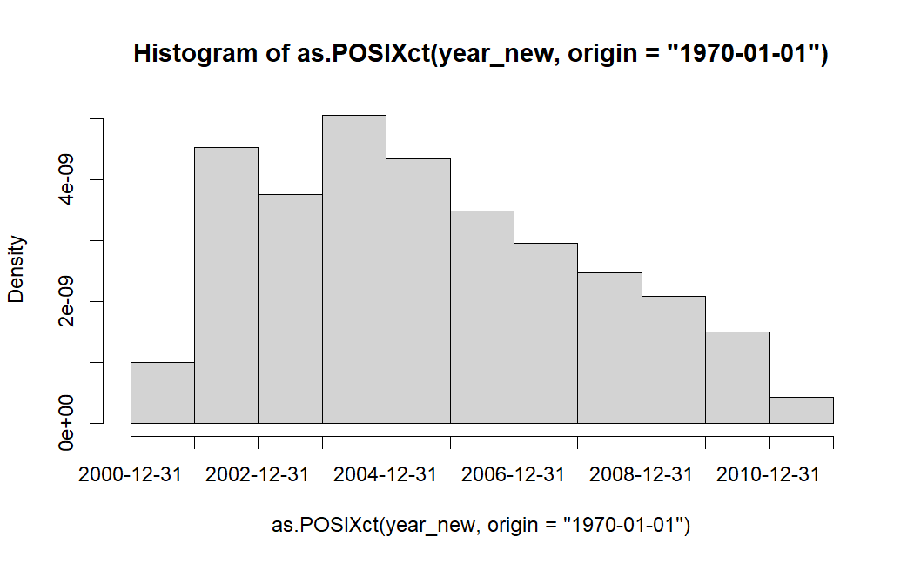

# R - Data Mining

[Back](../index.md)

- [R - Data Mining](#r---data-mining)
  - [Data Mining](#data-mining)
  - [Data mining tasks](#data-mining-tasks)
  - [Example:](#example)

---

## Data Mining

- `Data mining` / `data discovery`

  - a specialized form of data analysis that targets large datasets.
  - involves **extracting hidden or unknown patterns** in the massive datasets
  - involves **automatically uncovering valuable information** within extensive data repositories

- `Data mining` forms the basis for **predictive analytics** and `business intelligence (BI)`

---

## Data mining tasks

- Data mining tasks are generally divided into two major categories:
  - 1. **Predictive** tasks
    - Classification
    - Regression
  - 2. **Descriptive** tasks
    - Association Discovery
    - Clustering

---

## Example:

```r
library(jsonlite)
library(curl)
# url
url <- 'https://raw.githubusercontent.com/ansymo/msr2013-bug_dataset/master/data/v02/eclipse/bug_status.json'
# load data from url
ds <- fromJSON(txt=url)

# Extract bug_status
bug_list <- ds$bug_status

# How many tickets are there in the bug_list?
ticket_num <- length(bug_list)
ticket_num

# - What is total number of operations carried out within the bug_list? (Hint: tabulate the count by using table())
num_op_tb <- table(unlist(sapply(bug_list, function(x) x$what)))
num_op_tb

# - What is the total number of operations performed across all tickets in the bug_list?
total_num_op <- length(unlist(sapply(bug_list, function(x) x$what)))
total_num_op

# Find the number of unique users performing operations in the bug_list?
unique_num_user <- length(unique(unlist(sapply(bug_list, function(x) x$what))))
unique_num_use
```

- Plot:

```r
library(ggplot2)
year_new <- unlist(sapply (bug_list, function (x) x$when[x$what == "NEW"]))
hist(as.POSIXct(year_new, origin = "1970-01-01"), breaks = "years")
```



---

[TOP](#r---data-mining)
